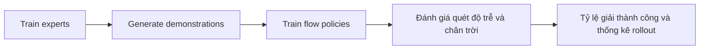

# Stack đánh giá và mã tham chiếu Kinetix

## Mục đích và phạm vi

Kho lưu trữ công cộng là gói tái tạo mô phỏng cho cả hai bài báo RTC. Nó là bằng chứng cho
các nhánh thuật toán và kết quả Kinetix, nhưng nó không phải là ngăn xếp triển khai robot thực đầy đủ.
Việc kiểm tra trong báo cáo này được ghim để cam kết `9296f31` vào ngày 22-07-2026; mã đã được đọc, không chạy.

## Các mô-đun thực thi

| Tập tin | Trách nhiệm | Hành vi quan trọng của RTC |
|---|---|---|
| `src/model.py` | Bộ lấy mẫu và chính sách luồng MLP-Mixer | Luồng Vanilla, BID, hướng dẫn thời gian suy luận, điều hòa tiền tố thời gian đào tạo |
| `src/train_expert.py` | Đào tạo chuyên gia tăng cường học tập | Tạo điểm kiểm tra chuyên môn cho 12 cấp độ |
| `src/generate_data.py` | Bộ sưu tập trình diễn | Xây dựng bộ dữ liệu chuyển đổi hàng triệu từ sự kết hợp của các chuyên gia |
| `src/train_flow.py` | Đào tạo chính sách học tập bắt chước | Xây dựng các khối bước `H` liền kề và gọi tổn thất tiêu chuẩn hoặc tiền tố có điều kiện |
| `src/eval_flow.py` | Đánh giá độ trễ/chân trời theo đợt | So sánh lấy mẫu không đồng bộ ngây thơ, RTC, BID và lấy mẫu tiền tố cứng |
| `worlds/l/*.json` | Cấp độ Kinetix | Mười hai môi trường điều khiển động được sử dụng trong bài báo |

Luồng sao chép từ đầu đến cuối được kho lưu trữ ghi lại là:

## Hợp đồng mô hình và thí nghiệm

Chính sách mô phỏng mặc định có `H=8`, bốn khối MLP-Mixer, kênh 256 chiều và
năm bước trong quá trình đánh giá. Người đánh giá mặc định có 2.048 lần triển khai và quét độ trễ suy luận
0–4 và các khoảng thời gian thực hiện hợp lệ. Nó xác nhận `s >= d`, sau đó vòng lặp căn chỉnh các đoạn cũ và mới trước đó
thực hiện chúng.

Quá trình đào tạo tạo thành các khối từ các hành động liền kề và vị trí số 0 sau khi một tập kết thúc
([`train_flow.py`, dòng 166–181](https://github.com/Physical-Intelligence/real-time-chunking-kinetix/blob/9296f31d62d5bfeb5779dcb2f9bcf71ca37f448b/src/train_flow.py#L166-L181)).
Kho lưu trữ README cho biết RTC thời gian đào tạo được sao chép bằng cách cài đặt `simulated_delay=5`, đang tải
điểm kiểm tra kỷ nguyên-24 và tinh chỉnh cho tám kỷ nguyên.

## Những gì có thể và không thể được sao chép

- **Đã xác minh từ mã/tài liệu:** 12 định nghĩa cấp độ Kinetix, các nhánh mô hình/tổn thất/lấy mẫu, chuyên gia
  và quy trình trình diễn cũng như quá trình quét đánh giá mô phỏng được công khai.
- **Đã được xác minh từ kho lưu trữ README:** nội dung chuyên gia được đào tạo trước có dung lượng khoảng 60 GiB, tính toán là
  được phân chia theo các cấp và số GPUs phải chia cho số cấp đã chọn. Báo cáo này
  không tải xuống những tài sản đó.
- **Không có mặt:** Trọng lượng `π0.5`/`π0.6`, bộ lập lịch rô-bốt thực, ngăn xếp camera/mạng, dữ liệu tác vụ rô-bốt,
  hoặc các tập lệnh tái tạo các đánh giá trong thế giới thực gồm sáu nhiệm vụ và hai nhiệm vụ.
- **Không chạy lại:** cài đặt phụ thuộc, tải xuống điểm kiểm tra, đào tạo và quét 2.048 lượt triển khai.
  Do đó, tài liệu này xác minh cấu trúc mã chứ không phải khả năng tái tạo bằng số trong không gian làm việc này.

## Thận trọng khi sao chép thực tế

Bộ dữ liệu và đào tạo chuyên gia mặc định của README ngược dòng rất đắt tiền: nhiều H100 GPUs,
hàng triệu bước môi trường và tài sản đám mây lớn. Một bản tái tạo cục bộ trong tương lai trước tiên sẽ chạy
một cấp độ, một hạt giống, số lần chuyển tiếp giảm và đợt đánh giá giảm trước khi thử
quét quy mô giấy. Đây là chiến lược thử nghiệm khói được đề xuất chứ không phải lệnh được xác minh trong không gian làm việc này.

## Chứng cớ

- [Kho lưu trữ README tại cam kết `9296f31`](https://github.com/Physical-Intelligence/real-time-chunking-kinetix/blob/9296f31d62d5bfeb5779dcb2f9bcf71ca37f448b/README.md).
- [`src/model.py`](https://github.com/Physical-Intelligence/real-time-chunking-kinetix/blob/9296f31d62d5bfeb5779dcb2f9bcf71ca37f448b/src/model.py),
  [`src/train_flow.py`](https://github.com/Physical-Intelligence/real-time-chunking-kinetix/blob/9296f31d62d5bfeb5779dcb2f9bcf71ca37f448b/src/train_flow.py) và
  [`src/eval_flow.py`](https://github.com/Physical-Intelligence/real-time-chunking-kinetix/blob/9296f31d62d5bfeb5779dcb2f9bcf71ca37f448b/src/eval_flow.py),
  kiểm tra 2026-07-22.
- *Thực thi chính sách luồng hành động theo thời gian thực*, Phần 4 và Phụ lục A.5–A.7:
  [PDF cục bộ](<../../../papers/realtime-chunking/Real-Time Execution of Action Chunking Flow Policies.pdf>).
