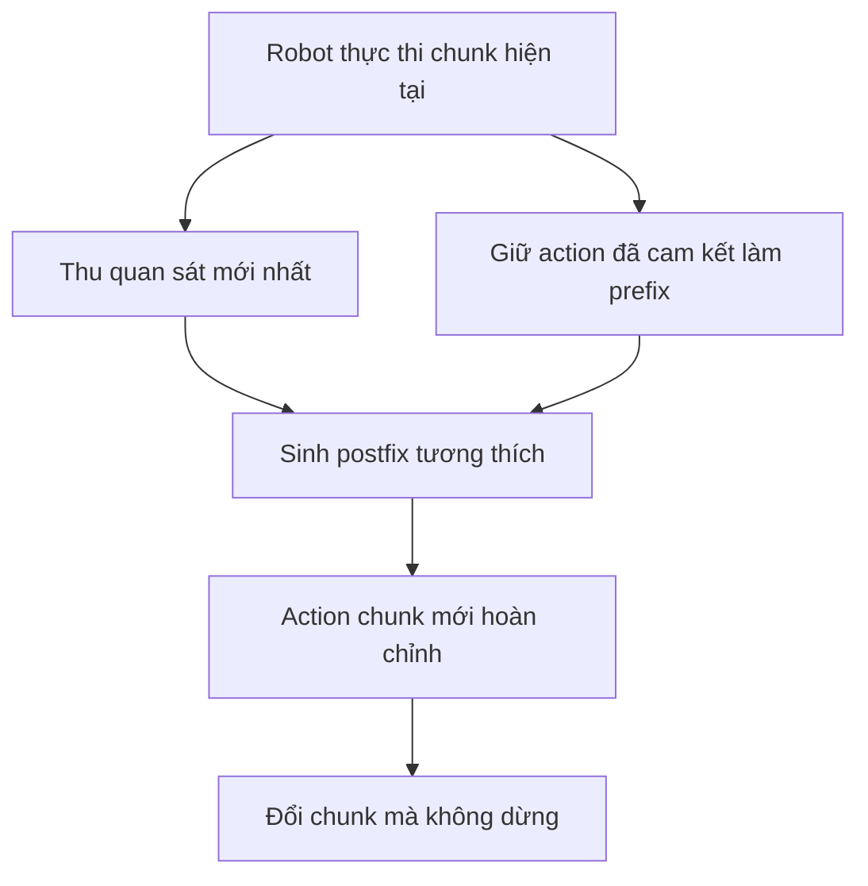

# Tổng quan về action chunking thời gian thực

## Bài toán nghiên cứu

Robot controller có thể cần một action mới mỗi 20 ms, trong khi một mô hình vision-language-action lớn có thể mất hàng chục hoặc hàng trăm mili giây để sinh một action chunk. Vì vậy, robot không thể chờ inference sau mỗi chunk.

Các chiến lược thực thi hiện có có hai kiểu thất bại:

- **Thực thi đồng bộ:** hoàn tất chunk hiện tại, dừng lại, sinh chunk tiếp theo rồi mới di chuyển tiếp. Các khoảng dừng làm chậm tác vụ và thay đổi động lực chuyển động của robot.
- **Thực thi bất đồng bộ đơn giản:** sinh chunk tiếp theo trong khi chunk hiện tại đang chạy, sau đó chuyển ngay lập tức. Hai chunk có thể đại diện cho các chiến lược khác nhau, nên việc chuyển đổi có thể tạo ra bước nhảy đột ngột, gia tốc lớn hoặc chuyển động không an toàn.

Câu hỏi nghiên cứu là:

> Làm thế nào để robot sinh action chunk bất đồng bộ mà không phải dừng, đồng thời giữ chunk
> tiếp theo liên tục với các action đã cam kết và vẫn phản ứng được với quan sát mới nhất?

## Giải thích đơn giản về ý tưởng

Hãy tưởng tượng robot đang làm theo kế hoạch này:

```text
chunk cũ:  [đã thực thi | thực thi trong lúc inference | kế hoạch tương lai]
chunk mới:             [prefix cố định                | action mới được sinh]
```

Trong khi mô hình tính toán, một số action trong chunk cũ vẫn phải được thực thi. Những action
đó không thể thay đổi nữa. RTC sao chép chúng vào đầu chunk mới làm **prefix đã cam kết**, sau đó
sinh **postfix** còn lại sao cho nó nối mượt với prefix.

Điều này đặt ra hai mục tiêu cho mô hình:

1. giữ nguyên các action mà robot đã cam kết thực thi;
2. dùng quan sát mới nhất để hiệu chỉnh phần tương lai của kế hoạch.



## Điều kiện thời gian

Hai chunk phải chồng lấn đủ lâu để bao phủ độ trễ inference:

$$
d \le s \le H-d,
$$

trong đó:

- `H` là số action được dự đoán trong một chunk;
- `s` là số action được thực thi trước khi bắt đầu chu kỳ chunk tiếp theo;
- `d` là độ trễ mô hình, đo bằng số bước controller.

Nếu điều kiện này không thỏa mãn, chunk cũ có thể hết action hợp lệ trước khi chunk mới sẵn sàng.

## Hai cách tạo postfix tương thích

| Phương pháp | Ý tưởng đơn giản | Ưu điểm chính | Chi phí chính |
| ---------------------------- | ------------------------------------------------------------------------------------------------------- | ------------------------------------------------------------------------------------------------------------------ | ------------------------------------------------------------------------------------------------- |
| **RTC tại inference** | Trong mỗi bước flow denoising, hướng chunk mới về các action chồng lấn từ chunk cũ | Hoạt động với flow hoặc diffusion policy hiện có mà không cần train lại; hỗ trợ tính liên tục mềm trên toàn bộ phần chồng lấn | Cần backpropagation khi lấy mẫu, làm tăng độ trễ |
| **RTC tại training** | Train policy với action prefix sạch để nó học cách chỉ sinh postfix tương thích | Dùng forward sampling thông thường, không có overhead do guidance; mạnh hơn ở độ trễ mô phỏng lớn | Cần train hoặc fine-tune cho phân phối độ trễ dự kiến; chỉ hỗ trợ prefix cứng |

RTC tại inference hữu ích khi chỉ có policy pretrained. RTC tại training hiệu quả hơn khi có
thể fine-tune policy và biết đủ rõ độ trễ triển khai để mô phỏng nó trong lúc training.

## Vì sao cần soft masking

Chỉ khớp prefix đã cam kết nghiêm ngặt vẫn có thể cho phép chunk mới đổi chiến lược ngay sau
đó. Vì vậy, RTC tại inference còn xét phần chồng lấn còn lại:

- action đã cam kết nhận guidance đầy đủ;
- action chồng lấn ở phía sau nhận guidance giảm dần;
- action nằm ngoài phần chồng lấn được sinh tự do.

Paper dùng suy giảm theo hàm mũ. Nó cũng chặn cường độ guidance vì trọng số lý thuyết trở nên
không ổn định gần bước denoising đầu tiên, đặc biệt khi controller chỉ dùng năm bước flow.

## Kết quả chính

- Trên 12 tác vụ Kinetix động, RTC tại inference bền vững với độ trễ hơn thực thi bất đồng bộ
  đơn giản, temporal ensembling và BID.
- RTC tại training hoạt động tốt hơn RTC tại inference khi độ trễ mô phỏng từ hai bước controller
  trở lên, nhưng kém hơn một chút ở độ trễ bằng 0 và 1.
- Trong sáu tác vụ robot thực được báo cáo, RTC tại inference cải thiện throughput và vẫn bền
  vững khi thêm độ trễ.
- Trong đánh giá thế giới thực tiếp theo gồm hai tác vụ, RTC tại training và tại inference có
  success rate và thời lượng thực thi tương tự, đồng thời đều nhanh hơn thực thi đồng bộ.
- Với GPU profile `π0.5` được báo cáo, guidance tại inference làm độ trễ mô hình tăng từ 76 ms
  lên 97 ms. Các con số này phụ thuộc phần cứng và mô hình, không phải chi phí RTC phổ quát.

## Giới hạn và câu hỏi mở

- RTC tại inference trực tiếp yêu cầu action generator diffusion hoặc flow dạng lặp.
- RTC tại training phụ thuộc vào phân phối độ trễ dùng khi training và không cung cấp guidance
  mềm cho phần chồng lấn.
- Các paper giả định timing được căn theo bước controller và không mô tả đầy đủ cách phục hồi
  khi lỡ deadline, mất gói tin, inference thất bại hoặc `d > H-s`.
- Repository công khai chứa pipeline mô phỏng Kinetix, không chứa runtime robot thực hoàn chỉnh
  hoặc asset đánh giá robot.
- Các thí nghiệm chưa được chạy lại trong workspace này; các claim định lượng ở trên đến từ paper.

## Báo cáo chi tiết

| Báo cáo | Trọng tâm |
| --------------------------------------------------------------------------------------- | ------------------------------------------------------------- |
| [Kết nối giữa paper và code](paper_code_connection.md) | Paper dùng repository cho phần nào và giới hạn tái tạo |
| [Chi tiết code repository](code_details/overview.md) | Từng module, call graph, artifact contract, CLI và bẫy runtime |
| [Chi tiết dependency Kinetix](kinetix_details/overview.md) | Environment, UED/PCG, model, experiment, config và toàn bộ module |
| [Runtime bất đồng bộ](module_details/inference/asynchronous_runtime.md) | Timing, căn chỉnh chunk và thực thi nền |
| [Inpainting tại inference](module_details/inference/inference_time_inpainting.md) | Lấy mẫu flow có guidance và chi phí tính toán |
| [Soft masking và độ ổn định](module_details/inference/soft_masking_and_stability.md) | Tính liên tục giữa các chunk, lịch trọng số và clipping |
| [Điều kiện hóa prefix tại training](module_details/training/training_time_prefix_conditioning.md) | Loss điều kiện hóa theo prefix, lấy mẫu và khác biệt paper/code |
| [Evaluation stack Kinetix](module_details/kinetix_evaluation_stack.md) | Cấu trúc code công khai và ranh giới khả năng tái lập |

## Nguồn

- Kevin Black, Manuel Y. Galliker, and Sergey Levine, *Real-Time Execution of Action Chunking Flow
  Policies*: [local PDF](<../../papers/realtime-chunking/Real-Time Execution of Action Chunking Flow Policies.pdf>),
  [arXiv](https://arxiv.org/abs/2506.07339).
- Kevin Black, Allen Z. Ren, Michael Equi, and Sergey Levine, *Training-Time Action Conditioning for
  Efficient Real-Time Chunking*: [local PDF](<../../papers/realtime-chunking/Training-Time Action Conditioning for Efficient Real-Time Chunking.pdf>),
  [arXiv](https://arxiv.org/abs/2512.05964).
- Physical Intelligence,
  [real-time-chunking-kinetix](https://github.com/Physical-Intelligence/real-time-chunking-kinetix/tree/9296f31d62d5bfeb5779dcb2f9bcf71ca37f448b),
  được kiểm tra tại commit `9296f31` ngày 2026-07-22.
