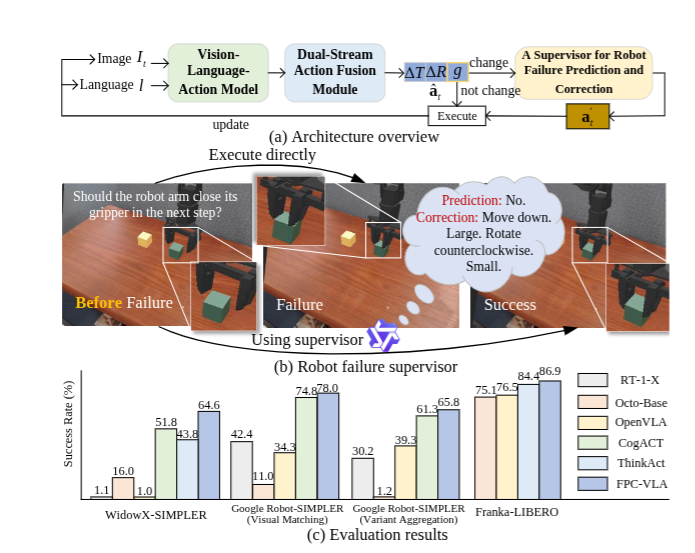
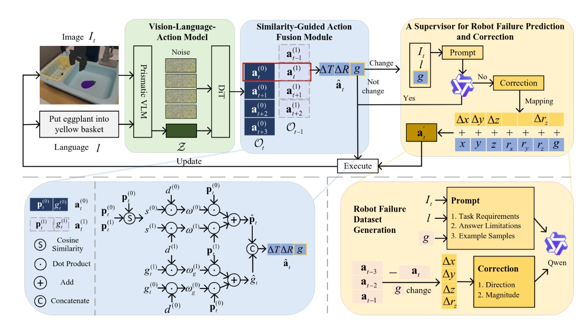
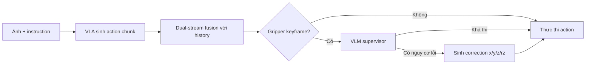
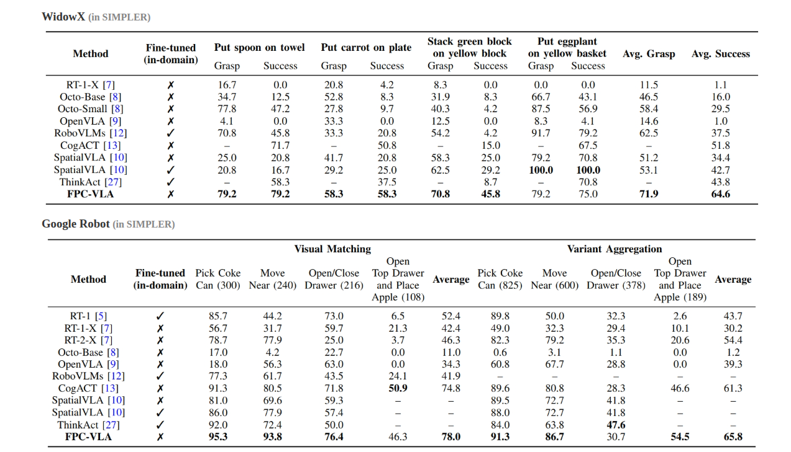
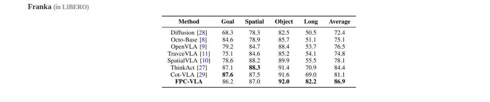

# FPC-VLA — supervisor dự đoán và sửa action trước khi lỗi xảy ra

## 1. Nguồn và câu hỏi nghiên cứu

- Paper: *FPC-VLA: A Vision-Language-Action Framework with a Supervisor for
  Failure Prediction and Correction*, Yifan Yang và cộng sự.
- Bản đọc: arXiv `2509.04018v2`, 4 Dec 2025; PDF không tự ghi venue. Bài sau đó
  được xuất bản tại *Expert Systems with Applications* 316 (2026), 131742,
  DOI `10.1016/j.eswa.2026.131742`.
- [PDF trong repo](../../../papers/retry-handle/fpc_vla_failure_prediction_correction.pdf),
  [arXiv](https://arxiv.org/abs/2509.04018),
  [trang dự án](https://fpcvla.github.io/).
- Phân loại: **action generation / proactive correction**. FPC-VLA sửa candidate
  trước khi thực thi; nó không phải cơ chế phục hồi một trạng thái đã hỏng.

**Câu hỏi:** có thể giữ một VLA sinh action như cũ, nhưng thêm một supervisor chỉ
can thiệp tại keyframe để ngăn action dễ thất bại mà không làm chậm toàn bộ control
loop hay không?

## 2. Why — vấn đề gì cần xử lý?

VLA thường học từ demonstration thành công rồi thực thi trực tiếp prediction.
Khi action lệch khỏi quỹ đạo expert, hệ thống thiếu tín hiệu để nhận biết và sửa
trước khi lỗi vật lý xảy ra. Hai vấn đề phụ làm tình hình xấu hơn:

1. action chunk cũ thường bị bỏ dù nhiều prediction chồng lấn chứa thông tin hữu
   ích;
2. average pose và gripper như cùng một biến có thể trộn các action mode không
   tương thích.

Paper quy nguyên nhân cho ba gap: thiếu failure/correction supervision có thể mở
rộng, thiếu kiểm tra sớm, và fusion không tôn trọng semantics khác nhau giữa pose
và gripper. Claim được xem là có căn cứ nếu supervisor/fusion tăng task success,
chịu motion disturbance tốt hơn, và overhead chỉ xuất hiện thưa tại keyframe.

## 3. Đóng góp

1. Một data engine biến trajectory RLDS có sẵn thành correction QA mà không cần
   người gán nhãn từng action.
2. Dual-stream fusion tận dụng prediction history nhưng xử lý pose và gripper
   theo hai semantics khác nhau.
3. Qwen2.5-VL-7B supervisor kiểm tra action tại gripper keyframe và chỉ can thiệp
   khi dự đoán có nguy cơ thất bại.

## 4. Method

### 4.1 Tổng quan luồng xử lý

Primary VLA nhận ảnh RGB $I_t$ và instruction $l$, rồi sinh một action chunk 15
bước. Các prediction chồng lấn từ nhiều timestep được dual-stream fusion thành
action hiện tại. Nếu action làm thay đổi trạng thái gripper, supervisor kiểm tra
tính khả thi; action an toàn được giữ nguyên, action có nguy cơ lỗi được cộng một
correction trước khi robot thực thi.

### 4.2 Sinh failure-correction QA từ RLDS

**Failure mode được xử lý:** supervisor thiếu dữ liệu chỉ ra action nào dễ làm
robot sai ở thời điểm grasp/release và phải dịch chuyển theo hướng nào.

Data engine dò các timestep mà gripper đổi trạng thái trong trajectory RLDS.
Mỗi event giữ một cửa sổ ba frame. Correction target được tính bằng delta từ pose
hiện tại tới pose tại gripper event kế tiếp, sau đó các thành phần `x/y/z/rz`
được lượng tử thành hướng và hai mức độ `small/large`. Target trở thành structured
QA để Qwen2.5-VL học trả lời action hiện tại có khả thi hay không; nếu không, nó
phải nêu correction.

Paper sinh 100k entry cho mỗi robot từ BridgeV2, Google Robot và LIBERO, cộng
10k mẫu MuJoCo/real teleoperation (p.11). Điểm yếu là delta tới event nominal kế
tiếp chỉ là **proxy correction**: nó chưa phải counterfactual đã được chứng minh
có thể cứu một failure thật.

### 4.3 Dual-stream action fusion

**Failure mode được xử lý:** chỉ dùng prediction mới nhất làm mất thông tin của
các chunk chồng lấn; average thẳng có thể trộn nhiều action mode và đặc biệt xử
lý sai gripper bit rời rạc.

Pose history được gán trọng số bằng cosine similarity với prediction mới nhất và
temporal decay, nên prediction vừa gần về hướng vừa gần về thời gian có ảnh hưởng
lớn hơn. Gripper state chỉ dùng temporal decay vì cosine similarity không mang
nghĩa phù hợp cho trạng thái open/close. Hai stream sau đó được ghép lại thành
action 7-D.

Ablation hỗ trợ đúng module này: latest-only đạt `38.0`, direct average `73.9`,
bỏ temporal decay `79.5`, còn full fusion đạt `82.1` task average (Table 7,
p.16). Tuy vậy, prediction mới nhất vẫn là similarity anchor; nếu chính nó sai,
fusion có thể ưu tiên một mode sai.

### 4.4 VLM supervisor tại gripper keyframe

**Failure mode được xử lý:** pose hoặc gripper command sai ở thời điểm grasp và
release có thể biến một deviation nhỏ thành failure không phục hồi được.

Supervisor chỉ kích hoạt khi `|g_t-g_{t-1}| > 0.5`. Qwen2.5-VL-7B nhận ảnh,
instruction và structured query, rồi trả Yes/No. Nếu câu trả lời là No, parser
trích direction và magnitude, biến chúng thành delta cho `x/y/z/rz`, cộng vào
action đã fusion rồi mới thực thi. Module không sửa `rx/ry` hoặc gripper bit.

Bỏ toàn bộ supervisor làm task average giảm `82.1 → 74.4`; vẫn gọi supervisor
nhưng bỏ correction làm giảm còn `75.4` (Table 7, p.16). Điều này kiểm tra được
giá trị của intervention, nhưng paper không báo precision/recall để biết module
can thiệp đúng bao nhiêu lần. Trigger cũng không thấy slip/drop xảy ra sau grasp.

### 4.5 Runtime keyframe-only

**Failure mode được xử lý:** chạy VLM 7B mỗi control step sẽ tạo latency quá lớn
cho manipulation.

Keyframe-only invocation giữ non-keyframe latency ở `0.176 s`; keyframe cần
`1.766 s`. Trong drawer task, supervisor chỉ được gọi tối đa ba lần và tổng thời
gian tăng `35.2 → 40.5 s` (p.11). Thiết kế giảm average overhead, nhưng paper
không báo deadline hoặc jitter nên chưa biết có đáp ứng contact event nhanh hay
không.

## 5. Training

Primary VLA dùng hybrid visual encoder, Llama2 cognition features và Diffusion
Transformer action head. Nó được pretrain trên hỗn hợp OXE + LIBERO để sinh 15
action step mỗi inference. Cấu hình được báo cáo là `batch=256`, learning rate
`2e-5`.

Supervisor khởi tạo từ Qwen2.5-VL-7B và được LoRA trên failure-correction QA sinh
tự động. Cấu hình gồm `rank=8`, `batch=128`, learning rate `1e-4`, bf16. Paper
báo dùng 16 H100 (p.11), nhưng không tách GPU-hour giữa primary VLA và supervisor.

Signal huấn luyện của supervisor gồm hai phần gắn chặt với failure prevention:

1. target Yes/No dạy model phân biệt action có khả thi tại gripper keyframe;
2. direction + magnitude dạy model sửa `x/y/z/rz` khi target là No.

Paper không công bố calibration objective riêng hoặc loss buộc correction phải
đạt task success sau khi replay. Vì vậy training học imitation của proxy label,
không trực tiếp tối ưu closed-loop recovery.

## 6. Claim → evidence

| Protocol                          | Kết quả được báo cáo                                                                 | Claim được kiểm tra                          |
| --------------------------------- | ------------------------------------------------------------------------------------------- | ------------------------------------------------ |
| SIMPLER, WidowX                   | grasp/task`71.9/64.6`; CogACT task `51.8` (Table 3, p.12)                               | transfer sang embodiment và policy robustness   |
| SIMPLER, Google Robot             | Visual Matching`78.0`, Variant Aggregation `65.8`; CogACT `74.8/61.3` (Table 4, p.12) | generalization trong simulator                   |
| LIBERO, Franka                    | average`86.9`, Long `82.2`; ThinkAct `84.4/70.9` (Table 5, p.12)                      | task success và long horizon                    |
| Xiaomi + ALOHA thật              | grasp/task`92.8/86.0`; CogACT `86.0/78.4`, 50 trial/task (Table 6, p.14)                | khả năng triển khai thật                     |
| Motion disturbance`[0.01, 0.1]` | bỏ supervisor`50.8`, full `66.1`; clean full `82.1` (Table 7, p.16)                  | contribution của supervisor dưới perturbation |

Đây đều là **reported results**, chưa được tái lập trong workspace. Claim
“zero-shot” cần đọc thận trọng: primary VLA đã pretrain trên LIBERO và dữ liệu
supervisor được sinh riêng từ BridgeV2/Google/LIBERO cho từng embodiment.

## 7. Giới hạn và threat to validity

- Trigger chỉ dựa vào thay đổi gripper, vì vậy bỏ lỡ slip/drop hậu-grasp. Paper
  cũng thừa nhận visual-only không thay thế force/torque sensing (p.16).
- Không báo precision/recall, false-positive rate hay calibration của supervisor.
- Delta tới gripper event kế tiếp là nhãn thuận tiện, nhưng chưa chứng minh đó là
  correction đúng khi failure thật xảy ra.
- Table 7 và prose dùng cách tính phần trăm không nhất quán; nên ưu tiên số tuyệt
  đối trong bảng.
- Không có matched baseline cô lập gain của data synthesis khỏi backbone và
  tổng lượng dữ liệu.

## 8. Liên hệ với workspace

**Inferred:** [`scripts/prepare_sample_dataset.py`](../../../../scripts/prepare_sample_dataset.py)
đã giữ frame, action, mask và timestamp, nên có thể mở rộng một sidecar gồm
`keyframe`, câu hỏi supervisor và correction target. Tuy nhiên action hiện hữu
không được xác nhận là pose robot 7-D + binary gripper; không được áp heuristic
`|g_t-g_{t-1}|` hoặc mapping `x/y/z/rz` trước khi có semantics adapter.

## 9. Thử nghiệm có khả năng bác bỏ claim

1. Tạo baseline matched-data, chỉ fusion và không supervisor, để tách gain do
   data/backbone khỏi gain do proactive correction.
2. Trên một tập failure thật nhỏ, đo precision/recall và expected calibration
   error của Yes/No supervisor, thay vì chỉ task success.
3. So nhãn “delta tới next gripper event” với correction do người gán; nếu sai
   hướng thường xuyên thì data engine không đại diện failure counterfactual.

**Mức tin cậy:** cao cho kiến trúc và bảng số liệu; trung bình cho causal claim
và khả năng zero-shot.
