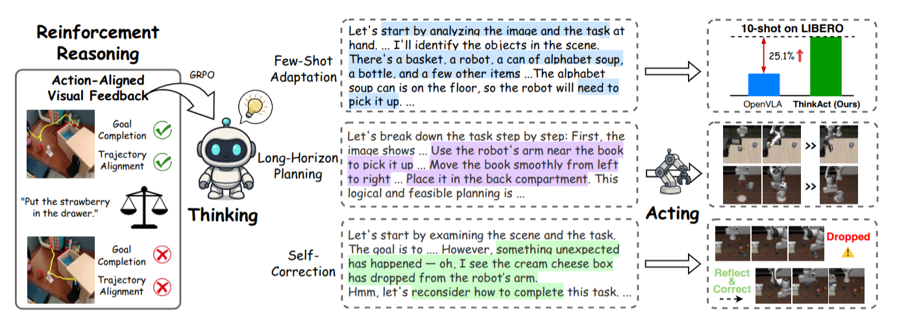
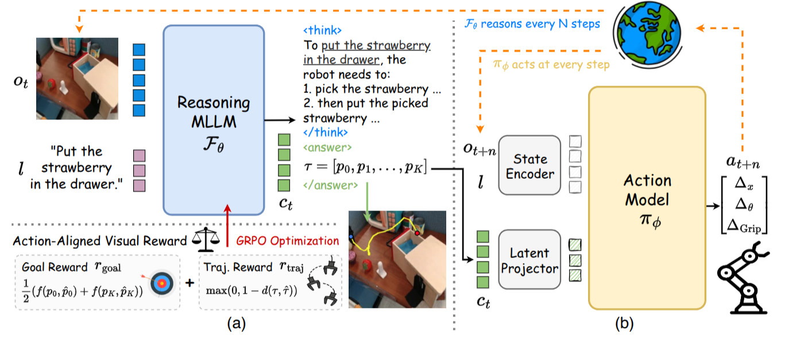

# ThinkAct — reasoning MLLM + visual plan latent, self-correction bằng replan

## 1. Nguồn

- Tiêu đề: *ThinkAct: Vision-Language-Action Reasoning via Reinforced Visual
  Latent Planning*
- Tác giả: Chi-Pin Huang, Yueh-Hua Wu, Min-Hung Chen, Yu-Chiang Frank Wang,
  Fu-En Yang (NVIDIA; National Taiwan University)
- Venue: **arXiv preprint** 2507.16815v2, bản v2 ngày 18 Sep 2025 (v1: 22 Jul
  2025). Có bản OpenReview (`id=72UR53jN7T`) nhưng PDF trong repo không ghi venue
  nào được nhận.
- PDF trong repo: [docs/papers/retry-handle/thinkact_reinforced_visual_latent_planning.pdf](../../../papers/retry-handle/thinkact_reinforced_visual_latent_planning.pdf)
- Nguồn: https://arxiv.org/abs/2507.16815
- Code: **Unknown** — chỉ có
  [trang dự án](https://jasper0314-huang.github.io/thinkact-vla/) (HTTP 200,
  kiểm tra 03 Aug 2026). Không tìm thấy repository chính thức; `NVlabs/ThinkAct`
  trả 404.
- Phân loại: **action_generation** (cơ chế: reasoning replanning) — can thiệp ở
  tầng *kiến trúc + suy luận lúc chạy*: một MLLM suy luận chậm sinh kế hoạch, một action model nhanh thực
  thi, và việc phát hiện lỗi xảy ra **trong bước suy luận định kỳ**, không phải
  bằng một monitor riêng.

⚠️ **Bằng chứng self-correction của paper là định tính.** Ba hình minh hoạ(Fig. 6, Fig. A8a, A8b) và không có metric nào đo tỉ lệ phát hiện lỗi hay tỉ lệ phục hồi. Xem §5.5 và §6.

## 2. Câu hỏi nghiên cứu

VLA end-to-end ánh xạ thẳng (quan sát, instruction) → action. Cách đó chặn hai thứ: **lập kế hoạch nhiều bước** và **thích nghi với biến thể task phức tạp**. Hai hướng vá đã có, và paper chỉ ra chỗ hỏng của cả hai:

| Hướng                 | Ví dụ              | Hỏng ở đâu                                                                                                                                                                                          |
| ----------------------- | -------------------- | ------------------------------------------------------------------------------------------------------------------------------------------------------------------------------------------------------- |
| CoT có giám sát      | ECoT, RAD, CoT-VLA   | Chi phí sinh reasoning trace chất lượng cao rất lớn; model**overfit vào cảnh cụ thể hoặc mẫu suy luận cụ thể**                                                                     |
| RL với reward dạng QA | Video-R1, Reason-RFT | Sinh được suy luận dài mà không cần giám sát mức bước, nhưng**reward kiểu QA không nối được suy luận với thực thi action thật**, và không hỗ trợ kế hoạch dài hạn |

Câu hỏi cụ thể: **lấy reward gì để RL dạy MLLM suy luận, mà reward đó vừa kiểm chứng được (như đáp án QA) vừa gắn với hành động vật lý (không như đáp án QA)?**

Trả lời của ThinkAct: **quỹ đạo 2D của gripper trên ảnh**. Nó có sẵn từ video (trích bằng detector), kiểm chứng được bằng khoảng cách, và là biểu diễn trung gian đúng nghĩa giữa ngôn ngữ và điều khiển.

## 3. Đóng góp

1. **Khung dual-system** nối suy luận có cấu trúc với action thực thi được, qua **visual plan latent**.
2. **Action-aligned visual reward**: goal reward (điểm đầu/cuối của quỹ đạo) + trajectory reward (khớp phân bố quỹ đạo bằng DTW).
3. **Visual latent planning** để dẫn hướng action model — dùng latent thay vì text, nên chuyển được sang môi trường mới bằng cách chỉ train lại projector + action model.
4. Chứng minh ba năng lực nổi lên: **few-shot adaptation**, **long-horizon planning**, **self-correction**.
5. **Insight:** Method **không cần text label** để train, sử dụng trajectory từ chính video Ego. Propose method training CoT nhưng với actions, với (answer) là các vị trí 2D, mô phỏng đường đi của gripper (M = 8)

## 4. Method

### 4.1 Bài toán và hai hệ thống

Tại timestep $t$: quan sát $o_t$, instruction $l$, cần action $a_t$ (lệnh text
hoặc vector điều khiển 7-DOF $[\Delta_x, \Delta_\theta, \Delta_{\text{Grip}}]$).

- **Reasoning MLLM** $\mathcal{F}_\theta$ sinh visual plan latent $c_t$ từ
  $(o_t, l)$.
- **Action model** $\pi_\varphi$ nhận $c_t$ và sinh $N$ action thực thi được
  $[a_t]_t^{t+N}$.

**Bất đối xứng tần số là điểm cốt lõi:** MLLM **suy luận mỗi $N$ bước**, action
model **hành động mỗi bước**. Lúc inference hai hệ chạy **bất đồng bộ** — slow
thinking, fast control. Đây là thứ làm cho reasoning-VLA khả thi về latency.

### 4.2 Reasoning MLLM và visual plan latent

$\mathcal{F}_\theta$ sinh tự hồi quy hai chuỗi embedding: $v_t \in \mathbb{R}^{|v_t| \times d}$
(giải mã thành các bước suy luận, đặt trong `<think>...</think>`) và
$c_t \in \mathbb{R}^{|c_t| \times d}$ (visual plan latent).

$c_t$ được suy ra thành chuỗi text của **$K$ điểm 2D**
$\tau = [p_k]_{k=1}^{K}$, $p_k \in [0,1]^2$, với $p_1$ và $p_K$ là vị trí đầu và
cuối của gripper. **$K = 8$.**

Điểm tinh tế: cái đi xuống action model là **latent $c_t$**, không phải chuỗi text
toạ độ. Text chỉ là dạng để tính reward. Latent giữ được ngữ cảnh kế hoạch nhiều
hơn 8 cặp số.

### 4.3 Reward

**Goal reward** — so điểm đầu và điểm cuối với quỹ đạo trích bằng detector sẵn có
$\hat\tau = [\hat p_k]_{k=1}^{K}$:

$$
r_{goal} = \tfrac{1}{2}\big(f(p_1, \hat p_1) + f(p_K, \hat p_K)\big), \qquad f(p, p') = \max\big(0,\; 1 - \lVert p - p' \rVert_2^2\big)
$$

**Trajectory reward** — ép quỹ đạo dự đoán khớp phân bố quỹ đạo demo, dùng
**Dynamic Time Warping**:

$$
r_{traj} = \max\big(0,\; 1 - d(\tau, \hat\tau)\big)
$$

**Tổng**:

$$
r = 0.9\, r_{visual} + 0.1\, r_{format}, \qquad r_{visual} = \omega_{goal} r_{goal} + \omega_{traj} r_{traj}, \quad \omega_{goal} = \omega_{traj} = 0.5
$$

Hai reward chia vai rõ: $r_{goal}$ hỏi "có tới đích không", $r_{traj}$ hỏi "đường
đi có khả thi về vật lý không". Bỏ $r_{traj}$ thì model có thể vẽ đường tắt xuyên
vật cản mà vẫn ăn điểm goal.

Ngoài ra khung này **nhận thêm dữ liệu QA** với reward dạng accuracy — bao gồm
robotic VQA và **failure detection** (dataset Reflect/RoboFail).

### 4.4 GRPO

Với mỗi input $(o_t, l)$, sample $M$ response từ $\mathcal{F}_{\theta_{old}}$,
chấm reward, chuẩn hoá thành advantage:

$$
\mathcal{J}_{GRPO}(\theta) = \frac{1}{M}\sum_{i=1}^{M}\Big(\frac{\mathcal{F}_\theta(z_i|o_t,l)}{\mathcal{F}_{\theta_{old}}(z_i|o_t,l)} A_i - \beta D_{KL}\big(\mathcal{F}_\theta \,\Vert\, \mathcal{F}_{\theta_{old}}\big)\Big), \qquad A_i = \frac{r_i - \text{mean}(\{r\})}{\text{std}(\{r\})}
$$

Cấu hình: $\beta = 10^{-2}$, độ dài response tối đa 1024, temperature 1.0,
top-$p$ 0.99, rollout size $M = 5$.

### 4.5 Action model và cầu nối

- $\pi_\varphi$ là **diffusion policy dựa DiT**, **432M tham số**, pretrain trên OXE.
- **State encoder**: DINOv2 (ảnh) + CLIP text encoder → embedding 1024 chiều.
- **Latent projector**: **Q-Former với 32 query**, nối $c_t$ vào không gian input
  của action model.
- Noise scheduler DDPM 1000 timestep khi train; inference bằng **20 bước DDIM**.
- Input quan sát: **một ảnh RGB 224×224 góc nhìn thứ ba** (theo OpenVLA).

Huấn luyện bằng imitation learning, **MLLM đóng băng**:

$$
\mathcal{L}_{IL}(\varphi) = \mathbb{E}_{(o_i, l, a_i)}\big[\ell(\pi_\varphi(c_t, o_i, l), a_i)\big], \qquad i \in [t, t+N]
$$

Chỉ cập nhật **state encoder, latent projector và action model**. Để tăng tốc,
$c_t$ được **sinh sẵn offline và cache lại**.

**$N$ (số action mỗi lần suy luận): 15 cho SimplerEnv, 75 cho LIBERO**, chọn theo
độ dài task trung bình.

### 4.6 Ba giai đoạn huấn luyện

| Giai đoạn                                | Cập nhật gì                                                           | Cấu hình                                                                     | Dữ liệu                                                                                                                         |
| ------------------------------------------ | ------------------------------------------------------------------------ | ------------------------------------------------------------------------------ | --------------------------------------------------------------------------------------------------------------------------------- |
| **1. SFT cold-start** (MLLM)         | $\mathcal{F}_\theta$                                                   | 20K iter, batch 32, lr 1e-5, DeepSpeed ZeRO-3                                  | 30K quỹ đạo 2D (OXE), 50K RoboVQA, 50K EgoPlan-IT, 165K Video-R1-CoT                                                           |
| **2. Reinforced fine-tuning** (GRPO) | $\mathcal{F}_\theta$                                                   | 6K iter, batch 64, lr 1e-6, rollout 5                                          | 12.5K quỹ đạo 2D (OXE + Something-Something V2), 10K RoboVQA, 10K EgoPlan-IT/Val,**0.5K RoboFail**, 10K LLaVA-Video-178K |
| **3. Action adaptation**             | state encoder + projector +$\pi_\varphi$ (**MLLM đóng băng**) | 100K mẫu OXE, 120K iter, batch 256, lr 2e-5; LIBERO thêm 75K iter, batch 128 | OXE, rồi dữ liệu môi trường đích                                                                                          |

Toàn bộ trên **16 GPU A100 80GB**. Action model được pretrain riêng trên OXE
trước giai đoạn 1.

Mục đích cold-start: dạy model **đọc quỹ đạo trực quan** và **xuất đúng format**
`<think>`/`<answer>` — chưa nhắm chất lượng suy luận. Chất lượng đến từ GRPO.

### 4.7 Trích quỹ đạo 2D — chi tiết thực dụng

- Robot: subset **`fractal20220817_data`** và **`bridge`** của OXE (chọn vì quỹ
  đạo rõ, chất lượng cao). Vị trí gripper trích bằng detector sẵn có (LLARVA).
- Người: **Something-Something V2**, dùng hand detector (Shan et al. 2020); nếu
  có hai tay thì lấy tay chuyển động nhiều hơn; áp **stabilization** để giảm ảnh
  hưởng rung camera.
- Mỗi video: sample ngẫu nhiên **3 frame khởi đầu**, rồi rút gọn quỹ đạo gripper
  còn $K$ keypoint bằng thuật toán **Ramer–Douglas–Peucker** (theo HAMSTER).
- Video xử lý tối đa 16 frame, độ phân giải tối đa $128 \times 28 \times 28$ pixel
  (video) và $256 \times 28 \times 28$ (ảnh).

**Điểm đáng chú ý:** **video người không có action label vẫn dùng được**, vì reward
chỉ cần quỹ đạo bàn tay trên ảnh. Đây là cách paper mở rộng dữ liệu RL vượt ra
ngoài dataset robot.

## 5. Claim → Evidence

### 5.1 Manipulation (Tab. 1)

| Benchmark                   | DiT-Policy (baseline của chính họ) | Magma | CoT-VLA | **ThinkAct** |
| --------------------------- | ------------------------------------- | ----- | ------- | ------------------ |
| Simpler-Google VM (overall) | 56.0                                  | 68.4  | —      | **71.5**     |
| Simpler-Google VA (overall) | 48.2                                  | 62.6  | —      | **65.1**     |
| Simpler-Bridge VM (overall) | 32.4                                  | 35.4  | —      | **43.8**     |
| LIBERO (overall)            | 76.8                                  | —    | 83.9    | **84.4**     |

**Đọc đúng mức đóng góp.** Con số đáng tin nhất là so với **DiT-Policy**, vì đó
chính là action model của ThinkAct khi *không* có visual plan latent:
**+15.5 / +16.9 / +11.4** trên ba setting SimplerEnv, **+7.6** trên LIBERO. Đây
là ablation kiến trúc sạch nhất trong paper.

So với SOTA ngoài thì mỏng hơn nhiều: hơn CoT-VLA đúng **+0.5** trên LIBERO
overall, và **thua** CoT-VLA/Magma ở vài task con (Object 91.4 so với 91.6;
Goal 87.1 so với 87.6; Stack Blocks 8.7 so với 12.7 của Magma).

**LIBERO-Long là chỗ ThinkAct thắng rõ nhất**: 70.9 so với CoT-VLA 69.0,
DiT-Policy 57.6, OpenVLA 53.7 — khớp với luận điểm long-horizon planning.

### 5.2 Embodied reasoning (Tab. 2)

| Benchmark                | Baseline mạnh nhất | ThinkAct       |
| ------------------------ | -------------------- | -------------- |
| EgoPlan-Bench2 (overall) | Qwen2.5-VL* 45.7     | **48.2** |
| RoboVQA (BLEU overall)   | Qwen2.5-VL* 55.7     | **59.8** |
| OpenEQA (overall)        | InternVL3 55.5       | **56.2** |

`Qwen2.5-VL*` là chính backbone đã finetune trên EgoPlan-IT + RoboVQA — tức
**so sánh có kiểm soát đúng**: cùng backbone, cùng dữ liệu, khác ở chỗ có RL
action-aligned hay không. +2.5 và +4.1 BLEU là đóng góp thực của RL.

Trên **OpenEQA** — benchmark zero-shot, không nằm trong dữ liệu train — mức hơn
chỉ **+0.7** so với InternVL3. Năng lực suy luận tổng quát không tăng nhiều; cái
tăng là suy luận *embodied*.

### 5.3 Ablation reward (Tab. 3, Tab. A6)

| Method                       | SimplerEnv     | EgoPlan        | RoboVQA        | LIBERO         | OpenEQA        |
| ---------------------------- | -------------- | -------------- | -------------- | -------------- | -------------- |
| ThinkAct (đầy đủ)        | **60.1** | **48.2** | **59.8** | **84.4** | **56.2** |
| w/o$r_{traj}$              | 59.2           | 47.9           | 58.5           | 82.1           | 55.9           |
| w/o$r_{goal}$              | 59.1           | 47.6           | 58.9           | 81.7           | 55.6           |
| w/o cả hai (chỉ reward QA) | 56.9           | 47.2           | 58.3           | 81.6           | 55.7           |
| SFT cold-start (không RL)   | 56.4           | 46.4           | 57.9           | 79.1           | 53.3           |

Ba kết luận:

1. **Reward QA đơn thuần gần như vô dụng cho manipulation.** Bỏ cả hai visual
   reward: LIBERO 81.6 so với SFT 81.6/79.1 — chênh lệch nằm trong nhiễu. Đây
   chính là luận điểm mở đầu của paper, và họ tự chứng minh nó.
2. **Hai reward gần như đối xứng về tầm quan trọng** (bỏ cái nào cũng mất ~2 điểm
   LIBERO), nhưng **không cộng tuyến**: bỏ cả hai (81.6) không tệ hơn nhiều so
   với bỏ một (81.7–82.1), trong khi có cả hai nhảy lên 84.4. Chúng bổ trợ nhau,
   không thay thế nhau.
3. **RL là phần mang giá trị, không phải SFT.** 79.1 → 84.4 trên LIBERO.

### 5.4 Few-shot adaptation (Fig. 5, Fig. A9)

Finetune action model với **10 demo/task**, đánh giá **100 trial**, trên
LIBERO-Spatial + Object (môi trường mới) và LIBERO-Goal (kỹ năng mới). ThinkAct
tốt nhất cả ba; theo phần text: hơn Magma **+7.3% trên LIBERO-Goal** và **+9.5%
trên LIBERO-Spatial**. Phụ lục có thêm thí nghiệm **5-shot** với cùng kết luận.

**Unknown:** các số cụ thể trong Fig. 5 và Fig. A9 bị vector-hoá nên không đọc
được tin cậy từ PDF text; chỉ những mức chênh nêu trong phần text mới là
**Verified**.

Ý nghĩa của kết quả này lớn hơn con số: vì MLLM bị **đóng băng** ở giai đoạn 3,
thích nghi sang môi trường mới chỉ tốn việc train projector + action model. Kế
hoạch mức cao đã có sẵn và không phụ thuộc embodiment.

### 5.5 Self-correction — điểm yếu nhất về bằng chứng

Cơ chế: mở rộng input của MLLM từ **một ảnh $o_t$** thành **một đoạn video ngắn
$o_{t-N:t}$**. Có ngữ cảnh thời gian thì model mới thấy được "vừa rồi đã xảy ra
chuyện gì".

Ba ví dụ định tính:

| Hình      | Tình huống                                      | MLLM làm gì                                                                  |
| ---------- | ------------------------------------------------- | ------------------------------------------------------------------------------ |
| Fig. 6     | Rơi hộp cream cheese giữa chừng               | Nhận ra đã rơi, xác định vị trí mới, replan để quay lại gắp lại |
| Fig. A8(a) | Gripper vật lộn, không kẹp chặt được cốc | Nhận ra grasp trước thất bại, đề xuất chỉnh lại vị trí và regrasp |
| Fig. A8(b) | Không gắp được object ngay từ đầu         | Phát hiện chưa gắp được, replan lại bước pickup                      |

**Không có một metric nào.** Không có tỉ lệ phát hiện lỗi, không có tỉ lệ phục
hồi thành công, không có so sánh với baseline không self-correction, không có
tập test lỗi. Điều này khác hẳn [FailSafe](../failure_adaptation/failsafe.md) (bảng phát hiện lỗi đầy đủ) và [FLARE](../failure_adaptation/flare.md)
(bảng độ chính xác phân loại ID/OOD trên 50 video có nhãn tay).

Bằng chứng gián tiếp duy nhất nằm ở **ablation $N$** (§5.6): đặt $N=100$ làm
performance giảm, và tác giả giải thích là "suy luận quá thưa khiến model không
kịp phát hiện lỗi và tự sửa". Đây là suy diễn của tác giả từ một con số tổng hợp,
không phải phép đo trực tiếp.

### 5.6 Tần suất suy luận $N$ và chi phí

Ablation trên LIBERO:

| $N$       | 25    | 50              | 75    | 100   |
| ----------- | ----- | --------------- | ----- | ----- |
| Avg success | 84.0% | **84.6%** | 84.4% | 83.7% |

Đường cong rất phẳng (0.9 điểm giữa cực trị). Tác giả chọn $N = 75$. Lập luận hai
đầu: $N=100$ quá thưa để bắt lỗi kịp; $N=25$ tốn thêm inference mà không đổi lại
gì đáng kể.

**Chi phí inference:** ThinkAct chậm hơn OpenVLA **17%** trên A100 (LIBERO), do
suy luận tự hồi quy. Đổi lại +2.8 (spatial), +3.2 (object), +8.4 (goal), +15.3
(long-horizon) điểm success. **Đây là con số overhead trung thực nhất trong cả
corpus 06** — RoboMonkey chỉ nói "1.5 Hz", FLARE không báo cáo latency của MLLM
monitor.

### 5.7 Backbone nhỏ hơn (Tab. A5)

Áp cùng công thức lên **Qwen2.5-VL-3B**: ThinkAct-3B đạt EgoPlan-Bench2 44.0,
RoboVQA 55.3, OpenEQA 48.9 — đều hơn Qwen2.5-VL-3B* (43.0 / 53.6 / 44.6) và mọi
model 2B khác. Phương pháp không phụ thuộc backbone 7B.

## 6. Giới hạn và điểm chưa rõ

- **Không có robot thật.** Toàn bộ manipulation là SimplerEnv và LIBERO. Không có
  một thí nghiệm phần cứng nào. Với một paper claim self-correction, đây là khoảng
  trống lớn nhất.
- **Self-correction không được đo.** Xem §5.5. Ba hình chọn lọc không phải bằng
  chứng về tỉ lệ.
- **Không có code.** Pipeline gồm Qwen2.5-VL-7B + GRPO + DiT policy 432M +
  Q-Former + detector quỹ đạo, huấn luyện ba giai đoạn trên 16× A100. Không có
  repo thì tái lập gần như bất khả thi.
- **Kế thừa hallucination của MLLM** — tác giả nêu thẳng trong phần Limitations:
  kế hoạch sinh ra có thể tham chiếu sai thuộc tính object hoặc sai quan hệ không
  gian, và lỗi đó chảy xuống thực thi. Latent planning chỉ giảm bớt chứ không
  chặn.
- **Quỹ đạo 2D là biểu diễn kế hoạch nghèo.** 8 điểm trên mặt phẳng ảnh không mã
  hoá được độ sâu, trạng thái gripper (đóng/mở), hay lực. Với task contact-rich
  hoặc cần chèn/lắp, tín hiệu này có thể không đủ — paper không thử loại task đó.
- **Reward phụ thuộc chất lượng detector.** $\hat\tau$ đến từ detector sẵn có
  (LLARVA cho robot, Shan et al. cho tay người). Không có ablation nào về việc
  detector sai thì reward hỏng tới đâu.
- **Chỉ một ảnh RGB góc thứ ba khi thực thi**, dù MLLM có thể xem video khi
  self-correct. Không có wrist camera, không có multi-view.
- **Cải thiện so với SOTA ngoài rất mỏng trên LIBERO** (+0.5 so với CoT-VLA), và
  ThinkAct thua xa π0/NORA-1.5 trên cùng benchmark (84.4 so với 94.2/94.5 —
  xem [NORA-1.5](../training/nora_1_5.md) §5.2, nơi ThinkAct là một baseline).
- **Unknown:** tổng chi phí huấn luyện (paper cho iteration và số GPU nhưng không
  cho giờ GPU).
- **Unknown:** trong 0.5K mẫu RoboFail dùng cho RL, phần nào đóng góp vào khả năng
  phát hiện lỗi. Không có ablation bỏ RoboFail.

## 7. Liên hệ với workspace

- **ThinkAct là mảnh còn thiếu trong taxonomy của corpus 06.** Bốn paper trước
  can thiệp ở test time (RoboMonkey), dữ liệu (FailSafe, FLARE) và tinh chỉnh
  online (SC-VLA). ThinkAct can thiệp ở **kiến trúc suy luận**: khả năng phát
  hiện lỗi không đến từ dữ liệu failure hay từ monitor riêng, mà là **hệ quả phụ
  của việc có một MLLM đọc lại video của chính mình mỗi $N$ bước**.
- **Đối chiếu trực tiếp với FLARE.** FLARE dùng Gemini-2.5-Pro làm monitor bên
  ngoài, đổi LoRA adapter khi phát hiện OOD error. ThinkAct để chính reasoning
  MLLM đảm nhiệm, không cần model thứ hai và không cần skill bank. Rẻ hơn về hạ
  tầng, nhưng **chưa được đo**, còn FLARE có bảng 88–96% độ chính xác phân loại.
  Hai thiết kế này là hai lựa chọn thật, không phải một tốt một xấu.
- **Đối chiếu với FailSafe.** FailSafe kết luận VLM thương mại không sinh được
  action sửa lỗi (cosine similarity ≈ 0), phải finetune trên dữ liệu failure có
  action. ThinkAct né vấn đề bằng cách **không bắt MLLM sinh action** — nó chỉ
  sinh kế hoạch mức quỹ đạo, còn action do policy riêng sinh. Đây có thể là câu
  trả lời cho hạn chế của FailSafe.
- **Quỹ đạo 2D gripper trích được từ dữ liệu hiện có.** Không cần trường schema
  mới nếu đã có video: chạy detector, rút gọn bằng RDP, xong. Đây là can thiệp
  thứ ba mà dữ liệu hiện tại đã đủ, sau nhãn SPI của SC-VLA và WM(subgoal) reward
  của NORA-1.5.
- **Khoảng trống schema mà ThinkAct chỉ ra:** cần **video segment** $o_{t-N:t}$
  chứ không chỉ frame đơn — cửa sổ thời gian có độ dài xác định gắn với timestep.
  Cùng loại yêu cầu mà FailSafe đặt ra (cửa sổ 10 frame liên tiếp). Hai paper độc
  lập cùng chỉ vào: **schema mức frame là không đủ cho phát hiện lỗi**.
- Với `vla-data-tools`: bước rẻ nhất mượn được là **pipeline trích quỹ đạo 2D**
  (detector → RDP → $K$ keypoint chuẩn hoá `[0,1]`), dùng làm annotation phụ cho
  dataset, độc lập với việc có triển khai ThinkAct hay không.

## 8. Thử nghiệm tiếp theo

Xếp theo chi phí tăng dần:

1. **Planned — trích quỹ đạo 2D cho dataset local.** Chạy detector gripper trên
   video có sẵn, rút gọn RDP về 8 keypoint. Không cần model nào của paper. Cho ra
   ngay một annotation dùng được cho nhiều mục đích (reward, visualization, phân
   đoạn subtask).
2. **Planned — đo trần của reward.** Với quỹ đạo đã trích, tính $r_{goal}$ và
   $r_{traj}$ giữa các trajectory *thành công khác nhau* của cùng task. Nếu hai
   trajectory đều thành công mà DTW distance lớn, thì $r_{traj}$ đang phạt oan và
   trọng số 0.5 cần chỉnh lại cho dữ liệu này.
3. **Planned — đo khoảng cách giữa ba mức reward.** Trên cùng dữ liệu, so ba proxy
   đã gặp trong corpus: $r_{goal}+r_{traj}$ (ThinkAct), $R_g$ world-model
   (NORA-1.5), $R_a$ GTA (NORA-1.5). Chúng chấm cùng candidate action; xem chúng
   có xếp hạng giống nhau không. Đây là thí nghiệm rẻ nối được ba paper.
4. **Planned — kiểm chứng giả thuyết ngữ cảnh thời gian.** Lấy một MLLM có sẵn,
   cho xem (a) một frame tại thời điểm lỗi, (b) đoạn video $N$ frame trước đó.
   Đo tỉ lệ phát hiện lỗi ở hai chế độ. Đây là phép đo mà chính ThinkAct không
   làm, và nó xác nhận hoặc bác bỏ cơ chế self-correction của paper mà không cần
   train gì.
5. **Planned — quét $N$ trên dữ liệu khác.** Đường cong $N$ của paper rất phẳng
   trên LIBERO (task dài). Trên task ngắn hơn, $N=75$ sẽ vô nghĩa. Nếu định dùng
   kiến trúc dual-system, phải quét lại theo độ dài task thật, không dùng thẳng
   số của paper.
