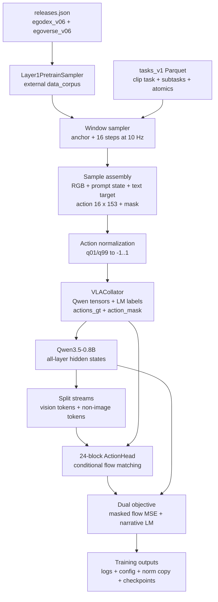
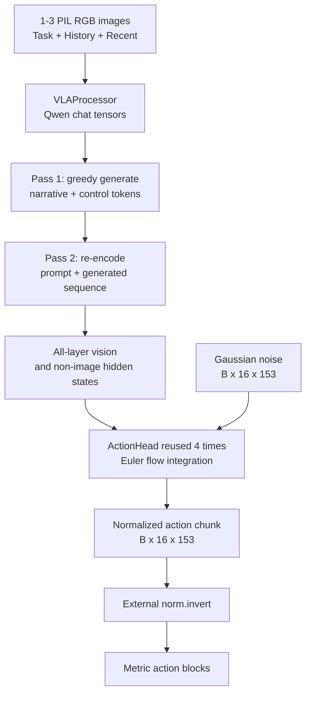

# VLA Core phiên bản mới: input ingestion, dataflow và output

> **Snapshot nghiên cứu:** `third_party/02_vla_core` tại commit
> [`2823b4e`](https://github.com/VietnamRobotics/vla_core/commit/2823b4e9eb974de34f28c0290a3591d9dc5f4653),
> kiểm tra ngày 2026-08-10. Superproject vẫn pin commit cũ `233396b`; working tree đang
> checkout phiên bản mới nhưng thay đổi gitlink chưa được commit.

## Tóm tắt điều hành

VLA Core mới là pipeline pretraining và offline evaluation cho một VLA dựa trên
Qwen3.5-0.8B. Đường dữ liệu thực tế bắt đầu từ hai release Layer-1 bên ngoài
(`egodex_v06`, `egoverse_v06`) và một lớp hierarchy `tasks_v1`, lấy một frame RGB tại
mỗi anchor, ghép action chunk `16 × 153`, dựng prompt `Task/History/Recent`, rồi tạo hai
nhánh supervision: action flow matching và narrative language modeling.

Ở inference, model không đi thẳng từ ảnh sang robot command. Nó chạy hai pass: sinh
narrative trước, re-encode toàn bộ prompt cộng narrative, sau đó dùng ActionHead denoise
Gaussian noise qua bốn bước Euler để tạo action chunk **trong normalized space**. Code hiện
chưa có deployment host hoàn chỉnh để cập nhật `History/Recent`, denormalize và gửi lệnh
sang robot. Vì vậy output hiện là tensor/action metric offline và checkpoint, chưa phải
closed-loop robot behavior.

**Trạng thái bằng chứng:** dataflow dưới đây được xác minh bằng đọc code tại commit nêu
trên; `test_norm.py` chạy pass và 27 file Python parse được. End-to-end training/inference
chưa chạy trong workspace do thiếu dependency, external corpus, dataset releases và model
weights.

## 1. Phiên bản này mới ở đâu?

So với commit `233396b` mà superproject đang pin, checkout hiện tại có năm commit mới,
thay đổi 28 file với khoảng 9.601 dòng thêm. Các thay đổi ảnh hưởng trực tiếp tới dataflow:

- thay lớp phase cũ bằng hierarchy `atomic → subtask → clip_task`;
- thêm `History:` và `Recent:` cùng control token `<|done|>`, `<|endsub|>`;
- tách horizon của action chunk khỏi `window_stride_s`, đồng thời loại window có nhiều
  atomic action kết thúc trong cùng horizon;
- thêm pooled action normalization và artifact thống kê có provenance;
- sửa đường inference/generation để mang theo `mm_token_type_ids`, EOS và autocast;
- thêm offline evaluation theo từng action block và shuffled control;
- checkpoint chỉ lưu trainable parameters, optimizer, scheduler, RNG, config và bản sao
  normalization metadata.

Đây là thay đổi về semantics của input/target chứ không chỉ là refactor. Report cũ của
`vla-core` không còn đủ để mô tả prompt state, control-token target và output evaluation
của phiên bản này.

## 2. Bản đồ dataflow tổng thể



Điểm quan trọng là hierarchy và Layer-1 corpus là **hai input độc lập** được join theo
`clip_id` và trục `video_frame`. Image/action/narrative thô đến từ sampler của
`data_corpus`; `clip_task`, subtask đã hoàn thành và atomic action đã hoàn thành đến từ
`tasks_v1`.

## 3. Input được ingest như thế nào?

### 3.1 Nguồn và dependency đầu vào

`configs/releases.json` hiện khai báo hai release bằng đường dẫn tuyệt đối:

| Nguồn          | Path được cấu hình                          | Vai trò                                   |
| --------------- | ------------------------------------------------ | ------------------------------------------ |
| `egodex`      | `/mnt/SSD4/dataset/releases/egodex_v06`        | video ego, annotation và action window    |
| `egoverse`    | `/mnt/SSD4/dataset/releases/egoverse_v06`      | video ego, annotation và action window    |
| `tasks_v1`    | `/mnt/SSD4/dataset/releases/_derived/tasks_v1` | hierarchy clip/subtask/atomic              |
| `data_corpus` | `/mnt/SSD3/code/VinRobotics/data_corpus`       | package cung cấp`Layer1PretrainSampler` |

Ba nhóm path này đều không tồn tại trong máy tại thời điểm kiểm tra. Ngoài ra,
`requirements.txt` dùng editable install tới path tuyệt đối của `data_corpus`, nên clone
VLA Core riêng chưa đủ để tái lập pipeline trên máy khác. Nguồn trực tiếp:
[`configs/releases.json`](../../../third_party/02_vla_core/configs/releases.json),
[`requirements.txt`](../../../third_party/02_vla_core/requirements.txt) và import sampler
trong
[`data/corpus_dataset.py`](../../../third_party/02_vla_core/data/corpus_dataset.py#L1-L27).

### 3.2 Contract mà adapter đọc từ Layer-1 sample

`CorpusPretrainDataset` gọi `Layer1PretrainSampler.sample(clip, t0)` và dùng các field sau:

| Nhóm              | Field được đọc                           | Biến đổi                                                                  |
| ------------------ | --------------------------------------------- | ---------------------------------------------------------------------------- |
| Image              | `video`, `video_frame`                    | PyAV keyframe seek, trả RGB`H × W × 3`, `uint8`                       |
| Head action        | `head_d_pos`, `head_d_rot`                | position 3D + hai cột đầu của rotation matrix thành rot6d               |
| Left/right hand    | `pos_cam`, `rot_cam`, `kp21`, `valid` | mỗi tay thành 72 chiều;`valid` mở/tắt toàn block                     |
| Text               | `narratives`                                | deduplicate theo span/text, ưu tiên span chứa anchor, bỏ`[ego]` clause |
| Locomotion         | `joystick`                                  | chỉ supervise khi khác`stationary`                                       |
| Provenance/routing | `source`, `clip_id`, `video_frame`      | source balancing và join hierarchy                                          |

Action per step có layout:

```text
head_d_pos(3) | head_rot6d(6)
| left:  pos_cam(3) | rot6d(6) | kp21(63)
| right: pos_cam(3) | rot6d(6) | kp21(63)
= 153 dimensions
```

Head block 9 chiều luôn có mask 1. Mỗi hand block 72 chiều dùng `hand.valid` theo từng
step; tay vắng hoặc invalid được mask khỏi loss. Contract này nằm trong
[`pack_actions()`](../../../third_party/02_vla_core/data/corpus_dataset.py#L29-L55).

Frame decoder không dùng OpenCV/decord. Code seek tới PTS gần anchor bằng PyAV, giới hạn
mỗi stream còn một decode thread và trả lỗi nếu không tìm được frame. Đây là lựa chọn quan
trọng vì comment trong code ghi AV1 của egodex có thể mở được bằng decoder khác nhưng đọc
frame thất bại im lặng. Chưa thể tái kiểm độ chính xác/tốc độ decoder vì release video và
`av` không có trong môi trường hiện tại.

### 3.3 Window enumeration, horizon và source balancing

Dataset tạo index `(clip_idx, t0)` bằng stride mặc định 2 giây, shuffle index theo seed, rồi
dùng `SourceTemperatureSampler` để chọn source theo:

$$
p(source) \propto n_{source}^{\tau}, \qquad \tau = 0.5.
$$

`window_stride_s` chỉ quyết định mật độ sample trong một epoch. Action target luôn là 16
step tại 10 Hz, tức horizon 1,6 giây. Trước khi train, dataset loại các anchor mà hai atomic
action cùng kết thúc trong horizon này; lý do được code nêu là target thứ hai sẽ mô tả một
action chưa bắt đầu, làm lệch state buffer khi inference. Xem
[`CorpusPretrainDataset.__init__()` và `_drop_multi_action()`](../../../third_party/02_vla_core/data/corpus_dataset.py#L156-L251)
cùng sampler trong
[`data/collate.py`](../../../third_party/02_vla_core/data/collate.py#L123-L147).

### 3.4 Hierarchy được join và chuyển thành prompt state

`data/hier.py` đọc:

- `clips.parquet`: `clip_id`, `status`, `clip_task`;
- `subtasks/{egodex,egoverse,xp10m}.parquet`: `sub_idx`, `start_f`, `end_f`, `label`;
- `atomics/{egodex,egoverse,xp10m}.parquet`: `seg_idx`, `start_f`, `end_f`, `text`.

Join dùng `clip_id` và `video_frame`; không dùng `anchor_row`. `hier.route()` trả:

- `task`: goal cấp clip;
- `history`: subtask đã kết thúc trước anchor;
- `recent`: atomic action đã kết thúc trong subtask hiện tại;
- `narrative`: atomic action chứa anchor;
- `atoms_ending`, `subs_ending`: mọi boundary đóng trong `(anchor, anchor+horizon]`;
- `known`: clip có hierarchy hợp lệ hay phải fallback.

Một chi tiết implementation cần phân biệt: `CorpusPretrainDataset.__getitem__()` dùng
`task/history/recent/atoms_ending/subs_ending` từ kết quả route, nhưng **không dùng**
`r.narrative`. Narrative supervision thực tế vẫn đến từ `pick_narrative(smp)` trên sample
Layer-1. Do đó hierarchy chịu trách nhiệm cho state/boundary, còn sampler narrative chịu
trách nhiệm cho câu mô tả action tại anchor.

Cache hierarchy được load ở parent process trước khi DataLoader fork để worker dùng
copy-on-write. Clip có subtask overlap bị loại khỏi hierarchy route và dùng fallback
`known=False`. Xem
[`data/hier.py`](../../../third_party/02_vla_core/data/hier.py#L99-L227).

### 3.5 Normalization

Action được normalize tại dataloader, không sửa release gốc. Artifact
`configs/action_norm_human_ego.json` khai báo thống kê từ 100.000 window, seed 0, `tau=0.5`,
gồm 46.240 sample egodex và 53.760 sample egoverse. Đây là metadata trong artifact, không
phải phép đo lại trên dataset hiện tại.

Mỗi cell dùng q01/q99 để tính center và scale, clip về `[-1, 1]`. Translation scale theo
từng chiều; rot6d và kp21 dùng một scalar cho cả block. Cell có range nhỏ hơn `1e-6` bị
đánh dấu dead, mask khỏi loss và zero khi invert. Việc kiểm tên release ngăn dùng nhầm stats
cho một mixture khác. Xem
[`data/norm.py`](../../../third_party/02_vla_core/data/norm.py) và artifact
[`action_norm_human_ego.json`](../../../third_party/02_vla_core/configs/action_norm_human_ego.json).

## 4. Từ sample tới model tensors

### 4.1 Prompt và assistant target

Mỗi sample train hiện chỉ truyền **một head RGB image** vào collator, dù `VLAProcessor` hỗ
trợ API 1–3 ảnh cho inference/multi-camera. Prompt text chỉ thêm field khi có giá trị:

```text
Task: <clip-level goal>
History: - <finished subtask> ...
Recent: - <finished atomic action in current subtask> ...
What should the robot do next?
```

Assistant target là chuỗi các span có supervision flag:

1. narrative chứa anchor, nếu có;
2. `<loco>...</loco>`, nếu locomotion có thông tin;
3. một `<|done|>` cho mỗi atomic action kết thúc trong horizon;
4. `<|endsub|> <label>` cho mỗi subtask kết thúc trong horizon.

Nếu window không có nội dung đáng supervise, collator tạo assistant placeholder rỗng và
mask toàn bộ label bằng `-100`. Prompt và assistant được token hóa chung; mask của span
unsupervised được xác định bằng character offset trên joint tokenization để tránh BPE merge
làm trượt label boundary. Xem
[`data/collate.py`](../../../third_party/02_vla_core/data/collate.py#L24-L120) và
[`data/processing.py`](../../../third_party/02_vla_core/data/processing.py#L79-L205).

### 4.2 Batch contract

`VLACollator` right-pad text và trả:

| Tensor/metadata                               | Shape/ý nghĩa                                                      |
| --------------------------------------------- | -------------------------------------------------------------------- |
| `input_ids`, `attention_mask`, `labels` | `(B, S)`; prompt/unsupervised label là `-100`                   |
| `mm_token_type_ids`                         | `(B, S)`; giữ text/image position type cho M-RoPE                 |
| `pixel_values`                              | patch stream được concatenate giữa các sample                   |
| `image_grid_thw`                            | một row cho mỗi image, giữ cùng thứ tự với patch/token stream |
| `actions_gt`                                | `(B, 16, 153)` normalized action                                   |
| `action_mask`                               | `(B, 16, 153)` per-element mask                                    |
| `sources`                                   | list source name                                                     |
| `has_narrative`                             | sample có ít nhất một supervised assistant span                  |

Processor đặt pixel budget chung cho mọi source. Comment trong code cho biết cap hiện biến
1920×1080, 640×480 và 640×360 thành khoảng 252, 234 và 220 vision token, nhằm giảm việc
resolution trở thành source identifier. Con số này có test nhưng chưa chạy được tại máy này
do thiếu model processor và dependency.

## 5. Dataflow bên trong model khi training

1. Qwen nhận text/image tensors và trả hidden state của embedding layer cộng 24 LM layer.
2. `extract_hidden_states()` tách vị trí `image_token_id` thành vision stream; mọi token hợp
   lệ còn lại thành stream được code gọi là `narrative_hs`. Tên này dễ gây hiểu nhầm: ở
   training, stream đó gồm cả chat marker, prompt và assistant target, không chỉ narrative.
3. Mặc định `detach_action_input=True`, nên action loss dừng gradient tại biên Qwen; LM loss
   vẫn train LoRA và hai embedding row của control tokens.
4. Ground-truth action được trộn với Gaussian noise tại flow timestep `t`; target velocity
   là `actions_gt - noise`.
5. ActionHead biến noisy action thành 16 token, cộng position/time embedding, rồi chạy 24
   cross-attention block. Block thứ `i` condition theo vision và non-image hidden state của
   Qwen layer `i+1`.
6. Masked MSE tính action loss theo từng element hợp lệ. Qwen đồng thời trả narrative LM
   loss; `total_loss = action_loss + 0.1 × narrative_loss`.

Nguồn chính:
[`VLAModel.forward()`](../../../third_party/02_vla_core/model/vla_model.py#L189-L309),
[`extract_hidden_states()`](../../../third_party/02_vla_core/model/utils.py#L13-L84) và
[`ActionHead.forward()`](../../../third_party/02_vla_core/model/action_head.py#L364-L450).

Lưu ý: khi `detach_action_input=True`, hai loss tác động lên hai nhóm parameter rời nhau.
Code tự cảnh báo hệ số narrative gần như không cân bằng update dưới AdamW và cung cấp
`--head-lr-mult` để điều chỉnh learning rate của ActionHead.

## 6. Inference: input nào vào và output nào ra?



`predict_action()` là inference entry point đầy đủ:

- **Pass 1:** greedy generation, tối đa 128 token; caller phải cung cấp tokenizer
  `pad_token_id`, còn EOS mặc định là `<|im_end|>` ID 248046.
- **Pass 2:** nối attention mask và `mm_token_type_ids` cho token mới, re-encode toàn
  sequence, rồi tách hidden state.
- **Action sampling:** bắt đầu từ Gaussian noise và gọi ActionHead bốn lần với Euler step
  `dt=1/4`.
- **Return:** tensor `(B, 16, 153)` trong normalized space.

Code từ chối batch `B>1` nếu prompt đang right-pad, vì decoder-only `generate()` cần
left-padding. Offline evaluator tránh trường hợp này bằng inference từng sample. Xem
[`predict_action()`](../../../third_party/02_vla_core/model/vla_model.py#L313-L465) và
[`sample_actions()`](../../../third_party/02_vla_core/model/vla_model.py#L577-L620).

`generate_narrative()` là output surface riêng, trả full token IDs gồm prompt cộng phần đã
generate; `ControlTokens.which/strip/strip_reasoning_span` cung cấp primitive để phát hiện
boundary và làm sạch narrative. Tuy nhiên repo không có rollout host gọi các primitive này
để duy trì `History/Recent` qua thời gian. Nói cách khác, model **phát tín hiệu state
transition**, nhưng vòng lặp stateful consumer vẫn là khoảng trống tích hợp.

## 7. Output artifacts

### 7.1 Training output

`train/pretrain.py` ghi vào `--out` (mặc định `runs/run1`):

| Artifact/output      | Nội dung                                                                        |
| -------------------- | -------------------------------------------------------------------------------- |
| stdout               | `total_loss`, `action_loss`, `narrative_loss`, gradient norm, LR, sample/s |
| `config.json`      | toàn bộ CLI arguments của run                                                 |
| `action_norm.json` | bản sao stats đã dùng để train                                             |
| `ckpt_XXXXXX.pt`   | periodic checkpoint theo`--save-every`                                         |
| `ckpt_final.pt`    | final checkpoint                                                                 |

Checkpoint chứa trainable-only model state, optimizer state, scheduler state, step,
normalization document, model config, CLI args và CPU RNG state. Frozen Qwen backbone không
được embed trong checkpoint; lúc load vẫn phải resolve đúng model ID/weights bên ngoài. Xem
[`save()`](../../../third_party/02_vla_core/train/pretrain.py#L136-L162).

### 7.2 Model forward output

`VLAOutput` có bốn field:

- `predicted_actions`: trong training đây là **predicted velocity field**, không phải action
  đã denoise;
- `action_loss`: masked flow-MSE scalar;
- `narrative_loss`: LM cross-entropy scalar;
- `total_loss`: tổng loss để backward.

Chỉ `predict_action()`/`sample_actions()` mới trả sampled action chunk. Tên
`predicted_actions` trong training vì vậy không nên được hiểu là robot command.

### 7.3 Offline evaluation output

`eval/offline.py` load checkpoint, chạy `predict_action()` từng validation window,
`norm.invert()` về metric units và báo MAE riêng cho tám block: head/left/right position,
rot6d và kp21. Nó cũng shuffle prediction giữa các window để tạo control: nếu checkpoint
không tốt hơn control, model có thể chỉ học marginal action distribution.

CLI in bảng ra stdout và có thể ghi JSON khi có `--out`; JSON gồm `mae`,
`shuffled_control`, `n`, `step`, `seed`. Đây là **open-loop regression trên held-out human
video**, không phải simulator/robot task success. `History/Recent` mặc định còn là oracle từ
annotation; `--no-history` chỉ tạo một pessimistic bound bằng cách bỏ cả hai field. Nguồn:
[`eval/offline.py`](../../../third_party/02_vla_core/eval/offline.py).

## 8. Những điểm đã xác minh bằng runtime

Chạy từ workspace root ngày 2026-08-10:

```bash
python3 -m pytest -q third_party/02_vla_core/tests/test_norm.py
# 1 passed in 0.13s
```

Một AST parse độc lập đọc 27 file Python trong vendor tree và không thấy syntax failure.

Full suite:

```bash
python3 -m pytest -q third_party/02_vla_core/tests
# collection stopped: 5 import errors
```

Nguyên nhân quan sát được là thiếu `torch` và `pandas`; probe môi trường còn cho thấy thiếu
`transformers`, `av`, `pyarrow`, `peft`. Bốn external path trong phần 3.1 cũng không tồn
tại. Vì vậy các claim sau **chưa được runtime-verified trong workspace này**:

- frame seek đúng pixel và đạt latency được test kỳ vọng;
- vision token cap đúng các count ghi trong test;
- hierarchy invariant trên corpus thật;
- collator/label target trên sample thật;
- model construction, forward, overfit collapse và checkpoint resume;
- two-pass inference và offline metric.

## 9. Rủi ro, mâu thuẫn và câu hỏi mở

### Verified từ code/working tree

1. **Superproject chưa pin phiên bản mới.** Outer gitlink vẫn là `233396b`, còn nested repo
   ở `2823b4e`. Clone/submodule update theo superproject sẽ không tự tái lập snapshot report.
2. **Input không portable.** Release config, hierarchy root và editable dependency đều là
   absolute path trên máy khác.
3. **Training hiện single GPU.** `WORLD_SIZE>1` hard-fail; chưa có DDP.
4. **Training ingest một camera.** Processor/model API hỗ trợ 1–3 image nhưng dataset
   collator luôn gọi `images=[head_frame]`; wrist cameras chưa nằm trong run-1 path.
5. **Output chưa phải robot-control stack.** Không có host cập nhật prompt buffer, action
   denormalization trong `predict_action()`, safety filter, timing loop hay robot transport.
6. **Checkpoint không self-contained.** Frozen Qwen và processor phải tải lại từ model ID.
7. **Có hai nguồn narrative liên quan nhưng chỉ một nguồn được supervise.** `hier.route()`
   tính `r.narrative`, còn dataset dùng `pick_narrative(smp)`. Việc text boundary từ
   `tasks_v1` luôn khớp với narrative được sampler chọn chưa được assert trực tiếp trong
   đường `__getitem__()`.

### Mâu thuẫn tài liệu nội bộ

- Docstring đầu `model/vla_model.py` vẫn vẽ output `(B, 50, 23)`, trong khi config và train
  path thực tế dùng `(B, 16, 153)`.
- Một số comment đầu `data/hier.py` còn mô tả horizon là “next anchor/stride” và nói action
  chunk ngắn hơn stride; implementation hiện gọi `route()` bằng horizon action chunk 1,6 s,
  test cũng đặt `STRIDE=48`. Với câu hỏi behavior hiện hành, cần tin call site và test mới
  hơn comment cũ.
- `README.md` nói dataset train có 4,48 triệu window và validation group-disjoint. Workspace
  không có release/sampler để đếm lại, nên đây chỉ là upstream claim chưa xác minh tại chỗ.

### Unknown cần kiểm tiếp

- Một checkpoint mới có sinh đúng `<|done|>/<|endsub|>` và action tốt hơn shuffled control
  trên tất cả block hay không?
- Oracle `History/Recent` tạo chênh lệch bao nhiêu so với state do model tự tích lũy?
- Drop multi-action window tác động bao nhiêu tới coverage theo source/task sau khi dùng
  release thật?
- Absolute paths sẽ được parameterize bằng CLI/environment hay giữ như contract nội bộ?

## 10. Kết luận và bước tái lập đề xuất

Phiên bản mới đã làm rõ một VLA dataflow hai-output: narrative/control-token stream quản lý
state ngữ nghĩa, còn flow-matching head tạo continuous action chunk. Phần ingest không đơn
thuần đọc ảnh/action: nó chủ động làm sạch target, route hierarchy, loại sample gây
train/inference skew, normalize theo mixture và giữ per-element validity mask. Đây là điểm
thay đổi quan trọng nhất so với snapshot cũ.

Để chuyển kết luận static thành runtime evidence, thứ tự kiểm chứng hợp lý là:

1. parameterize và mount đúng `data_corpus`, hai release cùng `tasks_v1`;
2. tạo môi trường có `torch`, `transformers>=5.3`, `peft`, `av`, `pyarrow`, `pandas`;
3. chạy unit/input/hierarchy/target tests trước;
4. chạy `--overfit 8` và `tests/check_overfit_emits.py` để xác nhận loss collapse cùng
   control-token emission;
5. chạy offline eval với và không có history, lưu JSON và so với shuffled control;
6. chỉ sau đó thiết kế host loop duy trì History/Recent và denormalize action cho deployment.

## Nguồn

### Primary code snapshot

- [VietnamRobotics/vla_core commit `2823b4e`](https://github.com/VietnamRobotics/vla_core/commit/2823b4e9eb974de34f28c0290a3591d9dc5f4653)
- [Dataset adapter](../../../third_party/02_vla_core/data/corpus_dataset.py)
- [Hierarchy routing](../../../third_party/02_vla_core/data/hier.py)
- [Processor](../../../third_party/02_vla_core/data/processing.py)
- [Batch collator và source sampler](../../../third_party/02_vla_core/data/collate.py)
- [Action normalization](../../../third_party/02_vla_core/data/norm.py)
- [VLA model](../../../third_party/02_vla_core/model/vla_model.py)
- [Action head](../../../third_party/02_vla_core/model/action_head.py)
- [Control tokens](../../../third_party/02_vla_core/model/special_tokens.py)
- [Training loop](../../../third_party/02_vla_core/train/pretrain.py)
- [Offline evaluator](../../../third_party/02_vla_core/eval/offline.py)

### Artifacts và executed checks

- [Release config](../../../third_party/02_vla_core/configs/releases.json)
- [Action normalization artifact](../../../third_party/02_vla_core/configs/action_norm_human_ego.json)
- [Tests](../../../third_party/02_vla_core/tests)
- Notion workspace search “VLA Core input ingestion dataflow output” ngày 2026-08-10 không
  trả về nguồn nào khớp trực tiếp; vì vậy report không dùng các trang VLA tổng quát làm bằng
  chứng cho implementation này.
