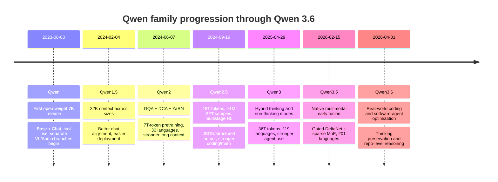
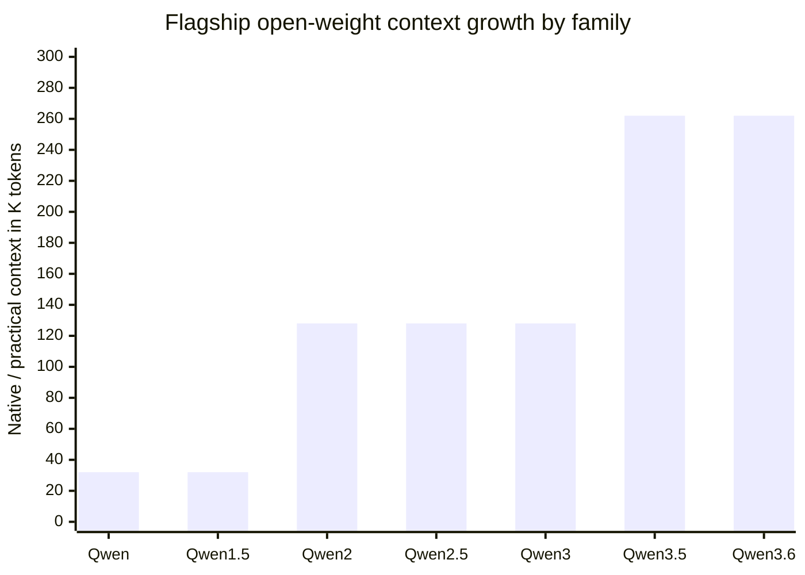

# Qwen Model Family Through Qwen 3.6

## Executive Summary

The public Qwen family progression up to **Qwen 3.6** is best understood as seven major version families: **Qwen**, **Qwen1.5**, **Qwen2**, **Qwen2.5**, **Qwen3**, **Qwen3.5**, and **Qwen3.6**. Across those families, the most important arcs were: a move from early decoder-only LLMs with separate multimodal branches into broader multilingual and longer-context text models; then into heavily specialized coding/math/vision/audio branches; then into hybrid “thinking / non-thinking” agents; and finally into **native multimodal, efficiency-oriented, agentic models** with explicit coding-first post-training in 3.6. The biggest step-changes were **Qwen1.5 → Qwen2**, **Qwen2 → Qwen2.5**, **Qwen2.5 → Qwen3**, and **Qwen3 → Qwen3.5**. Those jumps were driven by larger and cleaner pretraining corpora, more aggressive post-training, better long-context methods, more parameter-efficient architectures, stronger reinforcement learning, and—by 3.5—native multimodal early-fusion training and hybrid linear-attention/MoE design. citeturn18view0turn28view0turn39view0turn40view0turn42view0turn44view0

If the goal is to identify the clearest “version-to-version” inflection points,

- **Qwen2** is where Qwen becomes an obviously stronger modern open-weight family;
- **Qwen2.5** is where Qwen becomes a very strong general-purpose platform with powerful specialist branches;
- **Qwen3** is where hybrid reasoning and agent/tool use become the core product identity;
- **Qwen3.5** is where the family makes its most consequential architectural jump toward native multimodal agents and much better parameter efficiency
- **Qwen3.6** is where post-training sharply re-optimizes the line for real-world coding and software-agent work rather than merely raw general benchmarks.

A concise bottom line: **Qwen2** was the big “foundation reset,” **Qwen2.5** the “maturity and specialization” release, **Qwen3** the “hybrid reasoning and agent” release, **Qwen3.5** the “native multimodal efficiency” release, and **Qwen3.6** the “production coding agent” release. citeturn28view0turn39view0turn40view0turn42view0turn44view0

## Scope and Method

This report treats “versions” as the **publicly named Qwen family releases** that appear in official Qwen release materials up to the user’s cutoff of **Qwen 3.6**: **Qwen, Qwen1.5, Qwen2, Qwen2.5, Qwen3, Qwen3.5, Qwen3.6**. I did **not** treat every branch model—such as Qwen-VL, Qwen-Audio, Qwen2.5-Coder, Qwen2.5-Math, Qwen3-VL, or Qwen3-Omni—as a separate “main version,” but I do analyze them as **task-specific or multimodal branches within their parent family**, because that is how the official materials present them. Where official release materials did not provide a total training-token count, an exact family-wide release date, or a directly comparable score, I mark the item **unspecified** and note what the retrieved sources do provide. citeturn38view0turn38view1turn12search0turn12search1

I prioritized **official primary sources**: Qwen GitHub repositories, official Qwen blog posts, official Hugging Face model cards, and Qwen technical reports on arXiv. I used benchmark numbers from official Qwen model cards and technical reports when possible, since those are the sources that expose enough detail to compare versions. citeturn18view0turn27view0turn39view0turn40view0turn42view0turn44view0

## Version-by-Version Analysis

### Qwen

**Release and sizes.** The first open-weight core Qwen release appeared on **2023-08-03** with **Qwen-7B / Qwen-7B-Chat**. The family then expanded to **14B** on **2023-09-25** and **1.8B** and **72B** on **2023-11-30**. By late 2023, the main public family therefore spanned **1.8B, 7B, 14B, and 72B**, each with base and chat variants. The flagship 72B model had been pretrained on **3.0T** tokens; 7B at that point had **2.4T** tokens. citeturn18view0

**Architecture, training, and tuning.** Qwen was introduced as the first installment of the Qwen family, with base pretrained models and chat models aligned with human-preference methods. The official report says the chat models were finetuned with human-alignment techniques, and explicitly notes the use of **RLHF** as a major component for competitive chat performance. The repository describes multilingual pretraining “up to 3 trillion tokens,” broad domain coverage, and alignment via **SFT and RLHF**. Training objective for the base models was next-token prediction; for chat models, instruction following and alignment were layered on top. citeturn34view0turn18view0

**Multimodality, efficiency, and features.** The original Qwen family itself was not natively multimodal, but it quickly spawned **separate multimodal branches**: **Qwen-VL** was released on **2023-08-22** and **Qwen-Audio** checkpoints on **2023-11-30**. Qwen-VL used **Qwen-7B** plus an **OpenCLIP ViT-bigG** visual encoder and cross-attention, while Qwen-Audio used **Qwen-7B** plus a **Whisper-large-v2** audio encoder. The core Qwen chat line already emphasized **tool use, agent behavior, and code interpreter scenarios**, and the repo includes a Chinese tool-use benchmark where **Qwen-72B-Chat** reached **98.2% tool selection accuracy** and **1.1% false-positive error**, slightly edging GPT-4 on selection accuracy in that benchmark. Quantized **Int4** and **Int8** variants were also released for lower memory use and faster inference. citeturn46view0turn46view1turn45search3turn18view0

**How Qwen1.5 improved on it.** Official Qwen1.5 materials describe the next family as adding a broader size ladder, stronger multilingual support, uniformly stable **32K** context support, improved chat alignment, and native support in `transformers` without `trust_remote_code`. Public official sources do **not** provide a clean one-table, like-for-like Qwen-vs-Qwen1.5 benchmark comparison, so the most defensible quantified deltas are structural and deployment-related rather than benchmark deltas. citeturn24view0turn35view0

### Qwen1.5

**Release and sizes.** **Qwen1.5** was introduced on **2024-02-04**. Official materials describe a dense lineup that included **0.5B, 1.8B, 4B, 7B, 14B, 32B, and 72B**, plus a **MoE** model with **14B total / 2.7B activated**; later in the broader family lifecycle, **Qwen1.5-110B** was added on **2024-04-25**. The 72B-size model card characterizes Qwen1.5 as the “beta version of Qwen2.” citeturn35view0turn24view0turn38view0

**Architecture, training, and tuning.** The official model card says Qwen1.5 remained a decoder-only Transformer family, but with a more modernized stack: **SwiGLU**, **attention QKV bias**, **group query attention**, a **mixture of sliding-window attention and full attention**, and an improved tokenizer. The same model card also warns that, in the beta release, some of those features were not yet integrated in every size, which matters because Qwen1.5 acted as a transition layer into the more fully realized Qwen2 architecture. Post-training support remained centered on **SFT, RLHF, and continued pretraining**, and the release explicitly emphasized improved human-preference alignment in chat models. citeturn24view0turn35view0

**Training data, objectives, multimodality, and features.** The retrieved official Qwen1.5 materials do **not** give a full family-wide token count directly in the launch blog, but the later Qwen2 technical report states that Qwen2 expanded pretraining from **3T tokens in Qwen1.5** to **7T tokens in Qwen2**, which implies a roughly **3T-token** Qwen1.5 training scale. Qwen1.5 also introduced broader multilingual support for both base and chat models, uniform **32K** context across models, stronger support across deployment frameworks, and direct use through modern `transformers`. Multimodality still lived in separate Qwen-VL and Qwen-Audio branches rather than the core family. citeturn28view0turn35view0turn24view0

**Benchmarks and task specificity.** Qwen1.5-72B posted **77.5 MMLU**, **79.5 GSM8K**, **41.5 HumanEval**, and **65.5 BBH** in the official launch blog’s base-model benchmark table. For chat, **Qwen1.5-72B-Chat** scored **8.61 MT-Bench** and **27.18 AlpacaEval 2.0 win rate**. The same launch blog also showed strong multilingual performance and long-context performance, with **Qwen1.5-72B-Chat** reaching **78.12** average on the blog’s reported L-Eval suite. At the task-specific level, Qwen already had coding and math subfamilies, but Qwen1.5 made those branches much easier to deploy and extend. citeturn35view0

**How Qwen2 improved on it.** This is one of the clearest measured jumps in the family. The Qwen2 technical report says the flagship **Qwen2-72B** reached **84.2 MMLU**, **37.9 GPQA**, **64.6 HumanEval**, **89.5 GSM8K**, and **82.4 BBH**, versus Qwen1.5-72B’s **77.5 MMLU**, **41.5 HumanEval**, **79.5 GSM8K**, and **65.5 BBH**. That is a gain of roughly **+6.7 MMLU**, **+23.1 HumanEval**, **+10.0 GSM8K**, and **+16.9 BBH** on those official snapshots. Architecturally, Qwen2 formalized **GQA**, **Dual Chunk Attention**, and **YaRN**, cut KV-cache cost per token, and expanded pretraining from roughly **3T to 7T tokens**. citeturn35view0turn28view0

### Qwen2

**Release and sizes.** **Qwen2** was officially announced on **2024-06-07**. The family comprised dense models at **0.5B, 1.5B, 7B, and 72B**, plus an MoE model at **57B total / 14B activated**. Official materials emphasize that the 0.5B and 1.5B models were intended for easy deployment on portable devices, while larger models targeted GPU deployment. citeturn38view0turn27view0

**Architecture changes.** Qwen2 was a substantial redesign relative to Qwen1.5. The technical report explicitly identifies **Grouped Query Attention** as a replacement for conventional MHA to reduce KV-cache use and improve throughput, and it adds **Dual Chunk Attention** together with **YaRN** for long-context handling. It keeps **SwiGLU**, **RoPE**, **QKV bias**, **RMSNorm**, and pre-normalization, and the report highlights a **substantially lower KV size per token relative to Qwen1.5**, which directly reduces inference memory footprint—especially important at long context. citeturn28view0

**Training data, objectives, and post-training.** Qwen2 was pretrained on **over 7 trillion tokens**, up from **3T** in Qwen1.5, with more multilingual, code, and mathematics data. The report says Qwen2 supports approximately **30 languages**, and that the long-context stage raised context from **4,096** to **32,768** during late pretraining, while DCA and YaRN enabled processing up to **131,072** tokens. Post-training used **supervised fine-tuning** and **DPO**, and the report explicitly frames the alignment goal as making outputs **helpful, honest, and harmless**. citeturn28view0turn27view0

**Multimodality and new features.** Qwen2 itself was still a text-first family, but the official ecosystem around it expanded materially. The Qwen blog index shows **Qwen2-Audio** released on **2024-08-09** and **Qwen2-VL** on **2024-08-29**, both framed as next-generation multimodal branches built on the Qwen2 line. Qwen2-VL added state-of-the-art image understanding, long-video understanding, and architectural ideas such as **dynamic resolution** and **M-ROPE**; Qwen2-Audio added updated audio understanding. That means Qwen2 marked the first time the Qwen family had a clean, modern text core with parallel modern multimodal branches clearly branded under the same generation. citeturn38view1turn47search0turn47search8turn22search9

**Benchmarks and task specificity.** Officially, **Qwen2-72B** reached **84.2 MMLU**, **37.9 GPQA**, **64.6 HumanEval**, **89.5 GSM8K**, and **82.4 BBH**. **Qwen2-72B-Instruct** reached **9.1 MT-Bench**, **48.1 Arena-Hard**, and **35.7 LiveCodeBench**. Those results established Qwen2 as a strong general-purpose model family rather than merely a competitive Chinese-centric alternative. The smaller dense models were clearly deployment oriented, while the separate **Qwen2-VL**, **Qwen2-Audio**, and **Qwen2-Math** branches made 2.x meaningfully more task-specialized than earlier generations. citeturn27view0turn38view0

**How Qwen2.5 improved on it.** Qwen2.5 scaled high-quality pretraining from **7T to 18T tokens**, strengthened post-training with **over 1 million SFT samples** and **multi-stage reinforcement learning**, and focused heavily on long text generation, structured data understanding, structured outputs such as JSON, coding, and math. Official launch material summarizes the flagship improvement as roughly **MMLU 85+**, **HumanEval 85+**, and **MATH 80+**, whereas Qwen2-72B stood at **84.2 MMLU** and **64.6 HumanEval** in the earlier technical report. Even allowing for benchmark-reporting differences, the coding jump is especially large. citeturn30search0turn39view0turn27view0

### Qwen2.5

**Release and sizes.** **Qwen2.5** was announced on **2024-09-19**. Official launch materials list the general-purpose LLM line at **0.5B, 1.5B, 3B, 7B, 14B, 32B, and 72B**. The same release train also included dedicated families for **Qwen2.5-Coder** and **Qwen2.5-Math**, while later 2.5-family releases added **Qwen2.5-1M** for million-token context, **Qwen2.5-VL** for vision-language, **Qwen2.5-Omni** for end-to-end multimodal input/output, and **QwQ** as the reasoning-oriented branch named in the technical report. citeturn39view0turn30search0turn48search0turn48search2turn48search4

**Architecture, training data, and objectives.** The accessible official sources keep the base architecture description fairly conservative—Transformer + RoPE + SwiGLU + RMSNorm + QKV bias—but the main story is not a dramatic architecture replacement; it is **much larger and better pretraining plus stronger post-training**. The technical report abstract states that Qwen2.5 scales high-quality pretraining from **7T to 18T tokens** and adds **intricate supervised finetuning with over 1 million samples** plus **multistage reinforcement learning**. The family aims squarely at stronger common-sense knowledge, expert knowledge, reasoning, longer structured generation, and instruction following. citeturn30search0turn26view0turn26view1

**Fine-tuning, multimodality, and features.** Qwen2.5 retained long-context support at **128K** and added **generation up to 8K tokens**, while official materials emphasize better instruction following, longer text generation, better table/structured-data understanding, robust JSON output, and better behavior under diverse system prompts. Tool-use support was easier to access through **vLLM**, **Ollama**, and `transformers`, while still keeping compatibility with the older Qwen-Agent template. Within the 2.5 family, the task-specific story became exceptionally strong: **Qwen2.5-Coder** continued pretraining on **5.5T code-related tokens**; **Qwen2.5-Math** added CoT, PoT, and TIR; **Qwen2.5-1M** extended context to **1M tokens** and delivered **3x to 7x prefill speedup** at 1M context in its inference framework; **Qwen2.5-VL** was presented as a significant leap over Qwen2-VL; and **Qwen2.5-Omni** became the family’s first end-to-end model handling **text, images, audio, and video** with **streaming text and speech output**. citeturn39view0turn26view1turn30search8turn48search14turn48search17turn48search0turn48search4turn48search13

**Benchmarks and task specificity.** The 2.5 launch blog frames the family as crossing into a new tier: **MMLU 85+**, **HumanEval 85+**, **MATH 80+** for the flagship line, while emphasizing that even smaller specialist models were competitive against larger general models. The technical report says **Qwen2.5-72B-Instruct** is competitive with **Llama-3-405B-Instruct**, a model about **5× larger**. This is also the family where task-specificity becomes unmistakable: coding, mathematics, long context, reasoning, vision-language, and full multimodal interaction all become first-class official branches rather than side experiments. citeturn39view0turn30search0

**How Qwen3 improved on it.** Qwen3 nearly doubled pretraining again, moving from **18T to about 36T tokens**, and expanded language coverage from **29+ languages** to **119 languages and dialects**. More importantly, Qwen3 changed the interaction model: it unified **thinking mode** and **non-thinking mode** inside one model, added more explicit **thinking-budget control**, raised agent/tool capabilities, and achieved major **parameter-efficiency gains**. Officially, **Qwen3-4B can rival Qwen2.5-72B-Instruct**, and the dense base-model ladder lines up roughly as **Qwen3-1.7B/4B/8B/14B/32B ≈ Qwen2.5-3B/7B/14B/32B/72B**, respectively. That is one of the strongest efficiency claims anywhere in the family history. citeturn40view0turn31search1

### Qwen3

**Release and sizes.** **Qwen3** was officially announced on **2025-04-29**. The first public release included dense models at **0.6B, 1.7B, 4B, 8B, 14B, and 32B**, plus two MoE models: **30B total / 3B activated** and **235B total / 22B activated**. The release was under **Apache 2.0**. citeturn40view0turn37view0

**Architecture and training.** Qwen3 remained a text LLM family with dense and MoE forms, but the big novelty was not just the size list—it was the **hybrid reasoning interface** and the more aggressive training regime. Official materials say Qwen3 was pretrained on about **36T tokens** across **119 languages and dialects**. The blog describes a three-stage pretraining pipeline: **30T+ tokens** in stage one at **4K** context, then **5T** more tokens with a higher share of knowledge/STEM/code/reasoning data, and then a final long-context stage to **32K**. Qwen2.5-VL and Qwen2.5 were used to extract and clean text from PDF-like documents, and Qwen2.5-Math/Qwen2.5-Coder were used to synthesize math and code data. citeturn40view0turn31search1

**Post-training, tool use, and efficiency.** The official blog gives a **four-stage post-training pipeline**: long-CoT cold start, reasoning RL, thinking-mode fusion, and general RL. That stack underpins the defining Qwen3 feature: **one model can switch between thinking and non-thinking behavior** instead of forcing developers to choose separate model families. Official materials also call out stronger **agentic capabilities** and better **MCP support**. Parameter efficiency improved sharply: Qwen says its **Qwen3 MoE base models achieve similar performance to Qwen2.5 dense base models while using only about 10% of the active parameters**, saving both training and inference cost. citeturn40view0turn37view0

**Multimodality.** The initial Qwen3 release was primarily a text family; multimodality was not yet described as native to the core Qwen3 LLMs in the official April 2025 release materials retrieved here. In other words, compared with Qwen2.5’s late-family Omni/VL branches, Qwen3’s headline advance was **reasoning/agent design**, not yet unified multimodality in the base release. citeturn40view0turn37view0

**Benchmarks and task specificity.** Official sources say **Qwen3-235B-A22B** is competitive with top-tier models including DeepSeek-R1, o1, o3-mini, Grok-3, and Gemini-2.5-Pro. The blog makes two particularly strong comparative claims: **Qwen3-30B-A3B outcompetes QwQ-32B with 10× fewer active parameters**, and **Qwen3-4B rivals Qwen2.5-72B-Instruct**. That makes Qwen3 the clearest “general-purpose but reasoning-heavy” pivot in the family. Coding, math, and agent tasks moved from being side branches to core identity features. citeturn40view0turn36search6turn37view0

**How Qwen3.5 improved on it.** Qwen3.5 changed not only the performance envelope but the underlying design priorities. Official Qwen3.5 model cards emphasize **early-fusion multimodal training**, **Gated Delta Networks plus sparse MoE**, **201 languages and dialects**, **million-agent RL at scale**, and **near-100% multimodal training efficiency relative to text-only training**. Quantitatively, **Qwen3.5-122B-A10B** beats **Qwen3-235B-A22B** on many official reported tests despite using **10B activated vs 22B activated** parameters—for example **MMLU-Pro 86.7 vs 84.4**, **GPQA Diamond 86.6 vs 81.1**, **HLE w/ CoT 25.3 vs 18.2**, and **BFCL-V4 72.2 vs 54.8**. That is a major efficiency and capability jump, not just an incremental update. citeturn42view0

### Qwen3.5

**Release and sizes.** The official Qwen AI blog search result shows **Qwen3.5** on **2026-02-15**. The public Hugging Face collection shows an open-weight family including dense models at **0.8B, 2B, 4B, 9B, and 27B**, and MoE models at **35B-A3B, 122B-A10B, and 397B-A17B**. The 27B and smaller dense models were first visible on model cards dated **2026-03-02**, with additional larger MoE variants in the family collection by March and April 2026. citeturn12search0turn14search7turn15view2

**Architecture changes.** Qwen3.5 is the most dramatic architectural departure in the lineage up to 3.6. The official model cards describe a **Causal Language Model with Vision Encoder** and a hidden layout that alternates **Gated DeltaNet** blocks with **Gated Attention** blocks, combined with sparse **Mixture-of-Experts** in the MoE variants. The 122B-A10B card, for example, uses **12 × (3 × (Gated DeltaNet → MoE) → 1 × (Gated Attention → MoE))**, **256 experts**, and **8 routed + 1 shared activated experts**. The family also uses **MTP** and supports **262,144 native context**, extendable to about **1.01M tokens**. citeturn42view0turn16view0

**Training data, objectives, and multimodality.** In the accessible official sources I retrieved, a total family-wide pretraining token count for Qwen3.5 is **unspecified**. What is specified is more conceptually important: **early-fusion multimodal training on multimodal tokens**, **million-agent RL environments with progressively complex tasks**, and support expanded to **201 languages and dialects**. Qwen3.5 is also explicitly presented as a **unified vision-language foundation**, not a text model with a later attached VL branch. That is a major change in training objective: instead of a text-first family with sibling multimodal branches, Qwen3.5 is trained as a **native multimodal agent foundation**. citeturn42view0turn16view0

**Fine-tuning, efficiency, and features.** The family emphasizes **agent use**, **coding**, **search-agent workflows**, and **ultra-long text**. The model cards call out **high-throughput inference with minimal latency/cost overhead** as a consequence of the Gated DeltaNet + sparse MoE architecture, and they claim **near-100% multimodal training efficiency** relative to text-only training. Tooling is integrated through Qwen-Agent and Qwen Code usage sections in the official cards. citeturn42view0

**Benchmarks and task specificity.** Qwen3.5 is clearly more agentic and multimodal than Qwen3. Knowledge and reasoning improved on the flagship comparison: **MMLU-Pro 86.7 vs 84.4**, **GPQA Diamond 86.6 vs 81.1**, **HLE w/ CoT 25.3 vs 18.2** for **Qwen3.5-122B-A10B vs Qwen3-235B-A22B**. It also lifted coding and agent measures: **SWE-bench Verified 72.0** for 122B-A10B, **Terminal Bench 2 = 49.4**, **BFCL-V4 = 72.2**, and **TAU2-Bench = 79.5**. Among the smaller open models, **Qwen3.5-27B** is especially notable because it approaches or beats the 35B-A3B MoE on several metrics, including **LiveCodeBench v6 = 80.7** and **HLE with tool = 48.5** in the official table. The evidence strongly supports describing Qwen3.5 as a **native multimodal, agent-oriented general model with unusually strong coding performance**. citeturn42view0

**How Qwen3.6 improved on it.** Qwen3.6 did not visibly replace the 3.5 backbone family with a completely new architecture. Instead, it tightened the 3.5 design around **real-world coding workflows**, **repository-level reasoning**, **frontend tasks**, and **thinking preservation** across turns. The most reliable quantified comparison is 27B-to-27B: **Qwen3.6-27B** vs **Qwen3.5-27B** improves **SWE-bench Verified 77.2 vs 75.0**, **SWE-bench Pro 53.5 vs 51.2**, **SWE-bench Multilingual 71.3 vs 69.3**, **Terminal-Bench 2.0 59.3 vs 41.6**, **SkillsBench Avg5 48.2 vs 27.2**, **NL2Repo 36.2 vs 27.3**, and **Claw-Eval Pass^3 60.6 vs 46.2**. On many of the most “software agent” metrics, the jump is very large. citeturn16view1

### Qwen3.6

**Release and sizes.** Official Qwen AI search results show a **Qwen3.6-Plus** announcement on **2026-04-01**. The first open-weight coding-focused variant, **Qwen3.6-35B-A3B**, appears in official Qwen AI results on **2026-04-14**, and its Hugging Face model card was published on **2026-04-22**. An additional dense **Qwen3.6-27B** card appeared on **2026-04-22** as well. In the retrieved official sources, these are the publicly visible 3.6-family variants I could confirm; broader family size/catalog details beyond those variants are **unspecified** in the retrieved open model cards. citeturn12search1turn43search3turn44view0turn14search4

**Architecture and training.** Qwen3.6 keeps the **Qwen3.5 backbone family** rather than introducing a new overt top-level architecture. The 35B-A3B card shows the same overall pattern: **vision encoder**, **Gated DeltaNet**, **Gated Attention**, sparse **MoE**, **MTP**, and **262,144 native / ~1.01M extended context**. The accessible official sources do **not** disclose a new family-wide pretraining token total, so the safest reading is that 3.6 is chiefly a **post-training and productization** step over the 3.5 line. citeturn44view0turn16view1

**Fine-tuning objectives, features, and efficiency.** Officially, 3.6 is about **agentic coding** and **thinking preservation**. The model cards say the model now handles **frontend workflows** and **repository-level reasoning** more fluently, and they add a new option to **retain reasoning context from historical messages**, reducing overhead in iterative development. The vLLM deployment guidance also gives separate flags for **tool calling**, **MTP**, and **text-only serving**, which reinforces that 3.6 was built as an engineer-facing production model rather than only a benchmark demo. citeturn44view0turn16view1

**Multimodality and task specialization.** Like 3.5, the official model cards classify the released models as **Causal Language Model with Vision Encoder**. But unlike 3.5, the strongest evidence in the public materials points to 3.6 being **more task-specific**, particularly for software engineering and coding agents. The benchmark suite in the cards is heavily centered on **SWE-bench**, **Terminal-Bench**, **SkillsBench**, **NL2Repo**, **Claw-Eval**, and **QwenWebBench**, which are all software-agent or coding-agent heavy. That is different from Qwen3’s broad “hybrid reasoning” pitch and even from Qwen3.5’s broader “native multimodal agents” positioning. citeturn44view0turn16view1

**Benchmarks and evidence of improvement.** Against **Qwen3.5-27B**, the official **Qwen3.6-27B** card reports: **SWE-bench Verified 77.2 vs 75.0**, **Terminal-Bench 2.0 59.3 vs 41.6**, **SkillsBench Avg5 48.2 vs 27.2**, **QwenWebBench 1487 vs 1068**, **NL2Repo 36.2 vs 27.3**, and **Claw-Eval Avg 72.4 vs 64.3**. Against **Qwen3.5-35B-A3B**, the 35B-A3B card shows **Terminal-Bench 2.0 51.5 vs 40.5**, **QwenClawBench 52.6 vs 47.7**, and **Claw-Eval Avg 68.7 vs 65.4**. Those patterns justify calling Qwen3.6 the **largest coding/agent specialization jump** since Qwen2.5-Coder. citeturn16view1turn44view0

## Where the Biggest Jumps Happened

The first major jump was **Qwen1.5 → Qwen2**. This is where Qwen moved from a strong early family into a fully modern open-weight stack: **GQA**, **DCA**, **YaRN**, far better long-context handling, much lower KV cost, and a much larger multilingual/coding/math-heavy corpus. The benchmark deltas are large enough to be unambiguous: **MMLU +6.7**, **HumanEval +23.1**, **GSM8K +10.0**, and **BBH +16.9** on the flagship base models reported by official sources. That combination of better architecture, more data, and stronger post-training makes Qwen2 the first clearly transformative release. citeturn35view0turn28view0

The second major jump was **Qwen2 → Qwen2.5**. Here the main driver was not a visibly radical architecture shift but a **scaling and post-training jump**: **7T → 18T** high-quality pretraining tokens, **>1M SFT samples**, and **multistage RL**. The result was visibly stronger coding, math, structured output, long generation, and instruction-following. Qwen2.5 also became the platform layer for specialized models: **Coder, Math, 1M, VL, Omni, and QwQ**. In practical terms, this is where Qwen became not just “one LLM family,” but a **broad model platform**. citeturn30search0turn39view0

The third and perhaps most strategically important jump was **Qwen2.5 → Qwen3**. Qwen3 nearly doubled pretraining again to **36T tokens**, expanded to **119 languages**, and introduced the hybrid **thinking / non-thinking** paradigm. The official parameter-efficiency claims are unusually strong: **Qwen3-4B rivaling Qwen2.5-72B-Instruct**, and the dense base ladder matching larger Qwen2.5 sizes one rung up. This is the clearest sign that Qwen’s developers were no longer only scaling models; they were optimizing the family for **reasoning efficiency and deployment utility**. citeturn40view0turn31search1

The fourth and most architectural jump was **Qwen3 → Qwen3.5**. Qwen3.5 introduced **native multimodal early-fusion training**, **Gated DeltaNet**, **sparse MoE**, **201 languages**, **262K native context**, and **million-agent RL**. The flagship comparative evidence is striking because **Qwen3.5-122B-A10B**, with less than half the activated parameters of **Qwen3-235B-A22B**, still beats it on multiple key knowledge, reasoning, and agent benchmarks. This is the family’s clearest move from “better LLM” to **more parameter-efficient multimodal agent system**. citeturn42view0

Finally, **Qwen3.5 → Qwen3.6** is a major jump in a narrower sense: not broad frontier generality, but **production coding performance**. The huge gains on **Terminal-Bench**, **SkillsBench**, **NL2Repo**, and **Claw-Eval** indicate that 3.6’s extra value came from more targeted post-training and product iteration rather than another large pretraining reset. Put differently: Qwen3.5 is the bigger research jump, while Qwen3.6 is the bigger **developer-experience** and **software-agent** jump. citeturn16view1turn44view0

## Comparison Table and Charts

### Comparison Table

| Version           | Release date                                                                                                                                                                                                                   | Sizes                                                                                                                                                                                             | Major changes                                                                                                                                                                                                                                                          | Benchmark highlights                                                                                                                                                                                                                                                                        | Task-specific notes                                                                                                                                                                                                                    |
| ----------------- | ------------------------------------------------------------------------------------------------------------------------------------------------------------------------------------------------------------------------------ | ------------------------------------------------------------------------------------------------------------------------------------------------------------------------------------------------- | ---------------------------------------------------------------------------------------------------------------------------------------------------------------------------------------------------------------------------------------------------------------------- | ------------------------------------------------------------------------------------------------------------------------------------------------------------------------------------------------------------------------------------------------------------------------------------------- | -------------------------------------------------------------------------------------------------------------------------------------------------------------------------------------------------------------------------------------- |
| **Qwen**    | **2023-08-03** first open weights; later 14B on 2023-09-25 and 1.8B/72B on 2023-11-30. citeturn18view0                                                                                                             | 1.8B, 7B, 14B, 72B. citeturn18view0                                                                                                                                                         | Base + chat split; multilingual pretraining up to 3T tokens on the flagship; SFT/RLHF chat alignment; early tool-use focus; separate VL and Audio branches started. citeturn18view0turn34view0turn46view0turn46view1                                       | Strong enough that Qwen-72B-Chat hit**98.2%** tool-selection accuracy on Qwen’s Chinese tool benchmark. citeturn45search3                                                                                                                                                      | General-purpose core; specialized branches included**Code-Qwen**, **Math-Qwen-Chat**, **Qwen-VL**, **Qwen-Audio**. citeturn34view0turn46view0turn46view1                                             |
| **Qwen1.5** | **2024-02-04**; 110B later added on 2024-04-25. citeturn35view0turn38view0                                                                                                                                       | 0.5B, 1.8B, 4B, 7B, 14B, 32B, 72B; 14B-A2.7B MoE; later 110B. citeturn24view0turn35view0turn38view0                                                                                     | More modern Transformer stack, improved tokenizer, much better chat alignment,**32K** context across sizes, easier deployment in `transformers`. citeturn24view0turn35view0                                                                            | **Qwen1.5-72B:** 77.5 MMLU, 79.5 GSM8K, 41.5 HumanEval, 65.5 BBH. **72B-Chat:** 8.61 MT-Bench. citeturn35view0                                                                                                                                                            | Stronger multilingual and long-context chat; coding/math branches still present but not yet the family center of gravity. citeturn35view0                                                                                        |
| **Qwen2**   | **2024-06-07**. citeturn38view0turn27view0                                                                                                                                                                       | 0.5B, 1.5B, 7B, 72B, 57B-A14B. citeturn27view0                                                                                                                                              | Big architecture refresh:**GQA**, **DCA**, **YaRN**, lower KV-cache per token, ~30 languages, **7T** tokens, SFT + DPO, 128K-capable long-context inference. citeturn28view0                                                             | **Qwen2-72B:** 84.2 MMLU, 37.9 GPQA, 64.6 HumanEval, 89.5 GSM8K, 82.4 BBH. **72B-Instruct:** 9.1 MT-Bench, 48.1 Arena-Hard, 35.7 LiveCodeBench. citeturn27view0                                                                                                           | More general-purpose and globally multilingual; separate**Qwen2-VL**, **Qwen2-Audio**, **Qwen2-Math** branches started to modernize multimodal/specialist lines. citeturn38view1turn47search0turn22search9 |
| **Qwen2.5** | **2024-09-19**. citeturn39view0                                                                                                                                                                                    | 0.5B, 1.5B, 3B, 7B, 14B, 32B, 72B. citeturn39view0turn26view0                                                                                                                             | **18T** tokens, >1M SFT samples, multistage RL, stronger instruction following, long generation, tables/JSON, 128K context and 8K generation; became the base for 1M/VL/Omni/Coder/Math/QwQ. citeturn30search0turn39view0turn48search14turn48search4 | Official launch summary: flagship reached about**MMLU 85+**, **HumanEval 85+**, **MATH 80+**; technical report says **72B-Instruct** is competitive with **Llama-3-405B-Instruct** despite being ~5× smaller. citeturn39view0turn30search0           | Strongest specialist ecosystem up to that point:**Coder**, **Math**, **1M**, **VL**, **Omni**, **QwQ**. citeturn39view0turn30search8turn48search2turn48search0turn48search4          |
| **Qwen3**   | **2025-04-29**. citeturn40view0                                                                                                                                                                                    | Dense: 0.6B, 1.7B, 4B, 8B, 14B, 32B. MoE: 30B-A3B, 235B-A22B. citeturn40view0turn37view0                                                                                                  | Hybrid**thinking/non-thinking** modes, ~**36T** tokens, **119 languages**, stronger agent/MCP support, four-stage post-training, better parameter efficiency. citeturn40view0turn31search1                                                   | Officially:**Qwen3-4B rivals Qwen2.5-72B-Instruct**; **Qwen3-30B-A3B** outcompetes **QwQ-32B** with **10× fewer active params**. citeturn40view0                                                                                                             | General-purpose, reasoning-heavy, agent-centric; this is where “thinking budget” became a core product feature. citeturn40view0turn37view0                                                                                   |
| **Qwen3.5** | **2026-02-15** official blog result; open-weight model cards appeared in March 2026. citeturn12search0turn15view2                                                                                                | Dense: 0.8B, 2B, 4B, 9B, 27B. MoE: 35B-A3B, 122B-A10B, 397B-A17B. citeturn14search7turn42view0                                                                                            | Native multimodal early fusion,**Gated DeltaNet + Gated Attention + sparse MoE**, **201 languages**, 262K native context, million-agent RL, near-100% multimodal training efficiency. citeturn42view0                                                | **122B-A10B vs Qwen3-235B-A22B:** MMLU-Pro **86.7 vs 84.4**, GPQA Diamond **86.6 vs 81.1**, HLE w/ CoT **25.3 vs 18.2**, BFCL-V4 **72.2 vs 54.8**. citeturn42view0                                                                                      | Native multimodal agent foundation; unusually strong on coding + agent + visual understanding at once. citeturn42view0                                                                                                           |
| **Qwen3.6** | **2026-04-01** family announcement for 3.6-Plus; first open-weight 35B-A3B blog on **2026-04-14**; 27B/35B model cards on **2026-04-22**. citeturn12search1turn43search3turn44view0turn14search4 | Publicly confirmed open-weight sizes in retrieved sources:**27B** and **35B-A3B**; proprietary **3.6-Plus** also announced. citeturn12search1turn44view0turn14search4 | Same 3.5-family backbone, but post-trained for**agentic coding**, **frontend workflows**, **repo-level reasoning**, and **thinking preservation**. citeturn44view0turn16view1                                                          | **27B vs 3.5-27B:** SWE-bench Verified **77.2 vs 75.0**, Terminal-Bench **59.3 vs 41.6**, SkillsBench **48.2 vs 27.2**, NL2Repo **36.2 vs 27.3**. **35B-A3B vs 3.5-35B-A3B:** Terminal-Bench **51.5 vs 40.5**. citeturn16view1turn44view0 | More coding-specific than prior general releases; strongest evidence is software-agent benchmark lift. citeturn44view0turn16view1                                                                                              |

### Timeline



The timeline dates and labels above are drawn from official Qwen repositories, model cards, and release/blog results. For Qwen3.6, the family announcement, first open-weight announcement, and first open-weight cards appeared on different April 2026 dates, so the timeline uses the first family announcement date while the table notes the open-weight dates separately. citeturn18view0turn35view0turn38view0turn39view0turn40view0turn12search0turn12search1turn43search3turn44view0

### Context-Length Growth Chart



This chart reflects the headline native or family-standard flagship context reported in the official materials: **32K** for late Qwen/Qwen1.5, **128K** for Qwen2/Qwen2.5/Qwen3 flagships, and **262K native** for Qwen3.5/Qwen3.6, with Qwen3.5 and Qwen3.6 also described as extensible to roughly **1.01M tokens**. citeturn18view0turn24view0turn26view1turn40view0turn42view0turn44view0

### Coding-Agent Benchmark Trend

```mermaid
xychart-beta
    title "Coding-agent lift from Qwen3.5 to Qwen3.6"
    x-axis ["SWE-Verified","SWE-Pro","TerminalBench2","SkillsBench","NL2Repo"]
    y-axis "Score" 0 --> 80
    bar [75.0,51.2,41.6,27.2,27.3]
    bar [77.2,53.5,59.3,48.2,36.2]
```



In the chart above, the first bar series is **Qwen3.5-27B** and the second is **Qwen3.6-27B**. The especially large lifts on **Terminal-Bench 2.0**, **SkillsBench Avg5**, and **NL2Repo** help explain why Qwen3.6 should be viewed as a **coding/agent specialization release**, not just “Qwen3.5 but later.” citeturn16view1

## URLs of Key Sources

```text
https://github.com/QwenLM/Qwen
https://arxiv.org/abs/2309.16609
https://qwenlm.github.io/blog/qwen1.5/
https://huggingface.co/Qwen/Qwen1.5-72B
https://arxiv.org/abs/2407.10671
https://qwenlm.github.io/blog/qwen2.5/
https://huggingface.co/Qwen/Qwen2.5-72B
https://arxiv.org/abs/2412.15115
https://qwenlm.github.io/blog/qwen3/
https://arxiv.org/abs/2505.09388
https://huggingface.co/Qwen/Qwen3-235B-A22B
https://qwen.ai/blog?id=qwen3.5
https://huggingface.co/Qwen/Qwen3.5-122B-A10B
https://qwen.ai/blog?id=qwen3.6
https://huggingface.co/Qwen/Qwen3.6-27B
https://huggingface.co/Qwen/Qwen3.6-35B-A3B
https://github.com/QwenLM/Qwen-VL
https://github.com/QwenLM/Qwen-Audio
https://qwenlm.github.io/blog/qwen2.5-1m/
https://qwenlm.github.io/blog/qwen2.5-omni/
```
