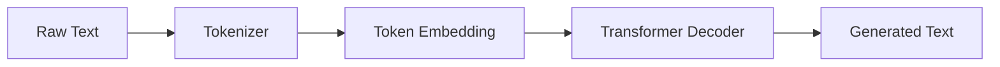
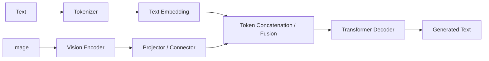
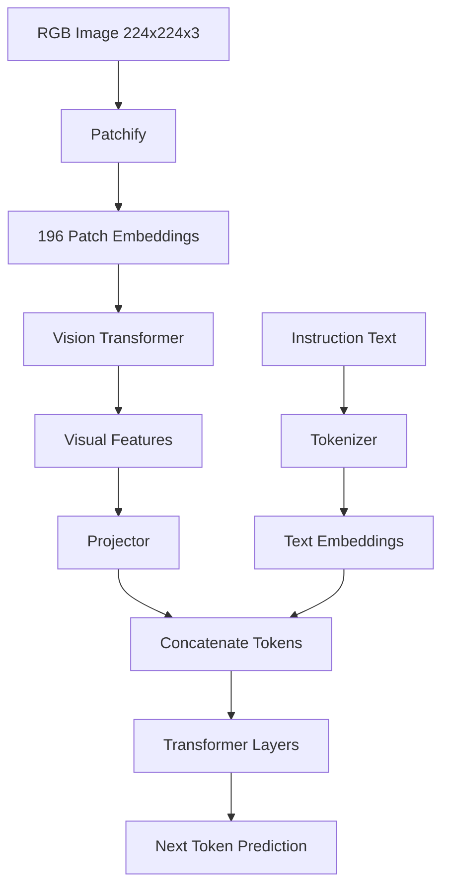
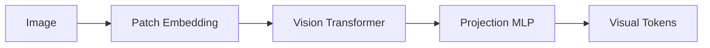
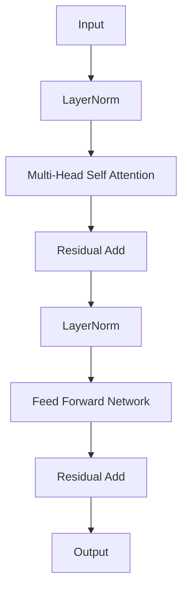
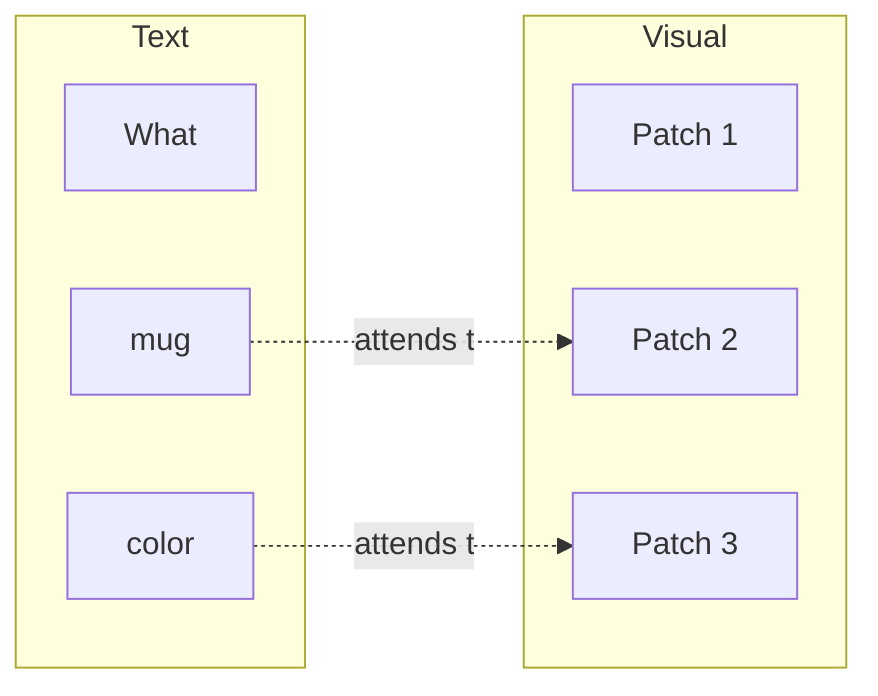
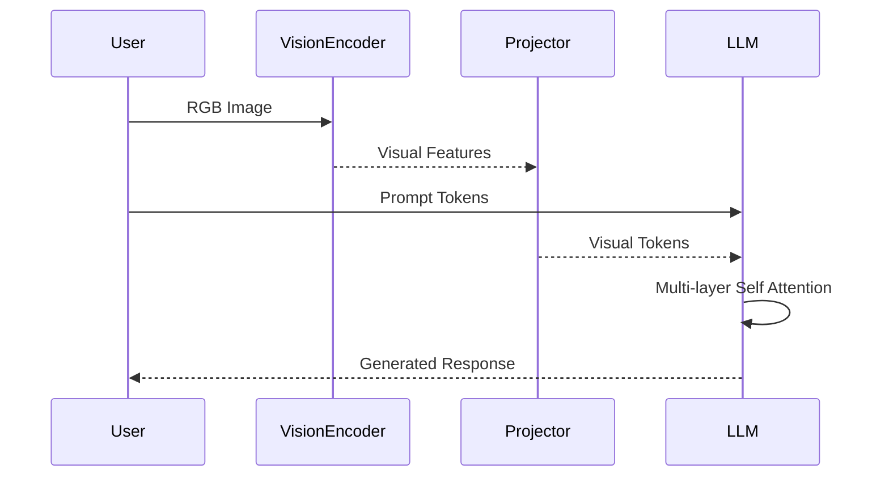

# Deep Architectural Comparison: LLM vs VLM

> This version uses Mermaid diagrams, markdown tables, and structured
> layouts for readability.

## 1. High-Level Architecture





## 2. Architectural Comparison

  Component              LLM              VLM

---

  Input                  Text             Text + Image / Video
  Tokenizer              Text tokenizer   Text tokenizer + image patch embedding
  Vision encoder         ✗                ✓
  Multimodal connector   ✗                ✓
  Transformer backbone   Decoder-only     Usually the same decoder
  Output                 Text             Usually text, sometimes actions or boxes

## 3. End-to-End Dataflow



## 4. LLM Pipeline

  Stage                 Output

---

  Tokenization          Integer IDs
  Embedding             Hidden vectors (e.g. 4096-D)
  Positional Encoding   Sequence information
  Transformer Blocks    Contextual representations
  LM Head               Vocabulary logits
  Softmax               Next-token probabilities

## 5. VLM Additional Pipeline



Typical example:

  Step                         Shape

---

  Input image              224×224×3
  Patch size                   16×16
  Number of patches              196
  ViT hidden size               1024
  LLM hidden size               4096
  Projected token size          4096

## 6. Transformer Block (Shared)



### Attention Equations

```text
Q = XW_Q
K = XW_K
V = XW_V

Attention(Q,K,V) = softmax(QKᵀ / √d) V
```

## 7. How Image and Text Interact



## 8. Tensor Shapes Through the Network

  Stage               Example Shape

---

  Image               (224,224,3)
  Patch embeddings    (196,768)
  ViT output          (196,1024)
  Projector output    (196,4096)
  Text embeddings     (18,4096)
  Combined sequence   (214,4096)
  Decoder output      (214,4096)
  Vocabulary logits   (214,VocabSize)

## 9. Complete Inference Flow



## 10. Major Architectural Families

---

  Model          Vision Module  Connector      LLM Backbone   Fusion

---

  LLaVA          ViT            Linear / MLP   Llama          Token
                                                              concatenation

  BLIP-2         ViT            Q-Former       Frozen LLM     Cross attention

  Flamingo       ViT            Perceiver      Frozen LLM     Interleaved
                                Resampler                     cross attention

  InternVL       InternViT      MLP            InternLM       Token
                                                              concatenation

  Qwen2.5-VL /   ViT            Native         Qwen           Native
  Qwen3.x-VL                    connector                     multimodal

GPT-4o /       Proprietary    Native         Proprietary    End-to-end
  Gemini                                                      multimodal
------------------------------------------------------------------------

## 11. Summary

---

  Aspect                  LLM                     VLM

---

  Core reasoning          Transformer             Same transformer in
                                                  most models

  New modules             None                    Vision encoder +
                                                  connector

  Biggest research focus  Scaling & reasoning     Vision-language
                                                  alignment, token
                                                  efficiency, multimodal
                                                  fusion

Mathematical core       Self-attention          Same self-attention;
                                                  only inputs differ
--------------------------------------------------------------------

Conceptually:

```text
VLM = Vision Encoder + Multimodal Connector + LLM
```
