# Modern LLM Families: Architecture, Training, Prompt Behavior, and End-to-End Dataflow

**Compared families:** OpenAI GPT, Anthropic Claude, Google Gemini, Alibaba Qwen, and Meta Llama
**Research date:** 2026-07-20
**Audience:** Software engineers, ML engineers, and AI researchers

---

## 1. Executive conclusion

The newest large-model families are **more similar at the neural-block level than their product behavior suggests**.

Most still depend on a Transformer-like autoregressive backbone and reuse a relatively small set of proven components:

- rotary or rotary-derived positional encoding;
- grouped or shared key/value attention;
- gated feed-forward layers;
- pre-normalization;
- dense or sparse Mixture-of-Experts layers;
- KV caching and optimized attention kernels;
- autoregressive next-token generation.

The important differences increasingly appear elsewhere:

1. **Pretraining data and curriculum**
2. **Multimodal pretraining strategy**
3. **Post-training objectives**
4. **Reasoning and test-time-compute policies**
5. **Tool-use and agent training**
6. **Safety and preference optimization**
7. **Product routing, memory, retrieval, and orchestration**
8. **Serving configuration and decoding defaults**

This explains a common observation:

> Two models can have broadly similar Transformer components but react very differently to the same prompt.

The neural backbone determines the model's basic representational and computational capacity. Pretraining determines what patterns and knowledge it acquires. Post-training determines how it behaves as an assistant. The runtime determines when it reasons, searches, calls tools, asks questions, refuses, or continues autonomously.

A useful conceptual decomposition is:

```text
Observed model behavior
=
base architecture
+ pretraining distribution
+ multimodal training
+ post-training objectives
+ reasoning policy
+ tool runtime
+ system prompt
+ decoding configuration
+ safety layers
+ product memory/retrieval
```

For modern frontier assistants, the final eight terms often explain more of the visible difference than whether the block uses ordinary RoPE, partial RoPE, GQA, or a particular MoE router.

---

## 2. Scope and latest model snapshots

Public documentation is uneven. Qwen and Llama expose model weights and many architecture parameters. OpenAI, Anthropic, and Google disclose considerably more about capabilities, deployment, training categories, and safety than about exact block-level internals.

| Family           | Latest practical snapshot prioritized here                                                                                       | What is publicly inspectable                                                                                                                                           |
| ---------------- | -------------------------------------------------------------------------------------------------------------------------------- | ---------------------------------------------------------------------------------------------------------------------------------------------------------------------- |
| **GPT**    | GPT-5.6 Sol, Terra, and Luna                                                                                                     | Product routing, reasoning controls, tools, context limits, training-data categories, reasoning RL, safety stack; exact Transformer internals remain undisclosed       |
| **Claude** | Claude Sonnet 5 and Claude Fable 5                                                                                               | Adaptive-thinking behavior, tokenizer change, prompt behavior, training-data categories, Constitutional AI alignment; exact block architecture remains undisclosed     |
| **Gemini** | Gemini 3.5 Flash, Gemini 3.1 Pro, and Deep Think                                                                                 | Native multimodality, thinking levels, tool interfaces, context limits, broad safety/post-training methods; detailed current block internals remain mostly undisclosed |
| **Qwen**   | Qwen3.7-Max as the newest hosted agent model; Qwen3.6-35B-A3B and Qwen3.6-27B as the newest technically inspectable open weights | Detailed configs, hybrid attention, MoE routing, vision tower, context, reasoning mode, sampling, deployment                                                           |
| **Llama**  | Llama 4 Maverick and Scout                                                                                                       | Model weights, MoE scale, early multimodal fusion, context, training-token estimates, post-training sequence, tokenizer family                                         |

### Disclosure legend

- **Disclosed:** stated in official model documentation or configuration.
- **Family-level:** documented for an earlier or underlying generation, but not guaranteed unchanged.
- **Unspecified:** not publicly documented.
- **Inference:** plausible engineering interpretation, not an official claim.

---

## 3. Brief shared foundation

A simplified modern autoregressive model still resembles:

```mermaid
flowchart LR
    A[Input text and optional media] --> B[Tokenization and modality encoders]
    B --> C[Unified sequence of embeddings]
    C --> D[Repeated model blocks]
    D --> E[Final normalization]
    E --> F[Language-model head]
    F --> G[Next-token distribution]
    G --> H[Sampling or constrained decoding]
    H --> I[Generated response or tool call]
```

A conventional block is approximately:

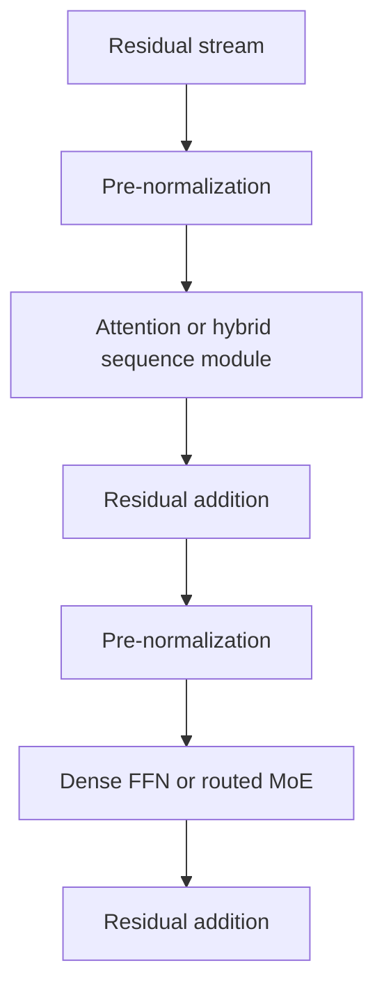

The exact implementation varies, but this pattern remains recognizable across many families.

---

# Part I — Architecture comparison

## 4. High-level architecture comparison

| Subsystem             | GPT-5.6                                                      | Claude 5                                              | Gemini 3.x                                                                | Qwen3.6                                                                                                          | Llama 4                                                               |
| --------------------- | ------------------------------------------------------------ | ----------------------------------------------------- | ------------------------------------------------------------------------- | ---------------------------------------------------------------------------------------------------------------- | --------------------------------------------------------------------- |
| Core generative style | Autoregressive reasoning system; internal blocks unspecified | Autoregressive assistant; internal blocks unspecified | Natively multimodal reasoning model; exact current block type unspecified | Autoregressive native multimodal model                                                                           | Autoregressive native multimodal model                                |
| Dense vs MoE          | Unspecified                                                  | Unspecified                                           | Unspecified for current Gemini 3.x                                        | Dense 27B and sparse 35B-A3B variants                                                                            | Sparse MoE                                                            |
| Attention             | Unspecified                                                  | Unspecified                                           | Unspecified                                                               | Hybrid sequence stack: three linear-attention layers followed by one full-attention layer; GQA in full attention | Attention plus MoE; Scout uses iRoPE-related long-context design      |
| Positional encoding   | Unspecified                                                  | Unspecified                                           | Unspecified                                                               | Partial multimodal RoPE, interleaved multimodal sections, large RoPE base                                        | RoPE/iRoPE family                                                     |
| FFN activation        | Unspecified                                                  | Unspecified                                           | Unspecified                                                               | SiLU-gated expert path; vision tower uses GELU variant                                                           | Not fully specified in current public launch material                 |
| Normalization         | Unspecified                                                  | Unspecified                                           | Unspecified                                                               | RMSNorm                                                                                                          | Not fully specified publicly for Llama 4 launch                       |
| Multimodal fusion     | Product supports image/file input; internals unspecified     | Image and document input; internals unspecified       | Native text-image-audio-video processing                                  | Native vision-language checkpoint with explicit vision tower and multimodal RoPE                                 | Early fusion of vision and text into a shared backbone                |
| Tool use              | First-class built-in and custom tools                        | First-class tools and MCP ecosystem                   | Function calls, search, code execution, computer use                      | Model and Qwen-Agent/Qwen-Code ecosystem                                                                         | Usually supplied by the deployment runtime or Llama Stack             |
| Reasoning control     | Reasoning levels and routed system behavior                  | Adaptive thinking and effort levels                   | Thinking levels and Deep Think                                            | Thinking on by default; can be disabled through serving parameters                                               | No single universal product-level reasoning controller in raw weights |
| Open weights          | No                                                           | No                                                    | No for Gemini                                                             | Yes, Apache 2.0 for open variants                                                                                | Yes, under Llama Community License                                    |

The strongest architecture departure among the newest inspectable models is Qwen3.6's move from a standard all-full-attention stack to a **hybrid recurrent/linear-attention and full-attention stack**. This is more structurally significant than merely changing from MHA to GQA.

---

## 5. GPT-5.6: publicly visible system architecture

OpenAI does not disclose whether GPT-5.6 uses a dense network, MoE, GQA, MLA, RoPE, or another internal combination.

The public architecture is better understood at the **system level**:

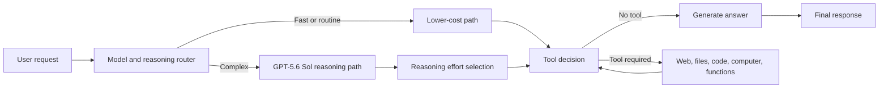

### Architecturally noticeable characteristics

- The deployed product behaves as a **system of model choices and reasoning levels**, not simply one fixed forward pass.
- Reasoning effort changes the amount of hidden deliberation and often the willingness to use tools.
- The API exposes explicit control over reasoning and output verbosity.
- Tool calls may run sequentially or in parallel.
- Prompt caching and long-context handling are part of the effective architecture even though they are not neural layers.

### Design implication

For GPT, the key optimization surface is often:

```text
router + reasoning budget + tools + prompt cache + agent orchestration
```

rather than direct access to attention or MoE configuration.

---

## 6. Claude Sonnet 5 and Fable 5: behavior-centered architecture

Anthropic also does not publish the exact Transformer block design of current Claude models.

The publicly observable system is dominated by:

- adaptive thinking;
- effort levels;
- long-context document processing;
- tool use;
- persistent agent workflows;
- Constitutional-AI-shaped behavior;
- safety routing for high-risk requests.

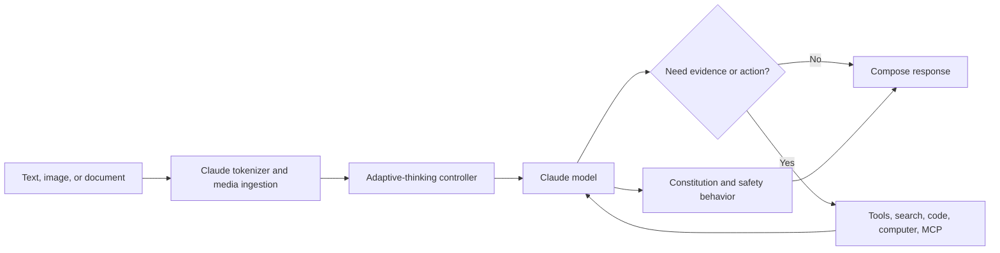

### Sonnet 5-specific prompt behavior

Anthropic documents several behavior changes:

- Response length adapts to task complexity.
- Instructions are interpreted more literally.
- Lower effort levels strongly limit how far the model goes beyond the explicit request.
- Adaptive thinking is enabled by default.
- Higher effort increases tool use and self-verification.
- A new tokenizer can produce roughly 30% more tokens than Sonnet 4.6 for equivalent text, depending on content.
- Non-default temperature, top-p, and top-k controls are not accepted for Sonnet 5; style should be controlled through instructions.

### Design implication

Claude's practical behavior is highly affected by:

```text
effort level
+ explicit task scope
+ positive examples
+ context structure
+ constitutional alignment
```

A vague instruction such as "be conservative" may be followed more literally than expected.

---

## 7. Gemini 3.5 Flash and Gemini 3.1 Pro

Google describes Gemini as a **natively multimodal reasoning family**. Current models can ingest combinations of:

- text;
- images;
- video;
- audio;
- PDFs;
- large code repositories.

The latest public product documentation does not provide full details on the current attention, MoE, FFN, or positional-encoding design.

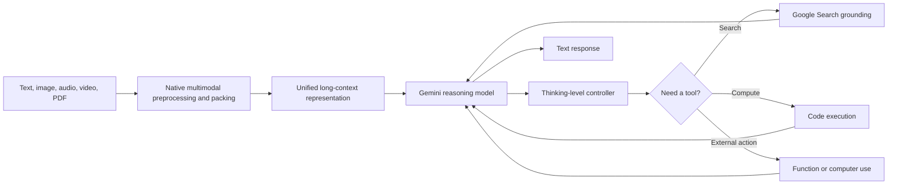

### Architecturally noticeable characteristics

- Multimodality is not presented as an optional adapter added after text training; it is a central family-level design.
- Gemini 3.5 Flash is based on a reasoning foundation and exposes thinking levels.
- The model's runtime tightly integrates search, code execution, structured outputs, and computer use.
- Google's deployment is optimized around TPU infrastructure, JAX, and ML Pathways.
- Gemini model behavior is strongly conditioned by context ordering: Google recommends putting large context first and the final task at the end.

### Prompting implication

Gemini 3 models generally prefer:

- concise instructions;
- explicit constraints;
- stable default sampling;
- large context before the question;
- explicit requests for verbosity.

Very elaborate prompt-engineering scaffolds can cause unnecessary over-analysis.

---

## 8. Qwen3.6: the most inspectable current architecture

The latest open Qwen3.6 models are natively multimodal and expose detailed configuration.

### 8.1 Qwen3.6-35B-A3B

Key official configuration values include:

| Property                           |                            Value |
| ---------------------------------- | -------------------------------: |
| Total parameters                   |                Approximately 35B |
| Active parameters                  |                 Approximately 3B |
| Hidden layers                      |                               40 |
| Experts                            |                              256 |
| Experts selected per token         |                                8 |
| Full-attention interval            |               Every fourth layer |
| Full-attention Q heads             |                               16 |
| KV heads                           |                                2 |
| Attention head dimension           |                              256 |
| Native maximum position embeddings |                          262,144 |
| Vocabulary                         |                          248,320 |
| Vision tower depth                 |                               27 |
| Vision patch size                  |                               16 |
| Temporal patch size                |                                2 |
| Native dtype                       |                             BF16 |
| Additional prediction head         | One multi-token-prediction layer |

The layer schedule is approximately:

```text
Linear/recurrent attention
Linear/recurrent attention
Linear/recurrent attention
Full GQA attention
(repeat)
```

The model combines:

- gated linear/recurrent sequence processing for most layers;
- periodic full attention for global interaction;
- sparse expert routing;
- multimodal RoPE;
- a native vision encoder;
- multi-token prediction support.

```mermaid
flowchart LR
    T[Text] --> Tok[248k-vocabulary tokenizer]
    Img[Images or video] --> ViT[27-layer vision tower]
    Tok --> Pack[Interleaved multimodal sequence]
    ViT --> Pack
    Pack --> L1[Linear attention]
    L1 --> L2[Linear attention]
    L2 --> L3[Linear attention]
    L3 --> FA[Full grouped-query attention]
    FA --> Router[MoE router]
    Router --> E[8 of 256 experts plus shared expert path]
    E --> Next[Repeat hybrid block pattern]
    Next --> Think[Thinking or direct-response policy]
    Think --> Out[Text or tool-call tokens]
```

### Why this matters

Compared with a standard full-attention Transformer:

- recurrent or linear layers reduce long-context cost;
- periodic full attention restores global token interaction;
- sparse experts increase parameter capacity without activating all weights;
- low KV-head count reduces cache memory;
- multimodal RoPE encodes temporal and spatial axes;
- multi-token prediction can improve training efficiency and decoding support.

### Qwen3.6 prompt behavior

- Thinking is enabled by default.
- Non-thinking mode is selected using serving or chat-template parameters.
- Qwen3.6 no longer relies on Qwen3's `/think` and `/no_think` soft switch.
- Historical reasoning traces can optionally be preserved for multi-turn agents.
- Qwen publishes different recommended sampling settings for general reasoning, precise coding, and non-thinking responses.
- Greedy decoding is generally discouraged for reasoning variants because it can produce repetition or degraded behavior.

This makes Qwen unusually transparent about the connection between architecture, decoding, and observed behavior.

---

## 9. Llama 4 Maverick and Scout

Llama 4 is an open-weight, natively multimodal MoE family.

| Variant  | Active parameters | Total parameters | Experts | Context |
| -------- | ----------------: | ---------------: | ------: | ------: |
| Scout    |               17B |             109B |      16 |     10M |
| Maverick |               17B |             400B |     128 |      1M |

### Major design features

- autoregressive generation;
- MoE routing;
- early fusion of visual and text representations;
- MetaCLIP-derived vision processing;
- large context;
- tokenizer derived from the TikToken family;
- iRoPE-related long-context design in Scout.

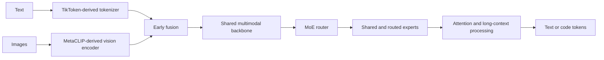

### Important practical distinction

Llama is a weight release rather than one fixed assistant product. Therefore, "Llama behavior" depends heavily on:

- the exact checkpoint;
- the chat template;
- system prompt;
- quantization;
- inference engine;
- tool wrapper;
- safety model;
- fine-tune or adapter;
- retrieval system;
- decoding parameters.

A hosted Llama service and a local Llama checkpoint can feel like different assistants even when they share the same base weights.

---

# Part II — Why prompting feels different

## 10. High-level behavioral comparison

These are documented tendencies and engineering implications, not universal personality labels.

| Dimension               | GPT-5.6                                                                  | Claude Sonnet 5                                                | Gemini 3.x                                                    | Qwen3.6                                                           | Llama 4                                                                                |
| ----------------------- | ------------------------------------------------------------------------ | -------------------------------------------------------------- | ------------------------------------------------------------- | ----------------------------------------------------------------- | -------------------------------------------------------------------------------------- |
| Default interaction     | Highly steerable, productized, often proactive in agent tasks            | Literal, scope-sensitive, adaptive depth                       | Direct and concise; optimized for structured multimodal tasks | Reasoning-first by default                                        | Depends strongly on deployment                                                         |
| Reasoning control       | Explicit reasoning levels                                                | Adaptive thinking plus effort                                  | Thinking levels / Deep Think                                  | Enable or disable thinking in serving configuration               | Usually implemented by prompt or external runtime                                      |
| Verbosity               | Explicit verbosity control and prompt instructions                       | Calibrates length to complexity; prompt for fixed style        | Concise by default; request detail explicitly                 | Can become long because reasoning is enabled                      | Highly sampling and fine-tune dependent                                                |
| Tool behavior           | Strong built-in tool orchestration                                       | More tool use at higher effort; self-verification tendency     | Search/code/function tools are tightly integrated             | Strong agent/coding orientation; framework-dependent              | External runtime usually controls tools                                                |
| Instruction literalness | Strong instruction following, but may proactively complete broader tasks | Particularly literal; scope must be explicit                   | Prefers direct, unambiguous instructions                      | Usually responds best to explicit mode and sampling configuration | Varies by fine-tune                                                                    |
| Long context prompting  | Can use file search, caching, and long native context                    | Strong document workflows; quoting first can improve grounding | Put context first and task last                               | Native 262K open configuration; local memory cost matters         | Scout advertises extreme context; actual retrieval quality depends on serving and task |
| Safety behavior         | Safe-completion and layered monitors                                     | Constitution-shaped and conversation-level risk reasoning      | Policy-conditioned with product filters                       | Depends on official checkpoint and deployment guardrails          | Safety is often a separate Llama Guard/runtime layer                                   |
| Reproducibility         | Stable API controls, but proprietary updates                             | Stable effort interface; no custom sampling on Sonnet 5        | Defaults recommended; altering sampling may hurt reasoning    | High control over weights and decoding                            | Highest control, but also highest behavioral variance                                  |

---

## 11. What a user notices with the same prompt

### Example prompt

```text
Review this repository.

Find all defects that could cause incorrect behavior, test failures,
security problems, misleading output, or maintainability risks.

Do not modify files yet.

For each issue provide:
- file and line
- severity
- confidence
- explanation
- minimal fix

Use tools when useful. Verify uncertain claims.
```

### GPT-5.6 tendency

A high-reasoning GPT configuration is likely to:

1. create a short plan;
2. inspect repository structure;
3. search multiple files;
4. run tests or static checks when tools are available;
5. report findings in the requested structure;
6. sometimes continue proactively until the repository has been broadly covered.

The prompt should explicitly state whether the model may run commands, install dependencies, or stop after a fixed number of findings. GPT's agentic training can otherwise encourage broader autonomous completion.

### Claude Sonnet 5 tendency

Claude is likely to interpret each filter literally.

If the prompt said only "report serious issues," Claude may investigate lower-severity problems but omit them from the final response. The improved version above explicitly defines what counts and asks for all findings with severity and confidence.

At low effort, Claude may scope itself narrowly. At high or xhigh effort, it is more likely to use tools, verify findings, and inspect more of the repository.

### Gemini 3 tendency

Gemini generally benefits from a direct prompt with the repository context first and the final task last.

It often produces a compact, structured answer unless the user requests extensive explanation. A complex old-style prompt containing repeated motivational language, many redundant planning rules, and multiple conflicting personas can cause over-analysis.

For long codebases, the preferred arrangement is:

```text
[repository or retrieved context]

Based on the repository above, perform the following review:
[precise requirements]
```

### Qwen3.6 tendency

Qwen3.6 will normally reason before answering unless thinking is disabled.

A local or API deployment may expose a reasoning block, parse it separately, or hide it. Repository-level work benefits from preserving reasoning across turns, but this increases context usage and can retain earlier mistakes.

Sampling configuration matters more visibly than with tightly managed closed APIs. Incorrect sampling can produce repetition, malformed tool calls, or unnecessary reasoning.

### Llama 4 tendency

No single answer can characterize Llama 4 without specifying the runtime.

A carefully deployed Maverick checkpoint with:

- the correct chat template;
- deterministic structured-output constraints;
- an agent loop;
- retrieval;
- Llama Guard;
- tuned sampling;

can behave like a polished coding assistant.

The same weights with an incorrect template or aggressive quantization can show weaker instruction following, malformed tool calls, or inconsistent response style.

---

## 12. Prompt adaptation matrix

| Goal                           | GPT                                                       | Claude                                                   | Gemini                                                   | Qwen                                                | Llama                                                            |
| ------------------------------ | --------------------------------------------------------- | -------------------------------------------------------- | -------------------------------------------------------- | --------------------------------------------------- | ---------------------------------------------------------------- |
| More reasoning                 | Raise reasoning effort                                    | Raise effort to high/xhigh/max                           | Raise thinking level or use Deep Think                   | Enable thinking; use recommended reasoning sampling | Add an external reasoning loop or use a reasoning fine-tune      |
| Less latency                   | Lower reasoning and verbosity                             | Lower effort or disable thinking                         | Lower thinking level; use Flash                          | Disable thinking; use non-thinking sampling         | Use smaller/quantized weights and shorter generation             |
| More exhaustive review         | Ask it not to stop early and define coverage              | Explicitly request every issue, including low confidence | Define exhaustive categories and request detailed output | Enable thinking and define stopping criteria        | Use multi-pass agent scaffolding                                 |
| Better long-document grounding | Use file search/citations and explicit source constraints | Ask for supporting quotes before synthesis               | Put context first, question last; use grounding          | Chunk or use long context with evidence extraction  | External RAG is often safer than relying only on nominal context |
| Stable JSON                    | Use structured outputs/schema                             | Give schema and examples                                 | Use structured output API                                | Constrain grammar/schema in serving engine          | Use grammar-constrained decoding                                 |
| Creative prose                 | Raise verbosity and define voice                          | Give positive style examples                             | Explicitly request conversational/detail level           | Use non-thinking or controlled sampling for style   | Fine-tune/system-prompt and tune sampling                        |

---

## 13. Why behavior differs even when the backbone is similar

### 13.1 Different preference targets

Post-training optimizes different ideas of a "good answer":

- accurate and action-oriented;
- concise and efficient;
- cautious and constitutionally compliant;
- exhaustive and research-oriented;
- tool-using and autonomous;
- conversational and emotionally calibrated.

These objectives can conflict.

For example:

```text
maximum helpfulness
vs.
minimum unsupported claims
vs.
minimum latency
vs.
maximum task completion
vs.
minimum safety risk
```

A model trained to maximize task completion may proactively take more steps. A model trained for literal compliance may avoid doing anything not explicitly requested.

### 13.2 Different reasoning policies

The base model does not automatically decide reasoning cost in the same way across products.

- GPT exposes reasoning levels and model routing.
- Claude uses adaptive thinking and effort.
- Gemini uses thinking levels and specialized Deep Think.
- Qwen can emit a reasoning trace by default.
- Llama relies on the chosen checkpoint and runtime.

### 13.3 Different tool policies

The model may have learned:

- when to search;
- when to calculate;
- when to call code execution;
- how many tools to call;
- whether to verify tool output;
- whether to continue after partial success;
- how to recover from tool errors.

These are post-training properties as much as architecture properties.

### 13.4 Different safety objectives

Safety training changes more than refusals. It can affect:

- uncertainty language;
- amount of explanation;
- whether benign adjacent information is included;
- willingness to infer user intent;
- conversation-level risk tracking;
- requirements for confirmation before external actions.

### 13.5 Different product prompts

A commercial assistant typically receives hidden system and developer instructions defining:

- tone;
- tool use;
- date awareness;
- citation rules;
- safety;
- memory;
- formatting;
- browsing;
- action confirmations.

Therefore, comparing raw models and chat products is not equivalent.

---

# Part III — Pretraining comparison

## 14. What pretraining controls

Pretraining primarily determines:

- broad knowledge;
- linguistic fluency;
- multilingual coverage;
- code familiarity;
- mathematical and scientific pattern recognition;
- multimodal representations;
- in-context learning;
- long-context behavior;
- latent capabilities that post-training can later elicit.

A simplified pretraining pipeline is:

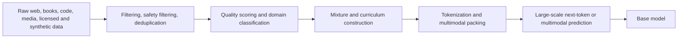

The major competitive advantage is often hidden in stages B-D rather than in the loss equation itself.

---

## 15. Pretraining comparison table

| Family     | Publicly stated data categories                                                                                  |                                                Public scale | Multimodal approach                                                     | Distillation/synthetic data                                                                              | Main uncertainty                                          |
| ---------- | ---------------------------------------------------------------------------------------------------------------- | ----------------------------------------------------------: | ----------------------------------------------------------------------- | -------------------------------------------------------------------------------------------------------- | --------------------------------------------------------- |
| GPT-5.6    | Public internet, third-party partnerships, user/human-trainer/researcher-provided or generated information       |                                               Not disclosed | Supports vision and files; exact pretraining mixture undisclosed        | Generated data is included in stated categories                                                          | Exact token count, modality mix, architecture, curriculum |
| Claude 5   | Public internet, public and private datasets, synthetic data from other models                                   |                                               Not disclosed | Text and image input; exact multimodal curriculum undisclosed           | Explicitly includes synthetic model-generated data                                                       | Token count, data proportions, architecture               |
| Gemini 3.x | Current model cards inherit data details from underlying Gemini 3 foundations; family is natively multimodal     |                            Not disclosed for current models | Text, image, video, audio, PDFs, and code are first-class inputs        | Google reports human and critic feedback in post-training; exact pretraining synthetic share undisclosed | Exact data composition and architecture                   |
| Qwen3.6    | Built on Qwen3.5's native multimodal foundation; earlier Qwen3 disclosed large multilingual corpora              | Qwen3 disclosed 36T tokens; Qwen3.6 exact count undisclosed | Early-fusion multimodal training and native vision-language checkpoints | Strong-to-weak distillation and large-scale synthetic/agent training are important family techniques     | Exact Qwen3.6 token count and mixture                     |
| Llama 4    | Public, licensed, and Meta product/service data, including publicly shared content and interactions with Meta AI |                                   Scout ~40T; Maverick ~22T | Multimodal pretraining with early fusion                                | Behemoth teacher generated distillation targets for student models                                       | Exact mixture proportions and filtering details           |

---

## 16. GPT pretraining

OpenAI states that GPT-5.6 uses diverse datasets including:

- publicly available internet information;
- information accessed through third-party partnerships;
- information provided or generated by users, human trainers, and researchers.

OpenAI also reports:

- personal-information reduction;
- quality filtering;
- sensitive-content filtering;
- safety classifiers in the data pipeline.

What remains undisclosed:

- total tokens;
- parameter count;
- modality proportions;
- code percentage;
- synthetic-data percentage;
- deduplication thresholds;
- curriculum phases;
- exact tokenizer;
- training compute.

### Likely practical consequence

OpenAI's competitive differentiation cannot be reconstructed from the public architecture because much of it lies in data selection, synthetic-data generation, reinforcement-learning environments, and production feedback loops.

---

## 17. Claude pretraining

Anthropic describes Claude Fable 5 and Mythos 5 as pretrained on a proprietary mixture of:

- public internet information;
- public datasets;
- private datasets;
- synthetic data generated by other models.

Anthropic explicitly mentions:

- deduplication;
- classification;
- data cleaning and filtering.

The company does not publish token count or architecture.

### Distinctive emphasis

Claude's public differentiation begins after base pretraining, but the data policy also matters. Anthropic states that current training uses a carefully filtered proprietary mix and then substantial post-training to align behavior with Claude's constitution.

---

## 18. Gemini pretraining

Gemini's major pretraining difference is its **native multimodality**.

Rather than treating image or audio understanding only as a late adapter, the family is trained to process combinations of:

- text;
- code;
- images;
- audio;
- video;
- documents.

Google's model cards disclose hardware and software choices more readily than exact data composition:

- TPU training;
- JAX;
- ML Pathways;
- multimodal processing.

### Practical consequence

Gemini tends to be designed around multimodal context as one combined problem. This can affect:

- cross-modal referencing;
- long-video analysis;
- document-image understanding;
- audio plus visual reasoning;
- tool use grounded in multimodal evidence.

---

## 19. Qwen pretraining

Qwen has disclosed substantially more than most closed vendors.

Qwen3 reported:

- 36 trillion pretraining tokens;
- 119 languages and dialects;
- a mixture of web, code, mathematical, scientific, multilingual, and synthetic data;
- multi-stage pretraining and context extension;
- dense and MoE model families.

Qwen3.5 later emphasized:

- early-fusion training on trillions of multimodal tokens;
- 201 languages and dialects;
- hybrid architecture;
- near-text-only efficiency for multimodal training;
- large-scale agent environments.

Qwen3.6 inherits the native multimodal foundation but does not publicly provide an exact new token total.

### Practical consequence

Qwen's strengths in multilingual work, coding, native vision, and deployability are strongly connected to data mixture and training infrastructure, not just its expert count.

---

## 20. Llama 4 pretraining

Meta provides unusually concrete scale data:

- Scout: approximately 40T multimodal tokens;
- Maverick: approximately 22T multimodal tokens.

The data mixture includes:

- publicly available data;
- licensed data;
- information from Meta products and services;
- publicly shared Facebook and Instagram posts;
- interactions with Meta AI.

The knowledge cutoff is reported as August 2024.

### Distillation

Meta used the much larger Behemoth teacher to create distillation targets for student training.

This illustrates an increasingly common pattern:

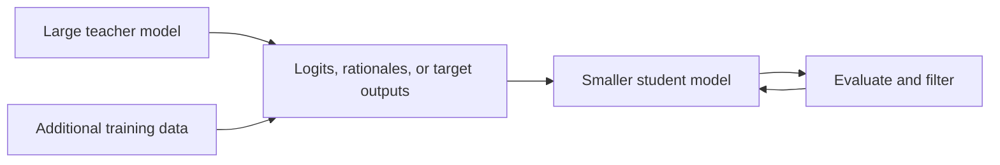

The student's architecture may be smaller or sparser, while much of its quality comes from teacher-generated supervision.

---

# Part IV — Post-training comparison

## 21. What post-training controls

Post-training turns a base predictor into an assistant.

It controls:

- instruction following;
- conversational style;
- reasoning persistence;
- tool calls;
- planning;
- safety;
- uncertainty expression;
- refusal boundaries;
- structured output;
- task completion;
- coding-agent behavior;
- multi-turn consistency.

A generalized pipeline is:

```mermaid
flowchart LR
    B[Pretrained base model]
    --> SFT[Supervised fine-tuning]
    SFT --> Pref[Preference or critique data]
    Pref --> RM[Reward model, judge, or verifier]
    RM --> RL[RL, online RL, GRPO, RLAIF, or related optimization]
    RL --> Tool[Tool and agent environment training]
    Tool --> Safe[Safety alignment and adversarial training]
    Safe --> Eval[Evaluation, red teaming, deployment simulation]
    Eval --> Final[Production model]
```

Modern systems often repeat this loop several times.

---

## 22. Post-training comparison table

| Family      | Publicly documented core                                                            | Reasoning optimization                                               | Preference/alignment approach                                          | Tool/agent training                                                  | Safety emphasis                                                                                        |
| ----------- | ----------------------------------------------------------------------------------- | -------------------------------------------------------------------- | ---------------------------------------------------------------------- | -------------------------------------------------------------------- | ------------------------------------------------------------------------------------------------------ |
| GPT-5.6     | Reasoning models trained through reinforcement learning; additional safety training | RL teaches longer reasoning, strategy changes, and error recognition | Human and synthetic supervision details not fully published            | Strong coding, computer-use, and tool-agent training                 | Safe completions, model-level safety training, monitors, activation classifiers, deployment simulation |
| Claude 5    | Substantial post-training aligned with Claude's constitution                        | Adaptive thinking and effort control                                 | Constitutional AI, human feedback, AI feedback, reinforcement learning | Agentic coding, search, tools, MCP, long-running workflows           | Conversation-level risk reasoning and constitution-based behavior                                      |
| Gemini 3.x  | SFT, reinforcement learning from human and critic feedback, policy training         | Thinking levels and Deep Think                                       | Human and critic feedback                                              | Search, code execution, functions, computer use, long-horizon agents | Dataset filtering, conditional pretraining, policy tuning, product filters, red teaming                |
| Qwen3.x/3.6 | Multi-stage reasoning and general-assistant post-training; scaled agent RL          | Thinking/non-thinking behavior and reasoning RL                      | SFT plus RL-family methods; open fine-tuning ecosystem                 | Million-agent environments, coding agents, tool use                  | Model and deployment guardrails; more responsibility falls on deployer for open weights                |
| Llama 4     | Lightweight SFT → online RL → lightweight DPO                                     | Hard-prompt online RL and teacher distillation                       | DPO for response-quality corner cases                                  | Multimodal online RL and continuous difficulty filtering             | Llama Guard, Prompt Guard, red teaming, deployer-controlled safety stack                               |

---

## 23. GPT post-training

OpenAI explicitly states that reasoning models are trained to reason through reinforcement learning.

The models learn to:

- think before answering;
- try alternative strategies;
- identify mistakes;
- refine intermediate reasoning;
- follow model policies.

GPT-5.6 also adds several safety-oriented mechanisms:

- training against policy-violating output;
- synthetic, semi-synthetic, red-team, and production-derived safety examples;
- deployment simulations over representative traffic;
- monitoring;
- activation classifiers for some higher-risk deployments;
- actor-level enforcement and access controls.

### Visible behavioral result

GPT often feels:

- proactive;
- tool-oriented;
- highly steerable;
- willing to plan and execute;
- sensitive to reasoning-effort configuration.

These are post-training and system-level properties, not direct consequences of RoPE or GQA.

---

## 24. Claude post-training

Claude's best-known distinction is Constitutional AI.

A simplified Constitutional AI process is:

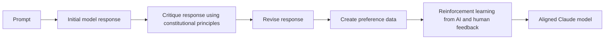

The constitution acts as a written target for:

- helpfulness;
- honesty;
- harmlessness;
- respect for user autonomy;
- calibrated behavior.

Claude 5 also exposes adaptive thinking. Instead of requiring a fixed manual reasoning-token budget, the model decides how much reasoning is useful within the selected effort level.

### Visible behavioral result

Claude often feels:

- deliberate;
- literal;
- scope-aware;
- careful about cumulative multi-turn risk;
- strong at long-running document and coding workflows;
- sensitive to whether the prompt explicitly asks for exhaustive or proactive behavior.

---

## 25. Gemini post-training

Google documents a family of safety and alignment methods including:

- supervised fine-tuning;
- reinforcement learning from human feedback;
- reinforcement learning from critic feedback;
- conditional pretraining;
- safety policies and desiderata;
- product-level filtering;
- automated and human red teaming.

Thinking levels control quality, latency, and cost.

Gemini's agent training is closely tied to:

- Google Search grounding;
- code execution;
- structured output;
- function calling;
- computer use;
- multimodal reasoning.

### Visible behavioral result

Gemini often feels:

- direct;
- efficient;
- optimized for multimodal context;
- comfortable with tool-backed factual and computational work;
- less responsive to unnecessarily complicated prompt theatrics than to clear structure.

---

## 26. Qwen post-training

The Qwen3 technical report described a four-stage flagship post-training pipeline:

1. long-chain-of-thought cold start;
2. reasoning reinforcement learning;
3. thinking-mode fusion through supervised fine-tuning;
4. general-domain reinforcement learning.

Qwen3.5 and Qwen3.6 extend the family toward native multimodal agents and scaled agent environments.

Qwen3.6 adds:

- default thinking;
- explicit non-thinking deployment mode;
- optional historical-thinking preservation;
- coding and repository-level agent improvements.

### Visible behavioral result

Qwen often feels:

- highly capable for its active parameter count;
- reasoning-heavy by default;
- strongly affected by sampling and template settings;
- flexible for local deployment;
- less behaviorally uniform across hosts than closed services.

---

## 27. Llama 4 post-training

Meta publicly describes the Llama 4 Maverick pipeline as:

```text
lightweight SFT
→ online reinforcement learning
→ lightweight DPO
```

Meta found that excessive SFT and DPO could over-constrain exploration during RL. Its response was to:

- remove more than half of examples judged too easy;
- train on harder examples;
- use multimodal online RL;
- continuously filter prompts by difficulty;
- use lightweight DPO for response-quality corner cases.

The unreleased Behemoth teacher used an even more RL-heavy recipe, with strong pruning of easy SFT data and hard-prompt curricula.

### Visible behavioral result

Llama 4's official instruct checkpoints reflect Meta's alignment recipe, but the final user experience varies because the deployer can replace or augment nearly every runtime component.

---

# Part V — End-to-end sample dataflow

## 28. Shared example task

Assume the user provides:

```text
Inputs:
- a 300-page system-design PDF;
- one architecture diagram;
- a repository containing implementation code;
- the instruction:

"Find the three most important differences between the documented
architecture and the implementation. Verify each claim using the files.
Then propose a migration plan with risks and tests."
```

---

## 29. GPT-5.6 dataflow

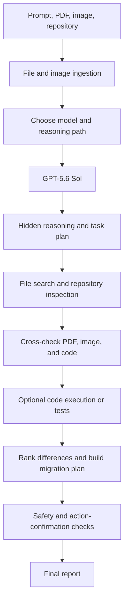

The main differentiator is the routed tool-using system. Exact image encoder and Transformer internals are not public.

---

## 30. Claude Sonnet 5 dataflow

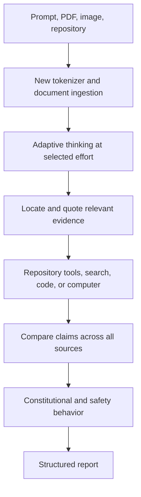

A strong Claude prompt should explicitly say whether to:

- inspect every relevant file;
- quote evidence;
- report uncertain discrepancies;
- stop after three final differences or list all candidates first.

---

## 31. Gemini 3.5/3.1 dataflow

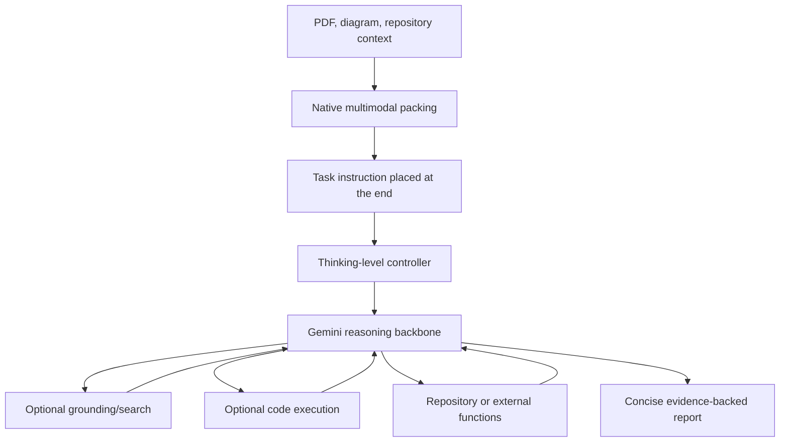

The prompt should place the large data context before the final question.

---

## 32. Qwen3.6 dataflow

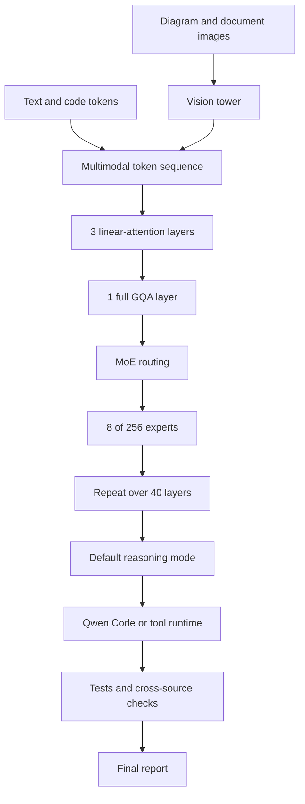

In a local deployment, the inference engine must correctly implement:

- multimodal preprocessing;
- reasoning parsing;
- chat template;
- MoE kernels;
- hybrid-attention state;
- KV and recurrent-state caching.

---

## 33. Llama 4 dataflow

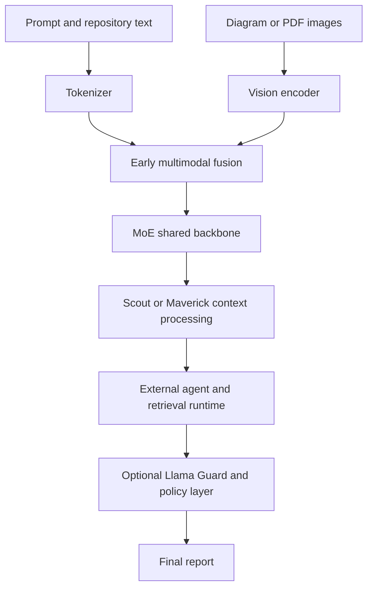

Unlike the closed products, the agent, search, repository tooling, and safety stack are commonly supplied by the application developer.

---

# Part VI — Which differences matter most?

## 34. Relative importance by use case

The percentages below are conceptual, not measured universal constants.

### General chat assistant

```text
Post-training and behavior policy      35%
Pretraining data and quality           30%
Product system and tools               20%
Architecture and scale                 15%
```

### Long-context document analysis

```text
Context training and data curriculum   30%
Retrieval/context packing              25%
Post-training for grounding            20%
Attention architecture                 15%
Serving and caching                    10%
```

### Coding agent

```text
Agent/tool post-training               30%
Code pretraining data                  25%
Runtime and environment                20%
Reasoning RL                           15%
Architecture                           10%
```

### Local deployment

```text
Architecture and active parameters     30%
Quantization and inference engine      25%
Post-training checkpoint quality       20%
Prompt template and sampling           15%
Data mixture                           10%
```

Architecture matters more for local deployment because it determines memory, throughput, and kernel compatibility. Post-training matters more for how pleasant and reliable the assistant feels.

---

## 35. The most important training differences

### Pretraining differences are mainly about capability supply

Pretraining decides whether the model has learned enough examples of:

- source code;
- mathematical proofs;
- multilingual conversation;
- legal and scientific writing;
- diagrams;
- video;
- audio;
- tool traces;
- long documents.

### Post-training differences are mainly about capability selection

Post-training decides:

- which latent capability is used;
- how long the model reasons;
- whether it searches;
- when it refuses;
- whether it asks for confirmation;
- whether it reports uncertainty;
- how it formats the answer;
- how aggressively it completes the task.

A base model may "know" how to solve a task but fail as an assistant because the post-training policy does not reliably elicit that capability.

---

## 36. Does architecture still matter?

Yes, especially for:

- training stability;
- active compute;
- memory bandwidth;
- KV-cache size;
- long-context cost;
- multimodal fusion;
- local deployment;
- expert specialization;
- serving throughput.

Examples:

- Qwen3.6's hybrid linear/full attention changes long-context compute.
- Qwen3.6's 3B active parameters change inference cost despite 35B total capacity.
- Llama 4's MoE provides high total capacity with 17B active parameters.
- Llama 4 Scout's long-context design changes the intended context regime.
- Early multimodal fusion changes where visual-language interaction occurs.

However, these choices do not directly tell you whether the model will be concise, cautious, proactive, literal, or good at tool use. Those are mostly training and system properties.

---

# Part VII — A fair cross-model testing protocol

## 37. Why casual comparisons are unreliable

A user comparing chat applications may unintentionally compare:

- different model sizes;
- different reasoning levels;
- browsing enabled on one and disabled on another;
- different system prompts;
- different memory;
- different context truncation;
- different tool permissions;
- different sampling;
- different safety policies.

The result may say more about the product wrapper than the model.

---

## 38. Recommended experiment

For each model:

1. Use the closest equivalent capability tier.
2. Disable web and tools for a pure-model test.
3. Repeat with tools enabled for a system test.
4. Match reasoning budget by observed latency/token usage, not by parameter name.
5. Use default vendor-recommended sampling.
6. Disable memory and personalization.
7. Provide identical source context.
8. Use a strict output schema.
9. Run at least 20-100 prompts per category.
10. Score correctness, instruction compliance, citation validity, latency, cost, and token use separately.

### Evaluation dimensions

| Metric                | What it measures                                                             |
| --------------------- | ---------------------------------------------------------------------------- |
| Task accuracy         | Whether the answer is correct                                                |
| Coverage/recall       | Whether all important findings are surfaced                                  |
| Precision             | Whether reported findings are valid                                          |
| Instruction following | Whether format and constraints are obeyed                                    |
| Grounding             | Whether claims are supported by provided evidence                            |
| Tool success          | Whether calls are valid and recover from errors                              |
| Autonomy              | Whether the model completes multi-step work without unnecessary intervention |
| Overreach             | Whether it takes actions beyond permission                                   |
| Calibration           | Whether confidence matches correctness                                       |
| Latency               | Time to first token and total completion                                     |
| Cost                  | Input, output, thinking, and tool cost                                       |
| Reproducibility       | Variance across repeated runs                                                |

---

# Part VIII — Practical selection guidance

## 39. Choose GPT when

- you need a highly integrated proprietary agent system;
- you need strong built-in tools and computer use;
- reasoning and verbosity controls are valuable;
- predictable managed deployment matters more than architecture transparency.

## 40. Choose Claude when

- long-running coding or document workflows are central;
- literal instruction following and explicit scope are desirable;
- adaptive effort and strong long-context workflows matter;
- Constitutional-AI-style behavior fits the application.

## 41. Choose Gemini when

- images, video, audio, PDFs, and text must be processed together;
- Google Search and code execution are useful;
- long-context multimodal analysis is central;
- low-latency agentic execution through Flash is important.

## 42. Choose Qwen when

- open weights and Apache licensing matter;
- you need strong capability at low active parameter counts;
- local multimodal deployment is required;
- architecture transparency and inference control are important;
- multilingual and agentic coding capability are priorities.

## 43. Choose Llama when

- ecosystem breadth and customization matter;
- you want to fine-tune or modify an open-weight family;
- extreme context experimentation is required;
- you are prepared to engineer the prompt template, safety layer, retrieval, tools, and serving stack.

---

# 44. Final answer to the central question

The current frontier is not composed of five completely different neural paradigms.

It is closer to:

```text
a converged Transformer-family foundation
+
different scaling and sparsity strategies
+
very different data pipelines
+
very different post-training objectives
+
very different reasoning and tool systems
```

The architecture differences are real, particularly in Qwen3.6 and Llama 4. But the most noticeable differences when users prompt GPT, Claude, Gemini, Qwen, and Llama usually come from:

1. post-training;
2. reasoning policy;
3. tool orchestration;
4. safety alignment;
5. system prompts;
6. data mixture;
7. decoding defaults.

Therefore:

> The neural modules explain efficiency and capacity.
> Training and system design explain most of the assistant's visible behavior.

---

# Sources

## OpenAI

- [S1] GPT-5.6 launch: https://openai.com/index/gpt-5-6/
- [S2] GPT-5.6 system card: https://deploymentsafety.openai.com/gpt-5-6
- [S3] GPT-5 for developers and prompting behavior: https://openai.com/index/introducing-gpt-5-for-developers/
- [S4] OpenAI model catalog: https://developers.openai.com/api/docs/models
- [S5] Practical GPT-5 guide: https://openai.com/business/guides-and-resources/a-practical-guide-to-building-with-ai/

## Anthropic

- [S6] Claude Sonnet 5 prompting guide: https://platform.claude.com/docs/en/build-with-claude/prompt-engineering/prompting-claude-sonnet-5
- [S7] Claude prompting best practices: https://platform.claude.com/docs/en/build-with-claude/prompt-engineering/claude-prompting-best-practices
- [S8] Anthropic Transparency Hub: https://www.anthropic.com/transparency/model-report
- [S9] Constitutional AI paper: https://www.anthropic.com/research/constitutional-ai-harmlessness-from-ai-feedback
- [S10] Claude's constitution: https://www.anthropic.com/constitution

## Google

- [S11] Gemini 3 prompt strategies: https://ai.google.dev/gemini-api/docs/prompting-strategies
- [S12] Gemini 3 developer guide: https://ai.google.dev/gemini-api/docs/gemini-3
- [S13] Gemini 3.5 Flash model card: https://deepmind.google/models/model-cards/gemini-3-5-flash/
- [S14] Gemini 3.1 Pro model card: https://deepmind.google/models/model-cards/gemini-3-1-pro
- [S15] Gemini 2.5 technical report: https://arxiv.org/abs/2507.06261
- [S16] Gemini 1 report and post-training overview: https://deepmind.google/gemini/gemini_1_report.pdf

## Qwen

- [S17] Qwen3.6 official repository: https://github.com/QwenLM/Qwen3.6
- [S18] Qwen3.6-35B-A3B model card: https://huggingface.co/Qwen/Qwen3.6-35B-A3B
- [S19] Qwen3.6-35B-A3B configuration: https://huggingface.co/Qwen/Qwen3.6-35B-A3B/blob/main/config.json
- [S20] Qwen3 technical report: https://arxiv.org/abs/2505.09388
- [S21] Qwen3.5 announcement: https://qwen.ai/blog?id=qwen3.5
- [S22] Qwen3.7 announcement: https://qwen.ai/blog?id=qwen3.7

## Meta

- [S23] Llama 4 launch and post-training: https://ai.meta.com/blog/llama-4-multimodal-intelligence/
- [S24] Llama model repository: https://github.com/meta-llama/llama-models
- [S25] Llama 4 Maverick model card: https://huggingface.co/meta-llama/Llama-4-Maverick-17B-128E
- [S26] Llama 4 model collection: https://huggingface.co/collections/meta-llama/llama-4

---

## Notes on uncertainty

- Closed vendors can change internal architecture without documenting it.
- A current product may route between multiple models.
- Hosted behavior includes hidden system prompts and safety layers.
- Context-window size does not guarantee equal information retrieval at every position.
- Benchmark scores should not be treated as direct predictors of a specific application.
- Practical behavior should be validated on an application-specific evaluation se

# Latest Major LLM Families Compared

## Executive summary

The newest mainstream LLM families have converged on a few visible product-level traits: very long context windows, multimodal inputs, explicit reasoning controls, and tighter integration with tools or agent loops. GPT-5.6, Claude 5, Gemini 3.x, Qwen3, and Llama 4 all present themselves as models for coding, knowledge work, or agentic execution rather than as plain chatbots. But they diverge sharply in what they disclose. OpenAI, Anthropic, and Google now publish rich product, safety, and deployment documentation while leaving many block-level architectural choices unspecified publicly. By contrast, Qwen and Llama publish much more of the technical substrate: expert counts, head counts, positional strategies, training-token counts, and concrete post-training recipes. citeturn25view0turn24view3turn37view2turn28view3turn30view3turn31view0

The most important family-level difference is no longer just “better benchmark X.” It is *how* capability is packaged. OpenAI’s GPT-5 is publicly framed as a routed system with fast and deeper-thinking submodels and an API-facing Sol/Terra/Luna tiering system. Anthropic’s current differentiation centers on adaptive thinking, long-running agents, and safety routing for high-risk domains. Google’s Gemini 3.x emphasizes native multimodality, 1M-token contexts, and strong tool-enabled agentic workflows, with Deep Think as a specialized reasoning mode built atop Gemini 3.1 Pro. Qwen’s current flagship remains the most transparent open-weight family in this comparison, combining MoE and dense lines, explicit thinking-budget control, and a multimodal sibling line with disclosed visual-fusion upgrades. Meta’s Llama 4 is the clearest case of an open-weight frontier family built around early-fusion multimodality and MoE efficiency, with Scout optimized for extreme context and Maverick for higher-quality general multimodal work. citeturn17view1turn35view3turn24view3turn22view0turn37view3turn40view0turn33view3turn34view1turn31view0turn30view3

Across the five families, several similarities are now stable enough to matter in practice. All are optimized for tool use or agentic workflows; all support multimodal or at least vision-heavy use cases at the product surface; all offer long context well beyond the old 32K–128K range; and all have invested substantially in post-training to shape behavior, not just raw pretraining scale. The differences are in where each vendor puts its engineering bets: OpenAI on routed reasoning plus tool-rich productivity; Anthropic on persistent, high-context agents and Constitutional-AI-style alignment; Google on integrated multimodality and agentic execution; Qwen on controllable reasoning and open deployment flexibility; and Meta on efficient open-weight multimodality with extreme context in Scout and strong quality-per-cost in Maverick. citeturn25view0turn17view1turn24view3turn39search1turn37view2turn40view0turn33view3turn31view0turn30view3

## Scope and comparison criteria

This report compares the **newest practically relevant public variants with usable primary documentation** as of **July 20, 2026**: **OpenAI GPT-5.6** (Sol/Terra/Luna), **Anthropic Claude Fable 5 and Sonnet 5**, **Google Gemini 3.1 Pro / Deep Think and 3.5 Flash**, **Qwen3-235B-A22B-2507 plus Qwen3-VL**, and **Meta Llama 4 Maverick / Scout**. I treat each as a *family snapshot*, because several vendors now expose multiple current tiers that share the same product generation but differ in cost, speed, or reasoning mode. Where a detail is absent from official documentation, I mark it **unspecified publicly** rather than infer it. citeturn35view3turn24view3turn37view2turn40view0turn27view2turn34view1turn30view3

Methodologically, the report prioritizes official release pages, API/model overviews, model cards, system cards, technical reports, and arXiv papers. For Qwen and Llama, the primary technical record is unusually rich, so architectural claims can be made at the block and training-recipe level. For GPT, Claude, and Gemini, the public record is much denser on product behavior, safety, and deployment than on internal transformer choices, so the analysis is correspondingly more conservative. citeturn28view3turn31view0turn25view0turn22view0turn37view2turn16view0

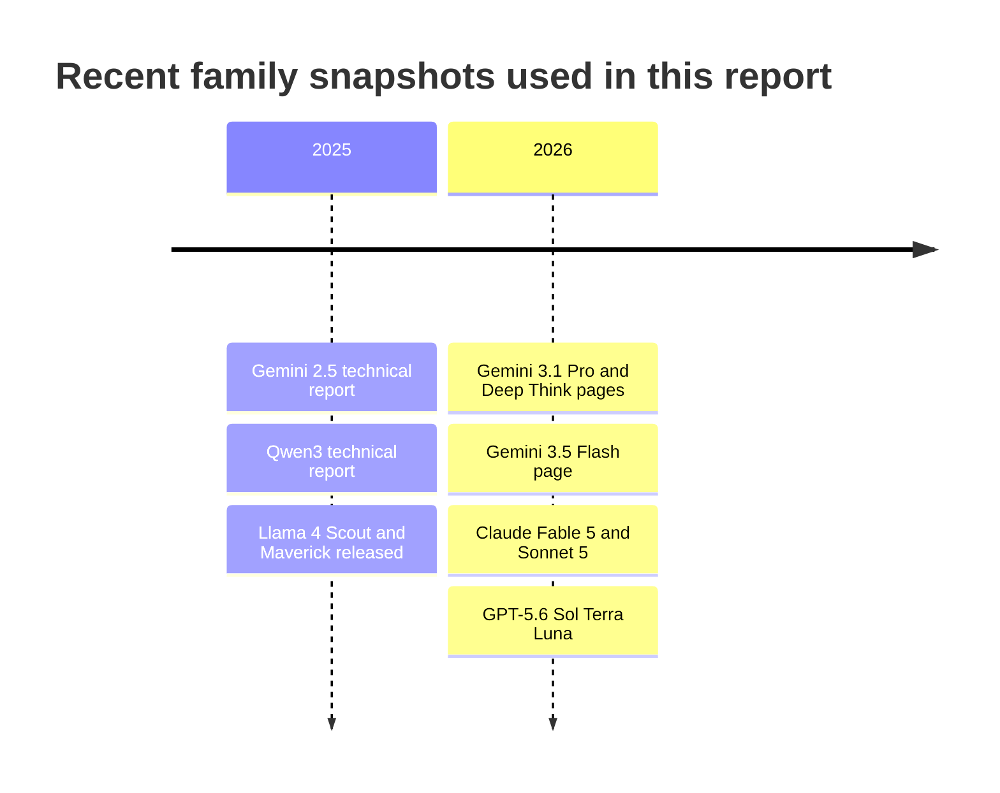

The timeline above is limited to the family snapshots actually analyzed in the report, not every intermediate release. Gemini 2.5 is included because it is still Google’s newest public *technical report* with explicit discussion of architecture/training at the family level, while the newest 3.x pages mainly document capabilities and deployment. citeturn16view0turn37view2turn40view0turn24view3turn35view3turn28view3turn31view0

## Comparative table

| Family snapshot                                             | Availability                                                                          | Architecture variant                                                                                                             | Attention and position engineering                                                                                                                                                                     | FFN and normalization                                                                                          | Tokenizer                                                                                            | Context and output                                                                                            | Multimodality and fusion                                                                                                                                    | Training and post-training highlights                                                                                                                                                                                            | Primary source basis                                                                   |
| ----------------------------------------------------------- | ------------------------------------------------------------------------------------- | -------------------------------------------------------------------------------------------------------------------------------- | ------------------------------------------------------------------------------------------------------------------------------------------------------------------------------------------------------ | -------------------------------------------------------------------------------------------------------------- | ---------------------------------------------------------------------------------------------------- | ------------------------------------------------------------------------------------------------------------- | ----------------------------------------------------------------------------------------------------------------------------------------------------------- | -------------------------------------------------------------------------------------------------------------------------------------------------------------------------------------------------------------------------------- | -------------------------------------------------------------------------------------- |
| **OpenAI GPT-5.6** Sol / Terra / Luna                 | Proprietary via ChatGPT, Codex, and OpenAI API                                        | Publicly described as a routed GPT-5 system plus API tiers; dense vs MoE**unspecified publicly**                           | Attention type, Flash/sliding, and positional scheme**unspecified publicly**                                                                                                                     | Activation and normalization**unspecified publicly**                                                     | Design**unspecified publicly**                                                                 | 1.05M context, 128K max output                                                                                | Text and image input, text output; tools include functions, web search, file search, computer use                                                           | Routed between “main” and “thinking” behaviors; safe-completions; reasoning effort controls; multi-agent “ultra” on top of the family                                                                                      | citeturn17view1turn25view0turn35view0turn35view3                           |
| **Anthropic Claude** Fable 5 / Sonnet 5               | Proprietary via Claude API, Bedrock, Google Cloud, Microsoft Foundry, Claude products | Internal transformer subtype**unspecified publicly**; product family differentiated by adaptive thinking and model tiering | Attention type and positional scheme**unspecified publicly**                                                                                                                                     | Activation and normalization**unspecified publicly**                                                     | Sonnet 5 uses a**new tokenizer**; tokenization design otherwise **unspecified publicly** | Fable 5, Opus 4.8, and Sonnet 5 each have 1M context and 128K max output                                      | Text and image input, text output; strong PDF/file document workflows; multimodal internals**unspecified publicly**                                   | Constitutional AI remains a defining alignment method for Claude broadly; Fable 5 is always adaptive-thinking; Sonnet 5 defaults to adaptive thinking and removes manual thinking budgets                                        | citeturn24view3turn22view0turn23view0turn39search1turn39search12         |
| **Google Gemini 3.x** 3.1 Pro / Deep Think, 3.5 Flash | Proprietary via Gemini app, Gemini API, AI Studio, Enterprise surfaces                | Natively multimodal generative model family; decoder vs encoder-decoder**unspecified publicly**                            | Attention type, MoE status, and positional scheme for 3.x**unspecified publicly**; latest technical report with family-level details is still Gemini 2.5                                         | Activation and normalization**unspecified publicly**                                                     | **Unspecified publicly**                                                                       | 1M input, 64K output on 3.1 Pro and 3.5 Flash                                                                 | Text, image, video, audio, and PDF input; output text; publicly described as natively multimodal                                                            | 3.1 Deep Think is built on top of 3.1 Pro; 3.5 Flash emphasizes agentic coding and reasoning at low latency; function calling, search-as-a-tool, structured output, and code execution are first-class                           | citeturn37view2turn37view3turn40view0turn40view3turn16view0              |
| **Qwen3** 235B-A22B-2507 and **Qwen3-VL**       | Open-weight, Apache 2.0; deployable via HF/vLLM/SGLang/local stacks                   | Causal language model family with both dense and MoE lines; flagship open model is 235B total / 22B active                       | GQA, RoPE, QK-Norm; RoPE base raised to 1,000,000 with ABF; YaRN and Dual Chunk Attention used for long-context extension; Qwen3-VL adds enhanced interleaved-MRoPE                                    | SwiGLU and RMSNorm with pre-norm                                                                               | Qwen BBPE tokenizer, vocab 151,669                                                                   | 235B-A22B-2507: 262,144 native and extendable to ~1.01M; Qwen3-VL: native 256K interleaved multimodal context | Qwen3-VL integrates ViT features with DeepStack and text-based timestamp alignment for video; text family supports`/think` and `/no_think` mode control | 36T-token pretraining over 119 languages; four-stage flagship post-training: long-CoT cold start, reasoning RL, thinking-mode fusion SFT, general-domain RL; strong-to-weak distillation for smaller models                      | citeturn27view2turn27view3turn28view0turn28view3turn33view0turn34view1 |
| **Meta Llama 4** Maverick / Scout                     | Open-weight under Llama 4 Community License; downloadable from Meta and Hugging Face  | Auto-regressive MoE family with early fusion for native multimodality                                                            | Maverick uses alternating dense and MoE layers, shared + routed experts; Scout uses iRoPE with interleaved attention layers and inference-time attention temperature scaling for length generalization | Activation, normalization, and tokenizer specifics are**unspecified publicly** in the reviewed materials | **Unspecified publicly**                                                                       | Maverick: 1M context; Scout: 10M context                                                                      | Early-fusion multimodality into a unified backbone; MetaCLIP-derived vision encoder adapted to the LLM                                                      | Multimodal pretraining over very large token/image/video mixtures; Maverick post-training pipeline is lightweight SFT → online RL → lightweight DPO; both released as open-weight models, but with a non-OSI community license | citeturn30view3turn31view0turn29search6turn38news27                        |

Two immediate patterns emerge from the table. First, the **open families disclose more of the actual transformer stack**: Qwen publishes GQA, RoPE, QK-Norm, RMSNorm, SwiGLU, tokenizer vocabulary, expert counts, and long-context engineering, while Llama 4 publishes MoE topology, early fusion, expert counts, context sizes, and post-training sequence. Second, the **closed families increasingly differentiate at the system and product layer**, not the block diagram layer: GPT-5.6 through routing and effort levels, Claude through adaptive thinking plus domain-specific safeguards, and Gemini through native multimodality, Deep Think, and broad tool surfaces. citeturn28view3turn33view0turn31view0turn17view1turn22view0turn37view3turn40view3

## Family-by-family analysis

### OpenAI GPT

OpenAI’s newest GPT family is best understood publicly as a **routed reasoning system** rather than a single monolithic transformer description. The GPT-5 system card says GPT-5 is “a unified system” combining a smart/fast model, a deeper reasoning model, and a real-time router that decides which to use based on conversation type, complexity, tool needs, and explicit intent. Separately, the current API model catalog exposes **GPT-5.6 Sol, Terra, and Luna** as durable tiers with the same 1.05M context window, 128K max output, image input, text output, and built-in tool support. OpenAI does **not** publicly specify whether these deployed models are dense or MoE, what attention variant they use, how positional encoding is handled, or what activation and normalization scheme they use. citeturn17view1turn25view0turn35view3

What *is* specific about GPT right now is the product-layer compute policy. The official docs expose explicit reasoning levels from **none** through **max**, while the GPT-5.6 launch page adds **ultra**, described as coordinating multiple agents across parallel workstreams for harder work. This means GPT’s most visible innovation is less “new kind of transformer block” and more **dynamic allocation of deliberation and agent parallelism** over a long-context, tool-enabled base system. That is a real architectural distinction at deployment time, even if the internal neural architecture remains undisclosed. citeturn25view0turn35view3turn35view0

On alignment and post-training, OpenAI’s current public materials emphasize **safe-completions**, reduced hallucinations, stronger instruction following, and lower sycophancy, but do not publish a GPT-5.6-specific RLHF or DPO recipe at the level Qwen or Llama disclose. The system card also shows a Preparedness-oriented deployment stance, including precautionary treatment of GPT-5-thinking in some bio/chem domains. In other words, OpenAI’s public transparency is strongest on **routing, guardrails, and evals**, weaker on **block-level internals**. citeturn17view1turn35view3

### Anthropic Claude

Anthropic’s newest current family snapshot separates into **Fable 5** as the most capable widely released model and **Sonnet 5** as the faster, cheaper, mainstream tier. The models overview gives all three top Claude tiers—Fable 5, Opus 4.8, and Sonnet 5—a **1M-token context window** and **128K max output**, while Sonnet 5’s migration page adds a specifically documented tokenizer change and a shift to **adaptive thinking** as the default behavior. Anthropic’s public materials do not specify whether the model internals are dense or MoE, which attention pattern they use, or which normalization and activation stack they use. citeturn24view3turn22view0

Claude’s distinctive public signature is therefore behavioral and alignment-centered. Fable 5 is presented as the tier for **days-long, long-running, asynchronous tasks**, especially coding and document-heavy knowledge work. It is also accompanied by special bio/cyber safeguards, with many high-risk prompts automatically routed down to Opus 4.8 rather than answered directly by Fable 5. Sonnet 5, meanwhile, is presented as a drop-in upgrade whose defaults are more agentic: adaptive thinking is on by default, manual thinking budgets are removed, and non-default sampling parameters are rejected. That is unusual among frontier APIs and suggests Anthropic is pushing users toward a narrower, more deterministic operational profile for its newest production models. citeturn23view0turn24view3turn22view0

Anthropic also remains the clearest case where **alignment philosophy itself is a family differentiator**. Claude is explicitly associated with **Constitutional AI**, which Anthropic describes as supervised learning plus reinforcement learning guided by a set of principles rather than only by harmfulness labels from humans. The company’s current transparency materials still describe Constitutional AI as central to how Claude is aligned with human values during reinforcement learning. That makes Claude the family where post-training philosophy is most legible publicly, even though the base transformer architecture is not. citeturn39search1turn39search12turn39search2

### Google Gemini

Google’s newest public Gemini snapshot is bifurcated: **Gemini 3.1 Pro** remains the “best for complex tasks” and is the basis for **Gemini 3.1 Deep Think**, while **Gemini 3.5 Flash** is the newer fast frontier tier for agents and coding. The official model pages show both 3.1 Pro and 3.5 Flash at **1M input / 64K output**, with support for text, image, video, audio, and PDF input, plus function calling, structured output, search as a tool, and code execution. Deep Think is explicitly described as a specialized reasoning mode built on top of Gemini 3.1 Pro. citeturn37view2turn37view3turn40view0

Architecturally, Google is currently less transparent than Qwen or Meta for the newest Gemini 3.x family. The current 3.x product pages do not publicly specify dense vs MoE, attention style, positional encoding, tokenizer design, normalization, or FFN activation. The newest detailed technical report in the public record is still **Gemini 2.5**, which describes the 2.x family as **natively multimodal**, with **>1M-token inputs**, thinking, and tool use. The outward behavior of Gemini 3.x strongly continues that trajectory, but a rigorous report should stop short of asserting continuity for undisclosed block-level choices. citeturn16view0turn37view2turn40view3

The clearest Gemini-specific differentiator is therefore **integrated multimodality plus agent execution**. Gemini 3.5 Flash is explicitly positioned for frontier agentic coding, multimodal understanding, long-horizon tasks, and multi-step problem solving, while the benchmark table on Google’s page shows it competitive or leading on several agentic and multimodal tasks relative to prior Gemini and some rival models. The practical takeaway is that Gemini’s family identity is no longer “a chat model with image support”; it is “a natively multimodal, tool-using, long-context agent platform,” even if the exact internal fusion stack is not publicly specified for 3.x. citeturn40view0turn40view3turn37view2

### Qwen

Qwen is the family in this set with the **richest public technical disclosure**. The Qwen3 technical report states that the dense line continues the Qwen2.5 stack of **GQA, SwiGLU, RoPE, and RMSNorm with pre-normalization**, while adding **QK-Norm** and removing QKV bias. It also publishes the MoE topology: the flagship **Qwen3-235B-A22B** has **128 experts with 8 activated experts per token**, and the family uses **byte-level BPE** with a **151,669-token vocabulary**. Public technical sources also disclose that Qwen3 was pretrained on **36T tokens across 119 languages and dialects**. citeturn28view0turn28view3turn33view2

Qwen is also unusually precise about long-context engineering. The technical report says Qwen3 raises the RoPE base frequency from 10,000 to **1,000,000** using **ABF**, and introduces **YaRN** plus **Dual Chunk Attention** to increase inference-time sequence capacity. The updated **Qwen3-235B-A22B-2507** model card gives the open-weight flagship **262,144 native context**, extendable to about **1.01M tokens**, while the long-context instructions specify sparse-attention serving configurations and even the approximate memory footprint for true 1M-token use. This is considerably more concrete than what frontier closed vendors now publish. citeturn28view4turn27view2turn27view3

Post-training is another area where Qwen is unusually explicit. Qwen3’s flagship recipe is a **four-stage** process: long-CoT cold start, reasoning RL, thinking-mode fusion via SFT, and general-domain RL. The family’s unusual user-facing differentiator is that it merges **thinking** and **non-thinking** into the same model, surfaced through **`/think`** and **`/no_think`** controls and a **thinking budget** mechanism. For smaller models, Qwen describes a strong-to-weak distillation path rather than repeating the full expensive flagship pipeline. citeturn33view0turn33view1turn33view3

For multimodality, the newest Qwen sibling to know is **Qwen3-VL**. Its public docs and technical-report abstract describe **interleaved 256K multimodal context**, **enhanced interleaved-MRoPE**, **DeepStack** integration for multi-level ViT features, and **text-based timestamp alignment** for video understanding. That makes Qwen arguably the most transparent family here not only for text-only LLM internals, but also for multimodal fusion specifics. citeturn34view0turn34view1

### Meta Llama

Llama 4’s public design is the clearest among the big Western open-weight families. Meta’s official release and model cards describe **Llama 4 Scout** and **Llama 4 Maverick** as **auto-regressive MoE** models with **early fusion** for native multimodality. Maverick is listed at **17B active / 400B total** with **128 experts**, while Scout is **17B active / 109B total** with **16 experts**. The public model card also exposes context and training-scale asymmetry: Scout targets **10M context** and about **40T tokens**, whereas Maverick targets **1M context** and about **22T tokens**. citeturn30view3turn31view0

Meta also reveals more about the serving topology than most proprietary vendors do. The release blog says Maverick uses **alternating dense and MoE layers**, and that each token is sent to a **shared expert** plus one routed expert among 128. Scout, in contrast, is the family’s long-context research-heavy model: Meta describes an **iRoPE architecture** combining **interleaved attention layers without positional embeddings** in some layers, RoPE in most layers, and inference-time attention temperature scaling to improve length generalization. That makes Scout the most explicit long-context architecture experiment in this whole comparison. citeturn31view0

Llama 4’s post-training disclosure is also relatively strong. Meta says Maverick was post-trained using **lightweight SFT → online RL → lightweight DPO**, and that balancing modalities, reasoning, and conversational quality was a central problem. On multimodality, Meta emphasizes **early fusion** plus a **MetaCLIP-derived vision encoder** trained to adapt to the LLM, as well as image/video-still pretraining to support broad visual reasoning. The family therefore stands out as the most clearly documented case of **native multimodality in an open-weight frontier family**. citeturn31view0turn30view3

One caution is benchmark interpretation. Meta’s official blog highlighted an **experimental chat variant** of Maverick for LMArena, and later reporting showed that the leaderboard variant was not identical to the public release, which complicates direct transfer of some headline benchmark claims to the downloadable model. That does not negate the family’s technical innovations, but it does mean Llama 4’s public benchmark story deserves more scrutiny than its architecture story. citeturn31view0turn38news28

## Public dataflow walkthroughs

### GPT family dataflow

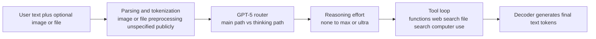

This diagram reflects only what OpenAI states publicly: a routed GPT-5 system, explicit effort controls, and built-in tool surfaces. OpenAI does **not** publicly document the image encoder path, attention kernels, or internal multimodal fusion mechanism for GPT-5.6. citeturn17view1turn25view0turn35view0

A concrete public-dataflow example is:

1. A user sends a long prompt plus an image or file.
2. OpenAI tokenizes the text and processes the other input through an **unspecified publicly** pathway.
3. The GPT-5 router decides whether the turn stays on the fast path or the deeper reasoning path; the selected reasoning level shapes how much additional deliberation the system uses.
4. If needed, the model enters tool loops through functions, web search, file search, or computer use, then returns final text tokens. citeturn17view1turn25view0turn35view0

### Claude family dataflow

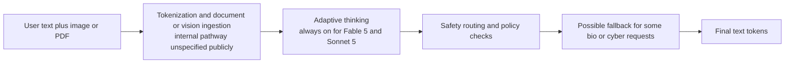

The Claude dataflow is shaped publicly by **adaptive thinking** and **safeguard routing**, not by disclosed block-level internals. Anthropic says Fable 5 and Sonnet 5 run with adaptive thinking and that some high-risk Fable 5 bio/cyber prompts are routed to Opus 4.8. citeturn24view3turn22view0turn23view0

A concrete public-dataflow example is:

1. A user uploads a PDF with charts and asks for analysis.
2. Claude ingests text plus the file or image through an internal pathway Anthropic does not specify publicly.
3. The model runs adaptive thinking to decide how much reasoning to use, rather than depending on a manual token budget.
4. If the request hits high-risk bio/cyber safeguards in Fable 5, the system may fallback; otherwise Claude returns text output. citeturn23view0turn22view0turn24view3

### Gemini family dataflow

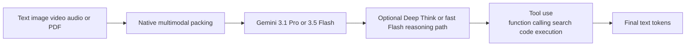

Google publicly describes Gemini as a **natively multimodal** family with long context and first-class tool use. The exact encoder/decoder separation and internal fusion stack for Gemini 3.x are not specified on the reviewed model pages, so the diagram stays at the product-mechanism level. citeturn16view0turn37view2turn37view3turn40view0

A concrete public-dataflow example is:

1. A user provides a long prompt, a PDF, and a screenshot.
2. Gemini 3.x ingests text plus multimodal inputs into a unified context window.
3. The request goes either to Gemini 3.5 Flash for fast agentic execution or to Gemini 3.1 Pro / Deep Think when deeper reasoning is appropriate.
4. The model can call functions, search, or code execution before returning text output. citeturn37view2turn37view3turn40view0turn40view3

### Qwen family dataflow

```mermaid
flowchart LR
    I[Image video and text] --> V[Vision stack with DeepStack in Qwen3-VL]
    I --> X[BBPE text tokenizer]
    V --> F[Interleaved multimodal sequence with enhanced MRoPE]
    X --> F
    F --> B[Dense or MoE decoder<br/>GQA RoPE QK-Norm RMSNorm SwiGLU]
    B --> C[Thinking control<br/>/think /no_think and budget]
    C --> O[Final text tokens]
```

Unlike the closed families, Qwen’s public docs let us be fairly concrete here. The text line discloses GQA, RoPE, RMSNorm, SwiGLU, QK-Norm, and BBPE tokenization, while Qwen3-VL discloses enhanced interleaved-MRoPE, DeepStack, and text-based temporal alignment for video. citeturn28view3turn28view0turn34view0turn34view1

A concrete public-dataflow example is:

1. A user sends an image and a question, or a long multilingual prompt.
2. Qwen tokenizes text with its BBPE tokenizer; Qwen3-VL encodes image or video signals and merges them into an interleaved multimodal sequence.
3. The dense or MoE decoder processes that sequence with GQA, RoPE-family position handling, RMSNorm, and SwiGLU.
4. The user or chat template can force `/think` or `/no_think`, or use a reasoning budget, before the model emits final tokens. citeturn28view0turn28view3turn33view1turn34view1

### Llama family dataflow

```mermaid
flowchart LR
    I[Image plus text] --> V[MetaCLIP-derived vision encoder]
    T[Text tokens] --> F[Early fusion into unified backbone]
    V --> F
    F --> M[MoE backbone<br/>Scout or Maverick]
    M --> L[Scout iRoPE long-context path<br/>or Maverick routed-plus-shared experts]
    L --> O[Final text or code tokens]
```

Meta’s public release is unusually explicit that Llama 4 uses **early fusion** for text and vision, a MetaCLIP-derived vision encoder, and MoE backbones. Scout and Maverick then diverge in their long-context and expert-routing design priorities. citeturn31view0turn30view3

A concrete public-dataflow example is:

1. A user provides several images and a text instruction.
2. The images are encoded by the vision encoder, and text plus vision tokens are combined early into the same model backbone.
3. If the request targets Scout, the long-context path benefits from the iRoPE strategy; if it targets Maverick, the shared-plus-routed-expert MoE path emphasizes higher overall capability per serving cost.
4. The model returns multilingual text or code output. citeturn31view0turn30view3

## Performance patterns and use-cases

The cleanest performance conclusion is not that one family dominates every benchmark, but that each family now has a **distinct deployment niche**. GPT-5.6 Sol is optimized for professional workflows that combine reasoning, browsing, tool use, and artifact production; OpenAI highlights strong results on Agents’ Last Exam, BrowseComp, OSWorld 2.0, and coding-agent benchmarks, while the product pages repeatedly frame Sol as the model for complex professional work and Terra/Luna as cheaper throughput tiers. citeturn17view0turn25view0turn35view3

Claude’s newest family looks strongest when the task requires **persistent, high-context orchestration** rather than short, bursty chat turns. Anthropic’s own materials frame Fable 5 as the model for multi-day agents, large migrations, complex implementations, and document-heavy analysis, while Sonnet 5 is the cost-efficient default that inherits much of that agentic behavior through adaptive thinking. That makes Claude especially attractive for codebase-scale and knowledge-work workflows where reliability across many steps matters as much as raw single-turn benchmark scores. citeturn23view0turn24view3turn22view0

Gemini’s split between 3.1 Pro/Deep Think and 3.5 Flash maps well onto two practical use cases. **Gemini 3.1 Pro** is the better fit when the user needs maximum multimodal depth, long-context reasoning, or research-heavy work; **Gemini 3.5 Flash** is the better fit when low-latency agentic execution matters. Google’s benchmark table is explicit that 3.5 Flash leads across many agentic benchmarks relative to earlier Gemini variants and some competitors, while 3.1 Pro remains stronger on some harder reasoning and long-context metrics such as MRCR and ARC-AGI-2. citeturn37view2turn40view3

Qwen remains the strongest option when the requirement is **open-weight deployment plus unusually transparent controllable reasoning**. The flagship Qwen3-235B-A22B posts strong published results on AIME, LiveCodeBench, CodeForces, and BFCL, while the family’s `/think` versus `/no_think` split and budget control are unusually explicit and developer-friendly. The trade-off is that the very largest open Qwen deployments become hardware-intensive quickly, especially at 1M context. citeturn33view2turn33view3turn27view3

Llama 4 is strongest where **open-weight customization, fine-tuning freedom, or extreme long context** matter more than closed-model polish. Scout is the standout for ultra-long-context experimentation at 10M tokens, while Maverick is the practical higher-quality multimodal workhorse. But benchmark interpretation needs caution: some of Meta’s launch-era public benchmark claims were tied to an experimental chat variant rather than the exact public release, so architecture and openness are stronger selling points here than single leaderboard snapshots. citeturn31view0turn30view3turn38news28

In aggregate, the newest family-level similarity is that **all five are now agent models first and chat models second**. The lasting differences are the ones that determine real deployment decisions: whether you need a proprietary but polished routed system with strong tooling, a Constitution-shaped long-running agent, a natively multimodal Google stack, an Apache-licensed reasoning-controllable open model, or an early-fusion open-weight multimodal model that you can run and fine-tune yourself. citeturn25view0turn24view3turn37view2turn33view3turn31view0

## Prioritized sources

The most authoritative sources for this comparison, in practical priority order, are the following:

**OpenAI**

- GPT-5.6 launch page for tiering, availability, multi-agent “ultra,” and benchmark framing. citeturn35view3turn35view0
- OpenAI API model catalog for current context windows, outputs, supported tools, and modality surfaces. citeturn25view0
- GPT-5 system card page for the public description of GPT-5 as a routed unified system. citeturn17view1

**Anthropic**

- Models overview for current Claude family comparison, context windows, and availability. citeturn24view3
- “What’s new in Claude Sonnet 5” for tokenizer change and adaptive-thinking defaults. citeturn22view0
- Claude Fable 5 page for long-running-agent use cases and high-risk safeguard fallback. citeturn23view0
- Constitutional AI research and Claude constitution materials for family-level alignment method. citeturn39search1turn39search2turn39search12

**Google**

- Gemini 3.1 Pro and 3.5 Flash model pages for current 3.x capabilities, tools, context, and deployment surfaces. citeturn37view2turn40view0
- Gemini 3.1 Deep Think page for the relationship between Deep Think and 3.1 Pro. citeturn37view3
- Gemini 2.5 technical report for the newest public family-level technical report with explicit architecture/training discussion. citeturn16view0

**Qwen**

- Qwen3 technical report for architecture, pretraining scale, tokenizer, and post-training pipeline. citeturn28view0turn28view3turn33view0
- Qwen3-235B-A22B-2507 model cards for current flagship open deployment details and long-context serving notes. citeturn27view2turn27view3
- Qwen3-VL docs and technical-report abstract for multimodal fusion specifics. citeturn34view0turn34view1

**Meta**

- Llama 4 release blog for MoE structure, early fusion, iRoPE, training-scale, and post-training sequence. citeturn31view0
- Llama 4 model cards for official model sizes, contexts, modalities, training data mix, and licensing. citeturn30view3turn29search6
- Secondary benchmark-caveat reporting for the LMArena/public-release mismatch. citeturn38news28

The highest-confidence comparative statements in this report are those about **Qwen and Llama architecture**, **GPT/Claude/Gemini deployment behavior**, and **context/tool/multimodal surfaces**. The lowest-confidence areas are exactly the ones the vendors do not document publicly for the newest closed families: dense vs MoE, detailed attention kernels, positional encodings, FFN activations, and normalization choices for GPT-5.6, Claude 5, and Gemini 3.x. Those are therefore intentionally labeled **unspecified publicly** throughout. citeturn28view3turn31view0turn25view0turn24view3turn37view


# Latest Major LLM Families Compared

## Executive summary

The newest mainstream LLM families have converged on a few visible product-level traits: very long context windows, multimodal inputs, explicit reasoning controls, and tighter integration with tools or agent loops. GPT-5.6, Claude 5, Gemini 3.x, Qwen3, and Llama 4 all present themselves as models for coding, knowledge work, or agentic execution rather than as plain chatbots. But they diverge sharply in what they disclose. OpenAI, Anthropic, and Google now publish rich product, safety, and deployment documentation while leaving many block-level architectural choices unspecified publicly. By contrast, Qwen and Llama publish much more of the technical substrate: expert counts, head counts, positional strategies, training-token counts, and concrete post-training recipes. citeturn25view0turn24view3turn37view2turn28view3turn30view3turn31view0

The most important family-level difference is no longer just “better benchmark X.” It is *how* capability is packaged. OpenAI’s GPT-5 is publicly framed as a routed system with fast and deeper-thinking submodels and an API-facing Sol/Terra/Luna tiering system. Anthropic’s current differentiation centers on adaptive thinking, long-running agents, and safety routing for high-risk domains. Google’s Gemini 3.x emphasizes native multimodality, 1M-token contexts, and strong tool-enabled agentic workflows, with Deep Think as a specialized reasoning mode built atop Gemini 3.1 Pro. Qwen’s current flagship remains the most transparent open-weight family in this comparison, combining MoE and dense lines, explicit thinking-budget control, and a multimodal sibling line with disclosed visual-fusion upgrades. Meta’s Llama 4 is the clearest case of an open-weight frontier family built around early-fusion multimodality and MoE efficiency, with Scout optimized for extreme context and Maverick for higher-quality general multimodal work. citeturn17view1turn35view3turn24view3turn22view0turn37view3turn40view0turn33view3turn34view1turn31view0turn30view3

Across the five families, several similarities are now stable enough to matter in practice. All are optimized for tool use or agentic workflows; all support multimodal or at least vision-heavy use cases at the product surface; all offer long context well beyond the old 32K–128K range; and all have invested substantially in post-training to shape behavior, not just raw pretraining scale. The differences are in where each vendor puts its engineering bets: OpenAI on routed reasoning plus tool-rich productivity; Anthropic on persistent, high-context agents and Constitutional-AI-style alignment; Google on integrated multimodality and agentic execution; Qwen on controllable reasoning and open deployment flexibility; and Meta on efficient open-weight multimodality with extreme context in Scout and strong quality-per-cost in Maverick. citeturn25view0turn17view1turn24view3turn39search1turn37view2turn40view0turn33view3turn31view0turn30view3

## Scope and comparison criteria

This report compares the **newest practically relevant public variants with usable primary documentation** as of **July 20, 2026**: **OpenAI GPT-5.6** (Sol/Terra/Luna), **Anthropic Claude Fable 5 and Sonnet 5**, **Google Gemini 3.1 Pro / Deep Think and 3.5 Flash**, **Qwen3-235B-A22B-2507 plus Qwen3-VL**, and **Meta Llama 4 Maverick / Scout**. I treat each as a *family snapshot*, because several vendors now expose multiple current tiers that share the same product generation but differ in cost, speed, or reasoning mode. Where a detail is absent from official documentation, I mark it **unspecified publicly** rather than infer it. citeturn35view3turn24view3turn37view2turn40view0turn27view2turn34view1turn30view3

Methodologically, the report prioritizes official release pages, API/model overviews, model cards, system cards, technical reports, and arXiv papers. For Qwen and Llama, the primary technical record is unusually rich, so architectural claims can be made at the block and training-recipe level. For GPT, Claude, and Gemini, the public record is much denser on product behavior, safety, and deployment than on internal transformer choices, so the analysis is correspondingly more conservative. citeturn28view3turn31view0turn25view0turn22view0turn37view2turn16view0

```mermaid
timeline
    title Recent family snapshots used in this report
    2025 : Gemini 2.5 technical report
         : Qwen3 technical report
         : Llama 4 Scout and Maverick released
    2026 : Gemini 3.1 Pro and Deep Think pages
         : Gemini 3.5 Flash page
         : Claude Fable 5 and Sonnet 5
         : GPT-5.6 Sol Terra Luna
```

The timeline above is limited to the family snapshots actually analyzed in the report, not every intermediate release. Gemini 2.5 is included because it is still Google’s newest public *technical report* with explicit discussion of architecture/training at the family level, while the newest 3.x pages mainly document capabilities and deployment. citeturn16view0turn37view2turn40view0turn24view3turn35view3turn28view3turn31view0

## Comparative table

| Family snapshot                                             | Availability                                                                          | Architecture variant                                                                                                             | Attention and position engineering                                                                                                                                                                     | FFN and normalization                                                                                          | Tokenizer                                                                                            | Context and output                                                                                            | Multimodality and fusion                                                                                                                                    | Training and post-training highlights                                                                                                                                                                                            | Primary source basis                                                                   |
| ----------------------------------------------------------- | ------------------------------------------------------------------------------------- | -------------------------------------------------------------------------------------------------------------------------------- | ------------------------------------------------------------------------------------------------------------------------------------------------------------------------------------------------------ | -------------------------------------------------------------------------------------------------------------- | ---------------------------------------------------------------------------------------------------- | ------------------------------------------------------------------------------------------------------------- | ----------------------------------------------------------------------------------------------------------------------------------------------------------- | -------------------------------------------------------------------------------------------------------------------------------------------------------------------------------------------------------------------------------- | -------------------------------------------------------------------------------------- |
| **OpenAI GPT-5.6** Sol / Terra / Luna                 | Proprietary via ChatGPT, Codex, and OpenAI API                                        | Publicly described as a routed GPT-5 system plus API tiers; dense vs MoE**unspecified publicly**                           | Attention type, Flash/sliding, and positional scheme**unspecified publicly**                                                                                                                     | Activation and normalization**unspecified publicly**                                                     | Design**unspecified publicly**                                                                 | 1.05M context, 128K max output                                                                                | Text and image input, text output; tools include functions, web search, file search, computer use                                                           | Routed between “main” and “thinking” behaviors; safe-completions; reasoning effort controls; multi-agent “ultra” on top of the family                                                                                      | citeturn17view1turn25view0turn35view0turn35view3                           |
| **Anthropic Claude** Fable 5 / Sonnet 5               | Proprietary via Claude API, Bedrock, Google Cloud, Microsoft Foundry, Claude products | Internal transformer subtype**unspecified publicly**; product family differentiated by adaptive thinking and model tiering | Attention type and positional scheme**unspecified publicly**                                                                                                                                     | Activation and normalization**unspecified publicly**                                                     | Sonnet 5 uses a**new tokenizer**; tokenization design otherwise **unspecified publicly** | Fable 5, Opus 4.8, and Sonnet 5 each have 1M context and 128K max output                                      | Text and image input, text output; strong PDF/file document workflows; multimodal internals**unspecified publicly**                                   | Constitutional AI remains a defining alignment method for Claude broadly; Fable 5 is always adaptive-thinking; Sonnet 5 defaults to adaptive thinking and removes manual thinking budgets                                        | citeturn24view3turn22view0turn23view0turn39search1turn39search12         |
| **Google Gemini 3.x** 3.1 Pro / Deep Think, 3.5 Flash | Proprietary via Gemini app, Gemini API, AI Studio, Enterprise surfaces                | Natively multimodal generative model family; decoder vs encoder-decoder**unspecified publicly**                            | Attention type, MoE status, and positional scheme for 3.x**unspecified publicly**; latest technical report with family-level details is still Gemini 2.5                                         | Activation and normalization**unspecified publicly**                                                     | **Unspecified publicly**                                                                       | 1M input, 64K output on 3.1 Pro and 3.5 Flash                                                                 | Text, image, video, audio, and PDF input; output text; publicly described as natively multimodal                                                            | 3.1 Deep Think is built on top of 3.1 Pro; 3.5 Flash emphasizes agentic coding and reasoning at low latency; function calling, search-as-a-tool, structured output, and code execution are first-class                           | citeturn37view2turn37view3turn40view0turn40view3turn16view0              |
| **Qwen3** 235B-A22B-2507 and **Qwen3-VL**       | Open-weight, Apache 2.0; deployable via HF/vLLM/SGLang/local stacks                   | Causal language model family with both dense and MoE lines; flagship open model is 235B total / 22B active                       | GQA, RoPE, QK-Norm; RoPE base raised to 1,000,000 with ABF; YaRN and Dual Chunk Attention used for long-context extension; Qwen3-VL adds enhanced interleaved-MRoPE                                    | SwiGLU and RMSNorm with pre-norm                                                                               | Qwen BBPE tokenizer, vocab 151,669                                                                   | 235B-A22B-2507: 262,144 native and extendable to ~1.01M; Qwen3-VL: native 256K interleaved multimodal context | Qwen3-VL integrates ViT features with DeepStack and text-based timestamp alignment for video; text family supports`/think` and `/no_think` mode control | 36T-token pretraining over 119 languages; four-stage flagship post-training: long-CoT cold start, reasoning RL, thinking-mode fusion SFT, general-domain RL; strong-to-weak distillation for smaller models                      | citeturn27view2turn27view3turn28view0turn28view3turn33view0turn34view1 |
| **Meta Llama 4** Maverick / Scout                     | Open-weight under Llama 4 Community License; downloadable from Meta and Hugging Face  | Auto-regressive MoE family with early fusion for native multimodality                                                            | Maverick uses alternating dense and MoE layers, shared + routed experts; Scout uses iRoPE with interleaved attention layers and inference-time attention temperature scaling for length generalization | Activation, normalization, and tokenizer specifics are**unspecified publicly** in the reviewed materials | **Unspecified publicly**                                                                       | Maverick: 1M context; Scout: 10M context                                                                      | Early-fusion multimodality into a unified backbone; MetaCLIP-derived vision encoder adapted to the LLM                                                      | Multimodal pretraining over very large token/image/video mixtures; Maverick post-training pipeline is lightweight SFT → online RL → lightweight DPO; both released as open-weight models, but with a non-OSI community license | citeturn30view3turn31view0turn29search6turn38news27                        |

Two immediate patterns emerge from the table. First, the **open families disclose more of the actual transformer stack**: Qwen publishes GQA, RoPE, QK-Norm, RMSNorm, SwiGLU, tokenizer vocabulary, expert counts, and long-context engineering, while Llama 4 publishes MoE topology, early fusion, expert counts, context sizes, and post-training sequence. Second, the **closed families increasingly differentiate at the system and product layer**, not the block diagram layer: GPT-5.6 through routing and effort levels, Claude through adaptive thinking plus domain-specific safeguards, and Gemini through native multimodality, Deep Think, and broad tool surfaces. citeturn28view3turn33view0turn31view0turn17view1turn22view0turn37view3turn40view3

## Family-by-family analysis

### OpenAI GPT

OpenAI’s newest GPT family is best understood publicly as a **routed reasoning system** rather than a single monolithic transformer description. The GPT-5 system card says GPT-5 is “a unified system” combining a smart/fast model, a deeper reasoning model, and a real-time router that decides which to use based on conversation type, complexity, tool needs, and explicit intent. Separately, the current API model catalog exposes **GPT-5.6 Sol, Terra, and Luna** as durable tiers with the same 1.05M context window, 128K max output, image input, text output, and built-in tool support. OpenAI does **not** publicly specify whether these deployed models are dense or MoE, what attention variant they use, how positional encoding is handled, or what activation and normalization scheme they use. citeturn17view1turn25view0turn35view3

What *is* specific about GPT right now is the product-layer compute policy. The official docs expose explicit reasoning levels from **none** through **max**, while the GPT-5.6 launch page adds **ultra**, described as coordinating multiple agents across parallel workstreams for harder work. This means GPT’s most visible innovation is less “new kind of transformer block” and more **dynamic allocation of deliberation and agent parallelism** over a long-context, tool-enabled base system. That is a real architectural distinction at deployment time, even if the internal neural architecture remains undisclosed. citeturn25view0turn35view3turn35view0

On alignment and post-training, OpenAI’s current public materials emphasize **safe-completions**, reduced hallucinations, stronger instruction following, and lower sycophancy, but do not publish a GPT-5.6-specific RLHF or DPO recipe at the level Qwen or Llama disclose. The system card also shows a Preparedness-oriented deployment stance, including precautionary treatment of GPT-5-thinking in some bio/chem domains. In other words, OpenAI’s public transparency is strongest on **routing, guardrails, and evals**, weaker on **block-level internals**. citeturn17view1turn35view3

### Anthropic Claude

Anthropic’s newest current family snapshot separates into **Fable 5** as the most capable widely released model and **Sonnet 5** as the faster, cheaper, mainstream tier. The models overview gives all three top Claude tiers—Fable 5, Opus 4.8, and Sonnet 5—a **1M-token context window** and **128K max output**, while Sonnet 5’s migration page adds a specifically documented tokenizer change and a shift to **adaptive thinking** as the default behavior. Anthropic’s public materials do not specify whether the model internals are dense or MoE, which attention pattern they use, or which normalization and activation stack they use. citeturn24view3turn22view0

Claude’s distinctive public signature is therefore behavioral and alignment-centered. Fable 5 is presented as the tier for **days-long, long-running, asynchronous tasks**, especially coding and document-heavy knowledge work. It is also accompanied by special bio/cyber safeguards, with many high-risk prompts automatically routed down to Opus 4.8 rather than answered directly by Fable 5. Sonnet 5, meanwhile, is presented as a drop-in upgrade whose defaults are more agentic: adaptive thinking is on by default, manual thinking budgets are removed, and non-default sampling parameters are rejected. That is unusual among frontier APIs and suggests Anthropic is pushing users toward a narrower, more deterministic operational profile for its newest production models. citeturn23view0turn24view3turn22view0

Anthropic also remains the clearest case where **alignment philosophy itself is a family differentiator**. Claude is explicitly associated with **Constitutional AI**, which Anthropic describes as supervised learning plus reinforcement learning guided by a set of principles rather than only by harmfulness labels from humans. The company’s current transparency materials still describe Constitutional AI as central to how Claude is aligned with human values during reinforcement learning. That makes Claude the family where post-training philosophy is most legible publicly, even though the base transformer architecture is not. citeturn39search1turn39search12turn39search2

### Google Gemini

Google’s newest public Gemini snapshot is bifurcated: **Gemini 3.1 Pro** remains the “best for complex tasks” and is the basis for **Gemini 3.1 Deep Think**, while **Gemini 3.5 Flash** is the newer fast frontier tier for agents and coding. The official model pages show both 3.1 Pro and 3.5 Flash at **1M input / 64K output**, with support for text, image, video, audio, and PDF input, plus function calling, structured output, search as a tool, and code execution. Deep Think is explicitly described as a specialized reasoning mode built on top of Gemini 3.1 Pro. citeturn37view2turn37view3turn40view0

Architecturally, Google is currently less transparent than Qwen or Meta for the newest Gemini 3.x family. The current 3.x product pages do not publicly specify dense vs MoE, attention style, positional encoding, tokenizer design, normalization, or FFN activation. The newest detailed technical report in the public record is still **Gemini 2.5**, which describes the 2.x family as **natively multimodal**, with **>1M-token inputs**, thinking, and tool use. The outward behavior of Gemini 3.x strongly continues that trajectory, but a rigorous report should stop short of asserting continuity for undisclosed block-level choices. citeturn16view0turn37view2turn40view3

The clearest Gemini-specific differentiator is therefore **integrated multimodality plus agent execution**. Gemini 3.5 Flash is explicitly positioned for frontier agentic coding, multimodal understanding, long-horizon tasks, and multi-step problem solving, while the benchmark table on Google’s page shows it competitive or leading on several agentic and multimodal tasks relative to prior Gemini and some rival models. The practical takeaway is that Gemini’s family identity is no longer “a chat model with image support”; it is “a natively multimodal, tool-using, long-context agent platform,” even if the exact internal fusion stack is not publicly specified for 3.x. citeturn40view0turn40view3turn37view2

### Qwen

Qwen is the family in this set with the **richest public technical disclosure**. The Qwen3 technical report states that the dense line continues the Qwen2.5 stack of **GQA, SwiGLU, RoPE, and RMSNorm with pre-normalization**, while adding **QK-Norm** and removing QKV bias. It also publishes the MoE topology: the flagship **Qwen3-235B-A22B** has **128 experts with 8 activated experts per token**, and the family uses **byte-level BPE** with a **151,669-token vocabulary**. Public technical sources also disclose that Qwen3 was pretrained on **36T tokens across 119 languages and dialects**. citeturn28view0turn28view3turn33view2

Qwen is also unusually precise about long-context engineering. The technical report says Qwen3 raises the RoPE base frequency from 10,000 to **1,000,000** using **ABF**, and introduces **YaRN** plus **Dual Chunk Attention** to increase inference-time sequence capacity. The updated **Qwen3-235B-A22B-2507** model card gives the open-weight flagship **262,144 native context**, extendable to about **1.01M tokens**, while the long-context instructions specify sparse-attention serving configurations and even the approximate memory footprint for true 1M-token use. This is considerably more concrete than what frontier closed vendors now publish. citeturn28view4turn27view2turn27view3

Post-training is another area where Qwen is unusually explicit. Qwen3’s flagship recipe is a **four-stage** process: long-CoT cold start, reasoning RL, thinking-mode fusion via SFT, and general-domain RL. The family’s unusual user-facing differentiator is that it merges **thinking** and **non-thinking** into the same model, surfaced through **`/think`** and **`/no_think`** controls and a **thinking budget** mechanism. For smaller models, Qwen describes a strong-to-weak distillation path rather than repeating the full expensive flagship pipeline. citeturn33view0turn33view1turn33view3

For multimodality, the newest Qwen sibling to know is **Qwen3-VL**. Its public docs and technical-report abstract describe **interleaved 256K multimodal context**, **enhanced interleaved-MRoPE**, **DeepStack** integration for multi-level ViT features, and **text-based timestamp alignment** for video understanding. That makes Qwen arguably the most transparent family here not only for text-only LLM internals, but also for multimodal fusion specifics. citeturn34view0turn34view1

### Meta Llama

Llama 4’s public design is the clearest among the big Western open-weight families. Meta’s official release and model cards describe **Llama 4 Scout** and **Llama 4 Maverick** as **auto-regressive MoE** models with **early fusion** for native multimodality. Maverick is listed at **17B active / 400B total** with **128 experts**, while Scout is **17B active / 109B total** with **16 experts**. The public model card also exposes context and training-scale asymmetry: Scout targets **10M context** and about **40T tokens**, whereas Maverick targets **1M context** and about **22T tokens**. citeturn30view3turn31view0

Meta also reveals more about the serving topology than most proprietary vendors do. The release blog says Maverick uses **alternating dense and MoE layers**, and that each token is sent to a **shared expert** plus one routed expert among 128. Scout, in contrast, is the family’s long-context research-heavy model: Meta describes an **iRoPE architecture** combining **interleaved attention layers without positional embeddings** in some layers, RoPE in most layers, and inference-time attention temperature scaling to improve length generalization. That makes Scout the most explicit long-context architecture experiment in this whole comparison. citeturn31view0

Llama 4’s post-training disclosure is also relatively strong. Meta says Maverick was post-trained using **lightweight SFT → online RL → lightweight DPO**, and that balancing modalities, reasoning, and conversational quality was a central problem. On multimodality, Meta emphasizes **early fusion** plus a **MetaCLIP-derived vision encoder** trained to adapt to the LLM, as well as image/video-still pretraining to support broad visual reasoning. The family therefore stands out as the most clearly documented case of **native multimodality in an open-weight frontier family**. citeturn31view0turn30view3

One caution is benchmark interpretation. Meta’s official blog highlighted an **experimental chat variant** of Maverick for LMArena, and later reporting showed that the leaderboard variant was not identical to the public release, which complicates direct transfer of some headline benchmark claims to the downloadable model. That does not negate the family’s technical innovations, but it does mean Llama 4’s public benchmark story deserves more scrutiny than its architecture story. citeturn31view0turn38news28

## Public dataflow walkthroughs

### GPT family dataflow

```mermaid
flowchart LR
    U[User text plus optional image or file] --> P[Parsing and tokenization<br/>image or file preprocessing unspecified publicly]
    P --> R[GPT-5 router<br/>main path vs thinking path]
    R --> E[Reasoning effort<br/>none to max or ultra]
    E --> T[Tool loop<br/>functions web search file search computer use]
    T --> D[Decoder generates final text tokens]
```

This diagram reflects only what OpenAI states publicly: a routed GPT-5 system, explicit effort controls, and built-in tool surfaces. OpenAI does **not** publicly document the image encoder path, attention kernels, or internal multimodal fusion mechanism for GPT-5.6. citeturn17view1turn25view0turn35view0

A concrete public-dataflow example is:

1. A user sends a long prompt plus an image or file.
2. OpenAI tokenizes the text and processes the other input through an **unspecified publicly** pathway.
3. The GPT-5 router decides whether the turn stays on the fast path or the deeper reasoning path; the selected reasoning level shapes how much additional deliberation the system uses.
4. If needed, the model enters tool loops through functions, web search, file search, or computer use, then returns final text tokens. citeturn17view1turn25view0turn35view0

### Claude family dataflow

```mermaid
flowchart LR
    U[User text plus image or PDF] --> P[Tokenization and document or vision ingestion<br/>internal pathway unspecified publicly]
    P --> A[Adaptive thinking<br/>always on for Fable 5 and Sonnet 5]
    A --> S[Safety routing and policy checks]
    S --> F[Possible fallback for some bio or cyber requests]
    F --> O[Final text tokens]
```

The Claude dataflow is shaped publicly by **adaptive thinking** and **safeguard routing**, not by disclosed block-level internals. Anthropic says Fable 5 and Sonnet 5 run with adaptive thinking and that some high-risk Fable 5 bio/cyber prompts are routed to Opus 4.8. citeturn24view3turn22view0turn23view0

A concrete public-dataflow example is:

1. A user uploads a PDF with charts and asks for analysis.
2. Claude ingests text plus the file or image through an internal pathway Anthropic does not specify publicly.
3. The model runs adaptive thinking to decide how much reasoning to use, rather than depending on a manual token budget.
4. If the request hits high-risk bio/cyber safeguards in Fable 5, the system may fallback; otherwise Claude returns text output. citeturn23view0turn22view0turn24view3

### Gemini family dataflow

```mermaid
flowchart LR
    U[Text image video audio or PDF] --> M[Native multimodal packing]
    M --> G[Gemini 3.1 Pro or 3.5 Flash]
    G --> D[Optional Deep Think or fast Flash reasoning path]
    D --> T[Tool use<br/>function calling search code execution]
    T --> O[Final text tokens]
```

Google publicly describes Gemini as a **natively multimodal** family with long context and first-class tool use. The exact encoder/decoder separation and internal fusion stack for Gemini 3.x are not specified on the reviewed model pages, so the diagram stays at the product-mechanism level. citeturn16view0turn37view2turn37view3turn40view0

A concrete public-dataflow example is:

1. A user provides a long prompt, a PDF, and a screenshot.
2. Gemini 3.x ingests text plus multimodal inputs into a unified context window.
3. The request goes either to Gemini 3.5 Flash for fast agentic execution or to Gemini 3.1 Pro / Deep Think when deeper reasoning is appropriate.
4. The model can call functions, search, or code execution before returning text output. citeturn37view2turn37view3turn40view0turn40view3

### Qwen family dataflow

```mermaid
flowchart LR
    I[Image video and text] --> V[Vision stack with DeepStack in Qwen3-VL]
    I --> X[BBPE text tokenizer]
    V --> F[Interleaved multimodal sequence with enhanced MRoPE]
    X --> F
    F --> B[Dense or MoE decoder<br/>GQA RoPE QK-Norm RMSNorm SwiGLU]
    B --> C[Thinking control<br/>/think /no_think and budget]
    C --> O[Final text tokens]
```

Unlike the closed families, Qwen’s public docs let us be fairly concrete here. The text line discloses GQA, RoPE, RMSNorm, SwiGLU, QK-Norm, and BBPE tokenization, while Qwen3-VL discloses enhanced interleaved-MRoPE, DeepStack, and text-based temporal alignment for video. citeturn28view3turn28view0turn34view0turn34view1

A concrete public-dataflow example is:

1. A user sends an image and a question, or a long multilingual prompt.
2. Qwen tokenizes text with its BBPE tokenizer; Qwen3-VL encodes image or video signals and merges them into an interleaved multimodal sequence.
3. The dense or MoE decoder processes that sequence with GQA, RoPE-family position handling, RMSNorm, and SwiGLU.
4. The user or chat template can force `/think` or `/no_think`, or use a reasoning budget, before the model emits final tokens. citeturn28view0turn28view3turn33view1turn34view1

### Llama family dataflow

```mermaid
flowchart LR
    I[Image plus text] --> V[MetaCLIP-derived vision encoder]
    T[Text tokens] --> F[Early fusion into unified backbone]
    V --> F
    F --> M[MoE backbone<br/>Scout or Maverick]
    M --> L[Scout iRoPE long-context path<br/>or Maverick routed-plus-shared experts]
    L --> O[Final text or code tokens]
```

Meta’s public release is unusually explicit that Llama 4 uses **early fusion** for text and vision, a MetaCLIP-derived vision encoder, and MoE backbones. Scout and Maverick then diverge in their long-context and expert-routing design priorities. citeturn31view0turn30view3

A concrete public-dataflow example is:

1. A user provides several images and a text instruction.
2. The images are encoded by the vision encoder, and text plus vision tokens are combined early into the same model backbone.
3. If the request targets Scout, the long-context path benefits from the iRoPE strategy; if it targets Maverick, the shared-plus-routed-expert MoE path emphasizes higher overall capability per serving cost.
4. The model returns multilingual text or code output. citeturn31view0turn30view3

## Performance patterns and use-cases

The cleanest performance conclusion is not that one family dominates every benchmark, but that each family now has a **distinct deployment niche**. GPT-5.6 Sol is optimized for professional workflows that combine reasoning, browsing, tool use, and artifact production; OpenAI highlights strong results on Agents’ Last Exam, BrowseComp, OSWorld 2.0, and coding-agent benchmarks, while the product pages repeatedly frame Sol as the model for complex professional work and Terra/Luna as cheaper throughput tiers. citeturn17view0turn25view0turn35view3

Claude’s newest family looks strongest when the task requires **persistent, high-context orchestration** rather than short, bursty chat turns. Anthropic’s own materials frame Fable 5 as the model for multi-day agents, large migrations, complex implementations, and document-heavy analysis, while Sonnet 5 is the cost-efficient default that inherits much of that agentic behavior through adaptive thinking. That makes Claude especially attractive for codebase-scale and knowledge-work workflows where reliability across many steps matters as much as raw single-turn benchmark scores. citeturn23view0turn24view3turn22view0

Gemini’s split between 3.1 Pro/Deep Think and 3.5 Flash maps well onto two practical use cases. **Gemini 3.1 Pro** is the better fit when the user needs maximum multimodal depth, long-context reasoning, or research-heavy work; **Gemini 3.5 Flash** is the better fit when low-latency agentic execution matters. Google’s benchmark table is explicit that 3.5 Flash leads across many agentic benchmarks relative to earlier Gemini variants and some competitors, while 3.1 Pro remains stronger on some harder reasoning and long-context metrics such as MRCR and ARC-AGI-2. citeturn37view2turn40view3

Qwen remains the strongest option when the requirement is **open-weight deployment plus unusually transparent controllable reasoning**. The flagship Qwen3-235B-A22B posts strong published results on AIME, LiveCodeBench, CodeForces, and BFCL, while the family’s `/think` versus `/no_think` split and budget control are unusually explicit and developer-friendly. The trade-off is that the very largest open Qwen deployments become hardware-intensive quickly, especially at 1M context. citeturn33view2turn33view3turn27view3

Llama 4 is strongest where **open-weight customization, fine-tuning freedom, or extreme long context** matter more than closed-model polish. Scout is the standout for ultra-long-context experimentation at 10M tokens, while Maverick is the practical higher-quality multimodal workhorse. But benchmark interpretation needs caution: some of Meta’s launch-era public benchmark claims were tied to an experimental chat variant rather than the exact public release, so architecture and openness are stronger selling points here than single leaderboard snapshots. citeturn31view0turn30view3turn38news28

In aggregate, the newest family-level similarity is that **all five are now agent models first and chat models second**. The lasting differences are the ones that determine real deployment decisions: whether you need a proprietary but polished routed system with strong tooling, a Constitution-shaped long-running agent, a natively multimodal Google stack, an Apache-licensed reasoning-controllable open model, or an early-fusion open-weight multimodal model that you can run and fine-tune yourself. citeturn25view0turn24view3turn37view2turn33view3turn31view0

## Prioritized sources

The most authoritative sources for this comparison, in practical priority order, are the following:

**OpenAI**

- GPT-5.6 launch page for tiering, availability, multi-agent “ultra,” and benchmark framing. citeturn35view3turn35view0
- OpenAI API model catalog for current context windows, outputs, supported tools, and modality surfaces. citeturn25view0
- GPT-5 system card page for the public description of GPT-5 as a routed unified system. citeturn17view1

**Anthropic**

- Models overview for current Claude family comparison, context windows, and availability. citeturn24view3
- “What’s new in Claude Sonnet 5” for tokenizer change and adaptive-thinking defaults. citeturn22view0
- Claude Fable 5 page for long-running-agent use cases and high-risk safeguard fallback. citeturn23view0
- Constitutional AI research and Claude constitution materials for family-level alignment method. citeturn39search1turn39search2turn39search12

**Google**

- Gemini 3.1 Pro and 3.5 Flash model pages for current 3.x capabilities, tools, context, and deployment surfaces. citeturn37view2turn40view0
- Gemini 3.1 Deep Think page for the relationship between Deep Think and 3.1 Pro. citeturn37view3
- Gemini 2.5 technical report for the newest public family-level technical report with explicit architecture/training discussion. citeturn16view0

**Qwen**

- Qwen3 technical report for architecture, pretraining scale, tokenizer, and post-training pipeline. citeturn28view0turn28view3turn33view0
- Qwen3-235B-A22B-2507 model cards for current flagship open deployment details and long-context serving notes. citeturn27view2turn27view3
- Qwen3-VL docs and technical-report abstract for multimodal fusion specifics. citeturn34view0turn34view1

**Meta**

- Llama 4 release blog for MoE structure, early fusion, iRoPE, training-scale, and post-training sequence. citeturn31view0
- Llama 4 model cards for official model sizes, contexts, modalities, training data mix, and licensing. citeturn30view3turn29search6
- Secondary benchmark-caveat reporting for the LMArena/public-release mismatch. citeturn38news28

The highest-confidence comparative statements in this report are those about **Qwen and Llama architecture**, **GPT/Claude/Gemini deployment behavior**, and **context/tool/multimodal surfaces**. The lowest-confidence areas are exactly the ones the vendors do not document publicly for the newest closed families: dense vs MoE, detailed attention kernels, positional encodings, FFN activations, and normalization choices for GPT-5.6, Claude 5, and Gemini 3.x. Those are therefore intentionally labeled **unspecified publicly** throughout. citeturn28view3turn31view0turn25view0turn24view3turn37view2
