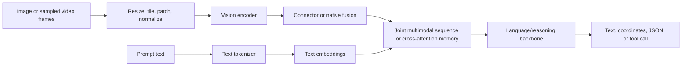
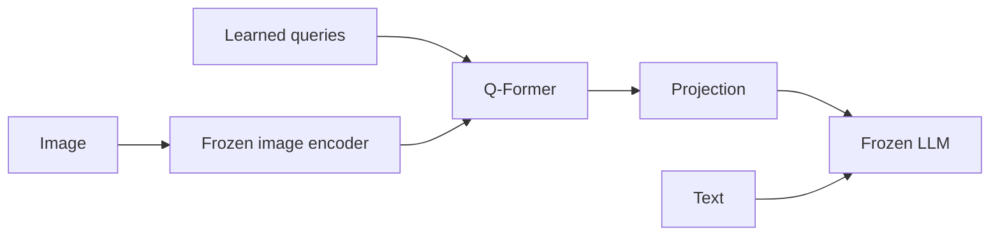
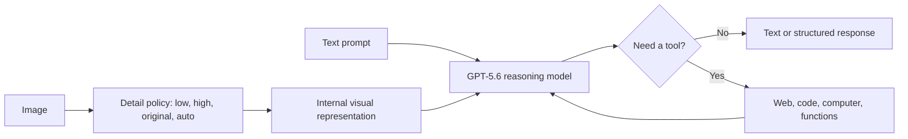
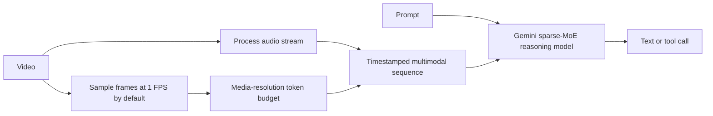
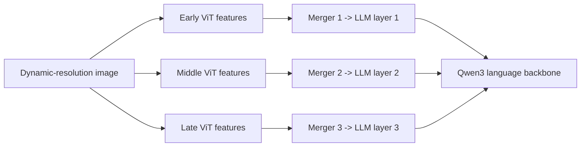
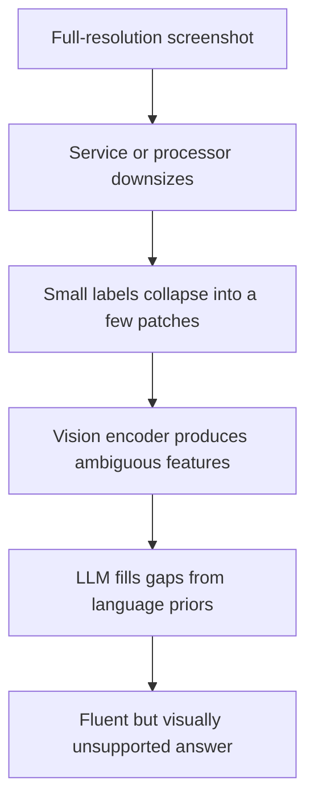
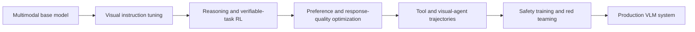
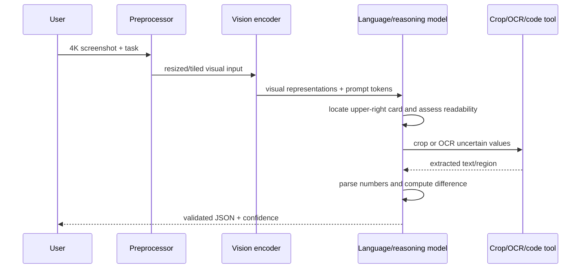

# Modern Vision-Language Models: Architecture, Training, Prompt Behavior, and End-to-End Dataflow

**Compared families:** OpenAI GPT, Anthropic Claude, Google Gemini, Alibaba Qwen-VL, and Meta Llama  
**Research date:** 2026-07-21  
**Audience:** Software engineers, ML engineers, and AI researchers

---

## 1. Executive conclusion

A modern vision-language model is not merely an LLM with an image file attached. It is a system that
must turn pixels or video frames into a bounded sequence of visual representations, align those
representations with language, preserve spatial and temporal information, and then generate or act on a
language-conditioned result.

The most useful high-level decomposition is:

```text
Observed VLM behavior
=
vision preprocessing and sampling
+ visual encoder
+ connector or fusion strategy
+ language/reasoning backbone
+ multimodal pretraining mixture
+ visual instruction and preference post-training
+ tool runtime
+ prompt structure
+ decoding and safety layers
```

The newest families are converging in product capability but not in public architecture:

- **OpenAI GPT-5.6 and Claude 5** expose strong image understanding and detailed input controls, but do not disclose their current vision encoder, connector, attention design, or parameter topology.
- **Gemini 3.x** is explicitly a native multimodal sparse-MoE Transformer family, but Google still withholds most block-level and modality-encoder details.
- **The Qwen line** is the most technically inspectable current family in this comparison. Qwen3.6 is the newest released open-weight VLM snapshot; Qwen3-VL remains the newest full technical report for the vision stack, disclosing its SigLIP-2 encoder, MLP merger, DeepStack fusion, multimodal RoPE, textual video timestamps, and multi-stage training recipe.
- **Llama 4** exposes an early-fusion native-multimodal MoE design, a MetaCLIP-derived vision encoder,
  training scale, and post-training sequence, but its released interface is image-and-text rather than a
  general native-video API.

The practical difference between models is often decided before the first language-model block runs:

```text
raw pixels/video
-> resize, tile, patch, and sample
-> visual-token budget
-> cross-modal fusion
-> reasoning and tool policy
-> answer
```

This is why the same model can succeed on a cropped high-resolution chart and fail on the original
full-page screenshot, or summarize a slow lecture correctly while missing a one-second event in a
video.

---

## 2. Scope and current snapshots

This report focuses on **generative VLMs that accept image or video evidence and produce text or tool calls**. It does not compare:

- image/video generation models such as GPT Image, Gemini Image, or Veo;
- pure contrastive embedding models used only for retrieval;
- classical task-specific detectors or OCR systems;
- vision-language-action models that directly output robot controls.

Those systems can share encoders or training data with a VLM, but their output contracts and evaluation
criteria differ.

| Family                     | Practical snapshot used here                                                     | Accepted visual input in the cited public interface                                                | Publicly inspectable internals                                                                                          |
| -------------------------- | -------------------------------------------------------------------------------- | -------------------------------------------------------------------------------------------------- | ----------------------------------------------------------------------------------------------------------------------- |
| **OpenAI GPT**       | GPT-5.6 Sol/Terra/Luna                                                           | Images; text output. The API model pages mark audio and video as unsupported for these checkpoints | Input resizing/token controls and product behavior; current neural internals unspecified                                |
| **Anthropic Claude** | Claude Sonnet 5, with Fable 5/Opus 4.8 as higher-capability current alternatives | Images and PDFs; text output                                                                       | Patch accounting, resolution tiers, training-data categories, post-training goals; current neural internals unspecified |
| **Google Gemini**    | Gemini 3.5 Flash for throughput and Gemini 3.1 Pro for harder reasoning          | Images, video, audio, documents; text output                                                       | Native multimodal sparse-MoE Transformer at Gemini 3 family level; exact encoder/router details mostly unspecified      |
| **Alibaba Qwen**     | Qwen3.6-35B-A3B as the newest open checkpoint; Qwen3-VL as the latest full VL technical report | Images, multi-image sequences, documents, and video; text/tool-oriented output | Qwen3.6 weights and hybrid LM config; Qwen3-VL vision encoder, merger, fusion, positional strategy, training recipe, and code |
| **Meta Llama**       | Llama 4 Scout and Maverick                                                       | Images and text in released checkpoints; multi-image support is bounded and should be validated    | Weights, MoE scale, early fusion, vision-encoder family, training-token estimates, and post-training sequence           |

Current product facts are from the official [OpenAI model catalog](https://developers.openai.com/api/docs/models),
[Claude model overview](https://platform.claude.com/docs/en/about-claude/models/overview),
[Gemini 3.5 Flash model card](https://deepmind.google/models/model-cards/gemini-3-5-flash/),
[Qwen3.6 model card](https://huggingface.co/Qwen/Qwen3.6-35B-A3B), and
[Llama 4 launch report](https://ai.meta.com/blog/llama-4-multimodal-intelligence/).

Qwen3.7-Max and Meta Muse Spark are newer proprietary product lines, but their public material does
not provide a comparable current vision-stack specification; this report keeps Qwen3.6/Qwen3-VL and
Llama 4 as the inspectable technical subjects.

### Disclosure labels

- **Verified:** directly documented in an official paper, model card, repository, or API guide.
- **Family-level:** documented for an earlier or underlying family member, not guaranteed unchanged in
  the newest checkpoint.
- **Inferred:** a reasonable engineering interpretation, not a vendor statement.
- **Unknown:** the public evidence is insufficient.

---

# Part I — Shared foundation and architecture

## 3. What makes a model a VLM?

A text-only autoregressive LLM maps token IDs to embeddings and predicts the next token. A generative
VLM must also map visual input into representations the language backbone can condition on.



The term **visual token** is overloaded. Depending on the system, it can mean:

1. a raw image patch embedding;
2. an encoded patch after the vision Transformer;
3. a compressed query or resampler output;
4. a projected vector placed in the LLM embedding sequence;
5. a billing unit that is not one-to-one with an internal neural token.

Therefore, vendor token-cost formulas should not be treated as architecture diagrams.

## 4. Four recurring fusion patterns

### 4.1 Project visual features into the LLM token space

The canonical open recipe is:

```text
ViT/CLIP features -> linear or MLP projector -> visual tokens -> decoder-only LLM
```

LLaVA showed that a simple projection plus visual instruction tuning can be effective. LLaVA 1.5
replaced the single linear connector with an MLP and used a stronger CLIP resolution and more
task-oriented data. See the original [Visual Instruction Tuning paper](https://arxiv.org/abs/2304.08485)
and [LLaVA 1.5 baseline paper](https://arxiv.org/abs/2310.03744).

This design is simple and easy to fine-tune, but every retained visual token consumes context and
attention compute.

### 4.2 Compress vision through learned queries

BLIP-2 keeps the image encoder and LLM frozen and trains a lightweight **Q-Former** in two stages:
vision-language representation learning, then vision-to-language generative learning. The method is
parameter-efficient but creates a deliberate information bottleneck. See the
[BLIP-2 paper](https://arxiv.org/abs/2301.12597).



### 4.3 Insert gated cross-attention into a language model

Flamingo uses a Perceiver-style resampler and gated cross-attention to let a pretrained language model
attend to arbitrarily interleaved images, video, and text. This avoids simply appending all raw patch
features to the text stream and supports multimodal few-shot examples. See the
[Flamingo paper](https://arxiv.org/abs/2204.14198).

### 4.4 Native or early fusion

In an early-fusion design, text and visual representations enter a shared backbone during large-scale
joint training. This does not mean raw pixels and text characters use identical tokenizers; it means the
model is optimized as one multimodal system rather than only joining two frozen experts at the end.

Meta explicitly describes Llama 4 as early fusion, while Google describes Gemini as natively
multimodal. Qwen3-VL uses a recognizable encoder-merger-LLM boundary but unfreezes all modules after
its initial alignment stage, so its later pretraining is end-to-end multimodal.

## 5. Architecture comparison

| Subsystem        | GPT-5.6                                                         | Claude 5                                                                         | Gemini 3.x                                                  | Qwen                                                                      | Llama 4                                                                                             |
| ---------------- | --------------------------------------------------------------- | -------------------------------------------------------------------------------- | ----------------------------------------------------------- | ------------------------------------------------------------------------- | --------------------------------------------------------------------------------------------------- |
| Vision encoder   | **Unknown**                                               | **Unknown**                                                                | **Unknown** publicly for current models               | Qwen3.6 confirms a vision encoder but does not narratively specify it; Qwen3-VL uses continuously trained SigLIP-2 | MetaCLIP-derived encoder trained alongside a frozen Llama during encoder adaptation                 |
| Connector/fusion | **Unknown**                                               | **Unknown**                                                                | Native multimodal; exact fusion unspecified                 | Qwen3.6 specifics not fully documented; Qwen3-VL uses a two-layer MLP merger plus DeepStack injection | Early fusion of vision and text tokens into a shared backbone                                       |
| Language core    | Current block topology **unknown**                         | Current block topology **unknown**                                          | Sparse-MoE Transformer for Gemini 3 Pro family              | Qwen3.6 hybrid Gated DeltaNet/full attention plus MoE; Qwen3-VL Qwen3 dense or MoE decoder | Alternating dense/MoE Transformer; Maverick has 17B active, 400B total parameters                   |
| Spatial position | Input sizing disclosed; neural position method **unknown** | 28x28 visual-patch accounting disclosed; neural position method **unknown** | Neural position method **unknown**                     | Qwen3.6 exposes interleaved MRoPE config; Qwen3-VL documents 2D RoPE plus interleaved temporal/height/width MRoPE | Family uses RoPE/iRoPE; detailed visual position path not fully disclosed                           |
| Video treatment  | GPT-5.6 API checkpoint does not accept video                    | No native video block in the cited API guide; users can supply extracted frames  | Samples visual stream and audio; File API defaults to 1 FPS | Dynamic frame sampling plus textual timestamp tokens                      | Trained on image and video-frame stills; released interface is multi-image rather than native video |
| Open weights     | No                                                              | No                                                                               | No for Gemini                                               | Yes, Apache 2.0                                                           | Yes, Llama Community License                                                                        |

The key conclusion is not that closed models are architecturally simpler. It is that architecture-level
comparison is **not possible from public evidence** for their current versions.

---

## 6. OpenAI GPT-5.6 vision system

### Verified public behavior

All current GPT-5.6 tiers accept text and image input and produce text. The models expose a 1.05M
context window and multiple reasoning levels, while the current model pages mark audio and video input
as unsupported. See the [OpenAI model catalog](https://developers.openai.com/api/docs/models) and the
[GPT-5.6 Terra model page](https://developers.openai.com/api/docs/models/gpt-5.6-terra).

The image pipeline exposes four detail settings:

- `low`: a 512x512 low-resolution representation;
- `high`: standard high-fidelity processing;
- `original`: preserves input dimensions for GPT-5.6 rather than resizing to a patch budget;
- `auto`: on GPT-5.6, currently behaves like `original`.

These rules and their cost implications are documented in the
[OpenAI image and vision guide](https://developers.openai.com/api/docs/guides/images-vision).



### What is not public

OpenAI does not state whether GPT-5.6 uses a separate ViT, a resampler, cross-attention layers, early
fusion, MoE routing, or a particular multimodal positional encoding. GPT-4o was explicitly described
as one model trained end-to-end across text, vision, and audio, but that 2024 statement is
**family-history evidence, not proof of GPT-5.6 internals**. See
[Hello GPT-4o](https://openai.com/index/hello-gpt-4o/).

### Practical prompt behavior

- Choose `original` for dense documents, small UI elements, charts, and localization when accuracy is
  worth the added tokens and latency.
- Crop the relevant region when the full image contains large irrelevant areas.
- Ask for evidence tied to visible regions before asking for a conclusion.
- Do not rely on natural-language coordinates as a replacement for a detector without application-level
  evaluation.

OpenAI explicitly lists small text, rotation, precise spatial localization, counting, panoramas, and
incorrect descriptions among current limitations in the image guide.

---

## 7. Claude 5 vision system

### Verified public behavior

All current Claude models accept text and image input and return text. Claude Sonnet 5 provides a 1M
context window, adaptive thinking by default, and a 128K synchronous output limit. Anthropic does not
publish the current vision encoder or fusion architecture. See the
[Claude model overview](https://platform.claude.com/docs/en/about-claude/models/overview) and
[Sonnet 5 migration notes](https://platform.claude.com/docs/en/about-claude/models/whats-new-sonnet-5).

Claude's API documentation is unusually explicit about visual-token accounting:

```text
visual_tokens = ceil(width / 28) * ceil(height / 28)
```

Images exceeding a model's long-edge or visual-token limit are downscaled. High-resolution current
models including Sonnet 5 support up to a 2,576-pixel long edge and 4,784 visual tokens. See the
[Claude vision guide](https://platform.claude.com/docs/en/build-with-claude/vision).

### Prompt behavior

Anthropic recommends placing images before the text query. For multiple images, label them explicitly
(`Image 1`, `Image 2`, and so on) so later questions have stable references. Animated GIFs are not
processed as video; only the first frame is used.

Sonnet 5 also changes non-visual behavior relevant to VLM workloads:

- adaptive thinking is on by default;
- manual thinking-token budgets are removed;
- non-default `temperature`, `top_p`, and `top_k` are rejected;
- a new text tokenizer yields roughly 30% more text tokens than Sonnet 4.6 for equivalent content,
  depending on the input.

### Training and tool use

The [Claude Sonnet 5 system card](https://www.anthropic.com/system-cards) states that training uses a
proprietary mixture of public internet information, public and private datasets, and synthetic data,
followed by post-training aligned to Claude's constitution. It does not disclose modality ratios or
neural architecture.

The same system card reports large gains from a Python environment and image-cropping tool on document,
chart, and CAD evaluations. This supports an important systems conclusion: a high-resolution crop/tool
loop can matter more than one extra forward pass over the untouched image.

---

## 8. Gemini 3.x: native multimodality plus explicit media control

### Architecture and modalities

Gemini 3.5 Flash accepts text, images, audio, and video with a 1M-token context window and returns up to
64K text tokens. Gemini 3.1 Pro exposes the same input modalities for harder reasoning work. Their model
cards inherit core details from Gemini 3 Flash/Pro.

The underlying [Gemini 3 Pro model card](https://storage.googleapis.com/deepmind-media/Model-Cards/Gemini-3-Pro-Model-Card.pdf)
describes a **sparse mixture-of-experts Transformer with native multimodal support**. It discloses the
architecture class but not expert counts, vision/audio encoders, head dimensions, or fusion layers.

### Image preprocessing

The current [Gemini image-understanding guide](https://ai.google.dev/gemini-api/docs/image-understanding)
states:

- images no larger than 384 pixels in both dimensions cost 258 tokens;
- larger images are tiled into 768x768 regions, each costing 258 tokens;
- Gemini 3 exposes `media_resolution` to trade fine detail for tokens and latency;
- for a single image, place the text prompt before the image in the Interactions API input array;
- rotate images correctly and avoid blur.

### Video preprocessing

Gemini's current File API processing is concrete enough to reason about failure modes:

- default visual sampling: 1 frame per second;
- default visual cost: 258 tokens per sampled frame, or 66 at low media resolution;
- audio: about 32 tokens per second;
- total: approximately 300 tokens/second at default resolution or 100 tokens/second at low resolution;
- models with a 1M context window support about one hour at default resolution or three hours at low
  resolution.

Google warns that 1 FPS can miss fast action and recommends placing the video before the text prompt.
See the [Gemini video-understanding guide](https://ai.google.dev/gemini-api/docs/video-understanding).



### Training

The Gemini 3 Pro model card lists public web documents, text, code, images, audio, video, licensed data,
permitted user data, and synthetic data in pretraining. Post-training includes instruction tuning,
reinforcement-learning data, human-preference data, and multi-step reasoning/problem-solving data.
Filtering includes deduplication, `robots.txt` handling, safety filtering, and quality filtering.

The exact modality proportions, token count, routing configuration, and curriculum remain unknown.

---

## 9. Qwen3.6 and Qwen3-VL: current checkpoint versus full vision report

Qwen3.6-35B-A3B is the newest released open-weight Qwen checkpoint verified in this research. Its
official model card describes a causal language model with a vision encoder, 35B total and 3B active
parameters, 40 layers, and a repeating language-backbone layout:

```text
3 x (Gated DeltaNet -> MoE)
-> 1 x (gated full attention -> MoE)
(repeat 10 times)
```

It has 256 experts, activates eight routed plus one shared expert, supports a native 262,144-token
context, accepts image and video input, and thinks by default. The published card does not provide an
equally complete narrative for its vision tower and fusion path. See the
[Qwen3.6-35B-A3B model card](https://huggingface.co/Qwen/Qwen3.6-35B-A3B).

For that missing vision-stack detail, Qwen3-VL is the latest full technical report and the proper source
for the architecture and curriculum below. These details must not be silently asserted as unchanged in
Qwen3.6.

Qwen3-VL uses three primary modules:

```text
SigLIP-2 vision encoder
-> two-layer MLP vision-language merger
-> Qwen3 dense or MoE language backbone
```

The flagship Qwen3-VL-235B-A22B has 235B total parameters and 22B active per token. Dense 2B, 4B,
8B, and 32B variants and the 30B-A3B MoE variant provide smaller deployment points. The weights are
Apache-2.0 licensed. See the [Qwen3-VL technical report](https://arxiv.org/abs/2511.21631) and
[official repository](https://github.com/QwenLM/Qwen3-VL).

### 9.1 Vision encoder and merger

- The vision encoder starts from SigLIP-2 and is continuously trained at dynamic native resolutions.
- It uses 2D RoPE plus interpolated absolute position embeddings.
- A two-layer MLP compresses each 2x2 group of visual features into one token in the LLM hidden
  dimension.
- The default large-model encoder is SigLIP2-SO-400M; smaller 2B/4B models use SigLIP2-Large.

### 9.2 DeepStack

Instead of passing only the final ViT layer to the language model, Qwen3-VL selects three levels of
vision features. Dedicated mergers project them and add them to the hidden states of the first three LLM
layers.



The paper's pretraining ablation improves its reported 12-task average from 74.7 to 76.0 with DeepStack.
That is evidence for this training setup, not a guarantee for every downstream task.

### 9.3 Interleaved MRoPE and video timestamps

Earlier MRoPE split embedding dimensions into temporal, height, and width bands, which could give each
axis a different frequency spectrum. Qwen3-VL interleaves those axes across dimensions so all three get
low- and high-frequency coverage.

For video, Qwen3-VL prefixes temporal patches with textual timestamps such as `<3.0 seconds>` rather
than encoding absolute time only through large temporal position IDs. This slightly increases context
length but makes time directly legible to the language backbone.

### 9.4 Practical inference behavior

- Use the exact official chat template and processor; image placeholder placement is part of the model
  contract.
- Set resolution or frame budgets deliberately. Larger images and more frames increase both prefill
  cost and KV-cache pressure.
- For Qwen3-VL, use **Instruct** for direct answers and **Thinking** for harder visual reasoning. For
  Qwen3.6, thinking is on by default and must be disabled with the API/template parameter; the old
  `/think` and `/nothink` soft switch is not officially supported.
- Qwen3.6's vLLM example defaults to 2 FPS for video and exposes the frame rate through processor
  arguments. This is a serving default, not a training-time property or a universal backend contract.
- Record Qwen3.6 sampling parameters and whether historical thinking is preserved; both can change
  latency, token use, and visible behavior.
- FlashAttention-2 is recommended by the official model card for multi-image and video workloads.

See the official
[Qwen3-VL-235B-A22B-Thinking model card](https://huggingface.co/Qwen/Qwen3-VL-235B-A22B-Thinking).

---

## 10. Llama 4: open-weight early fusion

Meta describes Llama 4 Scout and Maverick as its first natively multimodal Llama models and its first
MoE family.

### Architecture

- Vision and text tokens use **early fusion** in a shared backbone.
- The vision encoder is MetaCLIP-derived and was adapted while paired with a frozen Llama model.
- Maverick alternates dense and MoE layers, with 128 routed experts plus one shared expert; each token
  reaches the shared expert and one routed expert.
- Maverick has 17B active and about 400B total parameters; Scout has 17B active and about 109B total.
- Scout uses an iRoPE-related long-context design with interleaved attention layers.

These details are documented in Meta's
[Llama 4 launch report](https://ai.meta.com/blog/llama-4-multimodal-intelligence/).

### Training and interface boundaries

Meta reports approximately 40T multimodal training tokens for Scout and 22T for Maverick, drawn from
public, licensed, and Meta product/service data. It also describes training on text, images, and video
data, plus a post-training sequence of lightweight SFT, multimodal online RL, and lightweight DPO.

However, the release should not be described as an unrestricted native-video API. Meta says the models
were trained on image and video-frame stills and supports multi-image reasoning. The official Maverick
model card says image understanding was tested up to five input images; use above that boundary requires
application-specific validation. See the
[Maverick model card](https://huggingface.co/meta-llama/Llama-4-Maverick-17B-128E).

### Practical prompt behavior

- Use the official processor and chat template so image markers align with encoded features.
- Explicitly label multiple images and state whether the task is comparison, temporal ordering, or
  independent analysis.
- Treat safety, tools, retrieval, and prompt-injection handling as deployer responsibilities; raw open
  weights do not reproduce a closed product's runtime.

---

# Part II — Visual tokenization and prompt behavior

## 11. Resolution is a compute and information decision

The visual bottleneck is not only the number of input pixels. It is the number of visual features that
survive resizing, tiling, patching, encoder compression, and connector compression.

| System   | Public input-accounting behavior                                                                 | Main engineering consequence                                                                                      |
| -------- | ------------------------------------------------------------------------------------------------ | ----------------------------------------------------------------------------------------------------------------- |
| GPT-5.6  | `low`, `high`, `original`, `auto`; `original` preserves dimensions                     | Original detail can improve dense/localized tasks but has unboundedly higher input cost relative to resized modes |
| Claude 5 | 28x28-pixel visual patches, capped by resolution tier                                            | Cost is predictable; large images are downscaled, so crop before upload when small detail matters                 |
| Gemini 3 | 258-token base/tile behavior and `media_resolution`                                            | Explicit quality/latency control; high resolution should be reserved for OCR, charts, and small objects           |
| Qwen      | Qwen3.6 exposes configurable processor/frame budgets; Qwen3-VL documents dynamic resolution and 2x2 feature compression | Deployment owner controls memory/latency but can silently remove needed detail through aggressive limits |
| Llama 4  | Processor-dependent tiling/encoding; public release guidance is less explicit than Claude/Gemini | Inspect the exact processor config and measure tokens rather than assuming a generic patch count                  |

### A common failure chain



More reasoning after detail is lost does not restore the lost pixels.

## 12. Prompt adaptation matrix

| Task property            | Better prompt/input strategy                                                                                     | Why                                                                                    |
| ------------------------ | ---------------------------------------------------------------------------------------------------------------- | -------------------------------------------------------------------------------------- |
| Dense chart or document  | Crop relevant panels, preserve high/original detail, ask for extracted evidence first                            | Reduces visual competition and makes unsupported inference easier to catch             |
| Multiple images          | Label each image and define the comparison axes                                                                  | Prevents reference ambiguity                                                           |
| Object counting          | Ask for a region-by-region inventory, then total; validate against a detector for high-stakes use                | Generative VLMs can approximate rather than enumerate                                  |
| Spatial grounding        | Request a structured coordinate format and define coordinate order/range                                         | Natural-language locations are ambiguous; vendors use different normalized conventions |
| Long video               | State required timestamps and event granularity; increase sampling around fast segments                          | Default frame sampling can miss short events                                           |
| GUI agent                | Use high resolution, preserve coordinates, allow crop/zoom, and require confirmation before actions              | Click accuracy depends on fine spatial detail and runtime policy                       |
| OCR                      | Rotate correctly, avoid blur, use crop/high resolution, and request verbatim transcription before interpretation | OCR error and reasoning error are otherwise mixed                                      |
| Scientific/medical image | Ask the model to identify visible evidence and uncertainty; use a domain specialist for decisions                | General VLM documentation explicitly excludes some specialized medical interpretation  |

### Family-specific ordering guidance

- **Claude:** image before text.
- **Gemini Interactions API:** text before a single image; video before its prompt in the current video
  best-practice section.
- **Qwen/Llama:** use the model's official processor/chat template rather than assuming content order is
  implementation-independent.
- **OpenAI:** the API supports interleaved content blocks; detail choice and unambiguous references are
  more important than copying another vendor's ordering convention.

## 13. Why tool-assisted vision is becoming standard

A VLM can use tools to compensate for fixed perception:

```text
inspect full image
-> identify uncertain region
-> crop/zoom
-> OCR or run code
-> compare extracted values
-> answer with evidence
```

This is not equivalent to a larger vision encoder. It is a test-time perception loop. Claude's Sonnet 5
system card reports consistent gains from Python plus image cropping across document, chart, and CAD
tasks. GPT-5.6 and Gemini expose computer/code tools in their runtimes, while Qwen3-VL explicitly
post-trains visual-agent and tool-use trajectories.

---

# Part III — Pretraining and post-training

## 14. What VLM pretraining must learn

Text pretraining alone supplies language, reasoning patterns, and world knowledge, but it does not teach
which pixel regions support which words. VLM training must add at least four capabilities:

1. **visual representation:** preserve objects, text, layout, attributes, and relations;
2. **modality alignment:** map visual evidence into a space the language model can use;
3. **joint reasoning:** combine image/video evidence with instructions and prior knowledge;
4. **output grounding:** produce answers, coordinates, timestamps, or tool actions that remain tied to
   the input.

Common data types include:

- image-caption pairs;
- interleaved webpages and documents;
- OCR and document-layout data;
- VQA and visual reasoning problems;
- boxes, points, masks, and referring expressions;
- multi-image and video sequences;
- text-only data to preserve language capability;
- GUI and tool-use trajectories;
- preference, safety, and refusal data.

The VILA study found that interleaved data helped more than image-caption pairs alone for some VLM
properties, and that re-mixing text-only instructions could protect and even improve capability during
multimodal tuning. It also found that freezing the LLM limited in-context learning in its setup. See
[VILA: On Pre-training for Visual Language Models](https://arxiv.org/abs/2312.07533). These are
controlled results for VILA, not universal laws.

## 15. Training comparison

| Family   | Public pretraining evidence                                                                                                                                        | Public multimodal post-training evidence                                                        | Major unknowns                                                                     |
| -------- | ------------------------------------------------------------------------------------------------------------------------------------------------------------------ | ----------------------------------------------------------------------------------------------- | ---------------------------------------------------------------------------------- |
| GPT      | GPT-4V used internet and licensed text/image data; GPT-4o was trained end-to-end across text, vision, audio. GPT-5.6 data categories are published at system level | RL/reasoning, safety and multimodal deployment evaluations are documented                       | Current modality mix, encoder/fusion, objectives, scale                            |
| Claude   | Public internet, public/private datasets, synthetic data; deduplication/classification                                                                             | Constitution-aligned post-training, preference work, red teaming; multimodal tool evals         | Vision-specific data, objectives, architecture, modality ratios                    |
| Gemini   | Web documents, text, code, images, audio, video, licensed/user/synthetic data; native multimodal training                                                          | Instruction tuning, human-preference data, RL including multi-step reasoning                    | Exact token counts, modality ratios, expert/router and encoder details             |
| Qwen     | Qwen3-VL publishes a four-stage alignment-to-256K recipe with approximately 2T+ multimodal/text tokens after a 67B-token alignment stage | Qwen3-VL documents SFT, strong-to-weak distillation, reasoning RL, general RL, and tool-integrated visual-agent RL | Qwen3.6's complete VL curriculum and exact relation to Qwen3-VL are not fully documented |
| Llama 4  | Reported 22T/40T multimodal tokens, early fusion, text/image/video data, 200 pretraining languages                                                                 | Lightweight SFT -> multimodal online RL -> lightweight DPO                                      | Dataset composition at sample level and full fusion/encoder implementation details |

## 16. Qwen3-VL's four-stage pretraining recipe

Qwen3-VL provides the clearest example of a staged current VLM curriculum:

| Stage | Trainable modules                              | Approximate budget | Sequence length | Purpose                                             |
| ----- | ---------------------------------------------- | -----------------: | --------------: | --------------------------------------------------- |
| S0    | MLP merger only; vision encoder and LLM frozen |         67B tokens |           8,192 | Initial vision-language alignment                   |
| S1    | All modules                                    |         ~1T tokens |           8,192 | Broad multimodal pretraining plus text preservation |
| S2    | All modules                                    |         ~1T tokens |          32,768 | More video, agent data, and long-context learning   |
| S3    | All modules                                    |        100B tokens |         262,144 | Ultra-long documents and video adaptation           |

Important details from the technical report include:

- 30M in-house OCR samples plus multilingual synthetic OCR data;
- millions of documents/PDFs with layout-aware parsing;
- grounding data with boxes and points normalized to `[0, 1000]`;
- multimodal coding data such as screenshot-to-HTML and diagram-to-code;
- length-adaptive video frame sampling;
- visual STEM data and millions of filtered reasoning samples;
- GUI, function-calling, and search trajectories.

This explains why Qwen3-VL's behavior cannot be attributed only to SigLIP-2 or DeepStack. Data
construction and curriculum cover the exact output contracts the model is expected to produce.

## 17. Post-training changes what users perceive

A generic multimodal post-training pipeline is:



Post-training controls whether a model:

- transcribes before interpreting;
- admits that text is unreadable;
- emits normalized boxes in the requested schema;
- uses a crop or OCR tool;
- persists through a multi-step visual task;
- refuses unsafe image-based requests;
- gives a concise answer or a long visual rationale.

The vision encoder may determine what evidence is available, but post-training determines how that
evidence is selected, verbalized, checked, and acted upon.

---

# Part IV — End-to-end dataflow

## 18. Shared example task

Assume the input is a 4K dashboard screenshot and the request is:

```text
Read the revenue value in the upper-right card, compare it with the previous-month value,
and return JSON with current, previous, difference, and confidence.
```

The ideal logical flow is:



## 19. How the five families realize the flow

### GPT-5.6

```text
image block + detail policy
-> undisclosed visual stack
-> GPT-5.6 reasoning
-> optional computer/code/crop workflow
-> structured text output
```

Use `original` when small dashboard text is the bottleneck. The architecture between the image block
and reasoning model is unknown.

### Claude Sonnet 5

```text
image first, then task
-> 28x28 patch accounting and possible downscale
-> undisclosed multimodal stack
-> adaptive thinking
-> optional crop/Python tools
-> JSON/text output
```

Pre-crop the card if the full screenshot would exceed the visual-token tier or make the target too small.

### Gemini 3.5 Flash / 3.1 Pro

```text
task + image
-> tile and media-resolution allocation
-> native multimodal sparse-MoE reasoning model
-> optional code/tool runtime
-> JSON/text output
```

Use Flash for high-volume extraction after measuring accuracy; use Pro when the comparison requires
harder reasoning or cross-document context.

### Qwen3.6 / Qwen3-VL

```text
official processor and chat template
-> Qwen3.6 visual front end (details incomplete), or documented Qwen3-VL SigLIP-2 stack
-> Qwen3.6 hybrid DeltaNet/attention MoE, or Qwen3-VL Qwen3 backbone
-> configured thinking or direct-answer mode
-> local structured output/tool loop
```

The deployer owns processor limits, sampling, quantization, runtime tools, and schema enforcement.

### Llama 4

```text
official image processor and chat template
-> MetaCLIP-derived visual representation
-> early-fused shared MoE backbone
-> local decoder/runtime
-> structured output
```

The deployer also owns safety and tool orchestration. Do not infer that a hosted provider uses Meta's
reference processor or prompt defaults without checking.

---

# Part V — Evaluation, limitations, and counter-evidence

## 20. What different benchmarks actually test

| Benchmark type             | Examples                              | What it can reveal                               | What it does not establish                                     |
| -------------------------- | ------------------------------------- | ------------------------------------------------ | -------------------------------------------------------------- |
| Broad multimodal reasoning | MMMU, MMMU-Pro                        | Cross-domain image-plus-text reasoning           | Production OCR, latency, robustness to arbitrary image quality |
| Document/chart             | DocVQA, ChartQA, CharXiv, ChartMuseum | Reading, layout, chart reasoning                 | General spatial grounding or video understanding               |
| Visual math                | MathVista, MathVision                 | Diagram perception plus symbolic reasoning       | Open-world visual accuracy                                     |
| Hallucination/illusion     | HallusionBench                        | Inconsistency and language-prior failures        | Full factuality across real applications                       |
| Video                      | Video-MME, VideoMMMU, MLVU, LVBench   | Temporal and long-video comprehension            | Equal frame/audio budgets across providers                     |
| GUI/agent                  | OSWorld, ScreenSpot-style tasks       | Visual localization plus action policy           | Passive image understanding in isolation                       |
| Grounding                  | RefCOCO-style boxes/points            | Localization under a defined coordinate contract | Pixel-accurate detection for all categories                    |

No single score measures “vision.”

## 21. Why current leaderboard numbers are not directly comparable

### Different model versions

Vendor tables often compare a current model against older competitor snapshots. A Gemini 3.5 Flash
table that lists GPT-5.5 or Claude 4.x is useful for that evaluation run, but it is not a current GPT-5.6
versus Claude 5 versus Gemini 3.5 leaderboard.

### Different visual budgets

The Qwen3-VL technical report explicitly notes unequal maximum input frames in one video comparison:
512 for Gemini 2.5 Pro, 256 for GPT-5, and 100 for Claude Opus 4.1. It says full fairness cannot be
guaranteed. A video score can therefore measure sampling budget and API constraints as well as model
quality.

### Different tools and graders

The Claude Sonnet 5 system card reports separate tool/no-tool results, changes the grader on some
benchmarks, and states that Anthropic could not reproduce Surge's published GDP.pdf numbers. These are
responsible caveats, but they prevent casual cross-table ranking.

### Data exposure and benchmark saturation

Web-scale training can expose models to benchmark images, questions, or closely related templates.
Use fresh private tasks, not only public leaderboards, for application selection.

## 22. Shared failure modes

### 22.1 Visual hallucination

The language model can produce a plausible completion when visual evidence is weak or missing. The
[HallusionBench paper](https://arxiv.org/abs/2310.14566) documents failures from entangled language
hallucination and visual illusion. Although the evaluated 2023-era models are no longer current, the
failure taxonomy remains relevant and should be tested again on current checkpoints.

### 22.2 Fine-detail loss

Small text, thin chart lines, distant objects, and dense UI elements can disappear during resizing or
compression. Higher resolution helps only if the service preserves the detail and the connector retains
it.

### 22.3 Counting and exact geometry

Autoregressive generation is not a guaranteed enumeration or geometry algorithm. Ask for intermediate
grounding and verify coordinates/counts with task-specific tools when errors are costly.

### 22.4 Video aliasing

Temporal sampling turns continuous video into sparse observations. Gemini's documented 1 FPS default
can miss short actions. Increasing reasoning effort cannot recover an unsampled frame.

### 22.5 OCR-language and rotation sensitivity

Blur, rotation, unusual scripts, handwriting, and low contrast can cause transcription errors that then
propagate into reasoning. Separate transcription, parsing, and conclusion in the output contract.

### 22.6 Prompt injection inside images

A screenshot or document can contain instructions addressed to the model. An agentic VLM must treat
visual text as untrusted evidence, not automatically as higher-priority instructions. This is primarily a
runtime and policy problem, not just an encoder problem.

### 22.7 Fluent uncertainty masking

Text quality is not a confidence estimate. Require evidence fields, allow `unknown`/`unreadable`, and
calibrate confidence on labeled data rather than trusting self-reported certainty.

## 23. Fair application-specific test protocol

Use a fixed dataset and record the full effective configuration:

1. exact model ID and date;
2. original image/video plus any crop, resize, compression, or frame sampling;
3. visual detail/media-resolution setting;
4. prompt and image/video ordering;
5. reasoning effort or Thinking/Instruct variant;
6. tool availability and tool-call limits;
7. temperature/decoding settings where supported;
8. output schema and retry policy;
9. latency, input tokens, output tokens, and cost;
10. human-reviewed correctness and evidence grounding.

Recommended test slices:

- clean versus blurred/rotated inputs;
- original versus cropped image;
- low versus high visual budget;
- single versus multiple images;
- no-tool versus crop/OCR/code tools;
- normal versus adversarial text embedded in the image;
- common versus rare scripts and domain terminology;
- slow versus fast video events.

Report task success, not only average answer similarity. For extraction, include exact-field accuracy. For
grounding, use IoU or point distance. For video, score timestamp tolerance. For agents, measure both
completion and unsafe/incorrect actions.

---

# Part VI — Practical selection guidance

## 24. Choose GPT-5.6 when

- a managed reasoning-and-tool system matters more than inspecting neural internals;
- high-resolution image input and computer-use workflows are central;
- structured output, tools, and long context need one hosted API;
- image input is sufficient and native video input is not required for this checkpoint.

## 25. Choose Claude when

- image-plus-document analysis and long-context professional work dominate;
- explicit, predictable visual patch accounting is useful;
- crop/Python-assisted analysis is part of the workflow;
- a hosted model is acceptable and architecture transparency is not required.

## 26. Choose Gemini when

- native video plus audio understanding is required;
- long multimodal context and Google tool integration matter;
- explicit image/video media-resolution controls are valuable;
- Flash/Pro tiers fit a measured quality-latency split.

## 27. Choose Qwen when

- open weights, local deployment, fine-tuning, or architecture inspection are required;
- OCR, document parsing, grounding, GUI agents, or native video are important;
- the team can own processor limits, serving, quantization, safety, and tool orchestration;
- Qwen3.6 thinking/direct modes or Qwen3-VL Instruct/Thinking variants can be evaluated separately.

## 28. Choose Llama 4 when

- an open-weight early-fusion MoE model is preferred;
- image reasoning and customization matter more than native video ingestion;
- the Llama ecosystem/license fits the deployment;
- the team can build the missing safety, tools, and application evaluation stack.

## 29. Final answer to the central question

Modern VLM families are converging toward a shared product surface—images, documents, reasoning,
structured outputs, and tools—but they reach it through different and often undisclosed internal paths.

The most durable conceptual model is:

```text
VLM quality
=
what visual evidence survives preprocessing
+ how vision is aligned and fused with language
+ what multimodal tasks appeared in training
+ how post-training rewards grounded behavior
+ what tools can re-inspect uncertain regions
```

Architecture still matters. Qwen3.6's hybrid sequence backbone, Qwen3-VL's DeepStack and temporal
encoding, Llama 4's early fusion, and Gemini's native sparse-MoE design are meaningful differences. But
real application behavior is often dominated by resolution, sampling, data mixture, post-training, tool
availability, and runtime policy.

Therefore:

> A VLM cannot reason about visual evidence that its preprocessing discarded.
> A strong visual encoder does not guarantee a grounded answer.
> The complete system—not the model name alone—must be evaluated.

---

# Sources

All online sources were accessed on **2026-07-21**.

## OpenAI

- [OpenAI API model catalog](https://developers.openai.com/api/docs/models) — current GPT-5.6 tiers,
  modalities, context, reasoning, and tools.
- [GPT-5.6 model guidance](https://developers.openai.com/api/docs/guides/latest-model) — current
  reasoning and original-image-detail behavior.
- [Images and vision guide](https://developers.openai.com/api/docs/guides/images-vision) — detail
  levels, resizing/tokenization, costs, and vision limitations.
- [GPT-5.6 system card](https://deploymentsafety.openai.com/gpt-5-6) — training categories, vision
  safety evaluation, hallucination and deployment safeguards.
- [Hello GPT-4o](https://openai.com/index/hello-gpt-4o/) — historical family-level evidence for
  end-to-end multimodal training.
- [GPT-4V system card](https://openai.com/index/gpt-4v-system-card/) — historical image/text training,
  RLHF, and multimodal risk evidence.

## Anthropic

- [Claude models overview](https://platform.claude.com/docs/en/about-claude/models/overview) — current
  models, modalities, context, and output behavior.
- [Claude vision guide](https://platform.claude.com/docs/en/build-with-claude/vision) — formats,
  ordering, patch accounting, resolution tiers, and multiple-image guidance.
- [What&#39;s new in Claude Sonnet 5](https://platform.claude.com/docs/en/about-claude/models/whats-new-sonnet-5)
  — adaptive thinking, tokenizer, sampling restrictions, and context.
- [Claude Sonnet 5 system card](https://www-cdn.anthropic.com/73ad94ca3c0502e75e46637cc62c8bd9532a7f2c/Claude%20Sonnet%205%20System%20Card.pdf)
  — training categories, multimodal evaluation methodology, tools, limitations, and corrections.

## Google

- [Gemini 3.5 Flash model card](https://deepmind.google/models/model-cards/gemini-3-5-flash/) — current
  modalities, context, benchmark methodology, and model dependency.
- [Gemini 3.1 Pro model card](https://deepmind.google/models/model-cards/gemini-3-1-pro/) — complex
  multimodal reasoning model, context, and evaluation.
- [Gemini 3 Pro model card](https://storage.googleapis.com/deepmind-media/Model-Cards/Gemini-3-Pro-Model-Card.pdf)
  — sparse-MoE native-multimodal architecture class and training-data categories.
- [Gemini image-understanding guide](https://ai.google.dev/gemini-api/docs/image-understanding) — image
  tiling, token accounting, media resolution, capabilities, and prompt order.
- [Gemini video-understanding guide](https://ai.google.dev/gemini-api/docs/video-understanding) — frame
  sampling, audio/video tokens, duration limits, timestamps, and prompt guidance.
- [Gemini 1 technical report](https://deepmind.google/gemini/gemini_1_report.pdf) — foundational native
  multimodal training and family history.

## Qwen

- [Qwen3.6-35B-A3B model card](https://huggingface.co/Qwen/Qwen3.6-35B-A3B) — current open-weight
  checkpoint, hybrid language backbone, model scale, context, modalities, and inference controls.
- [Qwen3.6 official repository](https://github.com/QwenLM/Qwen3.6) — current code, deployment
  guidance, and released checkpoints.
- [Qwen3-VL technical report](https://arxiv.org/abs/2511.21631) — architecture, training recipe, data,
  post-training, ablations, and evaluation limits.
- [Qwen3-VL official repository](https://github.com/QwenLM/Qwen3-VL) — released variants, capabilities,
  dates, code, and deployment links.
- [Qwen3-VL-235B-A22B-Thinking model card](https://huggingface.co/Qwen/Qwen3-VL-235B-A22B-Thinking)
  — weight license, architecture summary, processor usage, and serving guidance.
- [SigLIP 2 paper](https://arxiv.org/abs/2502.14786) — the vision-encoder family and its multilingual,
  localization, dense-feature, and multi-resolution training recipe.

## Meta

- [Llama 4 launch and technical overview](https://ai.meta.com/blog/llama-4-multimodal-intelligence/)
  — early fusion, MoE, vision encoder, pretraining, post-training, context, and multi-image behavior.
- [Llama 4 Maverick model card](https://huggingface.co/meta-llama/Llama-4-Maverick-17B-128E) — intended
  use, training tokens, benchmark setup, tested image count, license, and safeguards.

## Foundational architecture and evaluation papers

- [Flamingo](https://arxiv.org/abs/2204.14198) — resampler, gated cross-attention, interleaved
  image/video/text few-shot learning.
- [BLIP-2](https://arxiv.org/abs/2301.12597) — frozen experts joined through a Q-Former.
- [Visual Instruction Tuning / LLaVA](https://arxiv.org/abs/2304.08485) — projected vision features and
  synthetic visual instruction data.
- [LLaVA 1.5](https://arxiv.org/abs/2310.03744) — MLP connector, higher-resolution CLIP, and stronger
  visual instruction baseline.
- [VILA](https://arxiv.org/abs/2312.07533) — controlled findings on freezing, interleaved data, and
  text-data reblending.
- [POPE](https://arxiv.org/abs/2305.10355) — object-hallucination evaluation through polling-based
  questions.
- [HallusionBench](https://arxiv.org/abs/2310.14566) — language hallucination and visual-illusion
  failure taxonomy.
- [ChartMuseum](https://arxiv.org/abs/2505.13444) — chart-understanding evaluation with manually
  curated questions and answer rationales.
- [Video-MME](https://arxiv.org/abs/2405.21075) — multi-duration video-understanding evaluation with
  optional subtitles.
- [OSWorld](https://arxiv.org/abs/2404.07972) — multimodal computer-agent evaluation in real desktop
  environments.

## Notes on uncertainty

- Closed vendors can change architecture and preprocessing without publishing all details.
- API documentation is an operational contract, not a full neural-network specification.
- “Native multimodal” does not imply the same tokenization or fusion design across vendors.
- Vendor benchmark tables use different model dates, image/frame budgets, tools, prompts, and graders.
- Self-reported benchmark scores should guide test design, not replace application-specific evaluation.
- Hosted behavior includes safety filters, hidden system instructions, tool policies, and routing that raw
  open weights do not reproduce.
