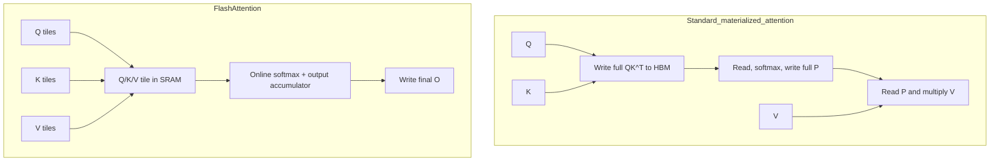

# FlashAttention

**Improves:** the memory access pattern of standard exact attention.  
**Primary goal:** avoid writing the full attention-score and probability matrices
to high-bandwidth memory (HBM).

## It is an algorithm, not a different learned attention layer

Standard attention is:

$$
\begin{aligned}
S &= \frac{QK^{\top}}{\sqrt{d_{\mathrm{head}}}}, \\
P &= \operatorname{softmax}(S+M), \\
O &= PV
\end{aligned}
$$

A naive GPU implementation materializes `S` and `P`, each shaped approximately
`sequence_length × sequence_length` per head. It writes them to HBM, reads them
back for softmax/value mixing, and stores large intermediates for backward.

FlashAttention computes the same mathematical result, up to ordinary floating-
point ordering differences. Its main innovation is IO-aware tiling:

1. load blocks of Q, K, and V from HBM into small, fast on-chip SRAM;
2. compute one score tile;
3. update an online softmax maximum, normalizer, and output accumulator;
4. discard the score tile instead of writing an `N × N` matrix to HBM;
5. repeat over all K/V tiles; recompute selected quantities during backward.

The paper proves fewer HBM accesses than a standard materialized implementation
for the analyzed memory regime.
([Dao et al., 2022, §§3.1–3.2](https://arxiv.org/abs/2205.14135))

## Why online softmax is exact

For one query row, suppose a previous tile has running maximum `m_old`,
normalizer `l_old`, and unnormalized weighted-value accumulator `a_old`. For a
new score tile `s`:

$$
\begin{aligned}
m_{\mathrm{new}}
&= \max\!\left(m_{\mathrm{old}},\max(s)\right), \\
\ell_{\mathrm{new}}
&= e^{m_{\mathrm{old}}-m_{\mathrm{new}}}\ell_{\mathrm{old}}
 + \sum_j e^{s_j-m_{\mathrm{new}}}, \\
a_{\mathrm{new}}
&= e^{m_{\mathrm{old}}-m_{\mathrm{new}}}a_{\mathrm{old}}
 + \sum_j e^{s_j-m_{\mathrm{new}}}V_j, \\
o &= \frac{a_{\mathrm{new}}}{\ell_{\mathrm{new}}}
\end{aligned}
$$

Rescaling the previous accumulator when `m_new` changes makes the result equal
to a softmax over all tiles; the whole score row never has to coexist in HBM.

## Dataflow comparison

## Complexity and practical benefit

- Arithmetic remains quadratic for dense full attention: approximately
  `O(N^2 d)`. FlashAttention is not a linear-attention method.
- It avoids quadratic-size stored score/probability intermediates, reducing
  auxiliary memory toward `O(Nd)`.
- Lower HBM traffic can make attention much faster because GPUs often have more
  arithmetic capacity than memory bandwidth for this operation.
- The advantage grows with sequence length, but exact speed depends on GPU,
  dtype, head dimension, masks, dropout, batching, and kernel generation.

FlashAttention does not shrink the persistent autoregressive KV cache. GQA does
that. The two techniques are complementary: GQA stores fewer K/V heads, while
FlashAttention executes attention over the available Q/K/V tensors with a better
IO schedule.

## How Qwen uses it

FlashAttention should not be listed as a weight-level Qwen architecture feature.
The same Qwen checkpoint can use a framework's eager/SDPA attention or a
FlashAttention kernel and represent the same learned function.

**Verified historical use:** the original Qwen technical report says
FlashAttention was used to improve attention efficiency during pretraining. This
describes the training implementation, not an extra learned module stored in the
weights. ([Qwen Technical Report, §2.4](https://arxiv.org/abs/2309.16609))

**Verified runtime support:** the official Qwen3-VL README recommends
FlashAttention-2 for acceleration and memory saving and enables it with
`attn_implementation="flash_attention_2"`. It also notes that the documented
path requires FP16 or BF16 and compatible hardware.
([Qwen3-VL README](https://github.com/QwenLM/Qwen3-VL/blob/main/README.md#flash-attention-2-to-speed-up-generation))

So the precise statement is: **Qwen can be executed with FlashAttention where
the framework and hardware support it; FlashAttention is not what the checkpoint
learned.**
