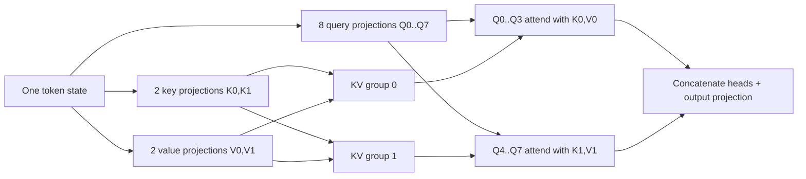

# Grouped-Query Attention (GQA)

**Improves:** multi-head attention (MHA), with multi-query attention (MQA) as the
other endpoint.  
**Primary goal:** preserve most of MHA's quality while reducing autoregressive
KV-cache size and memory bandwidth.

## From MHA to MQA to GQA

For a model width `d_model`, MHA splits the attention computation into `Hq`
query heads. Conventional MHA gives every query head its own key and value
heads:

$$
\begin{aligned}
\mathrm{MHA}:&\quad H_q\ \text{query heads},\ H_q\ \text{key heads},\ H_q\ \text{value heads} \\
\mathrm{MQA}:&\quad H_q\ \text{query heads},\ 1\ \text{key head},\ 1\ \text{value head} \\
\mathrm{GQA}:&\quad H_q\ \text{query heads},\ H_{kv}\ \text{key heads},\ H_{kv}\ \text{value heads},
\quad 1 < H_{kv} < H_q
\end{aligned}
$$

MQA greatly reduces cache traffic, but sharing one K/V representation across
all query heads can reduce quality. GQA chooses the middle point: partition the
`Hq` query heads into `Hkv` groups, then let all queries in one group share one
K/V head. The original GQA paper reports quality close to MHA and speed
comparable to MQA after uptraining.
([Ainslie et al., 2023](https://arxiv.org/abs/2305.13245))

For query head `h`, define its KV group as:

$$
g(h) = \left\lfloor \frac{hH_{kv}}{H_q} \right\rfloor
$$

$$
\operatorname{head}_h
= \operatorname{softmax}\!\left(
\frac{Q_hK_{g(h)}^{\top}}{\sqrt{d_{\text{head}}}} + M_{\text{causal}}
\right)V_{g(h)}
$$

The softmax and value mixing are still performed independently for every query
head. Only the K/V projections and cached K/V states are shared.

## Dataflow example

Assume `Hq = 8` and `Hkv = 2`:

During generation, the model appends only two K heads and two V heads to the
cache for each new token, rather than eight of each.

## Why decoding becomes cheaper

Ignoring batch, layers, bytes per scalar, and implementation padding, the cache
per layer is approximately:

$$
N_{\mathrm{KV}}
= 2 \times L_{\mathrm{sequence}} \times H_{kv} \times d_{\mathrm{head}}
$$

MHA uses `Hkv = Hq`. GQA's cache ratio relative to MHA is therefore
`Hkv / Hq`. In the 8-query/2-KV example, K/V storage and the K/V memory traffic
are about one quarter of MHA. This matters especially in token-by-token decode,
which is often limited by reading model weights and the growing KV cache rather
than by raw arithmetic.

The improvement has boundaries:

- GQA does not eliminate the `QK^T` attention over all cached positions.
- Prefill still has quadratic full-attention work unless another method changes
  the attention pattern or algorithm.
- Fewer KV heads impose a representation bottleneck; `Hkv` is a quality versus
  cache/throughput design choice.
- The theoretical cache reduction may not equal wall-clock speedup because
  kernels, batching, quantization, and hardware utilization also matter.

## How Qwen uses it

**Verified:** Qwen2 explicitly replaces conventional MHA with GQA to optimize
KV-cache use and throughput. Its 7B model, for example, uses 28 query heads and
4 KV heads. ([Qwen2 Technical Report, §2.2 and Table 1](https://arxiv.org/abs/2407.10671))

**Verified:** Qwen3 retains GQA. Qwen3-8B uses 32 query heads and 8 KV heads;
Qwen3-235B-A22B uses 64 query heads and 4 KV heads.
([Qwen3 Technical Report, Tables 1–2](https://arxiv.org/abs/2505.09388))

Qwen3-Next's full-attention layers still use grouped K/V heads: the 80B-A3B
model card lists 16 Q heads and 2 KV heads. Its other three layers in each
four-layer cycle are Gated DeltaNet layers, so GQA describes only the full
attention quarter of that hybrid stack.
([Qwen3-Next model card](https://huggingface.co/Qwen/Qwen3-Next-80B-A3B-Instruct))
