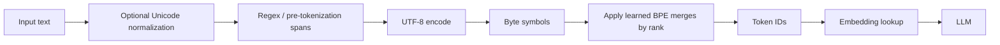
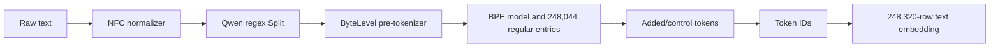

# Byte-Level Byte Pair Encoding (BBPE) Tokenizer

**Improves:** word tokenization, character tokenization, and character-level
BPE when the model must cover many scripts, rare symbols, noisy text, and code
with one fixed vocabulary.
**Primary goal:** guarantee a small lossless base alphabet while learning
frequent variable-length byte sequences so ordinary text does not pay the full
sequence-length cost of one token per byte.

**Simple Explanation:** BBPE converts normalized text to UTF-8 bytes, starts from a base vocabulary that can represent every byte, and learns ranked pair merges that compress frequent byte sequences into larger tokens. It is therefore
not a pure byte tokenizer and not merely ordinary BPE with a byte fallback.

**Research date:** 2026-07-20
**Scope:** the tokenizer algorithm, its architecture and dataflow, alternatives,
system trade-offs, and the exact tokenizer artifacts published for the Qwen
lineage.

## Why the earlier token units were insufficient

| Original unit       | Strength                                                       | Structural problem addressed by BBPE                                                                                                                   |
| ------------------- | -------------------------------------------------------------- | ------------------------------------------------------------------------------------------------------------------------------------------------------ |
| Word                | Short sequences for common words                               | An open vocabulary cannot fit in a fixed table; new names, inflections, typos, and code identifiers become unknown or require a separate fallback      |
| Unicode character   | Usually interpretable boundaries                               | Unicode contains a very large and unevenly used character space; rare characters consume vocabulary slots, and every character remains a separate step |
| Character-level BPE | Learns reusable subwords and whole frequent words              | The initial character alphabet still needs corpus coverage; an unseen character can become`<unk>` unless another fallback mechanism exists           |
| Pure bytes          | Any byte stream is representable with at most 256 base symbols | UTF-8 uses one to four bytes per Unicode code point, so sequences become much longer and model compute rises                                           |
| **BBPE**      | Universal byte base plus learned byte n-grams                  | It removes ordinary OOVs while recovering much of subword BPE's compression efficiency                                                                 |

Sennrich et al. adapted BPE from compression to open-vocabulary neural text
segmentation: initialize a small symbol set, repeatedly merge the most frequent
adjacent pair, and use the learned merges to represent rare words through
smaller units. Their version operated on characters or character sequences,
not necessarily raw bytes.
([Sennrich et al., 2016, §3.2](https://aclanthology.org/P16-1162/))

Wang et al. moved that initial alphabet down to UTF-8 bytes. Their motivation
was that a fixed byte alphabet is compact and language-agnostic, whereas rare
characters in noisy or character-rich languages can occupy disproportionate
vocabulary capacity. Their NMT experiments found comparable quality to
character-level BPE with much smaller BBPE vocabularies, but those experimental
ratios are results for the paper's translation setups, not a universal law for
decoder-only LLMs.
([Wang et al., 2019](https://arxiv.org/abs/1909.03341))

## From compression BPE to tokenizer BPE

The name is historical. Gage's 1994 compression algorithm finds the most
frequent pair of adjacent bytes in a data block, replaces every occurrence with
an unused byte, records the substitution table, and repeats until further
compression is impossible. A neural tokenizer does not require an unused
physical byte for every merge. It creates a new **symbol/token ID** whose value
is the concatenation of two existing symbols, learns a reusable ordered merge
table from a corpus, and leaves the language model to learn an embedding for
each resulting ID.
([Gage, 1994](https://jacobfilipp.com/DrDobbs/articles/CUJ/1994/9402/gage/gage.htm))

This distinction matters:

- the tokenizer vocabulary is a learned dictionary, not the compressed text;
- a token can contain one byte, one complete Unicode character, several
  characters, or even only part of a multi-byte character;
- the merge order is part of the tokenizer specification and must be identical
  in training and inference;
- the tokenizer does not understand morphology or semantics directly—it learns
  frequent adjacency patterns from its training distribution.

## Training BBPE

Let the normalized training corpus be split into pre-tokenized spans, and let
each span be converted to UTF-8 bytes. The minimum byte alphabet is

$$
V_0 = \{0,1,\ldots,255\}.
$$

Some implementations expose these bytes through printable Unicode surrogate
characters, but the underlying alphabet still represents bytes. At merge step
`t`, count adjacent symbol pairs inside the allowed spans:

$$
C_t(a,b)
=
\sum_{s \in \mathcal{D}_t}
\sum_{i=1}^{|s|-1}
\mathbf{1}\!\left[s_i=a \land s_{i+1}=b\right].
$$

Classical frequency-based BPE selects

$$
(a_t,b_t)
=
\underset{(a,b)}{\arg\max}\; C_t(a,b),
$$

creates the concatenated symbol `a_t b_t`, assigns it the next merge rank, and
replaces occurrences of the pair in the training representation:

$$
V_{t+1}=V_t\cup\{a_tb_t\}.
$$

The loop stops at a vocabulary/merge budget or another frequency threshold. In
the simplified case with 256 initial byte symbols and no reserved tokens,

$$
|V| = 256 + N_{\text{merges}}.
$$

Real tokenizer files can have a larger initial alphabet, unused IDs, added
tokens, and padded embedding rows, so this identity should not be used to infer
a checkpoint's exact `vocab_size` without inspecting its artifacts.

### Why pre-tokenization is part of the architecture

Most production BBPE tokenizers do not allow merges over an entire document.
A regex or another pre-tokenizer first isolates spans such as words, numbers,
punctuation, whitespace, and newlines. Pair counting and merge application stay
inside those boundaries. Therefore, changing only the pre-tokenization regex
can change:

- whether a leading space joins the following word;
- whether `1234` can become one token or is forced into four digits;
- how contractions, indentation, CR/LF, and code punctuation are grouped;
- which candidate tokens can ever be learned, even with the same corpus and
  vocabulary budget.

This is why “uses BBPE” is not enough to reproduce a tokenizer. Its normalizer,
pre-tokenizer, initial alphabet, merge ranks, special-token policy, and decoder
are all part of the contract.

## Encoding dataflow



For every pre-tokenized span, inference starts from the byte symbols, repeatedly
applies the available pair with the best learned rank, and stops when no learned
pair remains. In rank notation,

$$
(a^*,b^*)
=
\underset{(a,b)\in P(s)}{\arg\min}\;
r(a,b),
$$

where an unlearned pair has rank `+infinity`. This rank application is not a new
frequency count over the user's prompt; frequencies were already converted to
merge ranks during tokenizer training.

### Concrete example

Take the normalized string `café`. UTF-8 represents it as

```text
text:   c     a     f     é
bytes:  63    61    66    C3 A9        (hexadecimal)
```

Suppose the learned merge table contains these rules in increasing rank order:

```text
63 + 61       -> 6361          # "ca"
C3 + A9       -> C3A9          # complete UTF-8 encoding of "é"
6361 + 66     -> 636166        # "caf"
636166 + C3A9 -> 636166C3A9    # "café"
```

Then `café` can be one token. If the last two rules were never learned, the same
input could still be represented as `ca`, `f`, `é`; with only the 256-byte base
it could still be represented as the five original bytes. **Coverage is
guaranteed by the base alphabet, while compression depends on the learned
merges and their corpus.**

Tokens may cross Unicode character boundaries or end in the middle of one. For
example, a token may hold `C3` without its continuation byte `A9`. This is valid
inside a token sequence, but decoding that single token in isolation can show
the Unicode replacement character. Qwen's tokenizer note demonstrates exactly
this behavior: two individually incomplete token byte strings become a valid
Chinese character after concatenation.
([official Qwen tokenization note](https://github.com/QwenLM/Qwen/blob/main/tokenization_note.md#regular-tokens))

## GPT-2-style byte-to-Unicode mapping

Many implementations need BPE code that operates on strings rather than raw
byte arrays. GPT-2 introduced a reversible lookup from all 256 byte values to
printable Unicode characters, avoiding whitespace and control characters in
the internal representation. Its encoder performs this order:

```text
regex spans -> UTF-8 bytes -> byte-to-Unicode lookup -> ranked BPE -> IDs
```

and decoding reverses it:

```text
IDs -> merged surrogate strings -> bytes -> UTF-8 text
```

The familiar `Ġ` in GPT-2-family vocabulary displays the surrogate associated
with a space byte; it is not a linguistic marker discovered in the original
text. Likewise, surrogate-looking fragments should not be interpreted as the
text's actual Unicode characters. The original GPT-2 implementation exposes
the reversible lookup, regex, ranked merge loop, UTF-8 conversion, and inverse
decoder directly.
([OpenAI GPT-2 `encoder.py`](https://github.com/openai/gpt-2/blob/master/src/encoder.py))

## Decoding and reversibility

Ignoring normalization and special-token removal, decoding is the inverse of
encoding:

$$
\hat{b}
=
\operatorname{concat}
\left(
\operatorname{bytes}(v_{i_1}),\ldots,
\operatorname{bytes}(v_{i_L})
\right),
\qquad
\hat{x}=\operatorname{UTF8Decode}(\hat{b}).
$$

For input text encoded by the tokenizer, the byte base prevents an ordinary
unknown token. Generated token sequences are different: the model can stop
after a token containing only part of a UTF-8 character, so a streaming decoder
may need to buffer multiple tokens before it emits valid text. An arbitrary
model-generated byte sequence can also be invalid UTF-8; the application must
choose whether to buffer, replace, ignore, or surface decoding errors. Wang et
al. explicitly noted that not every arbitrary byte sequence maps to valid text,
although invalid sequences were rare in their completed NMT experiments.
([Wang et al., 2019, decoding discussion](https://arxiv.org/pdf/1909.03341))

There is another important boundary: **a normalizer can intentionally make the
whole tokenizer non-lossless with respect to the original input bytes**. For
example, NFC can replace a decomposed base-letter-plus-combining-mark sequence
with a canonically composed code point before byte encoding. BBPE then preserves
the normalized bytes, not the exact original spelling at the byte level.

## BBPE is not byte fallback

| Mechanism                                  | Normal path                                    | When raw-byte tokens appear                           | Ordinary OOV behavior                                           |
| ------------------------------------------ | ---------------------------------------------- | ----------------------------------------------------- | --------------------------------------------------------------- |
| True byte-level BPE                        | Convert**all** input to bytes before BPE | Always forms the base representation                  | None when all 256 bytes are covered                             |
| Character/subword model with byte fallback | Run the normal character/subword model first   | Only when a character/span would otherwise be unknown | Unknowns are replaced by explicit byte tokens such as`<0xE2>` |

Hugging Face's official decoder documentation makes the implementation
difference visible: `ByteLevel` reverses the GPT-2-style byte-to-Unicode mapping,
whereas `ByteFallback` interprets explicit `<0xNN>` fallback tokens that stand
in for unknown characters.
([Hugging Face Tokenizers decoders](https://huggingface.co/docs/tokenizers/main/en/api/decoders))

SentencePiece is also not one segmentation algorithm. It is a framework that
can train BPE, unigram, character, or word models directly from raw sentences;
its standard operation treats input as Unicode characters and applies its own
normalization and whitespace representation. A SentencePiece model can enable
byte fallback, but that does not turn every SentencePiece configuration into
BBPE.
([SentencePiece paper](https://arxiv.org/abs/1808.06226),
[official implementation](https://github.com/google/sentencepiece))

## Comparison with neighboring tokenizers

| Method         | Initial units                                   | Training/encoding rule                                                                              | OOV guarantee                                               | Characteristic trade-off                                                               |
| -------------- | ----------------------------------------------- | --------------------------------------------------------------------------------------------------- | ----------------------------------------------------------- | -------------------------------------------------------------------------------------- |
| Character BPE  | Covered Unicode characters                      | Merge most frequent adjacent units; apply learned ranks                                             | No, unless all needed characters or fallback are present    | More interpretable base symbols, but multilingual alphabets consume slots              |
| **BBPE** | All bytes                                       | Merge frequent adjacent byte-derived units; apply learned ranks                                     | Yes for byte coverage                                       | Compact universal base; tokens may split characters and rare scripts can be byte-heavy |
| WordPiece      | Character-like alphabet with continuation forms | Learn a likelihood-related vocabulary; encode by longest matching pieces                            | Usually uses`[UNK]` when a word cannot be fully segmented | Useful continuation convention, but not intrinsically open at the byte level           |
| Unigram LM     | Large candidate subword set                     | Remove candidates to optimize a corpus likelihood objective; select a high-probability segmentation | Depends on character coverage/fallback                      | Supports probabilistic alternative segmentations rather than a fixed merge hierarchy   |
| Pure bytes     | All bytes                                       | No learned merges                                                                                   | Yes                                                         | Smallest vocabulary but longest sequences                                              |

The WordPiece training implementation was never officially released by Google,
so exact descriptions of its pair-scoring rule are reconstructions from the
literature. The robust distinction is at encoding time: common WordPiece
implementations use longest-match-first over a final vocabulary, while BPE
applies an ordered merge table.
([Hugging Face WordPiece documentation](https://huggingface.co/docs/course/chapter6/6))

## System-level trade-offs

### Vocabulary size versus sequence length

Let `V` be vocabulary size, `d` model width, and `L` the resulting number of
tokens. The input embedding matrix costs

$$
P_{\text{embed}}=Vd.
$$

If the output LM head is separate, its weights add approximately another `Vd`:

$$
P_{\text{vocab}}
\approx
\begin{cases}
Vd, & \text{tied input/output weights},\\
2Vd, & \text{untied input/output weights}.
\end{cases}
$$

A larger BBPE vocabulary therefore increases checkpoint memory, embedding
bandwidth, and the final-logit computation. In return it can reduce `L` by
storing more frequent strings as single tokens. This matters throughout the
network: full-attention prefill scales approximately as

$$
O(L^2d),
$$

while token-wise projections and MLPs scale linearly with `L`. If the same text
uses a fraction `r` as many tokens, the attention portion can fall roughly to
`r^2` of its former size, but the larger output vocabulary makes each decoding
step more expensive. The best vocabulary size is consequently a hardware,
language-mixture, model-width, and serving-workload trade-off—not simply “larger
is better.”

### Corpus allocation is policy

Merge slots go to frequent patterns. If English and popular programming
languages dominate tokenizer training, they obtain long reusable tokens while a
low-resource script may remain close to raw bytes. BBPE ensures encodability,
not equal token efficiency or equal model quality across languages. Vocabulary
sharing can help cross-lingual transfer—the BBPE paper found this in its
multilingual translation setup—but a single shared inventory still reflects
the sampling weights used to train it.

### Whitespace, code, and exact text

Byte-level processing is attractive for code because tabs, spaces, line endings,
operators, and arbitrary identifiers remain representable. Yet the regex can
prevent useful merges, Unicode normalization can rewrite source text, and
different line-ending policies can change token counts. Any code model should
therefore benchmark the **whole tokenizer pipeline**, not only confirm that its
model type is `BPE`.

### Robustness and security are not automatic

BBPE removes the `<unk>` coverage failure but does not make visually equivalent
strings identical. Homoglyphs, zero-width characters, bidirectional controls,
NFC/NFD forms, and invalid byte handling are separate concerns. Normalization
can reduce some variation but may also destroy distinctions that matter in code
or security-sensitive text.

## Exact Qwen adoption

### Qwen → Qwen2 → Qwen3

| Family | Verified tokenizer description                                                                                                       | Important count detail                                                                                                                |
| ------ | ------------------------------------------------------------------------------------------------------------------------------------ | ------------------------------------------------------------------------------------------------------------------------------------- |
| Qwen   | Starts from`tiktoken`'s `cl100k_base`, adds frequent Chinese and other multilingual units, and splits numbers into single digits | Reported final vocabulary is approximately 152K                                                                                       |
| Qwen2  | Reuses Qwen's byte-level BPE                                                                                                         | 151,643 regular tokens plus 3 control tokens; the report warns that the embedding size can be larger for distributed-training reasons |
| Qwen3  | Explicitly identifies the tokenizer as BBPE                                                                                          | Vocabulary size 151,669                                                                                                               |

Sources: [Qwen Technical Report, §2.2](https://arxiv.org/abs/2309.16609),
[Qwen2 Technical Report, §2.1](https://arxiv.org/abs/2407.10671), and
[Qwen3 Technical Report, §2](https://arxiv.org/abs/2505.09388).

This lineage also shows why `151,643`, `151,646`, and `151,669` are not
contradictory. The first is Qwen2's regular BPE inventory, the second adds the
three Qwen2 control tokens, and the third is the later Qwen3 tokenizer's stated
full vocabulary.

### Qwen3.5: larger BBPE and the artifact-level dataflow

The Qwen3.5-Omni report and official release post describe a 250K byte-level BPE
vocabulary, increased from about 150K, and report 10–60% better encoding and
decoding efficiency across most languages. This is a Qwen-reported aggregate
claim; the cited report sentence does not provide a per-language tokenizer
benchmark table or enough methodology to reproduce the range.
([Qwen3.5-Omni Technical Report, §2.3](https://arxiv.org/abs/2604.15804),
[official Qwen3.5 release](https://www.alibabacloud.com/blog/602894))

The published `Qwen3.5-27B` artifacts reveal the concrete pipeline:



Verified directly from the official artifacts:

- `tokenizer.json` uses an NFC normalizer, a regex `Split` followed by
  `ByteLevel`, a `BPE` model, and a `ByteLevel` decoder;
- its BPE model vocabulary has **248,044 entries**, IDs `0..248043`;
- the same file appends 26 entries at IDs `248044..248069`, including chat,
  vision, tool, fill-in-the-middle, repository, and thinking markers;
- `tokenizer_config.json` declares `Qwen2Tokenizer` and lists 33 added-token
  decoder entries through ID `248076`, including seven audio/TTS markers beyond
  those serialized in `tokenizer.json`;
- `config.json` reserves **248,320** rows for the text vocabulary and sets
  `tie_word_embeddings: false`.

Official artifacts:
[Qwen3.5-27B `tokenizer.json`](https://huggingface.co/Qwen/Qwen3.5-27B/blob/fc05daec18b0a78c049392ed2e771dde82bdf654/tokenizer.json),
[`tokenizer_config.json`](https://huggingface.co/Qwen/Qwen3.5-27B/blob/fc05daec18b0a78c049392ed2e771dde82bdf654/tokenizer_config.json), and
[`config.json`](https://huggingface.co/Qwen/Qwen3.5-27B/blob/fc05daec18b0a78c049392ed2e771dde82bdf654/config.json).

The rounded “250K vocabulary” therefore should not be substituted blindly for
every software field:

$$
\underbrace{248{,}044}_{\text{BPE model entries}}
\neq
\underbrace{248{,}320}_{\text{reserved embedding rows}}.
$$

The gap is expected: added multimodal/control tokens and padded or reserved
rows serve different purposes from learned BBPE entries. Because Qwen3.5-27B
does not tie input and output embeddings, the padded text vocabulary affects
both large matrices rather than one shared matrix.

The current Qwen3.5 regex is:

```regex
(?i:'s|'t|'re|'ve|'m|'ll|'d)|[^\r\n\p{L}\p{N}]?[\p{L}\p{M}]+|\p{N}| ?[^\s\p{L}\p{M}\p{N}]+[\r\n]*|\s*[\r\n]+|\s+(?!\S)|\s+
```

It treats contractions case-insensitively, keeps Unicode combining marks
(`\p{M}`) with letters, splits numbers one digit at a time, and has explicit
branches for punctuation, horizontal whitespace, and newline runs. Those
rules—not BBPE in isolation—partly determine its multilingual, code, and
whitespace behavior.

## What BBPE improves—and what it does not

**It directly improves:**

- coverage: every normalized UTF-8 input can be decomposed to base bytes;
- compactness of the base alphabet across many scripts;
- reuse of byte fragments and frequent strings across languages;
- compression relative to a pure-byte model;
- handling of rare symbols, noisy text, whitespace, and code without a normal
  character-vocabulary OOV.

**It does not guarantee:**

- one token per word or one token per Unicode character;
- equal token efficiency across languages;
- semantic or morphological token boundaries;
- preservation of the original byte sequence when normalization runs first;
- valid UTF-8 after every intermediate generated token;
- shorter sequences than every character/subword tokenizer on every domain;
- better end-task quality merely because the vocabulary is larger.

## Practical inspection checklist

Before comparing two “BBPE tokenizers,” inspect:

1. the normalizer and whether round-trip byte identity matters;
2. the exact pre-tokenization regex and merge boundaries;
3. regular BPE entries, merge count, added tokens, and maximum assigned ID;
4. tokenizer length versus model `vocab_size` and embedding padding;
5. input/output weight tying;
6. tokens per byte, character, word, and document for each target language and
   code/data domain;
7. invalid UTF-8 and streaming decode policy;
8. special-token injection and whether user text can collide with it;
9. end-to-end latency, not only token count.

## Sources

All online sources were opened or downloaded and checked on 2026-07-20.

- Philip Gage. [A New Algorithm for Data Compression](https://jacobfilipp.com/DrDobbs/articles/CUJ/1994/9402/gage/gage.htm), 1994.
- Rico Sennrich, Barry Haddow, Alexandra Birch. [Neural Machine Translation of Rare Words with Subword Units](https://aclanthology.org/P16-1162/), ACL 2016.
- Changhan Wang, Kyunghyun Cho, Jiatao Gu. [Neural Machine Translation with Byte-Level Subwords](https://arxiv.org/abs/1909.03341), AAAI 2020.
- OpenAI. [GPT-2 byte-level BPE encoder implementation](https://github.com/openai/gpt-2/blob/master/src/encoder.py).
- Taku Kudo, John Richardson. [SentencePiece](https://arxiv.org/abs/1808.06226), EMNLP 2018 demo paper.
- Hugging Face. [Tokenizers components](https://huggingface.co/docs/tokenizers/main/components) and [decoders](https://huggingface.co/docs/tokenizers/main/en/api/decoders).
- Qwen Team. [Qwen Technical Report](https://arxiv.org/abs/2309.16609), [Qwen2 Technical Report](https://arxiv.org/abs/2407.10671), [Qwen3 Technical Report](https://arxiv.org/abs/2505.09388), and [Qwen3.5-Omni Technical Report](https://arxiv.org/abs/2604.15804).
- Qwen Team. [Qwen tokenization note](https://github.com/QwenLM/Qwen/blob/main/tokenization_note.md) and [Qwen3.5-27B tokenizer artifacts](https://huggingface.co/Qwen/Qwen3.5-27B/tree/main).
