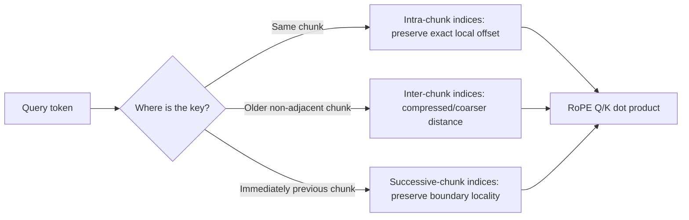

# Dual Chunk Attention (DCA)

**Improves:** RoPE attention whose raw relative distances exceed the pretrained context range.
**Primary goal:** keep effective RoPE distances within the familiar range while
retaining local, cross-chunk, and boundary-spanning attention.

**Simple Explanation:** Splits a long sequence into overlapping chunks so attention mostly operates over shorter, familiar distances, while a second cross-chunk attention path preserves long-range information. (Hence Dual-Chunk-Attention)

## Why chunk-specific position indices are needed

A simple local-chunk method can reuse positions `0..s-1` in every chunk, keeping
local RoPE distances familiar. However, strictly local attention discards access
to older chunks. Using the original global positions restores access but again
feeds RoPE distances beyond the trained range.

DCA resolves this tension by computing attention with three query-position
views. It does not merely mask all cross-chunk pairs, and the original method is
training-free. ([An et al., 2024](https://arxiv.org/abs/2402.17463))

## Three attention regions



- **Intra-chunk attention** reuses positions `0..s-1` inside every chunk. Local
  token distances remain exact and inside the trained range.
- **Inter-chunk attention** allows access to older chunks while using a capped
  query index. It retains content access but deliberately makes distant
  positions less precise.
- **Successive-chunk attention** preserves a local window across adjacent chunk
  boundaries, avoiding an artificial discontinuity between the last token of
  one chunk and the first token of the next.

## Position remapping

Let `c = L_train`, chunk size `s`, query index `i`, key index `j`, and boundary
window width `w = c - s`. A compact summary is:

$$
\begin{aligned}
P_k(j) &= j \bmod s,
&&\text{key position}, \\
P_q^{\mathrm{intra}}(i) &= i \bmod s,
&&\text{same-chunk query}, \\
P_q^{\mathrm{inter}}(i) &= c-1,
&&\text{older-chunk query}, \\
w &= c-s,
&&\text{successive-chunk local-window width}, \\
P_q^{\mathrm{succ}}(i) &\le c-1,
&&\text{preserve the local window, then cap}
\end{aligned}
$$

The causal mask selects the correct score region for each query-key pair. All
effective indices remain inside `0..c-1`, but older non-adjacent positions are
coarsened. The DCA paper describes separate Q-position sets for intra-, inter-,
and successive-chunk calculations and shows that the method can integrate with
FlashAttention. ([DCA method, §3](https://arxiv.org/abs/2402.17463))

## Example with an eight-token input

Assume a model trained with a four-token range and split an eight-token sequence
into `[A B C D] [E F G H]`:

```text
within second chunk: E,F,G,H reuse local positions 0,1,2,3
F attending to E: exact local displacement 1
F attending to B: cross-chunk relation uses a capped/reindexed distance
E attending to D: successive-chunk rule preserves this boundary locality
```

The model can access older content without sending every raw displacement from
4 to 7 directly into RoPE. The trade-off is loss of precise distance among some
far-away tokens.

## What it improves and its limits

- DCA preserves local and adjacent-boundary geometry better than a single
  repeated local-position scheme.
- It retains cross-chunk content access instead of truncating all old chunks.
- It still performs full causal attention over the enabled regions; DCA does
  not make attention linear-time.
- Chunk size and boundary-window choices affect locality and extrapolation.
- Coarsened far distances can reduce exact positional distinction.
- Longer accepted context does not guarantee perfect retrieval or reasoning.

## How Qwen uses DCA

**Verified:** Qwen2 uses DCA together with YaRN after long-context training to
process sequences up to 131,072 tokens.
([Qwen2 Technical Report, §§2.2 and 3.2](https://arxiv.org/abs/2407.10671))

**Verified:** Qwen3 introduces YaRN and DCA in its long-context stage for a
four-fold inference extension.
([Qwen3 Technical Report, §3.2](https://arxiv.org/abs/2505.09388))

DCA changes the query/key position-index assignment. [YaRN](YaRN.md) instead
changes the RoPE frequency spectrum and attention temperature. Later Qwen3-Next
goes further by replacing most full-attention layers with Gated DeltaNet; that
separate architecture is covered in [Gated_DeltaNet.md](Gated_DeltaNet.md).
