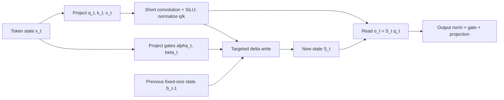

# Gated DeltaNet and Hybrid Attention

**Improves:** quadratic full attention for long sequences, and simpler linear
recurrent alternatives such as Mamba2 or DeltaNet.
**Primary goal:** maintain a fixed-size recurrent key-value memory that can both
forget globally and update a specific association, then combine it with periodic
full attention to recover exact-retrieval capacity.

**Simple Explanation:** A linear-attention mechanism that reduces attention complexity to **O(n)** by replacing token-to-token attention with a **shared recurrent memory**. Each token uses its **Q, K, and V** to read from and update this memory via the **delta rule** , while a **learned gate**(Mamba2) controls  **how much of the update is written** , allowing the model to preserve important information and ignore less relevant updates.

## From full attention to recurrent state

At decode step `t`, full causal attention stores every prior K/V pair and
compares the current query against all keys. This gives content-addressable
access but the KV cache grows linearly with sequence length, and full prefill
attention is quadratic.

Basic linear attention can instead summarize history in a matrix state:

$$
\begin{aligned}
S_t &= S_{t-1} + v_tk_t^{\top}, \\
o_t &= S_tq_t
\end{aligned}
$$

The state shape depends on head dimensions, not sequence length. Associativity
replaces an explicit scan over all prior tokens with a recurrent update. The
cost is compression: many K/V associations share one fixed-size matrix and can
collide.

## Why both a gate and a delta rule are needed

Mamba2-like scalar decay adds global forgetting:

$$
S_t = \alpha_t S_{t-1} + v_tk_t^{\top},
\qquad 0 < \alpha_t < 1
$$

Small `alpha_t` rapidly clears stale state, but it decays every association
together. It cannot selectively overwrite only the memory addressed by `k_t`.

DeltaNet performs a targeted correction:

$$
S_t
= S_{t-1}\left(I-\beta_tk_tk_t^{\top}\right)
+ \beta_tv_tk_t^{\top}
$$

Equivalently, it subtracts the current prediction error at key `k_t` and writes
the new value. This selectively changes one association, but lacks a fast global
reset when context changes.

Gated DeltaNet combines them:

$$
\begin{aligned}
S_t
&= S_{t-1}\left[\alpha_t\left(I-\beta_tk_tk_t^{\top}\right)\right]
  + \beta_tv_tk_t^{\top}, \\
o_t &= S_tq_t
\end{aligned}
$$

- `alpha_t -> 0`: forget most old state quickly;
- `alpha_t -> 1`: behave like the targeted delta update;
- `beta_t`: controls how strongly the new K/V association replaces the old
  value at that key.

This equation and interpretation come from the original Gated DeltaNet paper.
([Yang, Kautz, and Hatamizadeh, 2024/ICLR 2025, §3](https://arxiv.org/abs/2412.06464))

## Token dataflow



During sequential decoding, only the state is carried forward. During training,
the recurrence would underutilize GPUs if evaluated token by token. The paper
derives a chunkwise-parallel algorithm using compact WY/UT matrix forms so each
chunk becomes tensor-core-friendly matrix multiplications while overall sequence
complexity remains linear.

## Memory example

Suppose the state has learned associations for keys resembling `user_name`,
`current_city`, and `task`:

1. A new `current_city` value arrives. The delta term corrects the state mainly
   along that key direction instead of erasing unrelated `user_name` memory.
2. The conversation changes to a completely new document. A small `alpha_t`
   decays the whole old state quickly.
3. The current query reads a weighted combination through `S_t q_t`.

This is an analogy for the matrix update, not evidence that a real trained head
stores human-readable fields.

## Why Qwen uses a hybrid rather than pure linear stack

Fixed-size recurrent memory still loses detail when many associations collide.
The Gated DeltaNet paper finds pure recurrent models behind full attention on
some real-world retrieval tasks, while hybrids with attention perform better.
([paper §§4 and limitations](https://arxiv.org/abs/2412.06464))

Qwen3-Next therefore uses a 3:1 pattern:

```text
Gated DeltaNet -> MoE
Gated DeltaNet -> MoE
Gated DeltaNet -> MoE
Gated full attention -> MoE
repeat 12 times
```

The recurrent layers cheaply propagate compressed long-range state. Each fourth
layer provides explicit token-to-token attention for precise retrieval and
mixing. Qwen also adds an output gate to the full-attention layers and uses GQA
there (16 Q heads, 2 KV heads in 80B-A3B).
([official Qwen3-Next post](https://qwen.ai/blog?id=e34c4305036ce60d55a0791b170337c2b70ae51d),
[model card](https://huggingface.co/Qwen/Qwen3-Next-80B-A3B-Instruct))

## Complexity and trade-offs

| Property                     | Full attention                  | Gated DeltaNet                                     |
| ---------------------------- | ------------------------------- | -------------------------------------------------- |
| Prefill token mixing         | Quadratic in sequence length    | Linear in sequence length with chunkwise algorithm |
| Decode history               | Growing KV cache                | Fixed-size recurrent matrix state                  |
| Exact access to an old token | Strong content-addressable path | Compressed; collisions are possible                |
| Parallel training            | Natural large matmuls           | Requires specialized chunkwise kernels             |
| Serving support              | Mature                          | Architecture- and kernel-specific                  |

The official Qwen3-Next card claims 10× inference throughput over 32K context
relative to Qwen3-32B for its tested model/system, but that result combines Gated
DeltaNet, sparse MoE, model dimensions, kernels, and serving setup. It should not
be attributed to the recurrence equation alone.

**Verified lineage:** Qwen3 itself is still an all-attention dense/MoE family.
Gated DeltaNet first enters this line through Qwen3-Next; official later Qwen
materials describe it as continuing into Qwen3.5/3.6.

**Disclaimer:** Gated DeltaNet is **not yet a universal replacement** for Transformer attention. While it reduces attention complexity from **O(n²)** to  **O(n)** , it compresses past information into a recurrent memory, which can trade off some retrieval fidelity compared to full attention. Its efficiency advantages become most noticeable for  **very long contexts (100K–1M+ tokens)** , whereas for more common context lengths (e.g.,  **8K–32K tokens** ), optimized Transformer attention is often already efficient enough that the practical benefits are smaller.
([Qwen FlashQLA post](https://qwen.ai/blog?id=flashqla))
