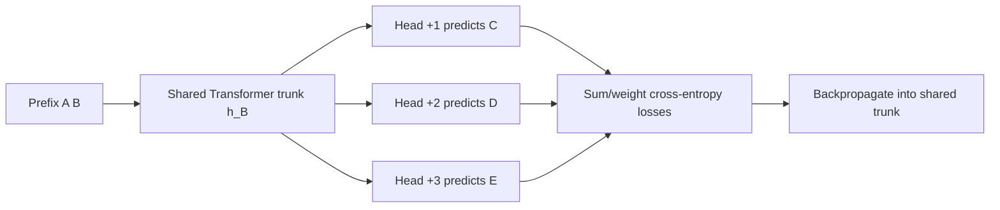
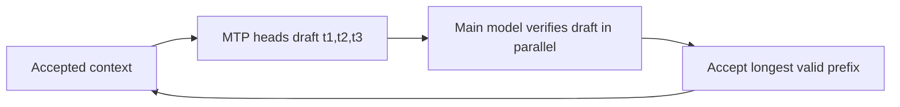

# Multi-Token Prediction (MTP)

**Improves:** next-token-only language-model training and one-token-per-forward-
pass autoregressive decoding.  
**Primary goal:** supervise multiple future positions from each context and reuse
the extra predictors as draft proposals for speculative decoding.

## Next-token prediction versus MTP

Standard causal language modeling trains one target at position `t`:

$$
\mathcal{L}_{\mathrm{NTP}}
= -\log p\!\left(x_{t+1}\mid x_{\le t}\right)
$$

An `n`-token predictor shares a Transformer trunk but adds future prediction
heads:

$$
\begin{aligned}
h_t &= \operatorname{Trunk}\!\left(x_{\le t}\right), \\
p_j &= \operatorname{Head}_j(h_t),
\qquad j\in\{1,\ldots,n\}, \\
\mathcal{L}_{\mathrm{MTP}}
&= -\sum_{j=1}^{n}
\log p_j\!\left(x_{t+j}\mid x_{\le t}\right)
\end{aligned}
$$

The heads predict different future offsets in parallel. They do not make future
tokens conditionally independent in the final autoregressive model; they are
auxiliary training heads and draft mechanisms. The original MTP paper argues
that this forces the trunk to represent less-local decisions and reports larger
benefits at larger model scales, especially on code generation.
([Gloeckle et al., 2024](https://arxiv.org/abs/2404.19737))

## Training dataflow

For input tokens `[A, B, C, D, E]` and three prediction heads:

Naively materializing logits for every head multiplies peak vocabulary-logit
memory. The paper's implementation evaluates and backpropagates the heads
sequentially while accumulating the trunk gradient, freeing one head's large
logit tensor before evaluating the next.

## Inference: proposal then verification

At inference, the ordinary `+1` head can still generate one token at a time. To
gain speed, the additional heads propose a short block:

Verification is essential. Simply appending all independently predicted future
tokens would change the model's output distribution and compound inconsistent
guesses. Self-speculative/blockwise or tree-based decoding accepts only tokens
that pass the main model's verification rule, then resumes from the first
rejection. Speedup depends on:

$$
\text{effective speedup}
\;\propto\;
\frac{\text{average accepted tokens per verification}}
{\text{draft cost}+\text{verification cost}}
$$

If most drafts are rejected, MTP can add overhead. If several are accepted, one
expensive trunk pass advances multiple output positions. The original paper
reports up to 3× inference speed in its tested 4-token-prediction models, not a
universal guarantee.

## Capability and systems trade-offs

- MTP supplies denser future supervision from the same text and may encourage
  longer-horizon features.
- Extra heads consume parameters and training work, though their cost is small
  relative to a large shared trunk and can be memory-scheduled.
- The best prediction horizon depends on model size and data. In the original
  experiments, four-token prediction could regress on some small-model or
  multiple-choice natural-language settings.
- Inference acceleration requires an engine that understands the MTP checkpoint,
  tree/block verification, and KV/state management.
- MTP is complementary to MoE or Gated DeltaNet: it changes the training target
  and decode procedure, not the token-mixer or FFN equation.

## How Qwen uses it

**Verified:** Qwen3-Next introduces native MTP both to improve pretraining and to
provide high-acceptance proposals for speculative decoding. The official post
also describes multi-step training intended to match multi-step inference and
improve acceptance in real serving.
([official Qwen3-Next post](https://qwen.ai/blog?id=e34c4305036ce60d55a0791b170337c2b70ae51d))

**Runtime caveat:** the official model card states that MTP is not generally
available through plain Hugging Face Transformers and recommends dedicated
inference frameworks such as SGLang or vLLM. Therefore, loading the base model
successfully does not prove that an MTP speedup is active.
([Qwen3-Next model card](https://huggingface.co/Qwen/Qwen3-Next-80B-A3B-Instruct))
