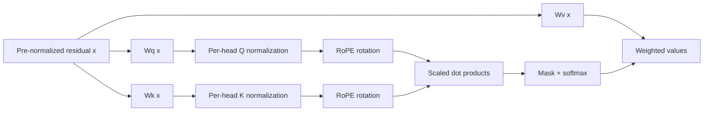

# Query-Key Normalization (QK-Norm)

**Improves:** attention that relies only on the conventional
`1 / sqrt(d_head)` scale to keep logits controlled.  
**Primary goal:** prevent Q/K magnitudes from driving attention logits to extreme
values and saturating softmax during large-scale training.

## The problem: learned magnitude can overwhelm similarity

Standard scaled dot-product attention computes:

$$
\begin{aligned}
\ell_{ij} &= \frac{q_i^{\top}k_j}{\sqrt{d_{\mathrm{head}}}}, \\
a_i &= \operatorname{softmax}\!\left(\ell_{i,:}\right)
\end{aligned}
$$

The square-root factor compensates for expected variance at initialization, but
it does not stop learned Q and K norms from growing. A very large logit gap makes
softmax nearly one-hot; gradients through saturated probabilities become poorly
conditioned, and extreme logits can precede training divergence.

QK-Norm inserts normalization after the Q/K projections and before the dot
product:

$$
\begin{aligned}
q_i &= \operatorname{Norm}\!\left(W_qx_i\right), \\
k_j &= \operatorname{Norm}\!\left(W_kx_j\right), \\
\ell_{ij} &= \frac{q_i^{\top}k_j}{\sqrt{d_{\mathrm{head}}}}
\end{aligned}
$$

The exact `Norm` is implementation-specific. The original QKNorm paper uses
L2-normalized Q/K and a learned scale instead of `sqrt(d_head)`; it motivates the
method as preventing arbitrary softmax saturation.
([Henry et al., 2020](https://arxiv.org/abs/2010.04245))
The work cited by Qwen3 applies LayerNorm to projected queries and keys to
stabilize a 22B Vision Transformer.
([Dehghani et al., 2023, §2](https://proceedings.mlr.press/v202/dehghani23a.html))
Therefore, “QK-Norm” names a placement and purpose, not one universal equation.

## Where it sits in the block

RMSNorm on `x` cannot guarantee bounded projected Q and K because `Wq` and `Wk`
can amplify particular directions. QK-Norm acts after those projections. RoPE is
an orthogonal rotation, so when normalization precedes RoPE, it does not change
the Q/K norms.

## Simple magnitude example

Two query/key pairs may have the same angle but very different norms:

$$
\begin{aligned}
q_1=\begin{bmatrix}1\\0\end{bmatrix},\quad
k_1=\begin{bmatrix}1\\0\end{bmatrix}
&\quad\Longrightarrow\quad q_1^{\top}k_1=1, \\
q_2=\begin{bmatrix}100\\0\end{bmatrix},\quad
k_2=\begin{bmatrix}100\\0\end{bmatrix}
&\quad\Longrightarrow\quad q_2^{\top}k_2=10{,}000
\end{aligned}
$$

Without QK-Norm, magnitude alone can produce a massive softmax logit. L2
normalization maps both pairs to dot product 1; LayerNorm/RMSNorm variants also
control scale, though their exact geometry differs. A learned scale can then
recover an appropriate attention temperature without allowing arbitrary vector
norm growth.

## Benefits and limits

- It directly controls one known source of attention-logit explosion.
- It can permit more aggressive large-scale training settings, but it is not a
  complete cure for optimizer instability or massive residual activations.
- Extra normalization adds parameters/operations and must be fused well for
  efficient inference.
- It can remove information encoded purely in Q/K magnitude; learned affine
  scales partially restore flexibility.
- QK-Norm is separate from output gating, logit capping, attention sinks, and
  residual-stream normalization. Those mechanisms target different pathologies.

## How Qwen uses it

**Verified:** Qwen3 removes the QKV bias used in Qwen2 and introduces QK-Norm
“to ensure stable training.” The report does not claim QK-Norm is responsible
for a standalone benchmark improvement, so that causal attribution should not
be made. ([Qwen3 Technical Report, §2](https://arxiv.org/abs/2505.09388))

The integrated Qwen3 implementation uses a separate per-head RMSNorm on the
projected Q and K tensors before applying RoPE; this is more specific than the
generic name used in the report.
([Transformers Qwen3 implementation](https://github.com/huggingface/transformers/blob/main/src/transformers/models/qwen3/modeling_qwen3.py))

**Verified:** Qwen3-Next reports that some normalization weights in the Qwen3
design grew abnormally large. It moves to zero-centered, weight-decayed RMSNorm
as part of a broader stability redesign. This is evidence that QK-Norm is useful
but not a final or cost-free solution.
([official Qwen3-Next architecture post](https://qwen.ai/blog?id=e34c4305036ce60d55a0791b170337c2b70ae51d))
