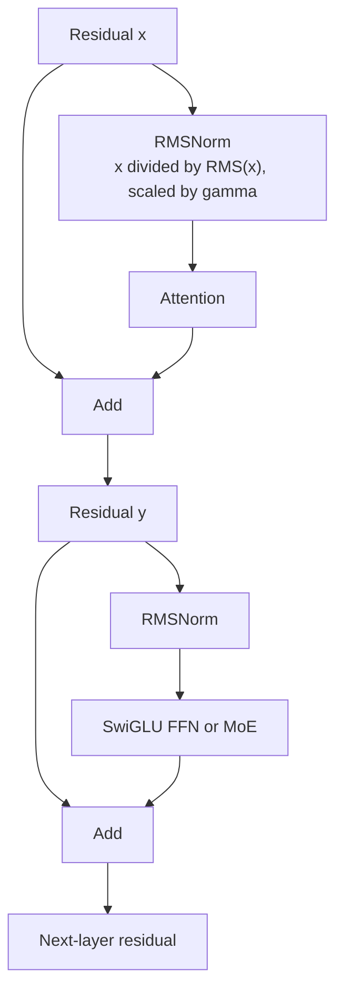

# RMSNorm and Pre-Normalized Residual Blocks

**Improves:** LayerNorm as the normalization inside a Transformer block.
**Primary goal:** retain scale control while removing LayerNorm's mean-centering
operation; in Qwen it is used before each sublayer (`pre-norm`).

Simple explaination: Replace 2 heavy computation: **means, variace** with 1 computation: **RMS** to increase speed without reduce perfomance.

## LayerNorm versus RMSNorm

For a hidden vector `x` of width `d`, LayerNorm computes:

$$
\begin{aligned}
\mu(x) &= \frac{1}{d}\sum_{i=1}^{d}x_i, \\
\sigma^2(x) &= \frac{1}{d}\sum_{i=1}^{d}\left(x_i-\mu(x)\right)^2, \\
\operatorname{LayerNorm}(x)
&= \gamma\odot
\frac{x-\mu(x)}{\sqrt{\sigma^2(x)+\varepsilon}}
+\beta
\end{aligned}
$$

It is invariant to both re-centering and positive re-scaling of the input.
RMSNorm removes the mean subtraction:

$$
\begin{aligned}
\operatorname{RMS}(x)
&= \sqrt{\frac{1}{d}\sum_{i=1}^{d}x_i^2+\varepsilon}, \\
\operatorname{RMSNorm}(x)
&= \gamma\odot\frac{x}{\operatorname{RMS}(x)}
\end{aligned}
$$

The common LLM form keeps a learned per-channel scale `gamma` and usually has no learned bias `beta`. It is invariant to re-scaling but not to adding a constant
shift. The RMSNorm paper's central hypothesis is that LayerNorm's re-centering
invariance is dispensable; it reports comparable task performance and **lower
runtime** in its tested RNN and Transformer settings.
([Zhang and Sennrich, 2019](https://arxiv.org/abs/1910.07467))

The paper's **7–64% runtime** reductions are measurements on its particular models
and hardware, not a universal modern-LLM speedup. In current fused GPU kernels,
the real gain depends on memory traffic, fusion, dtype, hidden width, and the
fraction of total time spent in normalization.

## Why pre-norm matters separately

Normalization type and normalization placement are different choices.

Original post-norm block:

$$
\begin{aligned}
y &= \operatorname{LayerNorm}\!\left(x+\operatorname{Attention}(x)\right), \\
z &= \operatorname{LayerNorm}\!\left(y+\operatorname{FFN}(y)\right)
\end{aligned}
$$

Qwen-style pre-norm block:

$$
\begin{aligned}
y &= x+\operatorname{Attention}\!\left(\operatorname{RMSNorm}(x)\right), \\
z &= y+\operatorname{FFN/MoE}\!\left(\operatorname{RMSNorm}(y)\right)
\end{aligned}
$$

The pre-norm residual path contains an identity route from `x` to later layers.
This helps gradient flow through a deep stack because the residual stream is not
forced through a normalization operation at every skip connection. RMSNorm then
controls the magnitude of each sublayer's input without rewriting the residual
stream itself.

## Dataflow example

For a simplified token state `x = [3, 4]` with `gamma = [1, 1]` and no epsilon:

$$
\begin{aligned}
\operatorname{RMS}(x)
&= \sqrt{\frac{3^2+4^2}{2}}
 = \sqrt{12.5}, \\
\operatorname{RMSNorm}(x)
&\approx \begin{bmatrix}0.849 & 1.131\end{bmatrix}
\end{aligned}
$$

RMSNorm preserves the direction of `x` and rescales its RMS magnitude. LayerNorm
would first subtract `3.5`, yielding a direction based only on deviations from
the mean. This makes clear what computation was removed; it does not by itself
prove that one representation is universally better.

## Limits and failure modes

- RMSNorm does not constrain the mean of activations. Other parts of the network
  must tolerate or learn around mean shifts.
- The learned `gamma` can itself grow; normalization is not a complete guarantee
  against unstable attention logits or massive activations.
- Pre-norm makes optimization easier at depth, but can change representation
  scaling and final-layer behavior; a final normalization is normally still
  applied before the LM head.
- RMSNorm and QK-Norm act at different locations: RMSNorm normalizes the block input; QK-Norm normalizes projected query/key heads immediately before their dot products.

## How Qwen uses it

**Verified:** Qwen2 uses RMSNorm with pre-normalization for training stability.
([Qwen2 Technical Report, §2.2.1](https://arxiv.org/abs/2407.10671))

**Verified:** Qwen3 retains RMSNorm/pre-norm and separately adds QK-Norm.
([Qwen3 Technical Report, §2](https://arxiv.org/abs/2505.09388))

**Verified:** Qwen3-Next reports a further variant, zero-centered and
weight-decayed RMSNorm, because the team observed abnormally large norm weights
with its prior QK-Norm design. This is a later stability modification, not the
definition of ordinary RMSNorm.
([official Qwen3-Next architecture post](https://qwen.ai/blog?id=e34c4305036ce60d55a0791b170337c2b70ae51d))
