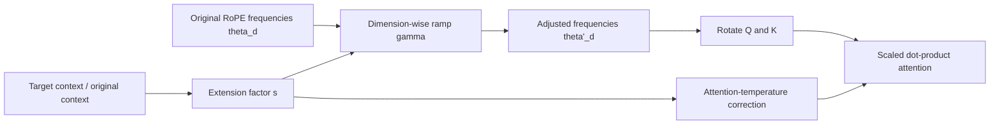

# YaRN: RoPE-Based Context Extension

**Improves:** ordinary RoPE used beyond the sequence lengths seen in training.
**Primary goal:** extend the usable position range while preserving local
high-frequency information and correcting the attention distribution shift.

**Simple Explanation:** **Rescales RoPE positions** so **extremely long contexts** produce rotation angles similar to those seen during training, enabling much longer context windows while preserving local positional information.

## Why plain RoPE extension fails

A RoPE model trained to length `L_train` has learned only the rotation phases
and relative distances inside that range. Increasing a configuration value does
not retrain those position-dependent circuits. At longer positions, high-
frequency dimensions can rotate through unfamiliar phases, while simple uniform
position interpolation can blur local positional differences.

YaRN—“Yet another RoPE extensioN method”—changes the RoPE frequency schedule and
attention scaling rather than replacing the Transformer block. It was designed
to extend pretrained models using substantially less continued-training data
than the context-extension methods compared in the paper.
([Peng et al., 2023](https://arxiv.org/abs/2309.00071))

## Architecture and formula

YaRN combines three ideas:

1. preserve high-frequency dimensions that represent local relations;
2. interpolate lower-frequency dimensions needed for longer range, with a
   smooth ramp between the two regimes;
3. apply a length-dependent attention-temperature correction.

For original RoPE angular frequency `theta_d`, extension factor `s`, and a
dimension-dependent ramp `gamma(r_d)` between 0 and 1:

$$
\theta'_d
= \left(1-\gamma(r_d)\right)\frac{\theta_d}{s}
  + \gamma(r_d)\theta_d
$$

- `gamma(r_d) = 0` fully interpolates that dimension for longer range.
- `gamma(r_d) = 1` preserves its original frequency and local resolution.
- Intermediate values blend smoothly instead of creating a hard boundary
  between scaled and unscaled dimensions.

YaRN also scales the attention temperature as a function of `s`. This corrects
the change in attention entropy caused by the new position spectrum; it does not
add a learned neural layer.

## Dataflow example

The learned Q/K/V and FFN weights do not change at inference merely because
YaRN is enabled. The runtime changes the angles used by RoPE and the associated
attention scaling. Continued long-context training can still be used so the
model learns to exploit the extended range.

## What it improves and its limits

The YaRN paper reports reaching extended contexts with 10× fewer tokens and
2.5× fewer training steps than its compared prior extension approaches. Those
are results for the paper's models and setup, not a universal cost ratio.
([YaRN experiments](https://arxiv.org/abs/2309.00071))

Important limits:

- the best scaling factor depends on original length, target length, model, and
  RoPE configuration;
- aggressive scaling can reduce short-context positional resolution;
- accepting more tokens does not guarantee accurate retrieval or reasoning
  across the entire window;
- YaRN changes position geometry but does not remove the quadratic computation
  of full attention;
- native training length and YaRN-extended inference length must be reported
  separately.

## How Qwen uses YaRN

**Verified:** Qwen2 raises the RoPE base frequency from 10,000 to 1,000,000 in
its long-context training stage and combines YaRN with DCA for inference up to
131,072 tokens.
([Qwen2 Technical Report, §3.2](https://arxiv.org/abs/2407.10671))

**Verified:** Qwen3 follows the same broad long-context recipe: base frequency
1,000,000 plus YaRN and DCA for a four-fold inference extension.
([Qwen3 Technical Report, §3.2](https://arxiv.org/abs/2505.09388))

YaRN and DCA are complementary, not synonyms. YaRN changes the RoPE frequency
spectrum and attention scaling; [DCA](DCA.md) changes the position indices used
for different query-key regions.
