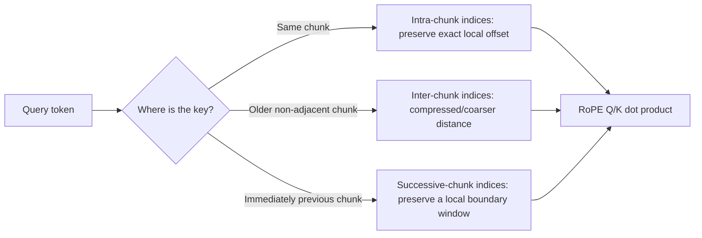

# Long Context: Dual Chunk Attention and YaRN

**Improves:** ordinary RoPE attention used far beyond its trained context length.  
**Primary goal:** keep relative positions in a familiar range and rescale RoPE
frequencies/attention temperature so a pretrained model can operate on longer
sequences.

## Why plain context extension fails

A RoPE model trained to length `L_train` has only learned attention behavior for
position phases and relative distances inside that range. Merely increasing a
configuration value exposes it to unfamiliar rotations and distances. YaRN and
DCA address related but different parts of this problem:

- **YaRN** modifies the RoPE frequency schedule and attention scaling, extending
  the position representation with relatively little continued training.
- **DCA** assigns different RoPE position indices to within-chunk, cross-chunk,
  and adjacent-chunk attention so the effective relative distances stay within
  the pretrained range; the original DCA method is training-free.

Qwen2 combines both methods rather than treating either as a complete solution.
([Qwen2 Technical Report, §§2.2 and 3.2](https://arxiv.org/abs/2407.10671))

## YaRN: change the frequency spectrum, not the block topology

Simple position interpolation compresses all long positions by a scale factor
`s = L_target / L_train`, but uniformly scaling every RoPE frequency harms local
high-frequency resolution. NTK-aware methods instead alter the RoPE base so
frequencies scale non-uniformly, but can still disturb some dimensions.

YaRN combines three ideas:

1. preserve high-frequency dimensions that represent local relations;
2. interpolate lower-frequency dimensions needed for long range, with a smooth
   ramp between regimes;
3. apply a length-dependent attention-temperature correction.

For original RoPE angular frequency `theta_d`, extension factor `s`, and a
dimension-dependent ramp `gamma(r_d)` between 0 and 1, the YaRN paper writes the
interpolated frequency in the form:

$$
\theta'_d
= \left(1-\gamma(r_d)\right)\frac{\theta_d}{s}
  + \gamma(r_d)\theta_d
$$

Thus `gamma = 0` fully interpolates a dimension for longer range, while
`gamma = 1` preserves its original local frequency. YaRN also scales the
attention temperature as a function of `s`; this corrects the distribution shift
in attention entropy rather than adding another neural layer.

It changes the angles supplied to RoPE, not the learned Q/K/V/FFN weights. The
paper reports reaching long contexts with 10× fewer tokens and 2.5× fewer
training steps than the compared prior context-extension approaches, and notes
no additional inference architecture.
([Peng et al., 2023](https://arxiv.org/abs/2309.00071))

## DCA: three views of token distance

DCA divides a long sequence into chunks of size `s < L_train`. It then selects
position indices according to the relationship between query and key:



- **Intra-chunk attention** reuses positions `0..s-1` inside each chunk. Local
  relations remain in the training range, but this alone discards long-range
  distinction.
- **Inter-chunk attention** exposes prior chunks while using capped/reassigned
  query positions, sacrificing precise far-away distances to retain access.
- **Successive-chunk attention** gives tokens near an adjacent boundary locally
  accurate distances, preventing a hard discontinuity at chunk edges.

Using `c = L_train`, chunk size `s`, token indices `i` (query) and `j` (key), the
position remapping can be summarized as:

$$
\begin{aligned}
P_k(j) &= j \bmod s,
&&\text{key position}, \\
P_q^{\mathrm{intra}}(i) &= i \bmod s,
&&\text{same-chunk query}, \\
P_q^{\mathrm{inter}}(i) &= c-1,
&&\text{older-chunk query}, \\
w &= c-s,
&&\text{successive-chunk local-window width}, \\
P_q^{\mathrm{succ}}(i) &\le c-1,
&&\text{preserve the local window, then cap}
\end{aligned}
$$

The attention mask chooses the appropriate score region for each query-key pair.
All effective RoPE indices remain inside the pretrained range `0..c-1`, but
older non-adjacent positions are deliberately coarsened.

The DCA paper emphasizes that these are distinct Q/K position-index sets, not a
sparse rule that simply prevents cross-chunk attention. It can integrate with
FlashAttention. ([An et al., 2024, §3](https://arxiv.org/abs/2402.17463))

## Example with a 4-token training range

Imagine a model trained only on relative distances up to 3 and an 8-token input
split into `[A B C D] [E F G H]`:

```text
within second chunk: E,F,G,H reuse local positions 0,1,2,3
F attending to E: exact local displacement 1
F attending to B: cross-chunk relation uses a capped/reindexed distance
E attending to D: successive-chunk rule preserves this near-boundary locality
```

The model can access old content without feeding RoPE an unseen raw displacement
of 4–7 for every pair. The price is that some far positions become less
distinguishable.

## Limits

- Extending the accepted token count does not guarantee faithful retrieval,
  reasoning, or calibration across the entire window.
- DCA intentionally loses some precise far-distance information.
- YaRN's best factor depends on original context, target context, and position
  scheme; excessive scaling can reduce short-context quality.
- Full attention over a longer prefill is still expensive unless kernels or
  sparse/hybrid sequence modules address compute and memory separately.
- Reported length capability must distinguish native training length from an
  inference-time extension.

## How Qwen uses them

**Verified:** Qwen2 increases RoPE base frequency from 10,000 to 1,000,000,
trains its final stage at 32,768 tokens, and uses YaRN plus DCA to process up to
131,072 tokens. ([Qwen2 Technical Report, §3.2](https://arxiv.org/abs/2407.10671))

**Verified:** Qwen3 follows the same broad recipe in its long-context stage:
base frequency 1,000,000, YaRN, and DCA for a four-fold inference extension.
([Qwen3 Technical Report, §3.2](https://arxiv.org/abs/2505.09388))

Later Qwen3-Next changes the underlying sequence architecture itself by mixing
Gated DeltaNet with periodic full attention. That is a deeper solution to
long-context cost than RoPE scaling alone and is covered separately in
[Gated_DeltaNet.md](Gated_DeltaNet.md).
