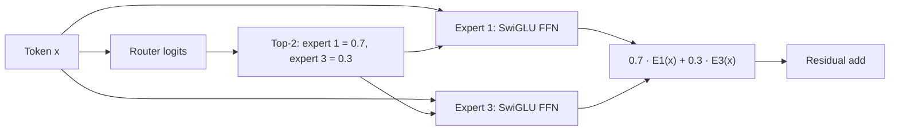

# Sparse Mixture-of-Experts (MoE)

**Improves:** a dense Transformer FFN that applies the same parameters to every
token.
**Primary goal:** increase total parameter capacity while activating only a
small subset of FFN parameters for each token.

## Dense FFN versus sparse expert routing

In a dense block, every token uses one FFN:

$$
y = \operatorname{FFN}(x)
$$

An MoE layer replaces that FFN with `N` experts plus a learned router. For token
state `x`:

$$
\begin{aligned}
r &= W_{\mathrm{router}}x, \\
\mathcal{I}(x) &= \operatorname{TopK}(r,k), \\
p_i &= \frac{e^{r_i}}{\sum_{j\in\mathcal{I}(x)}e^{r_j}},
\qquad i\in\mathcal{I}(x), \\
\operatorname{MoE}(x)
&= \sum_{i\in\mathcal{I}(x)}p_iE_i(x)
\end{aligned}
$$

Each `Expert_i` is normally an FFN, often SwiGLU in Qwen. Attention is not routed
in this conventional design; every token still traverses the attention/token
mixer, then uses selected experts in place of one dense FFN. Qwen2 gives this
same gated top-k formulation explicitly.
([Qwen2 Technical Report, §2.2.2](https://arxiv.org/abs/2407.10671))

## Token-level dataflow

Assume four experts and top-2 routing:

Another token in the same batch may choose experts 0 and 2. This conditional
execution lets the model store more parameterized functions than it evaluates
for one token.

## Why total parameters and active parameters differ

Let each expert contain `P_e` parameters and let the shared non-expert backbone
contain `P_shared`:

$$
\begin{aligned}
P_{\mathrm{total}} &\approx P_{\mathrm{shared}}+NP_e, \\
P_{\mathrm{active/token}} &\approx P_{\mathrm{shared}}+kP_e
\end{aligned}
$$

This explains names such as `235B-A22B`: roughly 235B total parameters exist,
but approximately 22B participate in one token's forward path. FLOPs per token
can resemble a much smaller dense model even though the checkpoint carries much
larger capacity.

That does **not** mean deployment costs only the active parameter count:

- all expert weights must be stored somewhere or fetched across devices;
- distributed expert parallelism performs all-to-all token dispatch and return;
- uneven routing creates stragglers and wasted capacity;
- small per-expert batches can reduce matrix-multiplication efficiency;
- router and expert weights add memory even when an expert is idle for a token.

## Specialization, shared experts, and load balance

Routing creates the possibility of specialization, but expert labels such as
“math expert” or “French expert” should not be assumed without interpretability
evidence. The training objective only selects experts useful for lowering loss.

Two design choices recur in Qwen:

1. **Fine-grained experts.** Split a large FFN capacity into more, smaller
   experts and activate several. At equal total and active parameters, this
   gives the router more expert combinations.
2. **Shared expert.** Always execute one or more experts for common knowledge,
   while routed experts specialize. This improves shared coverage but adds
   always-active compute.

Routers can collapse onto a few popular experts. Auxiliary load-balancing losses,
router regularization, capacity limits, token dropping, or global routing
statistics are used to distribute work. The Switch Transformer paper documents
both the scaling advantage and the communication/training-instability problems
of sparse MoE.
([Fedus et al., 2021](https://arxiv.org/abs/2101.03961))

## Qwen evolution

| Family                    | Expert design                           | Architectural meaning                                                            |
| ------------------------- | --------------------------------------- | -------------------------------------------------------------------------------- |
| Qwen2-57B-A14B            | 64 routed, top-8, plus 8 shared experts | Fine-grained routed FFNs plus always-active common FFNs                          |
| Qwen3-30B-A3B / 235B-A22B | 128 routed, top-8, no shared expert     | More expert choices; global-batch balancing encourages specialization            |
| Qwen3-Next-80B-A3B        | 512 total, top-10 routed plus 1 shared  | Much lower active/total ratio; every hybrid token-mixer layer is followed by MoE |

The Qwen2 configuration is documented in its Table 1 and routing discussion.
([Qwen2 Technical Report](https://arxiv.org/abs/2407.10671)) Qwen3 documents
128/8 routing, no shared experts, and global-batch load balancing.
([Qwen3 Technical Report, §2](https://arxiv.org/abs/2505.09388)) Qwen3-Next's
official card gives the 512/10+1 configuration.
([Qwen3-Next model card](https://huggingface.co/Qwen/Qwen3-Next-80B-A3B-Instruct))

The right conclusion is not “MoE uses fewer parameters.” It uses **more stored
parameters but fewer of them per token**, exchanging dense compute for routing,
communication, and systems complexity.
