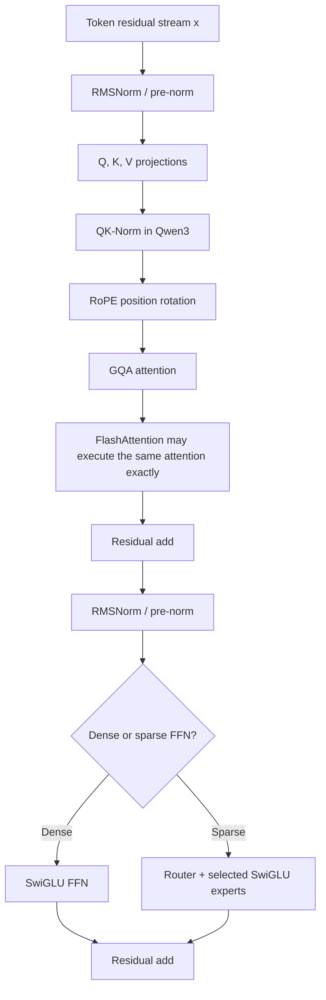

# Modern LLM Modules and Their Place in Qwen

**Research date:** 2026-07-20  
**Scope:** decoder-side modules that materially change a modern LLM's attention,
FFN, normalization, long-context behavior, training objective, or inference cost.

## The architectural picture

A modern Qwen block is not a completely new replacement for the Transformer. It is
mostly a sequence of targeted substitutions around the original residual block:

Later Qwen models introduce a bigger change to the token-mixing path. Qwen3-Next
repeats three Gated DeltaNet layers followed by one full gated-attention layer,
while every layer still has an MoE sublayer. It also adds multi-token prediction
for training and speculative decoding. The official model card specifies the
layout as `12 × (3 × (Gated DeltaNet → MoE) → 1 × (Gated Attention → MoE))`.
([Qwen3-Next model card](https://huggingface.co/Qwen/Qwen3-Next-80B-A3B-Instruct))

## What improves what

| New module | Main predecessor | Main improvement | What it does **not** solve |
|---|---|---|---|
| [RoPE](RoPE.md) | Additive absolute position embedding | Makes attention scores depend naturally on relative displacement | Long-context extrapolation beyond training is not guaranteed |
| [GQA](GQA.md) | Multi-head attention (MHA) | Shrinks the KV cache and decoder memory bandwidth | It does not remove quadratic prefill attention |
| [FlashAttention](FlashAttention.md) | Materialized attention implementation | Computes exact attention with much less HBM traffic and temporary memory | It does not change attention's mathematical output or quadratic FLOPs |
| [SwiGLU](SwiGLU.md) | ReLU/GELU two-matrix FFN | Adds an input-dependent multiplicative gate | It adds a third projection and is not automatically cheaper |
| [RMSNorm](RMSNorm.md) | LayerNorm | Removes mean-centering and simplifies normalization | It preserves scale invariance, not shift invariance |
| [QK-Norm](QK_Norm.md) | Only scaling logits by `sqrt(d_head)` | Controls Q/K magnitude and attention-logit growth | It does not replace residual-stream normalization |
| [Sparse MoE](MoE.md) | One dense FFN for every token | Increases parameter capacity without activating all parameters per token | Communication, routing balance, and total weight memory remain expensive |
| [DCA + YaRN](Long_Context_DCA_YaRN.md) | Plain RoPE outside its trained length | Re-indexes chunks and rescales RoPE frequencies for longer context | Long context is not equivalent to perfect retrieval or reasoning |
| [Gated DeltaNet](Gated_DeltaNet.md) | Full softmax attention or simpler linear recurrence | Uses a fixed-size recurrent memory with targeted update and global forgetting | Fixed-size state can still collide and lose exact detail |
| [Multi-token prediction](Multi_Token_Prediction.md) | Next-token-only training | Supervises several future positions and provides draft tokens for speculation | Speedup requires verification and an inference engine that supports it |

## Qwen lineage, without overclaiming

- **Verified:** Qwen2 documents GQA, SwiGLU, RoPE, RMSNorm/pre-norm, DCA and
  YaRN; its MoE substitutes a routed expert bank for the dense FFN.
  ([Qwen2 Technical Report, §2.2](https://arxiv.org/abs/2407.10671))
- **Verified:** Qwen3 retains GQA, SwiGLU, RoPE and RMSNorm/pre-norm, adds
  QK-Norm, and changes its MoE to 128 fine-grained experts with eight selected
  per token and no shared expert.
  ([Qwen3 Technical Report, §2](https://arxiv.org/abs/2505.09388))
- **Verified:** Qwen3-Next replaces an all-full-attention stack with a 3:1 hybrid
  of Gated DeltaNet and gated full attention, uses a much sparser MoE, and adds
  MTP. ([official Qwen3-Next architecture post](https://qwen.ai/blog?id=e34c4305036ce60d55a0791b170337c2b70ae51d))
- **Important distinction:** FlashAttention is a kernel/algorithm choice, not a
  learned checkpoint architecture. A Qwen checkpoint can run with or without it
  if the serving stack supports both exact implementations. Qwen's official
  Qwen3-VL instructions expose it as the optional
  `attn_implementation="flash_attention_2"` setting.
  ([Qwen3-VL README](https://github.com/QwenLM/Qwen3-VL/blob/main/README.md#flash-attention-2-to-speed-up-generation))

The files in this directory focus on module mechanics. Pretraining data,
post-training, reasoning mode, tool use, and multimodal fusion can dominate
observable behavior, but they are separate from the block-level substitutions
analyzed here.

