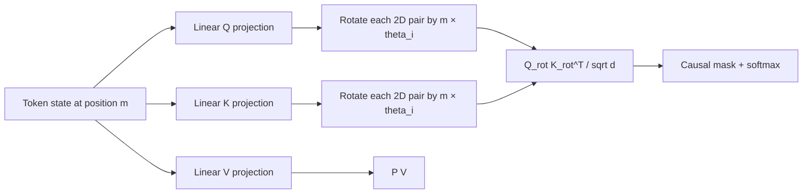

# Rotary Position Embedding (RoPE)

**Improves:** additive absolute position embeddings used by the original
Transformer.  
**Primary goal:** make attention scores depend naturally on relative position
while encoding position through a cheap, deterministic transformation of Q and
K.

## What changed from absolute position embeddings

The original Transformer adds a position vector `p_m` to the content embedding
at position `m`:

$$
\begin{aligned}
h_m &= e_m + p_m, \\
q_m &= W_qh_m, \\
k_m &= W_kh_m
\end{aligned}
$$

Position and content are mixed before all projections. Learned absolute tables
also have a fixed trained range; sinusoidal tables can be evaluated farther out,
but the attention score does not obtain a relative-position form by construction.

RoPE instead projects content first, then rotates pairs of Q and K dimensions by
an angle determined by token position. For frequency `theta_i` and the
two-dimensional pair `(2i, 2i+1)`:

$$
\begin{bmatrix}
q'_{2i} \\
q'_{2i+1}
\end{bmatrix}
=
\begin{bmatrix}
\cos(m\theta_i) & -\sin(m\theta_i) \\
\sin(m\theta_i) & \cos(m\theta_i)
\end{bmatrix}
\begin{bmatrix}
q_{2i} \\
q_{2i+1}
\end{bmatrix}
$$

The same operation is applied to K. Values V are normally not rotated. In
compact notation:

$$
\begin{aligned}
q'_m &= R_mq_m, \\
k'_n &= R_nk_n, \\
{q'_m}^{\top}k'_n
&= q_m^{\top}R_m^{\top}R_nk_n
 = q_m^{\top}R_{n-m}k_n
\end{aligned}
$$

Because rotations compose by angle difference, the dot product contains the
relative displacement `n - m`, even though each vector was transformed using
its absolute position. This is the core RoPE result.
([RoFormer, §3](https://arxiv.org/abs/2104.09864))

## Dataflow example

Consider the phrase `the robot grasped it`, with `robot` at position 1 and `it`
at position 3. The compatibility score between the query for `it` and the key
for `robot` includes rotations corresponding to displacement `1 - 3 = -2`.
If the same local relation occurs later in a document, the absolute positions
change but the relative displacement term can remain the same.

## What RoPE improves—and what it does not

RoPE is attractive because it adds no learned position table, preserves vector
norm under rotation, is cheap to fuse into attention kernels, and exposes
relative displacement directly in Q/K dot products. The RoFormer paper also
derives a long-range decay property for its frequency schedule.
([RoFormer analysis](https://arxiv.org/abs/2104.09864))

However, “can calculate rotations at any position” is not the same as “the model
generalizes to any length.” At positions much longer than training:

- high-frequency dimensions may rotate through unfamiliar phases;
- different positions can become hard to distinguish because of phase aliasing;
- attention logits and learned circuits were optimized only on shorter relative
  distances;
- changing the RoPE base or scaling frequencies trades short-range resolution
  against long-range coverage.

This is why later systems combine RoPE with techniques such as a larger base
frequency, YaRN, position interpolation, or DCA. The YaRN paper explicitly starts
from the observation that ordinary RoPE models fail to generalize reliably past
their trained length. ([Peng et al., 2023](https://arxiv.org/abs/2309.00071))

## How Qwen uses it

**Verified:** Qwen2 keeps RoPE from Qwen, increases the base frequency from
10,000 to 1,000,000 during long-context training, and combines it with YaRN and
DCA for inference up to 131,072 tokens.
([Qwen2 Technical Report, §§2.2 and 3.2](https://arxiv.org/abs/2407.10671))

**Verified:** Qwen3 retains RoPE and the long-context recipe: its final
pretraining stage again uses base frequency 1,000,000 with YaRN and DCA.
([Qwen3 Technical Report, §§2 and 3.2](https://arxiv.org/abs/2505.09388))

**Verified:** Qwen3-Next applies RoPE only to the first 25% of the head
dimensions in its gated full-attention layers. This “partial RoPE” leaves other
dimensions position-independent, an explicit long-context extrapolation design
choice rather than ordinary full-dimensional RoPE.
([official Qwen3-Next architecture post](https://qwen.ai/blog?id=e34c4305036ce60d55a0791b170337c2b70ae51d))

For Qwen-VL variants, multidimensional or multimodal RoPE extends the same idea
to temporal/height/width axes. That is a modality-fusion extension and is not
identical to the one-dimensional text RoPE analyzed here.
