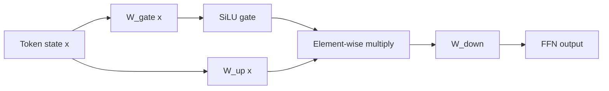

# SwiGLU Feed-Forward Networks

**Improves:** the original two-matrix ReLU FFN and its GELU successor.  
**Primary goal:** use a learned, input-dependent multiplicative gate to control
which expanded features pass through the token-wise FFN.

## From ReLU/GELU FFN to a gated FFN

The original Transformer applies the same position-wise MLP independently to
every token:

$$
\operatorname{FFN}_{\mathrm{ReLU}}(x)
= W_{\mathrm{down}}\operatorname{ReLU}
  \!\left(W_{\mathrm{up}}x+b_{\mathrm{up}}\right)
  + b_{\mathrm{down}}
$$

Many later models replace ReLU with GELU, which is smooth, but the topology is
still one expansion projection, one activation, and one contraction projection.

SwiGLU creates two separate expanded representations. One becomes a gate through
SiLU/Swish; the other carries candidate content:

$$
\begin{aligned}
g &= \operatorname{SiLU}\!\left(W_{\mathrm{gate}}x\right), \\
u &= W_{\mathrm{up}}x, \\
h &= g \odot u, \\
\operatorname{SwiGLU}(x) &= W_{\mathrm{down}}h, \\
\operatorname{SiLU}(a) &= a\,\sigma(a)
\end{aligned}
$$

Biases are omitted above because many LLM implementations omit them. They are not
essential to the SwiGLU definition. The key change is the element-wise product
between two learned projections. The GLU-variants paper found SwiGLU and related
gated variants better than the ReLU/GELU baselines in its Transformer
experiments. ([Shazeer, 2020](https://arxiv.org/abs/2002.05202))

## Architectural interpretation

The ordinary FFN answers: “which nonlinear expanded features are positive or
large?” SwiGLU can additionally answer: “given this token state, how strongly
should a separately learned feature channel pass?”

Suppose one expanded channel produces `content = 2.0`:

$$
\begin{aligned}
a=-3&:\quad \operatorname{SiLU}(-3)\approx-0.142
      \;\Longrightarrow\; h\approx-0.284, \\
a= 3&:\quad \operatorname{SiLU}(3)\approx 2.858
      \;\Longrightarrow\; h\approx 5.716
\end{aligned}
$$

The same candidate content is suppressed or amplified based on another learned
view of the input. A gate is continuous rather than a hard on/off decision; it
can also be negative.

## Parameter and compute accounting

An ordinary FFN with expansion width `d_ff` has roughly:

$$
P_{\mathrm{FFN}} \approx 2d_{\mathrm{model}}d_{\mathrm{ff}}
$$

SwiGLU has three matrices:

$$
P_{\mathrm{SwiGLU}}
\approx 3d_{\mathrm{model}}d_{\mathrm{ff,SwiGLU}}
$$

Therefore, model builders often reduce the SwiGLU intermediate width to around
two thirds of the baseline FFN width when matching parameter or FLOP budgets.
For example, compared with a conventional `4 × d_model` FFN, an approximately
budget-matched SwiGLU width is near `8/3 × d_model`, usually rounded for hardware
alignment. This is a budget derivation, not a fixed rule in the SwiGLU paper.

Trade-offs:

- the gate improves expressivity empirically, but requires an extra input
  projection;
- performance depends on chosen intermediate width, initialization, data, and
  the rest of the architecture;
- SwiGLU changes the per-expert computation but does not make an FFN sparse;
  MoE is the separate routing mechanism that chooses which FFNs execute;
- fused kernels can reduce memory traffic, but “SwiGLU” alone does not promise
  lower wall-clock time than a smaller GELU FFN.

## How Qwen uses it

**Verified:** Qwen2 explicitly follows Qwen in using SwiGLU as its FFN
activation. Its dense models use a SwiGLU FFN, while its MoE model uses a bank of
smaller routed FFNs.
([Qwen2 Technical Report, §2.2](https://arxiv.org/abs/2407.10671))

**Verified:** Qwen3 retains SwiGLU in both dense and MoE variants.
([Qwen3 Technical Report, §2](https://arxiv.org/abs/2505.09388))

In an MoE layer, the dataflow becomes:

$$
x
\;\xrightarrow{\text{router}}\;
\mathcal{I}_{\mathrm{top}\text{-}k}
\;\xrightarrow{\text{selected SwiGLU experts}}\;
\sum_{i\in\mathcal{I}_{\mathrm{top}\text{-}k}}p_iE_i(x)
\;\xrightarrow{\text{residual add}}\; y
$$

Thus “SwiGLU versus MoE” is the wrong comparison: SwiGLU specifies an expert's
internal FFN shape; MoE specifies how tokens are routed among multiple experts.
