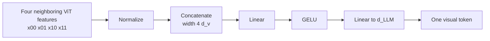

# Patch Merger in Qwen VLMs

> **Question:** How does Qwen turn a long grid of ViT features into fewer tokens that fit the language model?
>
> **Scope:** the Qwen 2 x 2 spatial merger from Qwen2-VL through Qwen3.5,
> including its role as both token compressor and vision-language projector.
> Research date: 2026-07-21.

## Short answer

Qwen's patch merger takes each spatially adjacent `2 x 2` group of **already
contextualized ViT features**, concatenates the four vectors, and applies an MLP
that produces one vector at the language model's hidden width. It therefore does
two jobs at once:

1. reduces the visual-token count by a factor of four; and
2. projects from vision width to language-model width.

It is not average pooling, a learned-query resampler, or a separate “merger then
projector” pair. Those are useful generic VLM alternatives, but they are not the
Qwen module described here. [Qwen2.5-VL, §2.1][qwen25]



## Tensor operation

For a feature grid

$$
X\in\mathbb{R}^{T\times H\times W\times d_v}
$$

and spatial merge size `s=2`, rearrange each local group into

$$
g_{t,i,j}=\operatorname{concat}(
x_{t,2i,2j},
x_{t,2i,2j+1},
x_{t,2i+1,2j},
x_{t,2i+1,2j+1})
\in\mathbb{R}^{4d_v}.
$$

The two-layer MLP computes

$$
y_{t,i,j}=W_2\,\operatorname{GELU}(W_1g_{t,i,j}+b_1)+b_2,
\qquad y_{t,i,j}\in\mathbb{R}^{d_{\text{LLM}}}.
$$

Hence

$$
N_{\text{out}}=\frac{T H W}{s^2}=\frac{T H W}{4}.
$$

`T`, `H`, and `W` here are the grid dimensions **after** patch/tubelet
embedding. Qwen's preprocessing makes `H` and `W` divisible by the merge size.
The merger does not reduce time; temporal compression happens earlier through
the two-frame tubelet embedding.

## Example dataflow: one 2 x 2 group

Continue the `224 x 224` **Qwen2.5-VL-7B** example. The ViT emits a
`16 x 16 x 1280` feature grid. Follow the group at merged row 1, column 1—the
same group used in the positional-encoding example:

```text
Pre-merge coordinates                Feature shape

x[2,2]  x[2,3]                      each vector: 1280
x[3,2]  x[3,3]
        |
        | RMSNorm each feature
        v
n[2,2]  n[2,3]                      4 x 1280
n[3,2]  n[3,3]
        |
        | concatenate in the model's arranged raster order
        v
g[1,1]                               4*1280 = 5120
        |
        | Linear 5120 -> 5120
        | GELU
        | Linear 5120 -> 3584
        v
y[1,1]                               one LLM-width visual token
```

Repeating the operation over the whole grid gives

```text
ViT output:       1 x 16 x 16 x 1280 = 256 feature vectors
grouping:         1 x  8 x  8 groups =  64 groups
merger output:                         64 x 3584
```

This example exposes the two transformations that the name “patch merger” can
hide: sequence length changes from 256 to 64, while feature width changes from
1,280 to 3,584. The output cell `(1,1)` receives the
[decoder MRoPE coordinate](pos_encode.md) `(t=0,h=1,w=1)` before attention in
the language model. [Qwen2.5-VL, Table 1 and §2.1][qwen25]
[Pinned Qwen2.5-VL implementation][qwen25-code]

## Why merge after the ViT

If four raw patches were compressed before visual attention, fine detail could
be discarded before it interacted with surrounding context. Qwen instead runs
the [ViT](ViT.md) first. A token entering the merger still occupies one grid
location, but its vector has already mixed information through local/global
visual attention.

The trade-off is deliberate:

- the ViT pays for the full pre-merge grid, preserving fine-grained visual
  processing;
- the much larger language model receives only one quarter as many visual
  tokens;
- each output token keeps a fixed raster location corresponding to one 2 x 2
  group, which works naturally with decoder-side
  [height/width positions](pos_encode.md).

For full attention over only the visual subsequence, reducing its length by four
reduces the visual-to-visual attention matrix area by up to sixteen. This is a
theoretical component-level ratio, not a 16x end-to-end speedup: text tokens,
ViT compute, projections, kernels, and the rest of the decoder still contribute.

## Concrete token-count examples

### Qwen2/2.5 with 14-pixel patches

A processed `224 x 224` image gives a `16 x 16` patch grid:

```text
224 / 14 = 16
16 x 16 = 256 ViT features
2 x 2 merge -> 8 x 8 = 64 visual tokens
```

Qwen2-VL reports 66 tokens entering the LLM because it counts the 64 merged
tokens plus `<|vision_start|>` and `<|vision_end|>`. The boundary markers are not
outputs of the merger. [Qwen2-VL, §2.1][qwen2]

Each merged token has a nominal `28 x 28`-pixel geometric footprint before
considering resize and ViT context. It should not be called a raw `28 x 28`
patch: its four inputs are contextual feature vectors.

### Qwen3-VL/Qwen3.5 with 16-pixel patches

The pinned Qwen3-VL-8B and Qwen3.5-27B configs use `patch_size=16` and
`spatial_merge_size=2`. One decoder visual token therefore corresponds to a
nominal `32 x 32` region in the processed image, again with a much larger learned
receptive field after the ViT. [Pinned Qwen3-VL-8B config][qwen3-config]
[Pinned Qwen3.5-27B config][qwen35-config]

## Implementation details by generation

| Model      | Merger behavior                                                                                                      | Important distinction                                                                                            |
| ---------- | -------------------------------------------------------------------------------------------------------------------- | ---------------------------------------------------------------------------------------------------------------- |
| Qwen2-VL   | Simple MLP after the ViT compresses adjacent 2 x 2 tokens                                                            | Paper establishes compression and the 224-pixel/66-token example, but gives less internal detail than later code |
| Qwen2.5-VL | RMSNorm each width-1280 feature, reshape four neighbors to width 5120, then two linear layers with GELU to LLM width | The output width changes with the 3B/7B/72B language backbone                                                    |
| Qwen3-VL   | LayerNorm + two-layer GELU MLP; one final merger plus dedicated mergers for three DeepStack feature levels           | Intermediate ViT features are also projected and injected into the first three LLM layers                        |
| Qwen3.5    | Inherits the main Qwen3-VL merger but deletes the DeepStack merger list                                              | Only final merged features are inserted once at decoder input                                                    |

### Qwen2.5-VL normalization and projection

The pinned reference implementation performs RMSNorm at visual width before
reshaping each group to `4*d_v`. Its first linear layer preserves that
concatenated width; its second maps to `d_LLM`. This confirms that the module is
simultaneously a spatial merger and a modality-width projector.
[Pinned Qwen2.5-VL implementation][qwen25-code]

The Qwen2.5 paper reports merger input width 1,280 and outputs of 2,048, 3,584,
and 8,192 for its 3B, 7B, and 72B variants respectively. The token compression
ratio is unchanged even though projection width follows the LLM.
[Qwen2.5-VL, Table 1][qwen25]

### Qwen3-VL main and DeepStack mergers

Qwen3-VL keeps the final merger and adds one dedicated merger for each selected
intermediate ViT level. The main path normalizes each `d_v` feature before
grouping; the reference DeepStack path groups first and then normalizes the
`4*d_v` vector (`use_postshuffle_norm=true`). Both paths project to LLM width.
[Pinned Qwen3-VL implementation][qwen3-code]

The three intermediate merged feature sequences are added to the corresponding
visual positions in the first three LLM layers. In the paper's controlled
pretraining ablation, DeepStack raises the reported 12-task average from 74.7 to
76.0. That supports this exact training setup; it does not prove that extra
mergers always improve every task. [Qwen3-VL, §2.2 and §5.12.2][qwen3]

### Qwen3.5 removes DeepStack

The pinned Qwen3.5 forward path explicitly deletes `deepstack_visual_indexes`
and `deepstack_merger_list`, loops through the vision blocks, and calls only the
final merger. Its 27B config contains an empty DeepStack index list. Therefore
Qwen3.5 should not be diagrammed with Qwen3-VL's three extra injection paths.
[Pinned Qwen3.5 implementation][qwen35-code]
[Pinned Qwen3.5-27B config][qwen35-config]

## Layout is part of the contract

The merger implementation can use a simple reshape only because preprocessing
and the vision model arrange tokens so the four consecutive feature vectors are
the intended spatial neighbors. Qwen2.5 additionally reorders features for
window attention and applies inverse indices after merging to restore raster
order. Copying the MLP without the same grid ordering can silently merge
unrelated locations. [Pinned Qwen2.5-VL implementation][qwen25-code]

The auditable shape contract is:

```text
input count  = T * H * W
input width  = d_v
group width  = 4 * d_v
output count = T * H * W / 4
output width = d_LLM
```

Any implementation or converted checkpoint should verify all four quantities,
plus the neighbor ordering, rather than only checking that the final tensor has
the right rank.

## Limitations and common mistakes

- Merging is lossy. Four token vectors become one fixed-width vector; the MLP
  can learn what to retain, but cannot guarantee preservation of every detail.
- It reduces LLM-side token count, not ViT-side patch count. High-resolution
  inputs still make the vision tower expensive.
- “One merged token equals 28 x 28 or 32 x 32 pixels” describes nominal grid
  coverage, not its contextual receptive field or exact source pixels after
  resizing.
- The patch merger does not perform cross-modal attention. It only emits vectors
  in the correct width; cross-modal interaction happens in the language model.
- Qwen's merger should not be conflated with Perceiver resamplers or Q-Former
  learned queries. Those can produce a fixed token count; Qwen's output remains
  proportional to input area.
- The Qwen-VLA paper confirms spatial merging in its Qwen3.5 VLM backbone but
  does not disclose the 4B checkpoint's exact dimensions. Values from the public
  Qwen3.5-27B config are not automatically valid for Qwen-VLA.

## Sources

All online sources were accessed on 2026-07-21.

- Wang et al. *Qwen2-VL*. [Local PDF][qwen2-local] · [arXiv][qwen2]
- Bai et al. *Qwen2.5-VL Technical Report*.
  [Local PDF][qwen25-local] · [arXiv][qwen25]
- Bai et al. *Qwen3-VL Technical Report*. [arXiv][qwen3]
- Qwen and Hugging Face. Pinned implementations and checkpoint configs below.

[qwen2]: https://arxiv.org/abs/2409.12191
[qwen25]: https://arxiv.org/abs/2502.13923
[qwen3]: https://arxiv.org/abs/2511.21631
[qwen2-local]: ../../../gwen-overview/qwen2_vl_2409.12191.pdf
[qwen25-local]: ../../../gwen-overview/qwen2.5_vl_2502.13923.pdf
[qwen25-code]: https://github.com/huggingface/transformers/blob/29985e67cccdddef7e336d7e53840500359d30a3/src/transformers/models/qwen2_5_vl/modeling_qwen2_5_vl.py
[qwen3-code]: https://github.com/huggingface/transformers/blob/29985e67cccdddef7e336d7e53840500359d30a3/src/transformers/models/qwen3_vl/modeling_qwen3_vl.py
[qwen3-config]: https://huggingface.co/Qwen/Qwen3-VL-8B-Instruct/blob/0c351dd01ed87e9c1b53cbc748cba10e6187ff3b/config.json
[qwen35-config]: https://huggingface.co/Qwen/Qwen3.5-27B/blob/fc05daec18b0a78c049392ed2e771dde82bdf654/config.json
[qwen35-code]: https://github.com/huggingface/transformers/blob/7ea2320c76117e6742364808a666ef6f2fb40a67/src/transformers/models/qwen3_5/modular_qwen3_5.py
