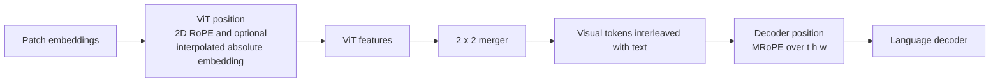

# Positional Encoding in the Qwen Vision-Language Stack

> **Question:** How does Qwen preserve spatial and temporal order when visual
> features pass through the vision tower and then the language decoder?
>
> **Scope:** Qwen2-VL, Qwen2.5-VL, Qwen3-VL, and the released Qwen3.5 reference
> path. Research date: 2026-07-21.

## Short answer: there are two position systems

Qwen does not use one positional encoding for the whole visual pipeline.

1. **Inside the ViT**, positions describe the patch grid so visual attention can
   distinguish up/down and left/right. Qwen2/2.5 use 2D RoPE; Qwen3-VL and
   Qwen3.5 also add an interpolated learned absolute embedding.
2. **Inside the language decoder**, MRoPE assigns temporal, height, and width
   coordinates to visual tokens while ordinary text behaves like 1D RoPE. This
   lets text, images, and videos share one causal sequence without pretending an
   image is only a flat row of unrelated tokens.

These systems act in different modules and at different feature widths. “Qwen
uses MRoPE” does not mean the ViT and LLM use the same position tensor.



## From absolute embeddings to RoPE

An absolute position table adds a learned vector to token content:

$$
x_{h,w}^{\prime}=x_{h,w}+e_{h,w}.
$$

This is simple, but a table trained on one grid shape must be resized or
interpolated for a new shape. The original ViT used learned 1D position
embeddings over the flattened patch sequence. [Original ViT, §3.1][vit]

RoPE instead rotates pairs of query and key dimensions. For one 2D pair at
position `p` and angular frequency $\theta_i$:

$$
R(p\theta_i)=
\begin{bmatrix}
\cos(p\theta_i)&-\sin(p\theta_i)\\
\sin(p\theta_i)&\cos(p\theta_i)
\end{bmatrix}.
$$

Applying $R$ to Q and K makes their dot product depend on relative displacement:

$$
(R_mq)^\top(R_nk)=q^\top R_{n-m}k.
$$

For a visual grid, Qwen supplies height and width coordinates rather than only
one flattened index. Values V are not rotated. The detailed 1D derivation is in
[the local RoPE note](../LLM_modules/RoPE.md).

## Example dataflow: one patch from ViT to decoder MRoPE

Continue the `224 x 224` Qwen2.5-VL example from [ViT.md](ViT.md). Patch size 14
creates a `16 x 16` grid before merging and an `8 x 8` grid afterward.

Choose the pre-merge patch at row 2, column 3. In the processed image it has the
nominal pixel bounds

```text
y = [2*14, 3*14) = [28, 42)
x = [3*14, 4*14) = [42, 56)
```

Its position information flows as follows:

```text
Patch feature x[2,3], width 1280
        |
        | vision position ID = (h=2, w=3)
        | generate height/width rotary phases
        v
Rotate this patch's Q and K inside every ViT attention block
        |
        | attention score to patch x[2,6]
        | contains spatial displacement (delta_h=0, delta_w=3)
        v
Contextual ViT feature at grid cell (2,3)
        |
        | 2 x 2 merger changes the coordinate grid
        v
Merged decoder cell (h=1, w=1), width 3584
        |
        | image temporal coordinate is constant, use t=0 locally
        v
Decoder MRoPE coordinate = (t=0, h=1, w=1)
```

The coordinate changes from `(2,3)` to `(1,1)` because the merger maps each
pre-merge cell `(r,c)` to `(floor(r/2), floor(c/2))`. The merged cell `(1,1)`
contains rows `{2,3}` and columns `{2,3}`. Prompt-level offsets are then added so
this image segment follows any earlier text or modality segment; the local grid
coordinates above are shown without that offset for clarity.

The same position tuple is interpreted differently for text:

```text
visual token: (t, h, w) = (0, 1, 1)
text token at sequence position p: (t, h, w) = (p, p, p)
```

Thus the decoder can use spatial axes for the visual token while the text token
reduces to ordinary 1D RoPE. This worked example also shows why position IDs must
be regenerated for the **merged** `8 x 8` grid; passing the original `16 x 16`
coordinates to the 64-token decoder payload would violate the token/position
contract. [Qwen2-VL, §2.1][qwen2]
[Pinned Qwen2.5-VL implementation][qwen25-code]

## Layer 1: position inside the vision tower

### Qwen2-VL and Qwen2.5-VL: 2D visual RoPE

**Verified.** Qwen2-VL removes the previous absolute position embeddings and
introduces 2D RoPE so one ViT can process variable image grids. Qwen2.5-VL keeps
2D RoPE while adding window attention; its processor resizes height and width to
multiples of 28, compatible with 14-pixel patches and 2 x 2 merging.
[Qwen2-VL, §2.1][qwen2] [Qwen2.5-VL, §2.1][qwen25]

In the reference path, grid coordinates generate rotary phases, and those phases
rotate Q and K inside every visual attention block. Window reordering in
Qwen2.5-VL reorders the position phases along with the patch features, so a token
keeps its spatial identity even when attention is computed window by window.
[Pinned Qwen2.5-VL implementation][qwen25-code]

### Qwen3-VL and Qwen3.5: learned position plus visual RoPE

**Verified.** Qwen3-VL uses two complementary signals inside its vision tower:

- a learned absolute position table, bilinearly interpolated to the current
  dynamic grid; and
- visual rotary phases applied to Q and K.

The additive table provides an absolute location signal; RoPE structures
attention by displacement. The reference implementation computes both before
the visual blocks. [Qwen3-VL, §2][qwen3]
[Pinned Qwen3-VL implementation][qwen3-code]

Qwen3.5 inherits this visual path. Its reference implementation interpolates the
learned table, adds it to patch embeddings, computes visual RoPE, and then runs
all vision blocks. [Pinned Qwen3.5 vision path][qwen35-code]

## Layer 2: multimodal RoPE inside the decoder

Let each decoder token have three position IDs:

$$
p_i=(t_i,h_i,w_i).
$$

Qwen2-VL's MRoPE maps them by modality:

| Token type | Temporal ID | Height ID | Width ID |
|---|---:|---:|---:|
| Text | `p` | `p` | `p` |
| Image token | constant within the image | merged-grid row | merged-grid column |
| Video token | frame/tubelet index | merged-grid row | merged-grid column |

For text, the three IDs are equal, so the result is functionally ordinary 1D
RoPE. For an image, the temporal ID stays fixed while height and width vary. For
video, temporal position varies as well. When modalities are concatenated, a new
segment starts after the maximum position ID of the preceding segment rather
than simply consuming one scalar position per image patch. This keeps the
decoder's multimodal position range more compact. [Qwen2-VL, §2.1][qwen2]

### Qwen2/2.5: chunked MRoPE

Qwen2-VL partitions rotary dimensions into temporal, height, and width sections.
Qwen2.5-VL keeps that decomposition and changes the **meaning of temporal IDs**:
they are aligned to absolute time instead of only the sampled frame count. Thus
videos sampled at different frame rates can represent the same elapsed time
more consistently. [Qwen2.5-VL, §2.1.2-2.1.3][qwen25]

This should not be described as a new video encoder. It changes decoder position
IDs; frame selection and tubelet embedding remain separate preprocessing/ViT
operations.

### Qwen3-VL: interleaved MRoPE and textual time

Qwen3-VL identifies a limitation of the earlier chunk layout: assigning one
contiguous frequency band to each axis gives temporal, height, and width
different spectral coverage. It instead interleaves them:

```text
Qwen2/2.5: T T T ... | H H H ... | W W W ...
Qwen3-VL:  T H W T H W T H W ...
```

The goal is to expose every axis to both low- and high-frequency bands. The
pinned implementation explicitly rewrites the frequency layout from chunked to
interleaved before computing cosine and sine. [Qwen3-VL, §2.1][qwen3]
[Pinned Qwen3-VL implementation][qwen3-code]

Qwen3-VL also stops using large absolute-time temporal IDs as its only time
signal. Each video temporal patch is prefixed with text such as
`<3.0 seconds>`; training includes seconds and `HH:MM:SS` forms. The paper cites
sparse, excessively large IDs in long videos and expensive frame-rate coverage
as reasons for this change. Text timestamps cost a few sequence tokens, but make
time explicitly readable by the language model. [Qwen3-VL, §2.3][qwen3]

### Qwen3.5 checkpoint detail

The pinned Qwen3.5-27B config records `mrope_interleaved=true`,
`mrope_section=[11,11,10]`, `rope_theta=10,000,000`, and
`partial_rotary_factor=0.25`. These are executable settings for that checkpoint,
not family-wide constants. Its decoder also maintains a separate 1D text
position stream for causal-mask and cache bookkeeping while using three
temporal/height/width streams for multimodal RoPE.
[Pinned Qwen3.5-27B config][qwen35-config]
[Pinned Qwen3.5 decoder path][qwen35-code]

## What position encoding solves—and what it does not

- It preserves spatial/temporal order in attention; it does not recover pixels
  discarded by resizing, frame sampling, patchification, or merging.
- Dynamic coordinates allow variable grids; they do not make compute independent
  of resolution.
- RoPE can be evaluated beyond trained positions, but that does not guarantee
  reliable extrapolation. Learned attention circuits and data coverage still
  matter.
- Qwen2.5 absolute-time MRoPE and Qwen3-VL textual timestamps are different
  designs. The latter is presented as a replacement for the former's long-video
  weaknesses, not merely an extra display format.
- Interleaving equalizes access to frequency bands; it does not by itself prove
  correct object geometry or video chronology.
- “2D/3D RoPE” is ambiguous unless the document says **which module** uses it.
  Use “vision-side 2D RoPE” or “decoder-side MRoPE” explicitly.

## Sources

All online sources were accessed on 2026-07-21.

- Dosovitskiy et al. *An Image Is Worth 16x16 Words*. [arXiv][vit]
- Wang et al. *Qwen2-VL*. [Local PDF][qwen2-local] · [arXiv][qwen2]
- Bai et al. *Qwen2.5-VL Technical Report*.
  [Local PDF][qwen25-local] · [arXiv][qwen25]
- Bai et al. *Qwen3-VL Technical Report*. [arXiv][qwen3]
- Qwen and Hugging Face. Pinned implementations and checkpoint config below.

[vit]: https://arxiv.org/abs/2010.11929
[qwen2]: https://arxiv.org/abs/2409.12191
[qwen25]: https://arxiv.org/abs/2502.13923
[qwen3]: https://arxiv.org/abs/2511.21631
[qwen2-local]: ../../../gwen-overview/qwen2_vl_2409.12191.pdf
[qwen25-local]: ../../../gwen-overview/qwen2.5_vl_2502.13923.pdf
[qwen25-code]: https://github.com/huggingface/transformers/blob/29985e67cccdddef7e336d7e53840500359d30a3/src/transformers/models/qwen2_5_vl/modeling_qwen2_5_vl.py
[qwen3-code]: https://github.com/huggingface/transformers/blob/29985e67cccdddef7e336d7e53840500359d30a3/src/transformers/models/qwen3_vl/modeling_qwen3_vl.py
[qwen35-config]: https://huggingface.co/Qwen/Qwen3.5-27B/blob/fc05daec18b0a78c049392ed2e771dde82bdf654/config.json
[qwen35-code]: https://github.com/huggingface/transformers/blob/7ea2320c76117e6742364808a666ef6f2fb40a67/src/transformers/models/qwen3_5/modular_qwen3_5.py
