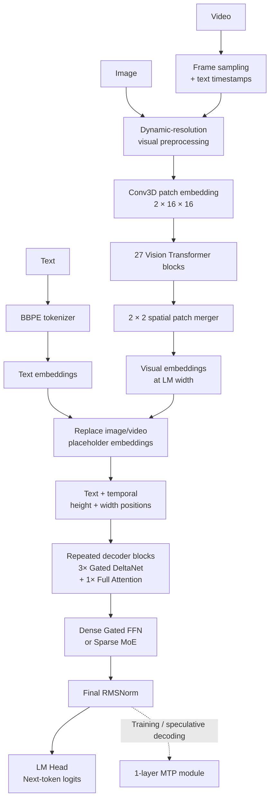

# Qwen3.5: Architecture, Data Flow, Pre-training, and Post-training

> **Research question:** What is publicly verifiable about the internal modules,
> multimodal data flow, pre-training, and post-training of the core Qwen3.5 model
> family?
>
> **Scope:** The native vision-language Qwen3.5 family released in 2026. This is
> not a report about Qwen3.5-Omni, Qwen-VLA, or Qwen3.6.
>
> **Research date:** 2026-07-20. Primary sources are Qwen's release material,
> official Qwen Hugging Face artifacts, the Qwen-authored Transformers
> implementation, and the Qwen3.5-Omni paper only where it explicitly describes
> a reused Qwen3.5 component.

## Short answer

Qwen3.5 is an **autoregressive image/video-to-text model**, not a text model with
vision attached only after language pre-training. It trains text and visual
inputs together from pre-training onward. Its main computational path combines:

1. a roughly 250K-token byte-level BPE tokenizer;
2. a 27-block vision Transformer that converts variable-resolution image/video
   patches into language-model-width embeddings;
3. a decoder whose repeating unit contains three recurrent **Gated DeltaNet**
   layers followed by one gated full-attention layer;
4. either a dense gated FFN or a sparse MoE after every token-mixing layer;
5. multimodal RoPE, causal language-model output, and a separately trained
   multi-token-prediction module.

The architecture and inference data flow are unusually well exposed in the
released configs and reference code. The training recipe is less transparent.
Qwen discloses early text-vision fusion, broader and more strictly filtered data,
201 languages/dialects, multi-token prediction, FP8 infrastructure, and RL over
large and progressively harder agent environments. It does **not** disclose the
exact total token count, modality mixture, data sources, optimizer schedule,
instruction-tuning stages, RL algorithm, reward construction, or safety recipe.

## Scope boundary: Qwen3.5 is not Qwen3.5-Omni

| Family                 | Inputs                    | Outputs                                      | Distinctive path                                                                                          |
| ---------------------- | ------------------------- | -------------------------------------------- | --------------------------------------------------------------------------------------------------------- |
| **Qwen3.5 core** | Text, image, silent video | Text tokens, including serialized tool calls | Vision encoder -> unified embedding sequence -> hybrid Gated DeltaNet/full-attention decoder              |
| **Qwen3.5-Omni** | Text, image, video, audio | Text and streaming speech                    | AuT audio encoder -> Thinker -> Talker -> RVQ speech codes -> Code2Wav; ARIA aligns text and speech rates |

The Qwen3.5-Omni technical report is a separate architecture. Its claims about
over 100 million hours of audio-visual data, Thinker-Talker training, ARIA, speech
codebooks, and speech-generation post-training must **not** be transferred to the
core Qwen3.5 family. The core model has no audio encoder, Talker, codec, or speech
renderer. [Qwen3.5-Omni Technical Report, §§1-3][qwen35-omni]

## Architecture at a glance



This is **early fusion at the decoder input**, after modality-specific visual
encoding. “Unified vision-language foundation” does not mean raw pixels and text
share the same first layer. It means that the vision encoder and language decoder
are trained jointly on mixed text-image-video sequences from pre-training rather
than aligning a frozen, finished language model only in a later phase.
[Qwen3.5 release, Pretraining][qwen35-release]
[Qwen3.5 reference implementation][qwen35-code]

## Input and fusion modules

### Text tokenizer and special tokens

**Verified.** Qwen describes a byte-level BPE tokenizer with an approximately
250K vocabulary, enlarged from about 150K. It claims 10-60% better encoding and
decoding efficiency across most languages. The released checkpoints make the
exact padded embedding/output vocabulary **248,320** entries. The core special
IDs include `vision_start=248053`, `vision_end=248054`, `image=248056`, and
`video=248057`. The input embeddings and LM output weights are not tied.
[Qwen3.5 release, Pretraining][qwen35-release]
[Qwen3.5-27B config][qwen35-27b-config]

The 250K number is a rounded public description; 248,320 is the executable
checkpoint dimension. The Qwen3.5-Omni paper independently identifies the reused
Qwen3.5 tokenizer as byte-level BPE. [Qwen3.5-Omni, §2.3][qwen35-omni]

### Image and video preprocessing

**Verified from the released 27B checkpoint and reference implementation:**

- the visual patch embedder is a 3D convolution with kernel and stride
  `(temporal=2, height=16, width=16)`;
- the vision tower has 27 blocks, hidden width 1,152, 16 attention heads, and an MLP intermediate width of 4,304 with GELU-tanh;
- a spatial merger combines each `2 x 2` group of vision patches, reducing the
  visual-token count by four, then projects the result to the language model's
  hidden width;
- images and videos use the same vision tower;
- each sampled video temporal patch is preceded in the serialized prompt by  a text timestamp such as `<1.5 seconds>`, followed by vision boundary and video placeholder tokens.

For a visual grid `(T, H, W)`, the number of decoder-level visual placeholders is
approximately:

```text
N_visual = T * H * W / spatial_merge_size^2
         = T * H * W / 4
```

Here `T`, `H`, and `W` refer to the grid after visual patchification, not the raw
pixel dimensions. [Qwen3.5-27B config][qwen35-27b-config]
[Qwen3.5/Qwen3-VL processor code][qwen35-processor]
[Qwen3.5 vision code][qwen35-code]

### Vision encoder and the absence of DeepStack

The vision tower inherits the Qwen3-VL ViT building blocks: patch embedding,
learned position interpolation, visual rotary embeddings, full-attention vision
blocks, and a patch merger. Each vision block is pre-normalized and contains
attention plus a two-layer GELU MLP.

There is an important Qwen3.5-specific difference. The reference
`Qwen3_5VisionModel` explicitly removes Qwen3-VL's `deepstack_visual_indexes` and
`deepstack_merger_list`; released configs set `deepstack_visual_indexes` to an
empty list. Therefore, Qwen3.5 inserts the **final merged vision embeddings once
at the decoder input**. It does not inject intermediate ViT features into early
decoder layers through Qwen3-VL DeepStack. [Qwen3.5 vision code][qwen35-code]
[Qwen3.5-27B config][qwen35-27b-config]

### Early fusion and multimodal positions

The processor first creates enough `<|image_pad|>` or `<|video_pad|>` positions
for the merged vision sequence. At model execution:

1. ordinary token IDs become text embeddings;
2. pixels pass through the vision tower and patch merger;
3. `masked_scatter` replaces the placeholder embeddings with visual embeddings;
4. the model computes position IDs for text, time, height, and width;
5. the resulting single embedding sequence enters the language decoder.

Qwen3.5 uses three-axis multimodal RoPE for temporal, height, and width positions,
while retaining a separate one-dimensional text position stream for causal mask
and cache bookkeeping. In the released configs, only the first 64 dimensions of
each 256-dimensional full-attention head receive RoPE, split through
`mrope_section=[11, 11, 10]`, with `rope_theta=10,000,000`.
[Qwen3.5-27B config][qwen35-27b-config]
[Qwen3.5 multimodal forward path][qwen35-code]

## The hybrid language decoder

### Repeating 3:1 token-mixer pattern

Every released large checkpoint follows the Qwen3-Next pattern:

```text
3 x Gated DeltaNet -> 1 x gated full attention -> repeat
```

The ratio is architectural, not an inference switch. Linear/recurrent layers
handle most sequence mixing cheaply; every fourth layer restores exact global
softmax attention and stronger recall. Qwen's Qwen3-Next experiments report that
pure linear attention was fast but weaker at recall, while the 3:1 hybrid was
better than either all-linear or all-standard-attention alternatives in their
tests. [Qwen3-Next architecture post][qwen3-next]

Each decoder block is:

```text
x -> zero-centered RMSNorm -> token mixer -> residual add
  -> zero-centered RMSNorm -> dense FFN or sparse MoE -> residual add
```

The standard attention/FFN/RoPE concepts are expanded in the adjacent
[module notes](module_details/README.md).

### Gated DeltaNet

Gated DeltaNet is a recurrent linear-attention token mixer. The Qwen3.5
implementation performs the following operations:

1. project the normalized hidden state into `Q`, `K`, `V`, output gate `z`, update
   strength `beta`, and decay `g`;
2. apply a causal depth-wise convolution of width four to `Q/K/V`;
3. L2-normalize `Q` and `K` inside the delta-rule kernel;
4. update a fixed-size recurrent key-value state with learned decay and delta
   correction;
5. read from that state with `Q`;
6. normalize and gate the result with `z`, then apply the output projection.

During prefill the implementation uses a parallel chunked delta-rule kernel.
During one-token decoding it updates cached convolution and recurrent states.
This avoids a growing KV cache in the Gated DeltaNet layers; only the periodic
full-attention layers maintain the ordinary key/value history. This is the main
reason long-context decode is cheaper than an all-full-attention decoder.
[Qwen3.5 Gated DeltaNet code][qwen35-code]
[Qwen3-Next architecture post][qwen3-next]

For a more mathematical explanation, see
[Gated DeltaNet](module_details/Gated_DeltaNet.md).

### Gated full attention

Every fourth layer uses causal grouped-query attention. Besides the normal
`Q/K/V` projections, the query projection produces an output-gate vector. The
softmax-attention result is multiplied by `sigmoid(gate)` before the output
projection. Qwen attributes this gate to better rank behavior and fewer attention
sinks/massive activations. Head width is 256, and only 64 dimensions use RoPE.
[Qwen3-Next architecture post][qwen3-next]
[Qwen3.5 attention implementation][qwen35-code]

The number of query and KV heads depends on model size. For example, 27B uses
24 query and 4 KV heads; 35B-A3B uses 16 query and 2 KV heads; 397B-A17B uses 32
query and 2 KV heads. This is GQA, not conventional equal-head MHA.
[27B model card][qwen35-27b]
[35B-A3B model card][qwen35-35b]
[397B-A17B model card][qwen35-397b]

### Dense FFN versus sparse MoE

The dense 0.8B, 2B, 4B, 9B, and 27B models put a SiLU-gated FFN after each token
mixer. The MoE 35B-A3B, 122B-A10B, and 397B-A17B models replace it with a sparse expert block. The suffix `A3B`, for example, means roughly 3B language-model parameters are active per token, not that the entire checkpoint occupies 3B parameters.

For 35B-A3B and 122B-A10B, a learned router selects eight of 256 routed experts
per token and also runs one shared expert. For 397B-A17B it selects ten of 512
routed experts plus one shared expert. Expert outputs are weighted and combined;
the shared path represents capacity that is always available rather than routed.
[35B-A3B model card][qwen35-35b]
[122B-A10B model card][qwen35-122b]
[397B-A17B model card][qwen35-397b]

See [MoE](module_details/MoE.md) and
[SwiGLU](module_details/SwiGLU.md) for the generic mechanisms.

### Normalization, logits, and MTP

Qwen3.5 inherits Qwen3-Next's zero-centered RMSNorm design and pre-norm residual
layout. A final RMSNorm feeds an untied linear output head over the 248,320-entry
vocabulary. Generation is autoregressive: logits choose the next text token, and
the selected token is appended to the same sequence for the next step.

The checkpoint also contains a distinct `mtp` module with a fusion projection,
one decoder layer, and normalization. Qwen says MTP is trained for multiple
future steps and is usable as a draft model for speculative decoding. MTP does
not change the semantic output space: accepted proposals are still ordinary
vocabulary tokens verified by the main model.
[27B model card][qwen35-27b]
[27B checkpoint weight index][qwen35-27b-index]
[Qwen3-Next MTP description][qwen3-next]

## End-to-end execution data flow

### Text-only request

```text
prompt/chat template
  -> BBPE IDs
  -> token embeddings
  -> 64 hybrid decoder layers in 27B, for example
  -> final RMSNorm
  -> 248,320-way logits
  -> autoregressive token selection
  -> decoded text
```

The vision tower is simply unused; it is still part of the multimodal checkpoint.

### Image request

```text
image + text prompt
  -> resize/normalize and dynamic patch grid
  -> Conv3D patch embedding
  -> learned visual position + visual RoPE
  -> 27 ViT blocks
  -> 2 x 2 spatial merger and projection to LM width
  -> replace image placeholder embeddings in token stream
  -> multimodal RoPE + hybrid decoder
  -> text logits
```

### Video request

```text
video + text prompt
  -> frame sampling
  -> pairs of frames form temporal patches
  -> one text timestamp around each temporal visual group
  -> same ViT and patch merger as images
  -> interleave timestamp tokens and visual embeddings
  -> multimodal RoPE + hybrid decoder
  -> text logits
```

Explicit timestamps provide semantic time references, while multimodal RoPE
represents the temporal and spatial coordinates of visual patches. These are
complementary, not duplicate mechanisms.

### Tool-using agent loop

Tools are not neural modules inside Qwen3.5. The model emits a serialized tool
call; an external agent runtime executes it and appends the tool response to the
context:

```text
user tokens -> Qwen3.5 -> tool-call tokens
                           |
                           v
                    external executor
                           |
                           v
tool-result tokens -> Qwen3.5 -> final answer or another tool call
```

Therefore, “agent capability” comes from post-training plus the surrounding
runtime. The weights do not themselves contain WebSearch, a shell, or an MCP
server.

## Representative released configurations

| Model             | LM layers and width | Repeating block           | Attention heads Q/KV | FFN or experts                                        | Native context |
| ----------------- | ------------------: | ------------------------- | -------------------: | ----------------------------------------------------- | -------------: |
| Qwen3.5-27B       |          64 x 5,120 | `16 x (3 GDN + 1 full)` |               24 / 4 | Dense FFN, 17,408 intermediate                        |        262,144 |
| Qwen3.5-35B-A3B   |          40 x 2,048 | `10 x (3 GDN + 1 full)` |               16 / 2 | 256 experts; 8 routed + 1 shared; 512 intermediate    |        262,144 |
| Qwen3.5-122B-A10B |          48 x 3,072 | `12 x (3 GDN + 1 full)` |               32 / 2 | 256 experts; 8 routed + 1 shared; 1,024 intermediate  |        262,144 |
| Qwen3.5-397B-A17B |          60 x 4,096 | `15 x (3 GDN + 1 full)` |               32 / 2 | 512 experts; 10 routed + 1 shared; 1,024 intermediate |        262,144 |

All four are natively vision-language checkpoints and are advertised as
extendable to about 1,010,000 tokens. The official collection also includes
dense 0.8B, 2B, 4B, and 9B variants, plus Base checkpoints for several sizes.
[Official Qwen3.5 collection][qwen35-collection]

The advertised `397B-A17B` and similar names describe the language-model scale.
The complete Hugging Face artifact also includes the vision tower, so repository
metadata can show a slightly larger total parameter count.

## Pre-training

### What is verified

Qwen describes pre-training along three axes:

1. **Capability:** more visual-text tokens than Qwen3; enriched Chinese,
   English, multilingual, STEM, and reasoning content; stricter filtering.
2. **Efficiency:** the Qwen3-Next-derived hybrid decoder, higher-sparsity MoE,
   stability changes, and multi-token prediction.
3. **Versatility:** early text-vision fusion, expanded visual/STEM/video data,
   and coverage of 201 languages and dialects.

The released Base model card identifies the artifact as **pre-trained only** and
still exposes it as image-text-to-text. It also says chat control tokens were
included during pre-training so later parameter-efficient tuning need not resize
the unusually large embeddings. [Qwen3.5 release, Pretraining][qwen35-release]
[35B-A3B-Base model card][qwen35-35b-base]

The executable model is a causal language model conditioned on text and visual embeddings. The public checkpoint and model card also verify MTP parameters.
Together these support the following training-flow interpretation:

```text
filtered text/image/video examples
  -> BBPE text tokens + encoded visual patches
  -> early-fused multimodal sequences
  -> causal future-token prediction through the main LM head
  + multi-step future-token prediction through MTP
  -> Base checkpoint
```

**Inferred boundary:** the released implementation establishes the causal and
MTP objectives available to train the network, but Qwen has not published a loss
equation or loss-weight schedule for the production Qwen3.5 pre-training run.

### Training infrastructure

**Verified.** Qwen reports a heterogeneous training system that decouples
parallelism strategies for the vision and language components and overlaps work
using sparse activation. On mixed text-image-video batches, it reports training
throughput close to its text-only baseline.

Its native FP8 path applies low precision to activations, MoE routing, and GEMMs,
while runtime monitoring retains BF16 for sensitive layers. Qwen reports about
50% lower activation memory and more than 10% speedup, with stable scaling to
tens of trillions of tokens. This describes infrastructure capability; it is
**not** an exact disclosure of Qwen3.5's final token count.
[Qwen3.5 release, Infrastructure][qwen35-release]

### What remains unknown

- exact number of pre-training tokens;
- counts and ratios for text, image-text, interleaved documents, and video;
- source datasets, licenses, deduplication, contamination checks, and language
  distribution;
- whether every model size saw the same curriculum;
- context-length curriculum and the method used for the 1.01M extension;
- optimizer, batch size, learning-rate schedule, checkpoint initialization, and
  compute budget;
- main causal-loss versus MTP-loss weights and number of predicted offsets;
- vision-language alignment losses, if any beyond autoregressive token loss;
- ablations that isolate early fusion, tokenizer expansion, data scaling, and
  architectural changes.

Do not fill these gaps with Qwen3's published 36T-token, three-stage recipe or
Qwen3-Next's 15T-token experiment. Qwen3.5 inherits architectural ideas, not a
publicly confirmed identical corpus or schedule.

## Post-training

### What is verified

Official post-trained checkpoints are distinct from Base checkpoints. Qwen says
the main post-training gains over Qwen3 came from scaling RL across almost all
tasks and environments it could construct, while increasing environment
difficulty and generalizability instead of optimizing a narrow benchmark.
[Qwen3.5 release, post-training discussion][qwen35-release]

The model cards summarize this as RL over **million-agent environments with
progressively complex task distributions**. The infrastructure is an
asynchronous, disaggregated training/inference system with:

- dynamic load balancing and fine-grained fault recovery;
- end-to-end FP8 training;
- rollout-router replay;
- speculative decoding;
- multi-turn rollout locking;
- controls for gradient staleness and data skew;
- native multi-turn agent interaction without pausing the training loop.

Qwen says million-scale agent scaffolds/environments can be orchestrated and
reports a 3-5x end-to-end system speedup. These are vendor-reported system
results, not independently reproduced measurements.
[Qwen3.5 release, Infrastructure][qwen35-release]
[35B-A3B model card][qwen35-35b]

The resulting post-trained model supports visible behavior modes. Open
checkpoints think by default and serialize reasoning inside `<think>...</think>`;
the serving interface can disable thinking. The hosted product additionally
offers adaptive `Auto`, deeper `Thinking`, and direct `Fast` modes. These modes
are post-training/prompting behavior over the same main decoder, not extra
attention modules. [397B-A17B model card][qwen35-397b]
[Qwen3.5 release, usage section][qwen35-release]

### What is inferred and what is unknown

**Inferred:** some instruction-alignment phase must separate the conversational
post-trained checkpoints from Base. The public sources do not name or order that
phase, so it should not automatically be called Qwen3's “thinking-mode fusion”
or copied from Qwen3's four-stage pipeline.

**Unknown:** Qwen has not publicly specified:

- a complete stage sequence such as CPT -> SFT -> preference tuning -> RL;
- SFT dataset size, sources, modality balance, or sampling policy;
- the RL algorithm (for example PPO, GRPO, or another method);
- reward models, rule-based verifiers, human preference labels, or reward
  composition;
- how text reasoning, visual reasoning, coding, search, GUI interaction, and
  tool-use environments are mixed;
- rollout counts, maximum turns, curriculum schedule, or filtering;
- safety-specific tuning, red-team data, refusal objectives, or alignment
  trade-offs;
- whether smaller dense models are independently post-trained or distilled from
  larger Qwen3.5 teachers.

The release explicitly says broader training details will appear in an upcoming
technical report. As of 2026-07-20, a standalone core Qwen3.5 technical report
could not be found in the official Qwen sources or arXiv. The available
**Qwen3.5-Omni** report is not that missing report.

## Practical conclusions

1. **The architectural center is the hybrid decoder.** Three recurrent Gated
   DeltaNet layers make long-context execution efficient; periodic gated full
   attention recovers global recall.
2. **MoE and hybrid attention solve different costs.** MoE reduces active FFN
   parameters per token; Gated DeltaNet reduces sequence-mixing and cache cost.
3. **Native multimodality is a training claim plus a concrete fusion path.** The
   vision tower remains modality-specific, but its embeddings participate in
   the same decoder stream from pre-training onward.
4. **Qwen3.5 is simpler than Qwen3-VL at the injection point.** It reuses the ViT family but removes DeepStack and inserts only final merged visual features at decoder input.
5. **Agent tools remain outside the model.** RL teaches tool-call behavior; an
   external runtime performs the actions and returns observations.
6. **Training transparency is uneven.** Architecture, checkpoint dimensions,
   inference flow, and infrastructure are verifiable; corpus composition and
   post-training algorithms remain largely undisclosed.

## Sources

All online sources below were accessed on 2026-07-20.

- Qwen Team. *Qwen3.5: Accelerating Productivity with Native Multimodal
  Agents*, February 2026. [Official Qwen page][qwen35-blog] and
  [Alibaba Cloud rendering with accessible section text][qwen35-release].
- Qwen. [Official Qwen3.5 Hugging Face collection][qwen35-collection] and model
  cards for [27B][qwen35-27b], [35B-A3B][qwen35-35b],
  [122B-A10B][qwen35-122b], [397B-A17B][qwen35-397b], and
  [35B-A3B-Base][qwen35-35b-base].
- Hugging Face Transformers, Qwen Team and Hugging Face contributors.
  [Pinned Qwen3.5 reference implementation][qwen35-code],
  [Qwen3-VL processor used by Qwen3.5][qwen35-processor], and
  [Qwen3.5 documentation][qwen35-hf-docs].
- Qwen Team. *Qwen3-Next: Towards Ultimate Training & Inference Efficiency*,
  2025. [Official architecture post][qwen3-next].
- Qwen Team. *Qwen3.5-Omni Technical Report*, arXiv:2604.15804v2, 2026.
  [arXiv][qwen35-omni]. Used only to establish the family boundary and the
  reused tokenizer description.

[qwen35-blog]: https://qwen.ai/blog?id=qwen3.5
[qwen35-release]: https://www.alibabacloud.com/blog/602894
[qwen35-collection]: https://huggingface.co/collections/Qwen/qwen35
[qwen35-27b]: https://huggingface.co/Qwen/Qwen3.5-27B
[qwen35-35b]: https://huggingface.co/Qwen/Qwen3.5-35B-A3B
[qwen35-122b]: https://huggingface.co/Qwen/Qwen3.5-122B-A10B
[qwen35-397b]: https://huggingface.co/Qwen/Qwen3.5-397B-A17B
[qwen35-35b-base]: https://huggingface.co/Qwen/Qwen3.5-35B-A3B-Base
[qwen35-27b-config]: https://huggingface.co/Qwen/Qwen3.5-27B/blob/fc05daec18b0a78c049392ed2e771dde82bdf654/config.json
[qwen35-27b-index]: https://huggingface.co/Qwen/Qwen3.5-27B/blob/fc05daec18b0a78c049392ed2e771dde82bdf654/model.safetensors.index.json
[qwen35-code]: https://github.com/huggingface/transformers/blob/7ea2320c76117e6742364808a666ef6f2fb40a67/src/transformers/models/qwen3_5/modular_qwen3_5.py
[qwen35-processor]: https://github.com/huggingface/transformers/blob/7ea2320c76117e6742364808a666ef6f2fb40a67/src/transformers/models/qwen3_vl/processing_qwen3_vl.py
[qwen35-hf-docs]: https://huggingface.co/docs/transformers/model_doc/qwen3_5
[qwen3-next]: https://qwen.ai/blog?id=e34c4305036ce60d55a0791b170337c2b70ae51d
[qwen35-omni]: https://arxiv.org/abs/2604.15804v2
