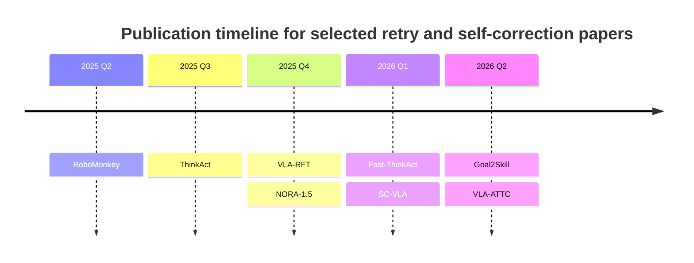

# State of the Art on Retry and Self-Correction in Vision-Language-Action and Multimodal Agents

## Executive summary

The most credible 2025–2026 papers on **retry, verification, reflection, and self-correction** in vision-language-action systems divide into three technical clusters. The first cluster adds **test-time deliberation or verification** to a base VLA, best represented by **VLA-ATTC** and **RoboMonkey**. The second cluster trains **reasoning-enhanced or reflection-capable policies**, represented by **ThinkAct**, **Fast-ThinkAct**, and **Goal2Skill**. The third cluster pushes **post-training or online refinement** using internal critics, world models, or reward shaping, represented by **SC-VLA**, **NORA-1.5**, and **VLA-RFT**. Across the papers I reviewed, **no clearly relevant 2025–2026 retry/self-correction paper surfaced with more than 200 verified citations**; the visible citation leaders in this niche are **ThinkAct** at roughly **115** in an arXiv PDF search snippet, with an OpenReview PDF snippet surfacing **136**, and **RoboMonkey** at **54** on its PMLR page snippet. By contrast, broader VLA backbone papers such as **OpenVLA** exceed that threshold by a wide margin, but they are not themselves retry/self-correction papers. citeturn36search9turn36search18turn18search8turn21search4

If your priority is **direct evidence against the π family**, **VLA-ATTC** is the strongest match to your query: it directly reports **PI0.5 90.6% → 95.4%** on LIBERO-LONG and **52.0% → 62.7%** on real-robot tasks, while claiming it **cuts PI0.5 failure rate by over 50%**. **Goal2Skill** is the second-strongest direct π-family comparison in the selected set, beating **Pi0.5 8.8%** with **32.4%** on a difficult RMBench subset for memory-heavy long-horizon manipulation. citeturn11view2turn18search0turn16view0

If your priority is **strong public code and reproducibility**, the best picks are **RoboMonkey**, **NORA-1.5**, **SC-VLA**, **VLA-RFT**, and **Fast-ThinkAct**. RoboMonkey is particularly strong operationally because the surfaced repo materials include an environment setup and quickstart-style instructions; NORA-1.5 and VLA-RFT both expose public code and project pages; SC-VLA exposes a public repository from the paper; and Fast-ThinkAct has a public GitHub repository in addition to its project page. By contrast, **VLA-ATTC** only promises future open-sourcing in the paper snippet I reviewed, and I did not surface an official public repo for **Goal2Skill** or **ThinkAct** during this review. citeturn13search3turn13search6turn26view0turn20search4turn38view0turn20search9turn40view2turn40view3turn35search0turn35search2turn18search0turn17search0turn17search1turn36search1

My ranked list therefore balances four factors: **directness to retry/self-correction**, **strength of benchmark evidence**, **public code quality**, and **citation traction**. On that combined basis, the most compelling shortlist is: **VLA-ATTC**, **NORA-1.5**, **Fast-ThinkAct**, **RoboMonkey**, **SC-VLA**, **VLA-RFT**, **ThinkAct**, and **Goal2Skill**. I excluded the 2024 precursor **A Self-Correcting Vision-Language-Action Model for Fast and Slow System Manipulation** from the ranked list because, although conceptually important, its surfaced citation count was only **17**, which does not meet your “2024 only if very high citation” filter. citeturn23search8turn34view0turn18search8turn40view0turn39view3turn36search9turn16view0turn20search3

## Selection criteria and scope

I prioritized papers that are **about retry, self-correction, reflection, test-time verification, adaptive deliberation, or self-improving post-training** for **VLA systems or closely related multimodal embodied agents**, and that were published in **2025 or 2026**. I only admitted a 2024 paper if it had very high citation momentum; in practice, the main 2024 self-correction precursor did not meet that bar. I also weighted papers more highly if they reported **direct comparisons to PI0.5 or π0**, because direct **π0\*** numbers were not surfaced in the paper texts and official project materials I reviewed. citeturn18search0turn16view0turn27view0turn40view0turn20search3

A practical limitation of the literature in this slice is that **the strongest and newest papers are often preprints or very recent conference acceptances**, so citation counts are still small and code release is uneven. For transparency, I report citation counts exactly as surfaced in the reviewed sources and, where necessary, describe them conservatively. For example, **VLA-ATTC** did not surface a standard citation count in the primary snippets I reviewed; the most concrete signal I found was **3 citing publications on Scite**, which is not perfectly comparable to Google Scholar-style counts. citeturn24search4turn18search0

The timeline above reflects the surfaced publication dates for the selected shortlist. citeturn18search1turn35search14turn37view0turn20search0turn18search3turn9search21turn18search2turn18search0

## Ranked shortlist and cross-paper comparison

### Ranked list

| Rank | Paper                   | Why it ranks here                                                                                                                             | Citation signal                                                  | Code status                                                                                                                                       |
| ---- | ----------------------- | --------------------------------------------------------------------------------------------------------------------------------------------- | ---------------------------------------------------------------- | ------------------------------------------------------------------------------------------------------------------------------------------------- |
| 1    | **VLA-ATTC**      | Strongest direct**PI0.5** head-to-head evidence for adaptive deliberation; best match to “retry/self-correction vs π baselines”      | **3 citing publications on Scite** surfaced during review  | **Planned**, not publicly released in the paper snippet reviewed citeturn11view2turn18search0turn24search4                        |
| 2    | **NORA-1.5**      | Strongest**broad LIBERO average** among code-available papers in this set, with public repo/model and DPO post-training                 | **25** surfaced in arXiv snippet                           | **Public code + project page + model** citeturn27view0turn23search8turn26view0turn20search12                                    |
| 3    | **Fast-ThinkAct** | Best efficiency/performance trade-off among reasoning VLAs; public repo; improves over ThinkAct while cutting latency by up to**89.3%** | **7** surfaced in arXiv snippet                            | **Public repo + project page** citeturn34view0turn23search7turn35search0turn35search2                                           |
| 4    | **RoboMonkey**    | Foundational generate-and-verify VLA paper with strong code surface and meaningful citation traction; still highly relevant operationally     | **54** on PMLR snippet                                     | **Public repos**, README setup surfaced citeturn18search8turn13search3turn13search6                                               |
| 5    | **SC-VLA**        | Most directly “self-correcting” VLA in the shortlist; public code; strong gains over**π0** and real-world gains                      | **2** surfaced in arXiv PDF snippet                        | **Public repo** citeturn40view0turn40view2turn40view3turn9search12                                                              |
| 6    | **VLA-RFT**       | Very efficient world-model RL post-training with public code; strong LIBERO gains and perturbation robustness                                 | **42** surfaced in arXiv PDF snippet                       | **Public repo + project page** citeturn39view3turn20search24turn38view0turn20search9                                            |
| 7    | **ThinkAct**      | Highest citation momentum in this niche and a major conceptual catalyst for reasoning-based self-correction                                   | **115** conservative surfaced count from arXiv PDF snippet | **Project page surfaced; no official repo surfaced in reviewed results** citeturn36search9turn30view0turn35search4turn36search1 |
| 8    | **Goal2Skill**    | Excellent reflective long-horizon results and direct**Pi0.5** comparison, but low citations and no surfaced code                        | **3** surfaced in arXiv snippet                            | **No official repo surfaced in reviewed results** citeturn16view0turn23search4turn17search0turn17search1                        |

### Direct benchmark comparison against π-family baselines

| Paper                   |                       Benchmark |           Paper score | π-family baseline in same paper |                                             Delta |
| ----------------------- | ------------------------------: | --------------------: | -------------------------------: | ------------------------------------------------: |
| **VLA-ATTC**      |             LIBERO-LONG average |       **95.4%** |            **PI0.5 90.6%** |          **+4.8 pts** citeturn11view2 |
| **VLA-ATTC**      |              Real-robot average |       **62.7%** |            **PI0.5 52.0%** |         **+10.7 pts** citeturn11view1 |
| **Goal2Skill**    |           RMBench total average |       **32.4%** |             **Pi0.5 8.8%** |         **+23.6 pts** citeturn16view0 |
| **SC-VLA**        |               ManiSkill average |        **0.86** |               **π0 0.55** |             **+0.31** citeturn40view0 |
| **NORA-1.5 DPO**  |                  LIBERO average |       **95.0%** |              **π0 94.2%** |          **+0.8 pts** citeturn27view0 |
| **Fast-ThinkAct** | RoboTwin2.0 easy / hard average | **65.7 / 26.4** |        **π0 52.9 / 16.3** | **+12.8 / +10.1 pts** citeturn33view0 |

A high-level takeaway is that **the strongest direct π-family gains come from VLA-ATTC and Goal2Skill**, while **NORA-1.5** and **SC-VLA** are the most convincing papers that both **beat strong baselines** and provide relatively concrete public artifacts. **Fast-ThinkAct** is especially notable because it adds **failure recovery** and **few-shot adaptation** without paying the large latency tax of textual chain-of-thought inference. citeturn11view2turn11view1turn16view0turn27view0turn40view0turn34view0

### Code availability and usability snapshot

| Paper                   | Official code link status | What surfaced in the reviewed sources                                               | Usability note                                                                                                        |
| ----------------------- | ------------------------- | ----------------------------------------------------------------------------------- | --------------------------------------------------------------------------------------------------------------------- |
| **RoboMonkey**    | Public                    | Multiple public repos; setup commands and quickstart surfaced for`sglang-vla`     | **Most obviously runnable** from surfaced materials citeturn13search3turn13search6                      |
| **NORA-1.5**      | Public                    | Paper links to project page and GitHub; model surfaced on Hugging Face              | Likely usable, but I did not audit installation end-to-end here citeturn26view0turn20search12turn21search13 |
| **SC-VLA**        | Public                    | Paper explicitly links a GitHub repository                                          | Public release exists; surfaced snippets did not expose installation details citeturn40view2turn40view3       |
| **VLA-RFT**       | Public                    | Paper points to project page; public GitHub repo surfaced                           | Promising for reproduction; install details not surfaced in reviewed snippets citeturn38view0turn20search9    |
| **Fast-ThinkAct** | Public                    | Public project page and GitHub repo surfaced                                        | Repo is public; surfaced snippet did not expose README commands citeturn35search0turn35search2                |
| **VLA-ATTC**      | Not yet public            | Paper says code and weights**will** be open-sourced                           | Strong paper, weak operational readiness today citeturn18search0                                                |
| **ThinkAct**      | Project page surfaced     | Project page surfaced, but no official repo surfaced in reviewed results            | Conceptually important, operationally less mature in public artifacts citeturn35search4turn36search1          |
| **Goal2Skill**    | No official repo surfaced | arXiv/project-style results surfaced, but no official code link in reviewed results | Strong idea paper, weak reproducibility surface today citeturn17search0turn17search1                          |

## Detailed paper assessments

### VLA-ATTC

**Title:** *VLA-ATTC: Adaptive Test-Time Compute for VLA Models with Relative Action Critic Model*
**Authors:** Wenhao Li, Xiu Su, Dan Niu, Yichao Cao, Hongyan Xu, Zhe Qu, Lei Fan, Shan You, Chang Xu
**Venue:** ICML 2026 regular paper on OpenReview
**Year:** 2026
**Citation signal:** **3 citing publications on Scite** surfaced during review on **2026-07-30**; this is the best concrete citation-like signal I could verify, but it is not strictly comparable to Scholar counts. citeturn19search10turn24search4

**Abstract summary.** VLA-ATTC treats self-correction as an **adaptive test-time compute** problem rather than a retraining problem. It monitors uncertainty, triggers extra deliberation only when needed, samples candidate actions efficiently, and uses a lightweight **Relative Action Critic** to choose among them. The headline result is unusually strong for this niche because it is measured directly against **PI0.5** on both LIBERO-LONG and a real robot. citeturn18search0turn11view2turn11view1

**Key technical contributions**

- Introduces a **“cognitive clutch”** that turns extra deliberation on only in uncertain states. citeturn10view0
- Replaces brittle absolute action scoring with a **pairwise relative critic**. citeturn10view0
- Builds an **automated preference-pair pipeline** from existing data instead of manual annotation. citeturn10view0

| Benchmark                          | Base / baseline |                      VLA-ATTC score |                       Delta |
| ---------------------------------- | --------------: | ----------------------------------: | --------------------------: |
| LIBERO-LONG average with PI0       |           82.8% | **92.2%** full / 90.6% clutch |   **+9.4 / +7.8 pts** |
| LIBERO-LONG average with PI0.5     |           90.6% | **95.4%** full / 94.0% clutch |   **+4.8 / +3.4 pts** |
| Real robot average with PI0        |           46.0% | **63.3%** full / 58.7% clutch | **+17.3 / +12.7 pts** |
| Real robot average with PI0.5      |           52.0% | **62.7%** full / 62.0% clutch | **+10.7 / +10.0 pts** |
| citeturn11view2turn11view1 |                 |                                     |                             |

**Dataset and evaluation details.** The paper evaluates on **LIBERO-LONG**, reporting 50 executions per task, and on three **Agilex Piper** real-robot tasks. It also reports a practical control rate of **20.8 Hz** for the uncertainty-triggered version, which is much faster than indiscriminate verifier-based methods such as RoboMonkey at **1.5 Hz**, though still below the **23.3 Hz** baseline policy. citeturn10view0turn11view2turn11view1turn11view2

**Code repository and usability.** The paper says **“We will open-source all the code and weights.”** As of this review, I did not surface an official public repository from the official paper materials. Operationally, that makes VLA-ATTC the strongest paper scientifically for your query, but not yet the strongest for immediate reproduction. citeturn18search0

**Limitations.** Public reproducibility is the biggest limitation today because the official code release had not been surfaced. The real-world evaluation is also narrow, covering only **three physical tasks**, even though the gains are strong. citeturn18search0turn11view1

**Why it qualifies as SOTA.** Among the papers I reviewed, this is the clearest example of **test-time retry/self-correction beating a strong π-family baseline directly** and doing so with an efficiency story strong enough for robotics rather than only offline evaluation. citeturn11view2turn11view1turn10view0

### NORA-1.5

**Title:** *NORA-1.5: A Vision-Language-Action Model Trained using World Model- and Action-based Preference Rewards*
**Authors:** Chia-Yu Hung, Navonil Majumder, Haoyuan Deng, Liu Renhang, Yankang Ang, Amir Zadeh, Chuan Li, Dorien Herremans, Ziwei Wang, Soujanya Poria
**Venue:** arXiv preprint
**Year:** 2025
**Citation count:** **25** in an arXiv search snippet, surfaced on **2026-07-30**. citeturn23search8

**Abstract summary.** NORA-1.5 upgrades the NORA backbone with a **flow-matching action expert**, then applies **reward-guided DPO** using both a world-model reward and a deviation-from-ground-truth heuristic. It is not a retry system in the same sense as VLA-ATTC or RoboMonkey, but it is highly relevant because it makes the policy **more reliable and self-improving through post-training** and posts some of the best broad benchmark numbers in this set. citeturn26view0

**Key technical contributions**

- Adds a **flow-matching action expert** on top of a pretrained autoregressive VLA. citeturn26view0
- Builds **world-model and action-based rewards** for preference construction. citeturn26view0
- Uses **DPO** to improve robustness and success without manual reward scripting. citeturn26view0

| Benchmark                             |             Baseline |                NORA-1.5 / DPO score |                     Delta |
| ------------------------------------- | -------------------: | ----------------------------------: | ------------------------: |
| LIBERO average                        |  **π0 94.2%** |             **94.5% / 95.0%** | **+0.3 / +0.8 pts** |
| LIBERO-Long                           |  **π0 85.2%** |             **89.6% / 90.5%** | **+4.4 / +5.3 pts** |
| Galaxea A1 real-robot average success | **π0 25.55%** | **71.11%** with NORA-1.5-FAST |      **+45.56 pts** |
| citeturn27view0                 |                      |                                     |                           |

**Dataset and evaluation details.** The paper evaluates on **SimplerEnv**, **LIBERO**, and nine **Galaxea A1** real-world tasks. It compares against **π0**, ThinkAct, MolmoAct, OpenVLA, and multiple other VLAs, and explicitly notes that NORA-1.5 outperforms recent SOTA models such as **π0** on LIBERO. citeturn27view0

**Code repository and usability.** The paper links both a **project page** and a **public GitHub repo**, and a Hugging Face model page also surfaced. That makes NORA-1.5 one of the most attractive papers here for hands-on follow-up. citeturn26view0turn20search12turn21search13

**Limitations.** The paper itself notes that DPO gains are relatively limited on **LIBERO-Object**, and that the flow-matching branch underperforms in real-robot low-data settings because the real dataset is much smaller. citeturn27view0

**Why it qualifies as SOTA.** It combines **excellent benchmark breadth**, **direct π0 comparisons**, and **public artifacts**, which is exactly the combination most papers in this area still lack. citeturn27view0turn26view0

### Fast-ThinkAct

**Title:** *Fast-ThinkAct: Efficient Vision-Language-Action Reasoning via Verbalizable Latent Planning*
**Authors:** Chi-Pin Huang, Yunze Man, Zhiding Yu, Min-Hung Chen, Jan Kautz, Yu-Chiang Frank Wang, Fu-En Yang
**Venue:** CVPR 2026
**Year:** 2026
**Citation count:** **7** in an arXiv search snippet, surfaced on **2026-07-30**. citeturn23search7turn23search10

**Abstract summary.** Fast-ThinkAct distills long textual reasoning into **compact latent reasoning tokens** that remain interpretable through a verbalizer. The paper is important because it preserves the planning and recovery benefits of reasoning VLAs while cutting inference latency by up to **89.3%**, making reasoning-based self-correction much more practical for control loops. citeturn19search9turn34view0

**Key technical contributions**

- Introduces **verbalizable latent CoT** instead of long explicit textual reasoning. citeturn31view0
- Uses **preference-guided distillation** plus **trajectory alignment** to transfer teacher reasoning into latent plans. citeturn31view0
- Demonstrates **failure recovery** and few-shot adaptation with much lower latency than ThinkAct. citeturn34view0turn31view0

| Benchmark                          |                      Baseline |   Fast-ThinkAct score |                       Delta |
| ---------------------------------- | ----------------------------: | --------------------: | --------------------------: |
| LIBERO                             |    **ThinkAct-3B 83.1** |        **89.7** |          **+6.6 pts** |
| SimplerEnv-Google                  |    **ThinkAct-3B 64.7** |        **68.7** |          **+4.0 pts** |
| Latency                            | **ThinkAct-3B 5674 ms** |      **805 ms** |      **7.0× faster** |
| RoboTwin2.0 easy / hard average    |     **π0 52.9 / 16.3** | **65.7 / 26.4** | **+12.8 / +10.1 pts** |
| citeturn34view0turn33view0 |                               |                       |                             |

**Dataset and evaluation details.** The paper evaluates embodied reasoning on **EgoPlan-Bench2**, **RoboVQA**, **OpenEQA**, and robot manipulation on **SimplerEnv**, **LIBERO**, and **RoboTwin2.0**. RoboTwin2.0 is especially relevant because it stresses **bimanual, long-horizon tasks** under easy and hard settings with domain randomization. citeturn33view0turn34view0

**Code repository and usability.** Both a **project page** and a **public GitHub repository** surfaced. I did not audit installation in this review, but its public code surface is better than that of most recent reasoning-VLA papers. citeturn35search0turn35search2

**Limitations.** The authors explicitly note that the **verbalizer can hallucinate**, although they argue this does not directly affect action execution because inference uses grounded latent representations rather than the textual verbalization itself. citeturn31view0

**Why it qualifies as SOTA.** It is the best paper in this set if your definition of SOTA includes **practical real-time reasoning** rather than purely the existence of a reflective mechanism. It pushes the frontier on **efficient failure recovery**. citeturn34view0turn31view0

### RoboMonkey

**Title:** *RoboMonkey: Scaling Test-Time Sampling and Verification for Vision-Language-Action Models*
**Authors:** Jacky Kwok, Christopher Agia, Rohan Sinha, Matt Foutter, Shulu Li, Ion Stoica, Azalia Mirhoseini, Marco Pavone
**Venue:** CoRL 2025
**Year:** 2025
**Citation count:** **54** on the PMLR paper page snippet, surfaced on **2026-07-30**. citeturn18search8

**Abstract summary.** RoboMonkey is the most influential **generate-and-verify** VLA paper in this slice. It establishes an inference-time scaling law for sampling robot actions, then combines **Gaussian perturbation**, **majority voting**, and a **VLM-based verifier** trained from synthetic preferences. It is still one of the cleanest formulations of “retry/self-correction by verification” for VLAs. citeturn14view0turn18search1

**Key technical contributions**

- Characterizes **inference-time scaling laws** for VLA action sampling. citeturn14view0
- Trains a **7B action verifier** on synthetic action-comparison data. citeturn14view0
- Optimizes inference throughput through **SGLang-based serving** and Gaussian perturbation. citeturn15view2

| Benchmark                          |                                   Baseline |      RoboMonkey |              Delta |
| ---------------------------------- | -----------------------------------------: | --------------: | -----------------: |
| SIMPLER average                    | OpenVLA baseline implied at**38.5%** | **46.3%** | **+7.8 pts** |
| Real-world OOD average             |                      **OpenVLA 35%** |   **60%** |  **+25 pts** |
| LIBERO-Long fine-tuned average     |                    **OpenVLA 49.8%** | **56.5%** | **+6.7 pts** |
| citeturn15view2turn15view3 |                                            |                 |                    |

**Dataset and evaluation details.** The paper evaluates on **SIMPLER**, real-world **WidowX-250 S** OOD suites, and **LIBERO-Long** adaptation. It also reports that real-world evaluation used a **single H100** and about **28 GB** of GPU memory, while the robot loop ran at approximately **1.5 Hz**. citeturn15view1turn15view2

**Code repository and usability.** RoboMonkey is one of the best-exposed open implementations in this review. The surfaced materials include a project page and multiple public repositories, and the `sglang-vla` repo snippet exposed **conda environment creation** and package installation commands. citeturn13search1turn13search3turn13search6

**Limitations.** The main penalty is latency: **1.5 Hz** is workable for some manipulation but not all reactive tasks. The most visible reported hardware results are also centered on **OpenVLA** as the base policy rather than the newer π-family models. citeturn15view1turn15view2

**Why it qualifies as SOTA.** Even though later works surpass it on direct π-family benchmarks, RoboMonkey remains the **foundational verifier-based retry paper** with the best blend of peer-reviewed venue status, citation traction, and practical code surface. citeturn18search8turn13search1turn13search3

### SC-VLA

**Title:** *Self-Correcting VLA: Online Action Refinement via Sparse World Imagination*
**Authors:** Chenyv Liu, Wentao Tan, Lei Zhu, Fengling Li, Jingjing Li, Guoli Yang, Heng Tao Shen
**Venue:** arXiv preprint
**Year:** 2026
**Citation count:** **2** in an arXiv PDF search snippet, surfaced on **2026-07-30**. citeturn9search12

**Abstract summary.** This is the paper you provided as a seed, and it is one of the most literal “self-correcting VLA” papers in the set. SC-VLA mixes **sparse world imagination** with **online action refinement**, using predictive heads for task progress and future trajectory trends to reshape rewards and refine actions online. Its direct **π0** comparison is strong both in simulation and on a real **ARX5** arm. citeturn9search21turn40view2

**Key technical contributions**

- Adds **Sparse World Imagination** to forecast task progress and near-future dynamics. citeturn9search21
- Uses **Online Action Refinement** to reshape progress-dependent dense rewards and adjust trajectory orientation. citeturn40view3
- Emphasizes **intrinsic self-improvement** rather than external textual reflection. citeturn9search21

| Benchmark                          |                  Baseline |   SC-VLA score |           Delta |
| ---------------------------------- | ------------------------: | -------------: | --------------: |
| ManiSkill average                  |        **π0 0.55** | **0.86** | **+0.31** |
| ManiSkill average                  | **GR00T N1.5 0.72** | **0.86** | **+0.14** |
| Real-world ARX5 average            | **GR00T N1.5 0.57** | **0.71** | **+0.14** |
| citeturn40view0turn40view2 |                           |                |                 |

**Dataset and evaluation details.** Simulation uses four **ManiSkill** tasks; real-world evaluation uses four **ARX5** tasks with **60 demonstrations per task** and **20 trials per task**. The paper highlights throughput as well as success, claiming **16% fewer steps** and a **9% higher success rate** than the best-performing baselines, plus a **14% real-world gain** over GR00T N1.5. citeturn40view0turn40view2

**Code repository and usability.** The paper explicitly links a **public GitHub repository**. I did not inspect the README in this review, so I cannot certify end-to-end install quality, but the project clears your public-code preference better than many equally new papers. citeturn40view2turn40view3

**Limitations.** Direct comparison is against **π0**, not **PI0.5** or **π0\***. The real-world evaluation is also relatively small-scale, with four tasks and 20 trials each. citeturn40view0turn40view2

**Why it qualifies as SOTA.** It is one of the clearest examples of a VLA whose **core identity is self-correction**, not just post-training or textual planning. citeturn9search21turn40view0

### VLA-RFT

**Title:** *VLA-RFT: Vision-Language-Action Reinforcement Fine-tuning with Verified Rewards in World Simulators*
**Authors:** Hengtao Li, Pengxiang Ding, Runze Suo, Yihao Wang, Zirui Ge, Dongyuan Zang, Kexian Yu, Mingyang Sun, Hongyin Zhang, Donglin Wang, Weihua Su
**Venue:** arXiv preprint
**Year:** 2025
**Citation count:** **42** in an arXiv PDF search snippet, surfaced on **2026-07-30**. citeturn20search24

**Abstract summary.** VLA-RFT uses a **data-driven world model as a controllable simulator** and optimizes the policy with **verified rewards** under GRPO-style reinforcement fine-tuning. It is less about online retry than VLA-ATTC or RoboMonkey, but very relevant to self-correction because it systematically teaches the policy to improve beyond imitation and to maintain performance under perturbation. citeturn38view0

**Key technical contributions**

- Turns a **world model into a simulator** for cheap policy rollouts. citeturn38view0
- Defines **verified rewards** from predicted trajectories rather than hand-authored perturbation logic. citeturn38view0
- Achieves major gains with only **400** RFT steps, which is unusually sample-efficient. citeturn39view3

| Benchmark             |             Baseline |         VLA-RFT |              Delta |
| --------------------- | -------------------: | --------------: | -----------------: |
| LIBERO average        | **Base 86.6%** | **91.1%** | **+4.5 pts** |
| LIBERO-Spatial        |      **88.4%** | **94.4%** | **+6.0 pts** |
| LIBERO-Object         |      **88.0%** | **94.4%** | **+6.4 pts** |
| LIBERO-Goal           |      **92.8%** | **95.4%** | **+2.6 pts** |
| LIBERO-Long           |      **77.2%** | **80.2%** | **+3.0 pts** |
| citeturn39view3 |                      |                 |                    |

**Dataset and evaluation details.** The paper is centered on **LIBERO** standard and perturbed suites, and it separately reports world-model generation fidelity with **MSE 0.0039**, **PSNR 25.23 dB**, **SSIM 0.906**, and **LPIPS 0.059** on average. It also compares favorably against other RL methods in a data-efficiency table, where VLA-RFT matches the best improvement with only **400** training steps versus **10,000–40,000** for alternative RL methods. citeturn39view0turn39view3

**Code repository and usability.** The paper points to a project page, and a public GitHub repository surfaced for **OpenHelix-Team/VLA-RFT**. That makes it one of the stronger operational papers in the shortlist. citeturn38view0turn20search9

**Limitations.** The paper’s benchmark emphasis is heavily **LIBERO-centric**, so it is less broad than NORA-1.5 or ThinkAct/Fast-ThinkAct in evaluation diversity. Its strongest claims are on post-training efficiency and robustness, not direct π-family comparisons. citeturn39view3turn38view0

**Why it qualifies as SOTA.** It is a leading example of **world-model-based self-improvement** for VLAs with public code, competitive gains, and very strong sample efficiency. citeturn39view3turn38view0

### ThinkAct

**Title:** *ThinkAct: Vision-Language-Action Reasoning via Reinforced Visual Latent Planning*
**Authors:** Chi-Pin Huang, Yueh-Hua Wu, Min-Hung Chen, Yu-Chiang Frank Wang, Fu-En Yang
**Venue:** arXiv preprint
**Year:** 2025
**Citation count:** **115** in an arXiv PDF search snippet on **2026-07-30**; an OpenReview PDF snippet surfaced **136**, so I treat **115** as the conservative report. citeturn36search9turn36search18

**Abstract summary.** ThinkAct is the conceptual pivot point for much of the later reasoning-VLA literature. It trains an MLLM to generate embodied reasoning guided by **action-aligned visual rewards**, compresses the reasoning into a **visual plan latent**, and uses that latent to steer a downstream action model. The paper explicitly claims **self-correction behaviors**, and the qualitative analysis section shows failure recognition and replanning. citeturn28view0turn29view2

**Key technical contributions**

- Reinforces reasoning with **goal-completion** and **trajectory-consistency** rewards. citeturn28view0
- Uses **visual latent planning** to bridge reasoning and action execution. citeturn28view0
- Demonstrates **few-shot adaptation**, **long-horizon planning**, and **self-correction** in a single framework. citeturn29view2

| Benchmark                    | Strong baseline in table |       ThinkAct |              Delta |
| ---------------------------- | -----------------------: | -------------: | -----------------: |
| LIBERO overall               |   **CoT-VLA 83.9** | **84.4** | **+0.5 pts** |
| SimplerEnv Google VM overall |     **Magma 68.4** | **71.5** | **+3.1 pts** |
| SimplerEnv Google VA overall |     **Magma 62.6** | **65.1** | **+2.5 pts** |
| SimplerEnv Bridge VM overall |     **Magma 35.4** | **43.8** | **+8.4 pts** |
| citeturn30view0        |                          |                |                    |

**Dataset and evaluation details.** ThinkAct evaluates on **SimplerEnv**, **LIBERO**, **EgoPlan-Bench2**, **RoboVQA**, and **OpenEQA**. For few-shot adaptation, it fine-tunes with only **10 demonstrations per task** and claims the reasoning module improves adaptation to new environments and skills. citeturn30view0turn29view2

**Code repository and usability.** A **project page** surfaced, but I did not surface an official public repository in the reviewed results. That weakens its immediate practicality despite its conceptual importance and citation momentum. citeturn35search4turn36search1

**Limitations.** The authors explicitly warn that ThinkAct inherits **hallucination** and spatial reasoning errors from the underlying MLLM, which can contaminate plans and downstream execution. citeturn29view2

**Why it qualifies as SOTA.** It is arguably the **most influential reasoning-VLA paper** in this exact niche, even if later works improve on its efficiency or baseline coverage. citeturn36search9turn29view2

### Goal2Skill

**Title:** *Goal2Skill: Long-Horizon Manipulation with Adaptive Planning and Reflection*
**Authors:** Zhen Liu, Xinyu Ning, Zhe Hu, Xinxin Xie, Weize Li, Zhipeng Tang, Chongyu Wang, Zejun Yang, Hanlin Wang, Yitong Liu, Zhongzhu Pu
**Venue:** arXiv preprint
**Year:** 2026
**Citation count:** **3** in an arXiv search snippet, surfaced on **2026-07-30**. citeturn23search4

**Abstract summary.** Goal2Skill separates a **VLM planner** from a **VLA executor**, then closes the loop with **structured memory**, **outcome verification**, and **reflection-driven recovery**. In spirit it is one of the most complete “retry and reflection” architectures I reviewed, and it reports a shockingly large margin over **Pi0.5** on an RMBench subset that stresses long-horizon memory. citeturn16view0

**Key technical contributions**

- Splits planning and execution to support **adaptive replanning** and **error-driven correction**. citeturn16view0
- Adds **structured episodic and working memory** for non-Markovian manipulation. citeturn16view0
- Shows that explicit **verification and reflection** improve recovery from failures. citeturn16view0

| Benchmark             |                           Baseline |      Goal2Skill |                       Delta |
| --------------------- | ---------------------------------: | --------------: | --------------------------: |
| RMBench total average |               **Pi0.5 8.8%** | **32.4%** |         **+23.6 pts** |
| RMBench M(n) average  | **X-VLA 9.0%** best baseline | **38.7%** |         **+29.7 pts** |
| RMBench Press Button  |         **all baselines 0%** |   **10%** | non-zero recovery advantage |
| citeturn16view0 |                                    |                 |                             |

**Dataset and evaluation details.** The main evaluation uses **five RMBench tasks**, with **50 expert demonstrations per task** and **100 rollout episodes** under the benchmark protocol. The paper also includes targeted memory and recovery ablations on the same task pool. citeturn16view0

**Code repository and usability.** I surfaced the paper and summary pages, but I did **not** surface an official code repository in the reviewed results. That sharply lowers present-day reproducibility. citeturn17search0turn17search1turn17search3

**Limitations.** Citations are still very low, evaluation breadth is narrow relative to LIBERO/SimplerEnv-centric papers, and the code surface is weak. Still, as a direct Pi0.5 comparison for long-horizon reflection, it is hard to ignore. citeturn23search4turn16view0

**Why it qualifies as SOTA.** On the subset it targets, it is one of the strongest concrete demonstrations that **memory, verification, reflection, and replanning** can dramatically outperform a π-family baseline. citeturn16view0

## Synthesis, limitations, and what actually looks like SOTA

Across the selected papers, three design patterns keep recurring. **Verifier-first methods** such as RoboMonkey and VLA-ATTC treat retry as a **candidate-generation plus critic-selection** problem. **Reasoning-first methods** such as ThinkAct, Fast-ThinkAct, and Goal2Skill treat self-correction as **planning, diagnosis, and replanning**. **Post-training-first methods** such as NORA-1.5, SC-VLA, and VLA-RFT treat self-correction as **improving the policy’s internal gradients, rewards, or imagination** so it enters fewer unrecoverable states to begin with. citeturn14view0turn10view0turn28view0turn31view0turn16view0turn26view0turn40view2turn38view0

The strongest empirical lesson is that **direct π-family comparisons are still rare**, but when they do appear, the gains can be substantial. The cleanest examples are **VLA-ATTC** over **PI0.5**, **Goal2Skill** over **Pi0.5**, **SC-VLA** over **π0**, **NORA-1.5** over **π0**, and **Fast-ThinkAct** over **π0** on RoboTwin2.0. That means the field’s SOTA is not settled around one “best” self-correction strategy; instead, the frontier is split between **adaptive verification** and **reasoning-guided correction**, with **world-model post-training** rapidly catching up. citeturn11view2turn11view1turn16view0turn40view0turn27view0turn33view0

The biggest practical weakness of the current literature is reproducibility. Several scientifically strong papers are still **preprints with weak or absent public code surfaces**. That matters in this subfield more than usual because retry/self-correction behavior depends strongly on **inference-time orchestration**, **critic calibration**, **hardware throughput**, and **evaluation protocol details**. Among the reviewed papers, **RoboMonkey**, **NORA-1.5**, **SC-VLA**, **VLA-RFT**, and **Fast-ThinkAct** are the most promising if you want something you can potentially run or adapt soon; **VLA-ATTC** is arguably the best scientific match to your query, but it is not yet the best operational match. citeturn13search3turn26view0turn40view2turn38view0turn35search2turn18search0

The paper I would treat as the **best direct answer** to your request is therefore **VLA-ATTC**. The paper I would treat as the **best code-backed operational SOTA candidate** is **NORA-1.5**, with **Fast-ThinkAct** as the most interesting efficiency-oriented challenger and **RoboMonkey** as the strongest open verifier baseline to benchmark against. citeturn11view2turn11view1turn27view0turn34view0turn18search8
