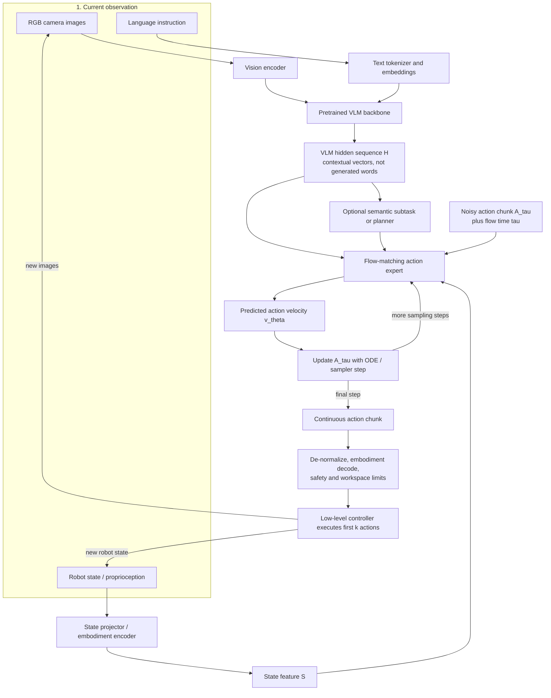

# The Core Pipeline of Modern Vision-Language-Action Models

## 1. The short version

A modern VLA with an action expert usually has two connected parts:

1. A pretrained **vision-language model (VLM)** processes camera images and the language instruction.
2. A robot-specific **action expert** combines the VLM's hidden features with proprioception, noisy candidate actions, and the flow timestep to generate a continuous action chunk.

The VLM usually does **not** output a sentence before the robot acts. Its useful output is normally a sequence of continuous hidden vectors:

$$
H = [h_1, h_2, \ldots, h_N],
\qquad
H \in \mathbb{R}^{N \times d_{\text{VLM}}}
$$

Each row is the contextual hidden state of one visual or text position. These are not vocabulary token IDs and are not motor commands.

Robot state is also not always inserted directly into the VLM. In many modern flow-based architectures, image and language go through the VLM first, while proprioception is projected separately and fused later inside the action expert.



**Important:** this is a logical dataflow diagram. Some implementations compute the VLM context first and then run a separate action Transformer, while others couple the VLM and action-expert Transformer layers more tightly.

Read the diagram as two loops:

- The **inner flow-sampling loop** repeatedly converts a noisy action tensor into a coherent trajectory.
- The **outer control loop** executes part of that trajectory, observes the robot again, and replaces the remaining plan with a corrected chunk.

An explicit planner is useful for long tasks, but it is not required in every VLA. Planning can remain implicit in hidden features, appear as a textual subtask, or be handled by a separate module.

---

## 2. Main modules

| Module                           | Input                                              | Main function                                                           | Output                        |
| -------------------------------- | -------------------------------------------------- | ----------------------------------------------------------------------- | ----------------------------- |
| **Vision encoder**         | Camera images                                      | Converts image patches into visual embeddings                           | Visual token vectors          |
| **Text embedding path**    | Instruction text                                   | Converts token IDs into text embeddings                                 | Text token vectors            |
| **VLM backbone**           | Visual and text embeddings                         | Contextualizes vision according to the instruction                      | Hidden sequence\(H\)          |
| **State adapter**          | Joint, gripper, end-effector, base, or force state | Normalizes and projects robot-specific numbers                          | State feature\(S\)            |
| **Planner** *(optional)* | VLM context and task history                       | Selects the next semantic subtask                                       | Textual or hidden subtask     |
| **Action expert**          | \(H\), \(S\), noisy actions, flow time             | Predicts how the noisy trajectory should move toward a valid trajectory | Action velocity field         |
| **Action decoder**         | Normalized action chunk                            | Converts shared output format to the robot's command format             | Joint or end-effector targets |
| **Low-level controller**   | Robot targets                                      | Executes commands under hardware control and safety limits              | Physical movement             |

The exact boundary between these modules varies. In particular, **state fusion** and **VLM fine-tuning** are design choices rather than one universal rule.

---

## 3. From image and language to VLM hidden space

### 3.1 Images become visual embeddings

Each camera image is divided into patches and processed by a vision encoder such as a Vision Transformer.

```text
image
  → patches
  → vision encoder
  → [v1, v2, ..., vm]
```

Multiple cameras produce multiple groups of visual embeddings. A front camera may describe the global scene, while a wrist camera provides a close view of the gripper and contact region.

The vision encoder does not normally emit explicit symbols such as:

```text
object = mug
grasp point = handle
```

Instead, it emits continuous vectors from which later Transformer layers can recover semantic and spatial information.

### 3.2 Language becomes text embeddings

The instruction is tokenized normally:

```text
"put the red mug on the tray"
    → token IDs
    → [l1, l2, ..., ln]
```

Language determines which parts of the scene are relevant. The same image should lead to different actions for:

```text
"pick up the mug"
"move around the mug"
"point at the mug"
```

### 3.3 The VLM contextualizes all visual-language positions

The visual and text embeddings enter the VLM Transformer:

$$
X_0 = [V;L]
$$

After \(L\) Transformer layers:

$$
H = \operatorname{VLM}(X_0)
  = [h_1,h_2,\ldots,h_N]
$$

where:

- \(N\) is the number of retained visual and text positions;
- \(d_{\text{VLM}}\) is the VLM hidden width;
- each \(h_i \in \mathbb{R}^{d_{\text{VLM}}}\) is a contextual hidden vector.

Through attention, a visual position corresponding to the mug can become related to the text position for “mug,” while the text representation for “put” can attend to the mug and tray regions.

Conceptually, the hidden sequence can encode information corresponding to:

- which object matches “red mug”;
- which region corresponds to the tray;
- which object is the task target;
- which visual regions are obstacles;
- what interaction the instruction requests.

These facts are generally **distributed across vectors and dimensions**. The model does not necessarily store them as a readable object list or scene graph.

### 3.4 “VLM then action expert” is sometimes only a conceptual boundary

The simple diagram suggests:

```text
VLM
  → final hidden sequence H
  → action expert
```

That is accurate for architectures such as GR00T N1, where the VLM output tokens are passed to a downstream DiT.

However, tightly integrated models can couple the two streams more directly. In a π0-style architecture:

```text
image and language prefix
        ↕ attention across Transformer layers
state, noised-action, and time suffix
```

The VLM prefix and action-expert suffix are processed with coordinated Transformer layers. The policy-specific suffix can use prefix information throughout the network rather than waiting for one final VLM tensor to be exported.

Therefore, `H` should be understood as a useful abstraction:

> all contextual vision-language features made available to the action policy.

Depending on the implementation, this can mean:

- the final VLM hidden sequence;
- projected VLM output tokens;
- cached per-layer key/value features;
- prefix representations jointly attended by action-expert layers.

---

## 4. What exactly is a hidden state?

### 4.1 It is the output vector at a token position

Suppose the VLM input sequence contains:

```text
[visual 1] [visual 2] ... [visual m] [put] [the] [mug]
```

At the input, every position is represented by an embedding. After self-attention and feed-forward layers, every position has an updated contextual vector:

```text
visual position 17 → h17
text position "mug" → hm+3
```

A hidden state is therefore a vector such as:

```text
h17 = [0.31, -0.82, 1.14, ..., 0.07]
```

The values themselves are not human-readable. Their meaning is learned and distributed.

### 4.2 Hidden vectors are not generated output tokens

A language model normally converts a hidden state into vocabulary logits:

$$
\text{logits} = W_{\text{LM}}h_i
$$

and then selects a word token.

```text
hidden vector
    → LM head
    → vocabulary probabilities
    → generated word
```

A flow-based VLA usually bypasses this language-generation step for low-level control:

```text
VLM hidden sequence H
    → action expert
    → continuous action trajectory
```

Therefore, saying that the action expert uses the VLM's “output tokens” can be ambiguous. A clearer statement is:

> The action expert consumes the VLM's **output hidden vectors at the visual and text token positions**.

### 4.3 The hidden space is usually a sequence, not one scene vector

The context usually has shape:

$$
H \in \mathbb{R}^{B \times N \times d_{\text{VLM}}}
$$

where \(B\) is batch size.

Keeping a sequence preserves location-specific information. A visual position covering the mug can remain distinct from a visual position covering the tray, even though attention allows them to exchange information.

Some architectures pool or compress \(H\), but it should not be assumed that every VLA reduces the scene to a single vector.

---

## 5. How robot state is fused

Images show the outside world, but they do not reliably specify the robot's exact internal configuration. A policy may additionally receive:

```text
joint angles
joint velocities
end-effector position and orientation
gripper opening
mobile-base velocity
force or torque readings
```

Let the normalized robot state be:

$$
s_t \in \mathbb{R}^{d_s}
$$

A learned projector converts it to one or more embeddings:

$$
S = f_{\text{state}}(s_t)
$$

The important distinction is **where \(S\) is inserted**.

### 5.1 Late fusion inside the action expert

This is common in modern flow-matching VLAs.

```text
images + instruction
    → VLM
    → hidden context H

robot state
    → state projector
    → S

H + S + noisy actions + flow time
    → action expert
```

In this design, the VLM itself may process only vision and language. Robot state first interacts with the VLM context inside the action expert.

Two representative patterns are:

- **π0-style prefix/suffix processing:** image and language form a VLM prefix. The projected state, noised action chunk, and flow-time information form policy-specific suffix inputs. The action expert uses attention to combine the suffix with the prefix context.
- **GR00T-style cross-attention:** the VLM outputs a sequence of vision-language vectors. A DiT processes robot-state and noised-action encodings while cross-attending to the VLM output sequence.

This is more accurate than saying that every modern VLA simply appends a state token to the original VLM input.

### 5.2 Early fusion inside the VLM

Another possible design inserts state embeddings before or during the VLM:

```text
[visual tokens] [text tokens] [state tokens]
                → VLM
                → state-aware hidden sequence
```

Now proprioception can influence visual-language reasoning throughout the VLM layers.

This approach can be useful, but it is not universal. Many action-expert architectures use late fusion because it keeps the pretrained VLM interface cleaner and isolates robot-specific dimensions inside the policy module.

### 5.3 Multiple state tokens and embodiment adapters

A state vector can be represented as:

- one embedding for the entire state;
- separate joint, gripper, force, or base embeddings;
- a fixed-width padded representation;
- an embodiment-specific encoder.

Cross-embodiment policies often use separate state encoders and action decoders because robots have different numbers of joints and different control conventions.

The shared action expert can then learn general behavior patterns while adapters handle robot-specific input and output formats.

---

## 6. Flow matching inside the action expert

### 6.1 Action chunk

Instead of predicting only the next command, the policy commonly predicts a horizon of \(T\) future actions:

$$
A =
[a_t,a_{t+1},\ldots,a_{t+T-1}]
\in \mathbb{R}^{T \times d_a}
$$

For a 7D end-effector controller:

$$
a_t =
[\Delta x,\Delta y,\Delta z,
 \Delta roll,\Delta pitch,\Delta yaw,
 gripper]
$$

Other robots may use joint targets, joint deltas, base velocity, bimanual commands, or full-body targets.

### 6.2 Training interpolation

A simplified flow-matching formulation begins with:

- demonstration action chunk \(A_1\);
- Gaussian noise \(A_0 \sim \mathcal{N}(0,I)\);
- sampled flow time \(\tau \in [0,1]\).

Construct an intermediate noisy chunk:

$$
A_\tau = (1-\tau)A_0 + \tau A_1
$$

For this straight interpolation, the target velocity is:

$$
u_\tau = A_1 - A_0
$$

The action expert predicts:

$$
v_\theta =
v_\theta(A_\tau,\tau,H,S,z)
$$

where \(z\) is an optional semantic subtask.

A typical objective is:

$$
\mathcal{L}_{\text{flow}}
=
\mathbb{E}
\left[
\left\|
v_\theta(A_\tau,\tau,H,S,z)-u_\tau
\right\|_2^2
\right]
$$

The precise path, weighting, and parameterization can differ across papers, but the central idea is the same: learn a vector field that moves noisy trajectories toward demonstrated robot trajectories.

### 6.3 Inference

At inference, begin with noise:

$$
A_0 \sim \mathcal{N}(0,I)
$$

Then integrate:

$$
\frac{dA_\tau}{d\tau}
=
v_\theta(A_\tau,\tau,H,S,z)
$$

using several numerical update steps until \(\tau=1\).

```text
random action chunk
    → action-expert velocity
    → update
    → action-expert velocity
    → update
    → final continuous action chunk
```

The model is not denoising words. It is refining a tensor whose rows are future robot commands.

---

## 7. Does the VLM need to be retrained for VLA control?

### 7.1 Usually initialized from a pretrained VLM

A modern VLA normally does not train its visual-language knowledge from scratch.

```text
web-scale image-text pretraining
    → pretrained VLM
    → add state adapter and action expert
    → train on robot demonstrations
```

The pretrained VLM supplies object, language, and visual-semantic knowledge. The action expert supplies the continuous control mechanism.

At minimum, the newly added action module must be trained on robot data. Whether the VLM weights also change depends on the training recipe.

### 7.2 Full or joint end-to-end training

If the VLM is unfrozen, gradients from the action loss can propagate through:

```text
flow loss
   ↑
action expert
   ↑
VLM backbone
   ↑
vision encoder
```

This can make the VLM hidden sequence more useful for control. For example, features can become more sensitive to contact regions, object affordances, reachability, and task-relevant geometry.

GR00T N1 explicitly describes its VLM and DiT as tightly coupled and jointly optimized end-to-end. π0 is built on pretrained PaliGemma and then trained as a robot policy with its action expert.

Joint training does **not** mean that the VLM is trained from random initialization. It means pretrained weights continue to receive robot-training gradients.

### 7.3 Partial fine-tuning

A cheaper option updates only:

- LoRA weights;
- adapters;
- selected upper Transformer layers;
- the state projector and action expert.

```text
mostly frozen pretrained VLM
    + trainable LoRA/adapters
    + trainable action expert
```

This reduces memory and can preserve more of the original VLM knowledge.

OpenVLA-OFT, for example, uses LoRA-based VLA fine-tuning rather than requiring full-parameter training.

### 7.4 Frozen VLM

The VLM can also remain fixed:

```text
frozen VLM → fixed hidden context H
trainable action expert → learns how to use H
```

This is cheaper and protects the pretrained representation, but the VLM cannot reshape its hidden space in response to the action loss.

A frozen backbone can still work when its existing features are sufficiently informative and the action module is expressive. GR00T N1.5 is an example in which the VLM is frozen while the downstream policy learns to use its embeddings.

### 7.5 Correct conclusion

The correct statement is not:

> Every VLM must be fully retrained when converted into a VLA.

It is:

> A pretrained VLM is normally reused. The robot-specific adapters and action expert must be trained, while the VLM may be fully fine-tuned, partially adapted, or frozen depending on the architecture, data, compute budget, and need to preserve pretrained knowledge.

---

## 8. Planning and reasoning

### 8.1 Implicit planning

For short tasks, the VLM context can directly condition the action expert:

```text
image + "pick up the cup"
    → hidden context H
    → action chunk
```

There is no visible list of steps. Task decomposition may remain implicit in hidden features and learned control behavior.

This is fast and simple, but long tasks can require stronger memory or explicit progress tracking.

### 8.2 Explicit semantic subtask

A hierarchical model may predict a short semantic subtask:

```text
overall task: "clean the kitchen"
current scene: dirty plate on counter
next subtask: "pick up the dirty plate"
```

The low-level action expert then generates movement conditioned on that subtask.

π0.5 is a representative design that combines high-level semantic prediction with continuous low-level action generation.

### 8.3 Separate planner

Earlier modular systems used clearer boundaries:

```text
LLM/VLM planner
    → symbolic skill or spatial target
    → motion planner or skill controller
    → robot
```

This can improve interpretability and reuse conventional control modules, but errors can accumulate across interfaces.

Reasoning does not necessarily mean visible chain-of-thought text. It may refer to implicit semantic computation, a predicted subtask, or an external planning module.

---

## 9. Other action-generation approaches

### 9.1 Parallel continuous regression

An action head can predict the full chunk in one pass:

$$
\hat{A} = f_\theta(H,S)
$$

```text
context
    → [action t, action t+1, ..., action t+T-1]
```

OpenVLA-OFT shows that parallel continuous prediction with action chunking can be fast and effective without iterative flow sampling.

### 9.2 Discrete autoregressive action tokens

Earlier end-to-end VLAs often quantized motor values:

```text
continuous actions
    → numeric bins
    → vocabulary token IDs
    → next-token prediction
```

The predicted IDs are then converted back into continuous numbers.

This reuses the language-model output head and cross-entropy objective, but token-by-token decoding can be slow for high-frequency action chunks.

### 9.3 FAST-style compressed tokens

FAST compresses action trajectories before autoregressive tokenization, reducing repeated information and the number of generated tokens.

Therefore, “action token” should be used carefully:

- in a narrow implementation sense, it is a discrete vocabulary ID representing action information;
- in some surveys, it is used more broadly for any action-related representation;
- flow-based VLAs normally output continuous action tensors, not literal language tokens.

---

## 10. Decoding, execution, and feedback

The generated action chunk is usually normalized. Before execution, the system must:

1. convert values back to physical units;
2. select the correct embodiment-specific dimensions;
3. enforce joint, velocity, workspace, and safety limits;
4. send targets to the low-level controller.

The robot generally executes only part of the chunk:

```text
predict 16 actions
    → execute first 2–8
    → capture new images and state
    → predict a replacement chunk
```

This is receding-horizon closed-loop control. It prevents the robot from blindly executing an old trajectory after the scene changes or a grasp deviates from expectation.

The instruction may remain constant and can sometimes be cached. Images and proprioception must be refreshed after movement.

---

## 11. Full example: raw input to physical motion

The numbers below are illustrative rather than copied from one model.

### Step 1: raw observation

```text
Instruction:
"Put the red mug on the tray."

Images:
I_front = front RGB camera
I_wrist = wrist RGB camera

Robot state:
s_t = [joint angles, joint velocities, gripper opening]
```

### Step 2: visual-language encoding

```text
I_front, I_wrist
    → patches
    → visual embeddings V

instruction
    → token IDs
    → text embeddings L

[V ; L]
    → VLM Transformer
    → H = [h1, h2, ..., hN]
```

`H` is a sequence of contextual vectors. It is not the sentence “the mug is on the left,” although its vectors may encode information needed to derive that relation.

### Step 3: state encoding

```text
s_t
    → normalize
    → state projector
    → S
```

In a late-fusion architecture, `S` has not yet changed `H`. Both are supplied to the action expert.

### Step 4: flow input

```text
A_0 ~ Gaussian noise
tau = current flow time

condition:
- VLM hidden sequence H
- state feature S
- optional semantic subtask z
```

### Step 5: action-expert refinement

```text
(A_tau, tau, H, S, z)
    → action expert
    → predicted velocity v_theta
    → numerical update of A_tau
    → repeat
    → final chunk A
```

Assume each action uses:

```text
[Δx, Δy, Δz, Δroll, Δpitch, Δyaw, gripper]
```

An action chunk may begin as:

```text
a_t   = [+0.012, -0.004, +0.006, 0.000, +0.010, -0.020, 1.0]
a_t+1 = [+0.011, -0.003, +0.005, 0.000, +0.008, -0.018, 1.0]
a_t+2 = [+0.009, -0.002, +0.003, 0.000, +0.005, -0.012, 1.0]
...
```

The early actions move toward the mug while the gripper remains open. Later replanning cycles close the gripper, lift the mug, move toward the tray, and release it.

### Step 6: execution and replanning

```text
normalized action chunk
    → de-normalize
    → embodiment decoder
    → safety limits
    → execute first k actions
    → receive new images and state
    → rerun the model
```

The complete transformation is:

```text
pixels + instruction
    → contextual VLM hidden vectors H

robot body numbers
    → projected state features S

H + S + noisy action chunk + flow time
    → action expert
    → continuous action chunk
    → robot-specific commands
    → physical movement
    → new pixels and body numbers
```

---

## 12. Architecture comparison

| Design                                  | Where image and language are fused                  | Where robot state is fused                                   | How actions are generated        | Typical VLM training                                                             |
| --------------------------------------- | --------------------------------------------------- | ------------------------------------------------------------ | -------------------------------- | -------------------------------------------------------------------------------- |
| **π0-style flow VLA**            | PaliGemma/VLM prefix                                | Policy suffix/action expert                                  | Flow-matched continuous chunk    | Pretrained VLM adapted with robot policy; downstream freezing/LoRA options exist |
| **GR00T N1-style dual system**    | Eagle VLM                                           | State/action encoders inside DiT; DiT attends to VLM outputs | DiT flow matching                | N1 jointly optimized end-to-end                                                  |
| **Frozen-backbone action expert** | Frozen pretrained VLM                               | Downstream policy module                                     | Flow, diffusion, or regression   | VLM fixed; action module trained                                                 |
| **OpenVLA-OFT**                   | OpenVLA backbone                                    | Optional proprioception projector in fine-tuning setup       | Parallel continuous action chunk | LoRA fine-tuning                                                                 |
| **Early state-fusion VLA**        | Vision, language, and state enter a shared backbone | Inside VLM layers                                            | Any action head                  | Usually requires at least adapters or backbone tuning                            |

The key architectural lesson is:

> “VLM context” means contextual hidden vectors. “State fusion” describes how projected robot-state vectors interact with those hidden vectors. In many modern action-expert models, that interaction happens in the action expert rather than inside the original VLM.

---

## Sources

- [π0: A Vision-Language-Action Flow Model for General Robot Control](https://arxiv.org/abs/2410.24164)
- [π0.5: A Vision-Language-Action Model with Open-World Generalization](https://arxiv.org/abs/2504.16054)
- [GR00T N1: An Open Foundation Model for Generalist Humanoid Robots](https://arxiv.org/abs/2503.14734)
- [GR00T N1.5 architecture update](https://research.nvidia.com/labs/gear/gr00t-n1_5/)
- [OpenVLA](https://arxiv.org/abs/2406.09246)
- [OpenVLA-OFT](https://arxiv.org/abs/2502.19645)
- [FAST: Efficient Action Tokenization for Vision-Language-Action Models](https://arxiv.org/abs/2501.09747)
