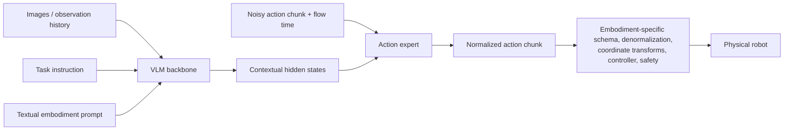

# Textual Embodiment in Vision-Language-Action Models

## Research question and scope

**Question.** What does it mean to represent a robot embodiment in text inside a
Vision-Language-Action (VLA) model, how does that conditioning affect action generation, and
which other VLAs use the same idea?

**Scope.** This report uses *textual embodiment* as a narrow operational term: a readable text or
structured-text prompt that describes the acting platform and its control context, and whose tokens
condition the VLA policy. It does not mean task language, a learned soft prompt, a proprioceptive
state vector, or a URDF encoded as numerical/graph tokens. The phrase is not yet a standardized VLA
taxonomy; the clearest implementation examined here is Qwen-VLA's *embodiment-aware prompt
conditioning*.

Research performed on **2026-07-21**. The starting local analysis was
[Qwen-VLA Architecture, Training, and End-to-End Dataflow](../../specific_qwen_version/qwen_vla.md).
Claims below were then checked against primary papers and official repositories.

## Short answer

Textual embodiment is best understood as a **routing and conditioning interface** , a **System Prompt** for the Robot. It tells a shared policy which robot/control distribution is active: for example, the platform identity, single- or dual-arm configuration, mobile base, control frequency, action horizon, and sometimes the action parameterization. The text is tokenized by the VLM, and its contextual hidden states condition the action generator.

It is **not a complete physical specification**. Text alone does not define channel order, units, coordinate frames, normalization statistics, kinematics, joint limits, controller behavior, or safety constraints. Those semantics still live in the dataset schema and robot adapter.

**Verified:** other VLAs do use closely matching implementations. The clearest full/strong matches found are **Green-VLA**, which uses a structured embodiment/control-type prompt, and **Qwen-RobotManip**, which uses explicit structured-text fields for robot identity and temporal execution context. 

Two partial matches are also informative: **X-VLA's language-prompt baseline** uses readable hardware/camera/frequency text, while **CHORUS** prepends a robot identity and role toone shared VLA.

Qwen-RobotManip is from a related Qwen research lineage; Green-VLA, X-VLA, and CHORUS provide independent evidence. Several other models use *adjacent* mechanisms—learned soft prompts, state vectors, dataset IDs, or kinematic tokens—but these should not be mislabeled as textual embodiment.

## The interface being modeled

A normal task-conditioned policy can be written as

$$
\hat{A} \sim p_\theta(A \mid O, I),
$$

where $O$ is the visual observation and $I$ is the task instruction. Textual embodiment adds an
explicit condition $E_{\text{text}}$:

$$
\hat{A} \sim p_\theta(A \mid O, I, E_{\text{text}}).
$$

For an action-expert VLA, the logical dataflow is:



The text affects the learned distribution selected by the model. The adapter still gives the output
numbers their executable physical meaning.

## Qwen-VLA as the clearest case

The [Qwen-VLA paper](https://arxiv.org/abs/2605.30280) prepends every training example with a
natural-language template containing:

- a robot/platform tag;
- single- or dual-arm configuration;
- optional waist and mobile base;
- control frequency;
- predicted action-chunk length;
- the task instruction.

The prompt tokens are processed by the VLM. Their hidden states are supplied to the DiT action
expert together with a noisy action chunk and flow timestep. This makes textual embodiment an
input-side condition, not a generated explanation and not a robot command by itself.

Qwen-VLA shares a fixed $H \times K$ tensor interface and a masked loss across datasets, but it does
**not** convert every dataset into one physical action space. Each source retains its native action
convention, uses per-dataset quantile normalization, and occupies only its valid output channels. The
prompt helps the shared network distinguish these learned conventions; the dataset metadata and
deployment adapter remain the authoritative definitions of them.

This is why the most accurate mental model is:

> One network learns multiple embodiment-specific action languages; the text selects which learned
> language is active, while the robot adapter interprets and executes it.

That sentence is an interpretation, not a formal term introduced by the authors.

### Relation to proprioception

Textual embodiment answers **what body/control context is active**. Proprioception answers **what
state that body is in now**. They are different signals.

Qwen-VLA reports a RoboTwin-2.0 ablation in which adding joint state either as discretized prompt
text or directly to the DiT produced only small gains over no state. The default model therefore omits
proprioception and keeps the embodiment prompt as its platform-specific model input. This is evidence
for that evaluated setting, not evidence that state is generally unnecessary. The authors' explanation
depends on multi-view images exposing robot configuration and on relative-action prediction reducing
the need for an absolute state reference.

By contrast, [$\pi_0$](https://arxiv.org/abs/2410.24164) explicitly includes the robot's joint-angle
vector in its observation and gives robotics-specific state/action tokens to an action expert. State can
remain important under occlusion, contact, high-speed dynamics, absolute joint control, or partial
observability.

## Other VLAs with the same implementation pattern

The answer is **yes**, but exact matches are still a short list. The table distinguishes readable
embodiment/control prompts from merely prompt-like latent mechanisms.

| Model                                                             | What is placed in the prompt                                                                                                                                                          | How close is it to Qwen-VLA?                                                                                                           | Important difference                                                                                                                                                                   |
| ----------------------------------------------------------------- | ------------------------------------------------------------------------------------------------------------------------------------------------------------------------------------- | -------------------------------------------------------------------------------------------------------------------------------------- | -------------------------------------------------------------------------------------------------------------------------------------------------------------------------------------- |
| [Green-VLA](https://arxiv.org/abs/2602.00919)                      | A structured embodiment/control-type prompt specifying the active effectors and action parameterization, such as arm/hand configuration, joint versus Cartesian control, and mobility | **Strong independent match**: text/control tokens condition one multi-embodiment VLA                                             | Also consumes proprioceptive state and maps actions into a fixed-semantic 64-dimensional unified space; text is one part of a larger alignment contract                                |
| [Qwen-RobotManip](https://arxiv.org/abs/2606.17846)                | Structured fields for`embodiment`, task `instruction`, speed bin, `fps`, and camera-view direction                                                                              | **Strong match, related research lineage**: readable structured text conditions the Qwen-VL backbone and diffusion action expert | Uses a canonical 80-dimensional representation, camera-frame motion alignment, optional in-context action history, 15% field dropout, and reports prompt-component ablations           |
| [X-VLA language-prompt baseline](https://arxiv.org/abs/2510.10274) | Scripted text such as`Embodiment: Single Franka, Camera Setup: Top View, Freq: 30Hz`, concatenated with the task instruction                                                        | **Partial independent match**: natural-language embodiment metadata enters the pretrained VLM encoder                            | This is a preliminary baseline, not X-VLA's final design; it omits explicit action convention, normalization, and horizon, and the authors prefer learned soft prompts for scalability |
| [CHORUS](https://arxiv.org/abs/2606.12352)                         | A robot-identifying prefix naming the embodiment, such as`<ARX>` or `<Kinova>`, plus that robot's natural-language role in the collaborative task                                 | **Partial independent match**: text identifies which robot one shared VLA instance controls                                      | The prompt is closer to an identity/role tag than a physical control specification; it does not encode DoF, frames, units, normalization, or action type                               |
| [Qwen-VLA](https://arxiv.org/abs/2605.30280)                       | Natural-language sentence containing platform, arm configuration, waist/base flags, FPS, horizon, and task                                                                            | **Reference implementation**                                                                                                     | Preserves source-native action semantics and relies on per-dataset normalization rather than a single fixed-semantic physical space                                                    |

### Green-VLA

Green-VLA's policy fuses RGB, proprioceptive state, task language, and a structured
embodiment/control-type prompt before its flow-matching action expert. Its control prompt makes the
active body and control representation explicit while a semantic action layout and validity mask align
heterogeneous robots. It is therefore the closest independent example found: it uses textual control
conditioning, but does not expect text to replace state or the action mapping.

### Qwen-RobotManip

Qwen-RobotManip gives a particularly concrete structured-text example:

```text
embodiment: robot_aloha
instruction: Take the toy off the table and put it on the mat.
speed: 1000
fps: 30
camera view direction: arm side
```

Its paper also randomly drops the embodiment, speed, and FPS fields during training and reports an
ablation separating embodiment tag, FPS, and in-context history. This is stronger evidence that prompt
fields contribute than Qwen-VLA's results alone, although the two models share related authors and a
Qwen backbone.

### X-VLA's language-prompt baseline

X-VLA is commonly described as a soft-prompt VLA, but its paper first evaluates a readable language
baseline. Each domain receives a scripted description of embodiment, camera arrangement, and
frequency, concatenated with the task instruction and encoded by Florence-Base. Examples distinguish
single versus dual Franka, UR, AgileX, top/left/right/wrist views, and 15 versus 30 Hz.

This baseline confirms that natural-language hardware conditioning predates Qwen-VLA. It is not the
released X-VLA design: the authors argue that carefully scripted descriptions are hard to maintain at
scale and choose learned embeddings instead. It is also narrower than Qwen-VLA because it does not
formally describe action horizon or the complete control convention.

### CHORUS

CHORUS adapts one $\pi_{0.5}$-based VLA policy to a team of heterogeneous robots. At each timestep,
each robot independently receives only its local observation and a robot-identifying prompt. The
prompt names the embodiment and states its role—for example, a `<YAM>` prefix followed by that
robot's part of a collaborative lifting task—so a shared forward pass does not have to infer robot
identity from pixels.

This is genuine textual embodiment conditioning, but at a weaker level than Qwen-VLA: the prompt
routes identity and role, not the action schema or kinematics.

### Search conclusion

**Verified as of 2026-07-21:** Green-VLA and Qwen-RobotManip implement the same broad pattern of
readable embodiment/control metadata conditioning a VLA. X-VLA's preliminary language baseline and
CHORUS are partial matches. No other model found matches Qwen-VLA simultaneously on all three
features: a natural-language robot description, control frequency/horizon/convention metadata, and that
text serving as the main platform-specific condition for one shared action decoder. This is a bounded
search conclusion, not proof that no other example exists in a fast-moving literature. Qwen-VLA also
remains distinctive in combining manipulation, navigation, and human trajectory targets while
preserving source-native action conventions.

## Related approaches that are not the same

| Approach                                          | Example                                                                                                   | What conditions the model                                                      | Why it is not textual embodiment                                                                                                                                                      |
| ------------------------------------------------- | --------------------------------------------------------------------------------------------------------- | ------------------------------------------------------------------------------ | ------------------------------------------------------------------------------------------------------------------------------------------------------------------------------------- |
| Learned soft prompt                               | [X-VLA final model](https://arxiv.org/abs/2510.10274)                                                      | A separate set of learned embeddings for each data source/embodiment           | Unlike its preliminary language baseline, the final prompt vectors are not readable and do not explicitly state physical semantics; adapting a new robot learns new prompt parameters |
| Explicit state conditioning                       | [$\pi_0$](https://arxiv.org/abs/2410.24164)                                                              | Joint-angle state projected into robotics-specific tokens                      | Describes instantaneous configuration numerically, not robot identity/control convention in text                                                                                      |
| Dataset-specific normalization and decoding       | [Open X-Embodiment / RT-X](https://www.jiajunwu.com/papers/openx_icra.pdf)                                 | Coarsely aligned action vector plus per-dataset normalization/de-normalization | The physical interpretation is selected by the data/deployment path, not by a textual robot description                                                                               |
| Structural morphology encoding                    | [Embedding Morphology into Transformers for Cross-Robot Policy Learning](https://arxiv.org/abs/2603.00182) | Per-joint kinematic tokens, topology-aware attention, and joint attributes     | Encodes the kinematic graph directly; more structural than text and intentionally adds an inductive bias text does not provide                                                        |
| Instruction-only prompt plus external adapter key | [OpenVLA](https://github.com/openvla/openvla)                                                              | Task instruction in text; an external`unnorm_key` selects action statistics  | The instruction says what to do, while embodiment/action interpretation remains outside the language prompt                                                                           |

These mechanisms are complementary. A robust multi-robot system may use readable textual metadata for
routing, numerical state for the current configuration, structural morphology tokens for kinematics,
and an explicit adapter for execution.

## What the current evidence supports

### Verified

- Text/control tokens can condition one shared action generator across multiple training
  embodiments in Qwen-VLA, Green-VLA, and Qwen-RobotManip.
- Qwen-VLA's official report and
  [official repository](https://github.com/QwenLM/Qwen-VLA) describe one set of weights and no
  per-platform output heads.
- Qwen-VLA still uses per-dataset normalization and source-native action conventions.
- Qwen-RobotManip reports an embodiment-prompt design and component ablations; Green-VLA combines
  its control prompt with an explicitly unified action space.
- X-VLA's paper implements readable embodiment/camera/frequency prompts as a preliminary baseline,
  and CHORUS conditions a shared policy on textual robot identity and role.

### Inferred

- The prompt likely works partly as a semantically initialized dataset/robot identifier. Repeated
  co-occurrence lets the network associate text fields with observation statistics, active channels,
  action scales, and temporal patterns.
- Human-readable compositional fields may be more reusable than an opaque dataset ID when a new
  platform shares seen attributes, but existing evaluations do not establish a general law of
  compositional transfer.
- Text is most useful for slowly changing or episode-level metadata. Fast continuous state is usually
  better represented numerically.

### Unknown or not established

- Qwen-VLA does not isolate the effect of each prompt field or prompt wording in a dedicated
  ablation.
- Its reported generalist benchmark model is trained jointly on the evaluated embodiments. Its ALOHA
  real-robot results use ALOHA demonstrations for fine-tuning, and its DOMINO zero-shot result tests
  unseen dynamics rather than an arbitrary unseen robot. These results do not prove prompt-only control
  of a completely novel morphology.
- The published Qwen-VLA template names the robot, arm configuration, FPS, and horizon, but does not
  explicitly serialize channel order, units, coordinate frame, rotation representation, gripper
  convention, or normalization statistics. Prose that says the prompt specifies the “control
  convention” should therefore be read together with the external dataset/adapter contract.
- As accessed on 2026-07-21, the official Qwen-VLA repository contains the research overview and
  assets but not enough implementation code to audit exact runtime prompt construction and decoding.

## Recommended data and deployment contract

Text should be a **derived view of structured embodiment metadata**, not the only source of truth.
A training record should retain machine-checkable fields such as:

```yaml
embodiment_id: aloha_v2
morphology:
  arms: 2
  mobile_base: false
observation:
  cameras: [front, left_wrist, right_wrist]
state_schema: joint_position_12d
action:
  type: absolute_joint_position
  channel_order: [left_j1, left_j2, ..., right_gripper]
  unit: radian
  reference_frame: joint_space
  rotation: null
  gripper_convention: 0_closed_1_open
control_hz: 30
horizon: 16
normalization_id: aloha_v2_q01_q99
adapter_version: aloha_v2_controller_3
```

Generate the model-facing prompt deterministically from those fields, for example:

```text
The robot is ALOHA with dual arms and no mobile base.
Control uses absolute joint positions at 30 Hz.
Predict the next 16 actions for: put the red cup in the bin.
```

The structured record must remain authoritative. A deployment adapter should validate the prompt
profile against the action schema, normalization statistics, expected cameras, controller version, and
safety limits before inference. Changing only the prose while leaving those components inconsistent is
not embodiment transfer; it is a schema mismatch.

## Conclusion

Textual embodiment is a useful, low-friction way to expose episode-level robot and control metadata to
the language-conditioned part of a VLA. It can let one policy route among multiple learned action
distributions without per-platform model heads. It should not be mistaken for a universal robot
description or a substitute for proprioception, morphology, action semantics, and the control adapter.

Other VLAs do implement the same broad idea—most clearly Green-VLA and Qwen-RobotManip—but the
field currently uses several incompatible meanings of “prompt.” Reports and code should always say
whether a prompt is readable text, a learned latent vector, a categorical embodiment ID, or a
structured kinematic representation.

## Primary sources

1. Wang et al. **Qwen-VLA: Unifying Vision-Language-Action Modeling across Tasks, Environments,
   and Robot Embodiments.** arXiv:2605.30280, 2026.
   [Paper](https://arxiv.org/abs/2605.30280) ·
   [Official repository](https://github.com/QwenLM/Qwen-VLA). Accessed 2026-07-21.
2. Apanasevich et al. **Green-VLA: Staged Vision-Language-Action Model for Generalist Robots.**
   arXiv:2602.00919, 2026. [Paper](https://arxiv.org/abs/2602.00919) ·
   [Project](https://greenvla.github.io/). Accessed 2026-07-21.
3. Yuan et al. **Qwen-RobotManip Technical Report: Alignment Unlocks Scale for Robotic
   Manipulation Foundation Models.** arXiv:2606.17846, 2026.
   [Paper](https://arxiv.org/abs/2606.17846). Accessed 2026-07-21.
4. Zheng et al. **X-VLA: Soft-Prompted Transformer as Scalable Cross-Embodiment
   Vision-Language-Action Model.** arXiv:2510.10274, 2025.
   [Paper](https://arxiv.org/abs/2510.10274). Accessed 2026-07-21.
5. Black et al. **$\pi_0$: A Vision-Language-Action Flow Model for General Robot Control.**
   arXiv:2410.24164, revised 2026. [Paper](https://arxiv.org/abs/2410.24164). Accessed 2026-07-21.
6. Padalkar et al. **Open X-Embodiment: Robotic Learning Datasets and RT-X Models.** ICRA 2024.
   [Paper](https://www.jiajunwu.com/papers/openx_icra.pdf). Accessed 2026-07-21.
7. Suzuki et al. **Embedding Morphology into Transformers for Cross-Robot Policy Learning.**
   arXiv:2603.00182, 2026. [Paper](https://arxiv.org/abs/2603.00182). Accessed 2026-07-21.
8. Kim et al. **OpenVLA: An Open-Source Vision-Language-Action Model.** 2024.
   [Official repository](https://github.com/openvla/openvla). Accessed 2026-07-21.
9. Doshi et al. **CHORUS: Decentralized Multi-Embodiment Collaboration with One VLA Policy.**
   arXiv:2606.12352, 2026. [Paper](https://arxiv.org/abs/2606.12352). Accessed 2026-07-21.
