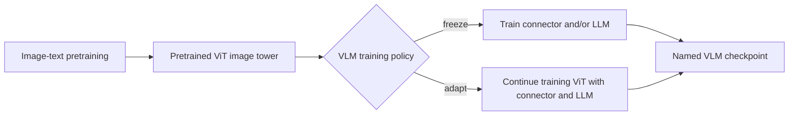

# Pretrained ViT Encoders Reused by VLMs

> **Question:** Which well-known pretrained ViT encoders are actually used by
> named VLMs, and how does each VLM use them?
>
> **Scope:** externally pretrained or reusable vision towers. This report
> distinguishes an exact checkpoint from a pretraining family, and a frozen
> tower from an initialization that is later adapted. Research date:
> 2026-07-21.

## Short answer

The most common starting points are not plain ImageNet ViTs. They are ViTs
whose features have already been aligned with language, especially **CLIP**,
**OpenCLIP**, **EVA-CLIP**, **SigLIP**, and **SigLIP 2**. A second useful class,
represented by **DINOv2**, is pretrained without paired text and contributes
strong spatial and semantic image features.

The name alone is insufficient. For example, these are three different cases:

```text
LLaVA          <- OpenAI CLIP ViT-L/14          (kept frozen)
Qwen-VL        <- OpenCLIP ViT-bigG             (initialized, then adapted)
MiniGPT-4      <- EVA-CLIP ViT-G/14 via BLIP-2  (kept frozen)
```

Likewise, “pretrained” does not imply “frozen.” PaliGemma starts from SigLIP but
jointly trains the vision encoder, while Prismatic keeps its SigLIP and DINOv2
towers frozen. The treatment must therefore be stated per VLM and per training
stage.

## What is being reused?

CLIP-like pretraining has two towers: an image encoder and a text encoder. A VLM
normally reuses the **ViT image tower**, discards the contrastive text tower,
and connects the image features to its own language model through a projector,
Q-Former, resampler, or similar adapter.



Three naming distinctions prevent most mistakes:

- **CLIP** below means the OpenAI model/checkpoint family. **OpenCLIP** is an
  independent open implementation and checkpoint ecosystem. **EVA-CLIP** uses
  the CLIP objective with EVA-based visual initialization. They are related
  recipes, not interchangeable weights. [CLIP][clip] [EVA-CLIP][eva-clip]
- `ViT-L/14`, `ViT-g/14`, or `ViT-So400m/14` describes architecture scale and
  patch size; it does not uniquely identify who pretrained the checkpoint.
- **SigLIP** replaces CLIP's batch-normalized softmax contrastive loss with
  independent sigmoid losses over image-text pairs. **SigLIP 2** is a later
  recipe that adds captioning, self-distillation, masked prediction, and online
  data curation. [SigLIP][siglip] [SigLIP 2][siglip2]

## Exact adoption map

### CLIP-family checkpoints

| Pretrained vision encoder | VLMs with direct evidence | How the VLM uses it |
| --- | --- | --- |
| OpenAI CLIP `ViT-L/14` | **LLaVA v1** | The CLIP tower is frozen in both alignment and visual-instruction tuning. Stage 1 trains the projection layer; Stage 2 trains the projector and LLM. [LLaVA, §§4.1-4.2][llava] |
| OpenAI CLIP `ViT-L/14@336px` (`openai/clip-vit-large-patch14-336`) | **LLaVA-1.5 7B/13B** | LLaVA-1.5 replaces the lower-resolution tower with the 336-pixel checkpoint and an MLP projector. The released 7B config records the exact tower and `unfreeze_mm_vision_tower: false`. [LLaVA-1.5][llava15] [official config][llava15-config] |
| OpenCLIP `ViT-bigG` | **Qwen-VL** and **Qwen-VL-Chat** | Qwen initializes from OpenCLIP rather than OpenAI CLIP. It trains the vision encoder plus adapter in Stage 1, trains the whole model in Stage 2, then freezes the vision encoder during supervised fine-tuning. [Qwen-VL, §§2.1 and 3.1-3.3][qwen-vl] |
| CLIP `ViT-L/14` or EVA-CLIP `ViT-g/14` | **BLIP-2** variants | Both are evaluated as frozen image encoders during BLIP-2 pretraining while the Q-Former learns the bridge. Some downstream task fine-tuning later updates the image encoder, so “BLIP-2 always freezes ViT” is too broad. [BLIP-2, §§3.4, 4.2-4.3][blip2] |
| EVA-CLIP `ViT-g/14` | **InstructBLIP** with Flan-T5-XL/XXL or Vicuna-7B/13B | It inherits the BLIP-2 tower, freezes both image encoder and LLM, and instruction-tunes the Q-Former. [InstructBLIP, §§2.3 and 2.6][instructblip] |
| EVA-CLIP `ViT-G/14` plus BLIP-2 Q-Former | **MiniGPT-4** | It freezes the inherited visual components and language model and trains only a new linear projection in its alignment stages. `G` versus `g` is the source papers' capitalization, not evidence of a different tower here. [MiniGPT-4, §3.1][minigpt4] |
| MetaCLIP-based custom encoder; exact public checkpoint not stated | **Llama 4 Scout** and **Llama 4 Maverick** | Meta says the vision encoder is based on MetaCLIP but was trained separately together with a frozen Llama model to adapt it to the LLM. This is a recipe lineage, not evidence that Llama 4 loaded an off-the-shelf MetaCLIP checkpoint. [Meta Llama 4 announcement][llama4] |

The Qwen-VL row is a common source of incorrect diagrams: writing only “CLIP
ViT” loses both the **OpenCLIP** checkpoint identity and the fact that the tower
is adapted before being frozen for supervised fine-tuning.

### SigLIP-family checkpoints

| Pretrained vision encoder | VLMs with direct evidence | How the VLM uses it |
| --- | --- | --- |
| SigLIP `ViT-So400m/14` | **PaliGemma** and **PaliGemma 2** | PaliGemma combines an off-the-shelf SigLIP-So400m tower with Gemma 2B. Stages 1 and 2 train the whole model, including the vision encoder; downstream transfer normally fine-tunes all parameters. PaliGemma 2 explicitly reuses the same SigLIP-So400m family with Gemma 2 models from 2B through 27B. [PaliGemma, §§3.1-3.2][paligemma] [PaliGemma 2][paligemma2] |
| SigLIP `google/siglip-so400m-patch14-384` | **Idefics2 8B** | Idefics2 selects SigLIP-SO400M after comparing it with CLIP-ViT-H and EVA-CLIP-5B. The pretrained backbones are adapted with LoRA while newly introduced parameters are fully trained; the tower is not simply frozen. [Idefics2, §§3.2 and 4.1][idefics2] [official base model][idefics2-card] |
| SigLIP `google/siglip-so400m-patch14-384` | **LLaVA-OneVision Qwen2-7B** | Projector-only warm-up is followed by stages in which the vision tower, projector, and LLM are trainable. The released config names the exact SigLIP checkpoint and a separate vision learning rate. [LLaVA-OneVision][llava-ov] [official config][llava-ov-config] |
| SigLIP `ViT-So400m/14` | **Prism-SigLIP** 7B/13B | Prismatic keeps the vision tower frozen and trains the projector and LLM in its single-stage recipe. [Prismatic, §§4.1-4.2][prismatic] |
| SigLIP 2: `SigLIP2-SO-400M` by default; `SigLIP2-Large` for the 2B/4B variants | **Qwen3-VL** | Qwen3-VL initializes from official SigLIP 2 checkpoints and continues vision training at dynamic resolutions. It freezes the vision encoder during the merger-only S0 stage, then unfreezes all components in S1-S3. The adapted result is called Qwen3-ViT, not an unchanged SigLIP 2 tower. [Qwen3-VL, §§2 and 3.1][qwen3-vl] |

The SigLIP 2 paper also trains **PaliGemma-like experimental VLMs** to evaluate
its encoders, but this is not evidence that released PaliGemma or PaliGemma 2
checkpoints use SigLIP 2. The paper explicitly describes those models as using a
similar recipe. [SigLIP 2, §3.2][siglip2]

### Image-only and project-specific pretrained ViTs

| Pretrained vision encoder | VLMs with direct evidence | How the VLM uses it |
| --- | --- | --- |
| DINOv2 `ViT-L/14` fused with SigLIP `ViT-So400m/14` | **Prism-DINOSigLIP** 7B/13B | Prismatic concatenates features from the two frozen towers. DINOv2 supplies self-supervised image features, while SigLIP supplies image-text-aligned features; the projector learns to use the fused representation. [DINOv2][dinov2] [Prismatic, §§4.1-4.3][prismatic] |
| InternViT-6B | **InternVL 1.0**, then later **InternVL 1.5/2/2.5** variants | InternVL 1.0 originally creates InternViT-6B: it is randomly initialized and jointly trained in Stage 1, then frozen in Stage 2. Later InternVL releases reuse pretrained InternViT checkpoints, but the tower size varies with the VLM size. [InternVL, §4.1][internvl] [InternVL 2.5 training][internvl25] |
| DFN-derived ViT, exact public checkpoint not disclosed | **Qwen2-VL** | The paper says its roughly 675M-parameter vision encoder is initialized from a ViT derived from DFN and replaces the fixed position table with 2D RoPE. It does not identify an exact public DFN checkpoint, so equating it with `DFN5B-CLIP-ViT-H-14` would be an inference. [Qwen2-VL, §2.1][qwen2-vl] [DFN][dfn] |

DINOv2 is the important exception to the “vision tower must already understand
text” rule. Its self-supervised image pretraining does not align images to
captions, but Prismatic finds it complementary to SigLIP when their features are
fused. This supports a narrower conclusion—**language-aligned and image-only
features can complement each other**—not that DINOv2 alone is universally the
best VLM encoder.

## Qwen vision-pretraining lineage

Qwen is a useful counterexample to treating one encoder recipe as permanent
across a model family:

| Release | Vision initialization | What happens next |
| --- | --- | --- |
| Qwen-VL | OpenCLIP `ViT-bigG` | Vision tower is trained in early stages and frozen for SFT. [Qwen-VL][qwen-vl] |
| Qwen2-VL | ViT derived from DFN; exact checkpoint unknown | The tower is adapted for dynamic image/video input and 2D RoPE. [Qwen2-VL][qwen2-vl] |
| Qwen2.5-VL | ViT trained from scratch | The authors explicitly train a new window/global-attention ViT rather than reusing CLIP or SigLIP weights. [Qwen2.5-VL][qwen25-vl] |
| Qwen3-VL | Official SigLIP 2 checkpoint, size depending on VLM variant | Continued vision pretraining produces the adapted Qwen3-ViT; later VLM stages jointly train all components. [Qwen3-VL][qwen3-vl] |

Therefore, “Qwen uses CLIP” is true only for a particular generation and is not
a valid description of the current family as a whole.

## Choosing how to describe a VLM vision tower

For an architecture diagram or model table, record four fields:

```text
provider/family + exact checkpoint if known
        + input resolution
        + frozen/adapted status by stage
        + connector to the LLM
```

For example:

```text
LLaVA-1.5:
  openai/clip-vit-large-patch14-336
  -> frozen vision tower
  -> two-layer MLP projector
  -> Vicuna language model

Qwen3-VL default:
  SigLIP2-SO-400M initialization
  -> merger-only frozen stage
  -> full joint adaptation into Qwen3-ViT
  -> Qwen language model
```

Avoid these shortcuts:

- **“CLIP ViT”** when the source actually says OpenCLIP or EVA-CLIP.
- **“Uses SigLIP”** without stating whether it remains frozen or is only the
  initialization.
- Treating `ViT-L/14` as a checkpoint ID; it is only an architecture label.
- Assigning one tower to every size or release of a VLM family. InternVL and
  Qwen3-VL explicitly vary the encoder by model size or generation.
- Assuming every modern VLM starts from an external pretrained tower.
  Qwen2.5-VL documents a ViT trained from scratch.

## Sources

All online sources were accessed on 2026-07-21.

- Radford et al. *Learning Transferable Visual Models From Natural Language
  Supervision*. [arXiv][clip]
- Zhai et al. *Sigmoid Loss for Language Image Pre-Training*. [arXiv][siglip]
- Tschannen et al. *SigLIP 2: Multilingual Vision-Language Encoders with
  Improved Semantic Understanding, Localization, and Dense Features*.
  [arXiv][siglip2]
- Liu et al. *Visual Instruction Tuning* and *Improved Baselines with Visual
  Instruction Tuning*. [LLaVA][llava] · [LLaVA-1.5][llava15]
- Bai et al. *Qwen-VL: A Frontier Large Vision-Language Model with Versatile
  Abilities*. [arXiv][qwen-vl]
- Li et al. *BLIP-2: Bootstrapping Language-Image Pre-training with Frozen Image
  Encoders and Large Language Models*. [arXiv][blip2]
- Dai et al. *InstructBLIP: Towards General-purpose Vision-Language Models with
  Instruction Tuning*. [arXiv][instructblip]
- Zhu et al. *MiniGPT-4: Enhancing Vision-Language Understanding with Advanced
  Large Language Models*. [arXiv][minigpt4]
- Beyer et al. *PaliGemma: A Versatile 3B VLM for Transfer*. [arXiv][paligemma]
- Steiner et al. *PaliGemma 2: A Family of Versatile VLMs for Transfer*.
  [arXiv][paligemma2]
- Laurencon et al. *What Matters when Building Vision-Language Models?*
  [Idefics2 paper][idefics2]
- Karamcheti et al. *Prismatic VLMs: Investigating the Design Space of Visually-
  Conditioned Language Models*. [arXiv][prismatic]
- Oquab et al. *DINOv2: Learning Robust Visual Features without Supervision*.
  [arXiv][dinov2]
- Chen et al. *InternVL: Scaling up Vision Foundation Models and Aligning for
  Generic Visual-Linguistic Tasks*. [CVPR paper][internvl]
- Wang et al. *Qwen2-VL*; Bai et al. *Qwen2.5-VL*; Bai et al. *Qwen3-VL*.
  [Qwen2-VL][qwen2-vl] · [Qwen2.5-VL][qwen25-vl] · [Qwen3-VL][qwen3-vl]
- Meta. *The Llama 4 herd: The beginning of a new era of natively multimodal AI
  innovation*. [Official announcement][llama4]

[clip]: https://arxiv.org/abs/2103.00020
[eva-clip]: https://arxiv.org/abs/2303.15389
[siglip]: https://arxiv.org/abs/2303.15343
[siglip2]: https://arxiv.org/abs/2502.14786
[llava]: https://arxiv.org/pdf/2304.08485
[llava15]: https://openaccess.thecvf.com/content/CVPR2024/papers/Liu_Improved_Baselines_with_Visual_Instruction_Tuning_CVPR_2024_paper.pdf
[llava15-config]: https://huggingface.co/liuhaotian/llava-v1.5-7b/blob/66456a4fdc5655d2f39a9d533f80e8ae961a51eb/config.json
[qwen-vl]: https://arxiv.org/pdf/2308.12966
[blip2]: https://arxiv.org/pdf/2301.12597
[instructblip]: https://arxiv.org/pdf/2305.06500
[minigpt4]: https://arxiv.org/pdf/2304.10592
[paligemma]: https://arxiv.org/pdf/2407.07726
[paligemma2]: https://arxiv.org/abs/2412.03555
[idefics2]: https://arxiv.org/pdf/2405.02246
[idefics2-card]: https://huggingface.co/HuggingFaceM4/idefics2-8b-base
[llava-ov]: https://arxiv.org/abs/2408.03326
[llava-ov-config]: https://huggingface.co/lmms-lab/llava-onevision-qwen2-7b-ov/blob/main/config.json
[qwen3-vl]: https://arxiv.org/pdf/2511.21631
[prismatic]: https://arxiv.org/pdf/2402.07865
[dinov2]: https://arxiv.org/abs/2304.07193
[internvl]: https://openaccess.thecvf.com/content/CVPR2024/papers/Chen_InternVL_Scaling_up_Vision_Foundation_Models_and_Aligning_for_Generic_CVPR_2024_paper.pdf
[internvl25]: https://internvl.github.io/blog/2024-12-05-InternVL-2.5/
[qwen2-vl]: https://arxiv.org/abs/2409.12191
[dfn]: https://arxiv.org/abs/2309.17425
[qwen25-vl]: https://arxiv.org/abs/2502.13923
[llama4]: https://ai.meta.com/blog/llama-4-multimodal-intelligence/
