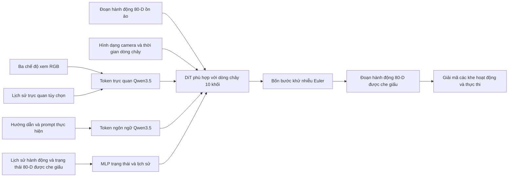
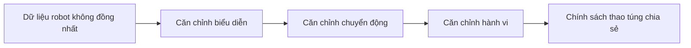
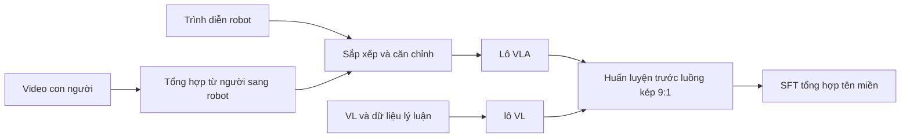

# Qwen-RobotManip: Tóm tắt bài thuyết trình

> **Nguồn đầy đủ sự thật:** [Báo cáo đầy đủ Qwen-RobotManip](qwen_robotmanip_details.md). Phiên bản ngắn này
> cố tình bỏ qua các chi tiết triển khai, tính toán dữ liệu đầy đủ, các phương trình và cảnh báo benchmark. Bài viết chính: [Qwen-RobotManip v2](https://arxiv.org/abs/2606.17846v2).

## Thông điệp chính

> **Qwen-RobotManip sắp xếp các biểu tượng, chuyển động và hành vi không đồng nhất của robot trước khi mở rộng quy mô
> huấn luyện thao tác.**

- Hỗ trợ các phương án một cánh tay, hai cánh tay, dụng cụ kẹp, bàn tay khéo léo, di động và hình người.
- Sử dụng Qwen3.5-4B để suy luận đa phương thức.
- Sử dụng DiT phù hợp với luồng để tạo ra các khối hành động liên tục.
- Thể hiện trạng thái và hành động trong mẫu 80-D được che dấu, được chia sẻ.
- Sử dụng deltas của bộ end-effector khung máy ảnh để cải thiện khả năng truyền giữa các robot.

## Kiến trúc


| Thành phần | Bài thuyết trình mang đi |
| --------------- | ----------------------------------------------------------------------------------------------------------- |
| Đầu vào | RGB nhiều chế độ xem, prompt phương án có cấu trúc, khả năng nhận biết hiện tại, hình học camera và lịch sử tùy chọn |
| Xương sống VLM | Qwen3.5-4B cùng xử lý tầm nhìn, ngôn ngữ và bối cảnh lịch sử |
| Action expert | 10 khối DiT, rộng 768, 12 đầu |
| Chú ý chéo | Thay thế điều hòa hình ảnh và ngôn ngữ trên các khối DiT |
| Đầu ra | Đoạn hành động liên tục trong không gian 80-D chuẩn |
| Suy luận | Bốn bước tích hợp Euler trong thiết lập mặc định được báo cáo |

### Ví dụ thực tế: Đầu vào cho hành động của robot

Sau đây là **bản trình bày được tái tạo**, không phải lược đồ API được phát hành. Nó cho thấy làm thế nào một
quyết định hai cánh tay có thể được tập hợp:

```yaml
images:
  - {camera: left_external, rgb: <image>, calibrated: true}
  - {camera: front_external, rgb: <image>, calibrated: true}
  - {camera: right_wrist, rgb: <image>, calibrated: true}

prompt: |
  embodiment: robot_aloha
  instruction: Take the toy off the table and put it on the mat.
  speed: 1000
  fps: 30
  camera view direction: arm side

state:
  canonical_80d: [q_left_1, ..., gripper_left, q_right_1, ..., gripper_right, 0, ...]
  active_mask:   [1, ..., 1, 1, ..., 1, 0, ...]

reference_camera:
  left_arm: front_external
  right_arm: right_wrist
history: <earlier images, states, and executed action chunks>
```



Bên trong DiT, các khối liên tiếp xen kẽ nhau chú ý đến các đặc điểm hình ảnh và ngôn ngữ. Đầu ra
là **một đoạn hành động trong tương lai**, không phải lệnh của robot bằng ngôn ngữ tự nhiên. Một giải mã minh họa đơn giản hóa là:

| Bước đầu ra | Các trường chuẩn đang hoạt động | Giải thích vật lý |
| ----------- | ----------------------------------------------------- | ----------------------- |
| (t+1) | Còn lại EEF`(+0.02, 0.00, -0.01)`; kẹp `open` | Tiếp cận đồ chơi |
| (t+2) | Còn lại EEF`(0.00, 0.00, -0.02)`; kẹp `close` | Đi xuống và nắm bắt |
| (t+3) | Còn lại EEF`(+0.04, +0.03, +0.05)`; kẹp `closed` | Di chuyển về phía tấm thảm |

Các giá trị ở trên chỉ minh họa vùng delta của khung máy ảnh. Bài báo không công bố tensor của mẫu này,
độ dài đoạn, tên trường API hoặc lệnh điều khiển.

## Tại sao Biểu diễn 80-D lại quan trọng

```text
Left arm:   29 dimensions
Right arm:  29 dimensions
Reserved:   22 dimensions
Total:      80 dimensions
```

Mỗi khối cánh tay 29-D chứa:

| Lĩnh vực | Kích thước |
| ------------------ | ---------: |
| Vị trí chung |          7 |
| Trạng thái end-effector |          9 |
| Kẹp |          1 |
| Bàn tay khéo léo |         12 |

Điểm mấu chốt: mặt nạ ngăn ngừa các khớp bị thiếu hoặc cánh tay không được sử dụng trở thành giám sát giả có giá trị bằng 0.

## Ba lớp căn chỉnh



| Căn chỉnh | Thay đổi gì | Tại sao nó giúp ích |
| -------------- | ------------------------------------------------------------------------------- | ------------------------------------------------------------------------- |
| Đại diện | Ánh xạ mọi robot vào cùng một mẫu 80-D | Các khớp tương đương và bộ phận end-effector chiếm các khe nhất quán |
| Chuyển động | Thể hiện vùng delta của bộ end-effector trong khung máy ảnh đã chọn | Chuyển động giống nhau về mặt trực quan trở nên giống nhau về mặt số lượng |
| Hành vi | Điều kiện về ID robot, FPS, tốc độ tập, hướng camera và lịch sử gần đây | Chính sách có thể thích ứng với động học và phong cách thực thi mà không cần cập nhật trọng lượng |

## Prompt về phương án mẫu

```text
embodiment: robot_aloha
instruction: Take the toy off the table and put it on the mat.
speed: 1000
fps: 30
camera view direction: arm side
```

Thận trọng khi trình bày: `speed` có nghĩa là độ dài tập tính theo thùng 500 bước, không phải mét/giây vật lý.

## Dữ liệu huấn luyện


| Nhóm dữ liệu |     Quy mô báo cáo | Giải thích chính |
| --------------------------- | -----------------: | ------------------------------------------------------------------------ |
| Trình diễn robot trực tiếp |           11.420 giờ | Chín nguồn dữ liệu rô-bốt mở theo nhiều phương án |
| Video con người ích kỷ |            1.933 giờ | Các tập hợp con EgoDex, VITRA và EgoVerse được lọc |
| Tổng hợp từ người sang robot |           24.808 giờ | Bắt nguồn từ các video giống nhau của con người trên 15 hình thái robot |
| Tổng số thao tác |           38.161 giờ | Được tác giả làm tròn lên khoảng 38.100 h |
| VL đồng huấn luyện | Khoảng 28 triệu ví dụ | Duy trì nhận thức, ngôn ngữ, lý luận không gian và khả năng ECoT |

Giờ tổng hợp có nguồn gốc từ thang đo chứ không phải trải nghiệm độc lập của con người.

## Luồng huấn luyện



| Loại hàng loạt | Mục tiêu | Báo cáo chia sẻ |
| ---------- | ------------------------------------- | -------------: |
| VLA | Kết hợp luồng mặt nạ trên các khối hành động |      Khoảng 90% |
| VL | Dự đoán token tiếp theo tự động hồi quy |      Khoảng 10% |

Bài viết báo cáo tỷ lệ nhưng không phải là thứ tự lô lặp lại cố định hoặc chính sách lấy mẫu hoàn chỉnh theo từng nguồn.

## Điểm nổi bật của đánh giá

| Đánh giá |                  Kết quả báo cáo chính | Nó thể hiện điều gì |
| ------------------------ | ------------------------------------: | ------------------------------------------------------------ |
| LIBERO |                 99,1 SR; bối cảnh 99,2 | Hiệu suất phân phối mạnh mẽ nhưng gần bão hòa |
| LIBERO-Plus |                    89,0; bối cảnh 91,4 | Mạnh mẽ đối với bảy trục nhiễu loạn OOD |
| RoboTwin-Clean2Rand Hard |                    62,6; bối cảnh 69,4 | Bối cảnh giúp theo chuyển cảnh kết hợp |
| RoboCasa365 |                         tổng 35,9 SR | Thao tác với đường chân trời dài và bố cục vẫn còn khó khăn |
| RoboTwin-IF |                       SR trung bình 72,2 | Mẫu ngôn ngữ được tổ chức sau đây |
| RoboTwin-XE |                       SR trung bình 23,9 | Chuyển giao theo phương án chéo không bắn vẫn còn nhiều thách thức |
| Bảng RoboChallenge30 v1 | 45% nhiệm vụ thành công; 59,83 điểm quá trình | Đánh giá robot thực đa nền tảng |

## Bảo hiểm hành động


## Trang trình bày cuối cùng: Năm điểm

1. Cải tiến chính là **căn chỉnh nhiều phương án**, không chỉ là tập dữ liệu lớn hơn.
2. Mẫu và mặt nạ 80-D giúp các hình thái robot khác nhau được huấn luyện cùng nhau.
3. Đồng bằng khung máy ảnh căn chỉnh tọa độ hành động với các quan sát trực quan.
4. Lịch sử đóng vai trò như một mô tả ngầm về hành vi và động học của robot.
5. Kết quả OOD và robot chéo đầy hứa hẹn nhưng các tạo tác tổng hợp, độ trễ và kiểm soát phản ứng vẫn còn hạn chế.
