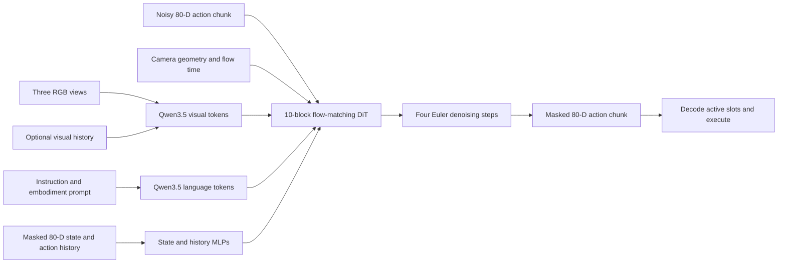
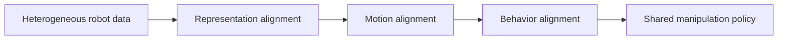
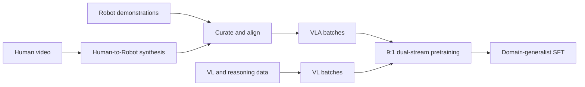

# Qwen-RobotManip: Presentation Summary

> **Full source of truth:** [Qwen-RobotManip complete report](qwen_robotmanip_details.md). This short version
> intentionally omits implementation details, complete dataset accounting, equations, and benchmark caveats. Primary paper: [Qwen-RobotManip v2](https://arxiv.org/abs/2606.17846v2).

## Main Message

> **Qwen-RobotManip aligns heterogeneous robot representations, motions, and behaviors before scaling
> manipulation training.**

- Supports single-arm, dual-arm, gripper, dexterous-hand, mobile, and humanoid embodiments.
- Uses Qwen3.5-4B for multimodal reasoning.
- Uses a flow-matching DiT to generate continuous action chunks.
- Represents state and action in a shared, masked 80-D template.
- Uses camera-frame end-effector deltas to improve cross-robot transfer.

## Architecture


| Component       | Presentation takeaway                                                                                       |
| --------------- | ----------------------------------------------------------------------------------------------------------- |
| Inputs          | Multi-view RGB, structured embodiment prompt, current proprioception, camera geometry, and optional history |
| VLM backbone    | Qwen3.5-4B jointly processes vision, language, and historical context                                       |
| Action expert   | 10 DiT blocks, width 768, 12 heads                                                                          |
| Cross-attention | Alternates visual and language conditioning across DiT blocks                                               |
| Output          | Continuous action chunk in the canonical 80-D space                                                         |
| Inference       | Four Euler integration steps in the reported default setup                                                  |

### Worked Example: Input to Robot Action

The following is a **presentation reconstruction**, not a released API schema. It shows how one
dual-arm decision could be assembled:

```yaml
images:
  - {camera: left_external, rgb: <image>, calibrated: true}
  - {camera: front_external, rgb: <image>, calibrated: true}
  - {camera: right_wrist, rgb: <image>, calibrated: true}

prompt: |
  embodiment: robot_aloha
  instruction: Take the toy off the table and put it on the mat.
  speed: 1000
  fps: 30
  camera view direction: arm side

state:
  canonical_80d: [q_left_1, ..., gripper_left, q_right_1, ..., gripper_right, 0, ...]
  active_mask:   [1, ..., 1, 1, ..., 1, 0, ...]

reference_camera:
  left_arm: front_external
  right_arm: right_wrist
history: <earlier images, states, and executed action chunks>
```



Inside the DiT, successive blocks alternate cross-attention to visual and language features. The output
is a **chunk of future actions**, not natural-language robot commands. A simplified illustrative decode is:

| Output step | Active canonical fields                               | Physical interpretation |
| ----------- | ----------------------------------------------------- | ----------------------- |
| (t+1)       | Left EEF`(+0.02, 0.00, -0.01)`; gripper `open`    | Approach the toy        |
| (t+2)       | Left EEF`(0.00, 0.00, -0.02)`; gripper `close`    | Descend and grasp       |
| (t+3)       | Left EEF`(+0.04, +0.03, +0.05)`; gripper `closed` | Move toward the mat     |

The values above only illustrate camera-frame deltas. The paper does not publish this sample's tensor,
chunk length, API field names, or controller commands.

## Why the 80-D Representation Matters

```text
Left arm:   29 dimensions
Right arm:  29 dimensions
Reserved:   22 dimensions
Total:      80 dimensions
```

Each 29-D arm block contains:

| Field              | Dimensions |
| ------------------ | ---------: |
| Joint positions    |          7 |
| End-effector state |          9 |
| Gripper            |          1 |
| Dexterous hand     |         12 |

Key point: masks prevent missing joints or unused arms from becoming false zero-valued supervision.

## Three Alignment Layers



| Alignment      | What changes                                                                    | Why it helps                                                              |
| -------------- | ------------------------------------------------------------------------------- | ------------------------------------------------------------------------- |
| Representation | Map every robot into the same 80-D template                                     | Equivalent joints and end effectors occupy consistent slots               |
| Motion         | Express end-effector deltas in a selected camera frame                          | Visually similar movement becomes numerically similar                     |
| Behavior       | Condition on robot ID, FPS, episode speed, camera direction, and recent history | Policy can adapt to kinematics and execution style without weight updates |

## Example Embodiment Prompt

```text
embodiment: robot_aloha
instruction: Take the toy off the table and put it on the mat.
speed: 1000
fps: 30
camera view direction: arm side
```

Presentation caution: `speed` means episode length in 500-step bins, not physical metres/second.

## Training Data


| Data group                  |     Reported scale | Key interpretation                                                       |
| --------------------------- | -----------------: | ------------------------------------------------------------------------ |
| Direct robot demonstrations |           11,420 h | Nine open robot-data sources across several embodiments                  |
| Egocentric human video      |            1,933 h | Filtered EgoDex, VITRA, and EgoVerse subsets                             |
| Human-to-Robot synthetic    |           24,808 h | Derived from the same human videos across 15 robot morphologies          |
| Total manipulation corpus   |           38,161 h | Rounded by the authors to about 38,100 h                                 |
| VL co-training              | About 28M examples | Preserves perception, language, spatial reasoning, and ECoT capabilities |

The synthetic hours are derived scale, not independent human experience.

## Training Flow



| Batch type | Objective                             | Reported share |
| ---------- | ------------------------------------- | -------------: |
| VLA        | Masked flow matching on action chunks |      About 90% |
| VL         | Autoregressive next-token prediction  |      About 10% |

The paper reports the ratio but not a fixed repeating batch order or complete per-source sampling policy.

## Evaluation Highlights

| Evaluation               |                  Main reported result | What it demonstrates                                         |
| ------------------------ | ------------------------------------: | ------------------------------------------------------------ |
| LIBERO                   |                 99.1 SR; context 99.2 | Strong in-distribution performance, but near saturation      |
| LIBERO-Plus              |                    89.0; context 91.4 | Robustness to seven OOD perturbation axes                    |
| RoboTwin-Clean2Rand Hard |                    62.6; context 69.4 | Context helps under combined scene shift                     |
| RoboCasa365              |                         35.9 total SR | Long-horizon and compositional manipulation remain difficult |
| RoboTwin-IF              |                       72.2 average SR | Held-out language-template following                         |
| RoboTwin-XE              |                       23.9 average SR | Zero-shot cross-embodiment transfer remains challenging      |
| RoboChallenge Table30 v1 | 45% task success; 59.83 process score | Multi-platform real-robot evaluation                         |

## Action Coverage


## Final Slide: Five Points

1. The main innovation is **cross-embodiment alignment**, not only a larger dataset.
2. The 80-D template and masks make different robot morphologies train together.
3. Camera-frame deltas align action coordinates with visual observations.
4. History acts as an implicit description of robot behavior and kinematics.
5. OOD and cross-robot results are promising, but synthetic artifacts, latency, and reactive control remain limitations.
