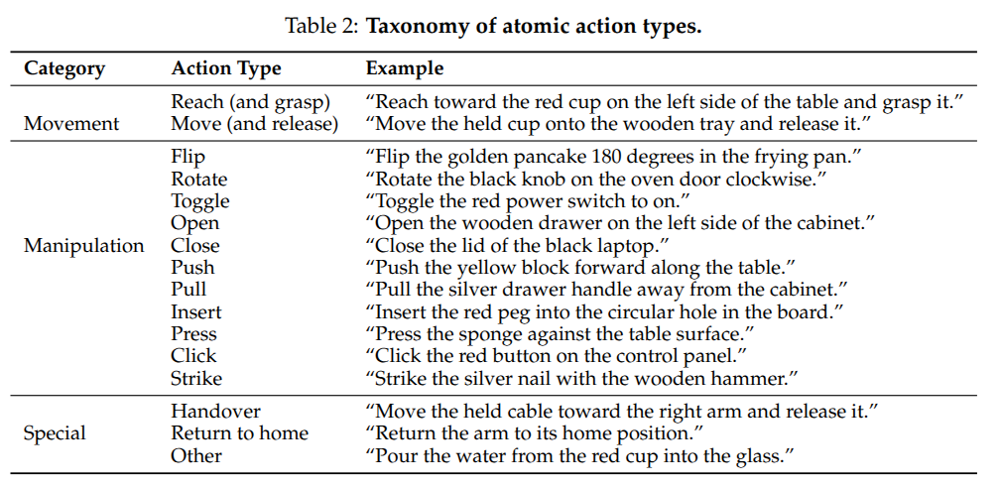
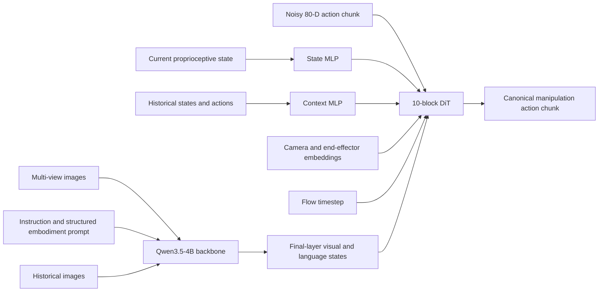
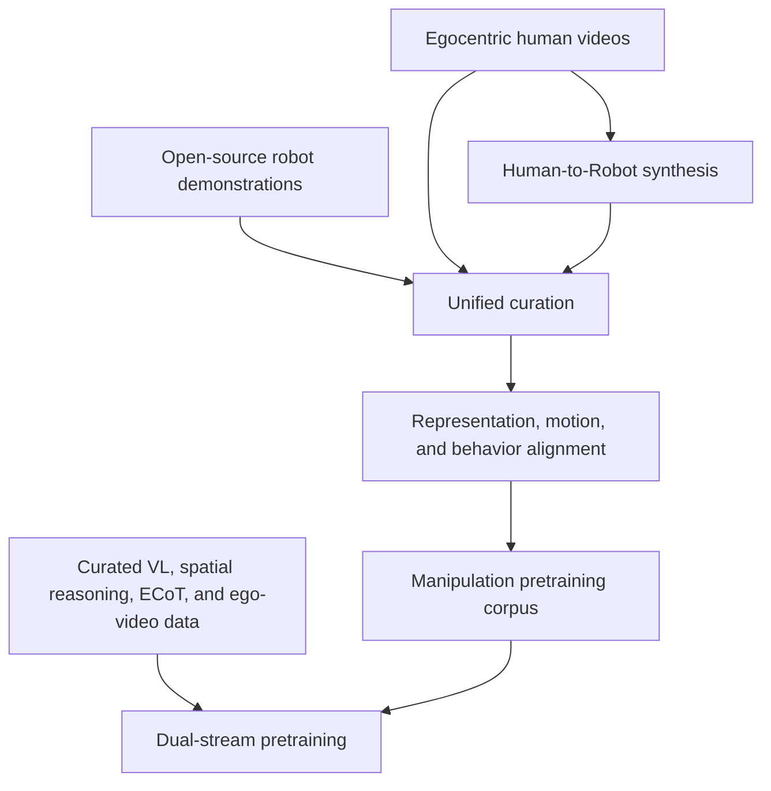
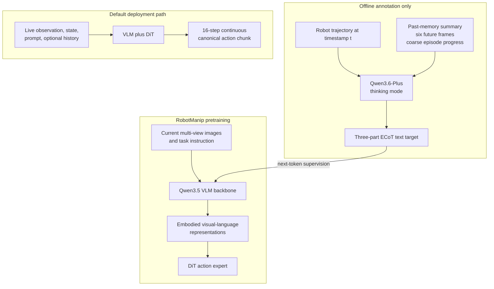

# Qwen-RobotManip: Architecture, Training Data, and Evaluation

## Scope

This report covers **Qwen-RobotManip**, the manipulation specialist in the Qwen-Robot suite.
It focuses on architecture, cross-embodiment alignment, training datasets, task alternation,
objectives, post-training, and evaluation. For the navigation specialist, see
[Qwen-RobotNav](../Qwen-RobotNav/qwen_robotnav_details.md). For the general model, see
[Qwen-VLA](../Qwen-VLA/qwen_vla_details.md).

> **Research date:** 2026-07-22. The primary source checked is Qwen-RobotManip v2
> (2026-06-17). Dataset and evaluation numbers are author-reported and have not been
> reproduced in this workspace. The official repository currently states that there is no
> plan to release the model weights.

## Core Idea

Qwen-RobotManip treats heterogeneous robot representations as the central scaling bottleneck.
It maps multiple embodiments into a masked 80-dimensional state/action space, aligns motion in
camera-relative end-effector coordinates, and conditions on recent behavior for in-context
adaptation. A flow-matching DiT generates action chunks while separate manipulation and
vision-language batches preserve both control and multimodal reasoning.

## 1. Model Overview

### 1.1 Main Tasks

Qwen-RobotManip focuses on manipulation rather than the full set of embodied tasks.

Target capabilities include:

- Single-arm and bimanual manipulation
- Parallel-gripper and dexterous-hand control
- Pick, place, fold, insert, operate, and rearrange tasks
- Instruction-conditioned manipulation
- Cross-robot transfer
- Robustness to new objects, layouts, backgrounds, and camera poses
- Rapid behavioral adaptation from recent episode history



Unlike Qwen-VLA, it does not need one action decoder to also model navigation waypoints or autonomous-driving trajectories.

### 1.2 Architecture




The Qwen VLM backbone hidden states have width 2,560.

The action expert contains:

- **10 Transformer blocks**
- Hidden width **768**
- **12 attention heads**
- Self-attention over state and noisy-action tokens
- Cross-attention to the VLM after self-attention
- SwiGLU feed-forward layers
- Alternating cross-attention:
  - Even-indexed blocks attend to visual tokens
  - Odd-indexed blocks attend to language tokens

This differs from Qwen-VLA's larger single-stream DiT, where VLM-derived and action tokens are processed jointly through self-attention.

The output contain a chunk of **16 continuos actions**, with **80 dims**.

## 2. Inputs and Cross-Embodiment Representation

### 2.1 Model Inputs, Camera Views, and Prompt Examples

One RobotManip decision consumes more than images and an instruction. The complete conceptual input is:

| Input group                 | Contents                                                                                               | Where it enters the model                                                             |
| --------------------------- | ------------------------------------------------------------------------------------------------------ | ------------------------------------------------------------------------------------- |
| Current vision              | One or more synchronized RGB camera views                                                              | Qwen3.5 vision-language backbone                                                      |
| Task and embodiment text    | Structured prompt with embodiment, instruction, speed, FPS, and camera-view direction                  | Qwen3.5 text stream                                                                   |
| Current proprioception      | Masked canonical 80-D state; only the embodiment's populated slots are meaningful                      | Two-layer state MLP, then prepended to noisy action tokens in the DiT                 |
| Camera geometry             | Intrinsics and extrinsics for every calibrated view; selected action-reference camera per end effector | Camera positional encoding in DiT cross-attention                                     |
| Action-side conditioning    | End-effector type, camera-calibration availability flag, and flow timestep                             | Adaptive normalization/conditioning in the DiT                                        |
| Optional behavioral history | Earlier RGB observations, 80-D states, and executed action chunks from the same episode                | Historical images join the visual stream; state/action history becomes context tokens |

The Gaussian noisy action chunk and flow timestep are training/inference machinery, not sensor inputs
provided by the robot operator. The model ultimately denoises them into the next canonical action chunk.
[RobotManip paper v2, §§3.1-3.5](https://arxiv.org/abs/2606.17846v2)

The adopted DiT architecture also uses a small set of learned query tokens as internal proxies for VLM
vision/language features. They join the state/action tokens, cross-attend to final-layer VLM states, and
participate in DiT self-attention; their outputs are discarded rather than decoded as actions. The paper
does not disclose their count or initialization. [RobotManip paper v2, §6.4 and Figure 20](https://arxiv.org/abs/2606.17846v2)

#### Camera views and “angles”

RobotManip does **not** prescribe a fixed camera count or a universal list of yaw angles. It consumes
whatever synchronized views a source embodiment provides. The paper and Figure 3 use these semantic
view types:

| View type             | Examples in the paper                                       | How it is used                                                                                        |
| --------------------- | ----------------------------------------------------------- | ----------------------------------------------------------------------------------------------------- |
| External/third-person | Front, side, left, and right views                          | Scene-wide object and arm geometry; any available external view can be the reference for a single arm |
| Head-mounted          | A common view above/between two arms                        | Can be the shared action-reference frame for both arms                                                |
| Wrist-mounted         | Single-arm wrist view, or separate left/right wrist cameras | Close-up manipulation; dual arms can use their own wrist camera as separate reference frames          |

“Left,” “front,” “right,” “side,” and “wrist” are view roles, not published numeric azimuths. The
structured prompt reduces the camera direction to **`arm side`** or **`opposite side`**; it does not carry
a degree value. Precise geometry instead comes from camera intrinsics/extrinsics and Camera Positional
Encoding (CaPE): every image token uses its own camera pose, while each state/action token uses the pose
of the selected reference camera.

Reference selection is randomized during training:

- For a single arm, select any available external or wrist-mounted camera.
- For dual arms, either use a shared head/third-person camera for both arms, or use the left wrist camera
  for the left arm and the right wrist camera for the right arm.
- If calibrated camera parameters are unavailable, an auxiliary flag switches pose prediction from
  camera-frame delta mode to robot-base-relative mode.

The camera-frame action path requires calibration at both training and inference. The paper does not
publish a fixed input resolution, a required lens field of view, the exact camera order in the Qwen chat
template, or numeric mounting angles for each dataset.
[RobotManip paper v2, §3.3 and Figure 3](https://arxiv.org/abs/2606.17846v2)

The paper's embodied chain-of-thought data uses synchronized available views such as front, wrist, and
side. During annotation, a separate VLM can see a history summary, six future frames spaced one second
apart, and episode progress. Those are **privileged annotation inputs**: the RobotManip VLM training
example receives only the current multi-view images and task instruction, with the generated reasoning
as its target. They should not be added to the runtime policy input contract.
[RobotManip paper v2, §2.5](https://arxiv.org/abs/2606.17846v2)

#### Exact structured embodiment prompt

The paper publishes this exact example:

```text
embodiment: robot_aloha
instruction: Take the toy off the table and put it on the mat.
speed: 1000
fps: 30
camera view direction: arm side
```

The fields mean:

| Field                     | Meaning                                                                      |
| ------------------------- | ---------------------------------------------------------------------------- |
| `embodiment`            | Robot platform identifier, such as`robot_aloha`                            |
| `instruction`           | Episode-level natural-language objective                                     |
| `speed`                 | Episode length in timesteps, quantized into 500-step bins—not metres/second |
| `fps`                   | Temporal sampling rate of the input sequence                                 |
| `camera view direction` | Camera position relative to the acting arm:`arm side` or `opposite side` |

During training, `embodiment`, `speed`, and `fps` are randomly dropped with 15% probability so
the policy can tolerate missing metadata. The paper does not say that the instruction or camera-direction
field is dropped. [RobotManip paper v2, §3.4](https://arxiv.org/abs/2606.17846v2)

#### Behavioral-history input

One historical chunk is the triplet \((o_h,s_h,a_h)\): what the robot saw, its proprioceptive state, and
the complete \(K\)-step action chunk it executed. For \(H\) chunks:

- historical frames are prepended to the current frame and encoded with the current images in one VLM
  forward pass;
- an image-count annotation is appended to the instruction so the VLM can associate images with time;
- historical states and flattened action chunks are projected by separate MLPs;
- temporal embeddings identify the chunk and slot embeddings identify action positions;
- chunks are serialized oldest-to-newest, while the current state still enters the DiT's dedicated state
  encoder.

The default “unified” design appends these context tokens to the VLM sequence. Training samples a
window from a random position in the same episode; deployment uses the most recent rolling window.
The paper uses symbolic \(H\) and \(K\) in the method description but does not publish one universal
history length or literal image-count annotation string. [RobotManip paper v2, §3.5](https://arxiv.org/abs/2606.17846v2)

#### Illustrative assembled input

The following is a **reconstruction for explanation**, not a released API schema or verbatim chat
template:

```yaml
current_images:
  - camera: left_external
    rgb: <image>
    calibrated: true
  - camera: front_external
    rgb: <image>
    calibrated: true
  - camera: right_wrist
    rgb: <image>
    calibrated: true

prompt: |
  embodiment: robot_aloha
  instruction: Take the toy off the table and put it on the mat.
  speed: 1000
  fps: 30
  camera view direction: arm side

current_state:
  canonical_80d: <masked state vector>

reference_camera:
  left_arm: front_external
  right_arm: right_wrist

history:
  - images: <earlier synchronized views>
    state_80d: <earlier state>
    executed_action_chunk_80d: <K earlier actions>
```

This example shows the information relationships. The paper does not release these YAML keys, the
exact tensor serialization, or an inference API.

### 2.2 Canonical 80-Dimensional State and Action Space

RobotManip maps many embodiments into a fixed 80-dimensional template:

```text
Left arm block:  29 dimensions
Right arm block: 29 dimensions
Reserved block:  22 dimensions
Total:            80 dimensions
```

Each 29-dimensional arm block includes:

```text
7  joint-position dimensions
9  end-effector-state dimensions
1  gripper dimension
12 dexterous-hand dimensions
```

The reserved dimensions can represent additional degrees of freedom such as mobile-base motion and humanoid robot actions.

Different robots activate different subsets of this space. Binary masks ensure that only valid dimensions contribute to training.

### 2.3 Three Forms of Cross-Embodiment Alignment

RobotManip's main innovation is not simply a larger manipulation dataset. It makes data from different robots numerically and behaviorally compatible.

#### A. Representation Alignment

All robots are converted into the same 80-D template.

```text
Franka data ─────┐
ALOHA data ──────┼──> canonical 80-D state/action representation
UR data ─────────┤
ARX data ────────┘
```

Per-dimension masks prevent:

- Missing joints from creating fake zero targets
- Single-arm robots from supervising the unused arm
- Dexterous-hand robots from dominating simpler gripper embodiments

#### B. Motion Alignment

End-effector actions are expressed as **camera-frame relative deltas** rather than only robot-base-frame coordinates.

This makes visually similar motions numerically closer:

```text
Robot A: move toward the cup in camera coordinates
Robot B: move toward the cup in camera coordinates
```

Although the two robots may have different base frames and kinematics, the target motion is aligned with what the vision model sees.

Camera positional encoding and learned camera embeddings provide information about viewpoint and camera geometry.

#### C. Behavior Alignment

The policy receives:

- Robot identity
- Execution speed
- FPS
- Camera direction
- Recent observation-state-action chunks

Recent history acts as an implicit description of:

- Kinematics
- Motion speed
- Grasping style
- Controller behavior
- Episode-specific execution dynamics

This enables **in-context policy adaptation** without changing model parameters.

## 3. Training Data

### 3.1 Dataset Composition

RobotManip is more data-centric than Qwen-VLA.




The action-training corpus contains **38,161 hours** in Table 1, rounded by the authors to
**about 38,100 hours**. Its headline total is not one flat
collection: it combines direct robot demonstrations, human-hand video, and robot-rendered derivatives of
that human video. The accompanying VL preservation stream is a separate collection of about **28M
examples**. [RobotManip paper v2, §2 and Table 1](https://arxiv.org/abs/2606.17846v2)

| Action-data group         | Reported amount | Sources and scope                                                                                              |
| ------------------------- | --------------: | -------------------------------------------------------------------------------------------------------------- |
| Single-arm robot          |         3,808 h | Part of OXE, RoboMIND, DROID, RH20T, AgiBotWorld-Beta, RoboCOIN, RDT-1B, InternData-A1, and Galaxea Open-World |
| Dual-arm robot            |         6,744 h | Same nine-source corpus, regrouped by embodiment rather than dataset                                           |
| Mobile and humanoid robot |           868 h | Tabletop and indoor manipulation                                                                               |
| Egocentric human hands    |         1,933 h | EgoDex 732 h used, VITRA 247 h, EgoVerse 954 h                                                                 |
| Human-to-Robot synthetic  |        24,808 h | Derived from the human videos and rendered across 15 dual-arm platforms                                        |

#### Direct robot demonstrations

The **11,420 direct-robot hours** come from nine named open sources:

| Source                    |       Amount used or reported | What it contributes                                                                    |
| ------------------------- | ----------------------------: | -------------------------------------------------------------------------------------- |
| Open X-Embodiment         |                   about 600 h | Fractal, Bridge and BC-Z subsets; diverse single-arm real-robot behavior               |
| AgiBotWorld-Beta          |                 about 2,400 h | Gripper-based bimanual G1 demonstrations over about 200 task types                     |
| RoboMIND and RoboMIND 2.0 |                 about 1,400 h | Single-arm, dual-arm, ALOHA and humanoid data across several platforms                 |
| Galaxea Open-World        |                   about 500 h | Bimanual mobile manipulation in household tasks                                        |
| RoboCOIN                  |                   about 430 h | Multi-embodiment real-world demonstrations                                             |
| DROID                     | 95K trajectories, about 500 h | Franka data from 86 real-world environments                                            |
| RH20T                     |                 about 1,100 h | Contact-rich data over four embodiments and 140+ tasks                                 |
| RDT-1B                    |                          29 h | Bimanual demonstrations on ALOHA-like hardware                                         |
| InternData-A1             |             more than 3,600 h | High-fidelity simulation spanning tabletop, mobile manipulation and long-horizon tasks |

These individually rounded source figures do not reconcile exactly with the embodiment-group total,
and the paper does not publish a post-curation episode manifest. They are therefore composition evidence,
not an exact accounting ledger. [RobotManip paper v2, §§2.1-2.2](https://arxiv.org/abs/2606.17846v2)

#### Egocentric human video

The **1,933 human hours** are filtered subsets rather than each source's full release:

- **EgoDex:** use 732 of 829 available hours; retain 60% of frames during training.
- **VITRA:** use 247 hours from its Ego4D and EPIC-KITCHENS subsets; retain 25% of frames.
- **EgoVerse:** use 954 of 1,362 available hours; retain 45% of frames.

Temporal subsampling slows the faster human-hand motion so its speed distribution better matches robot
teleoperation data.
[RobotManip paper v2, §§2.2-2.3](https://arxiv.org/abs/2606.17846v2)

#### Human-to-Robot synthesis

The conversion pipeline:

1. Retarget MANO hand poses into end-effector pose and gripper width.
2. Smooth translation and rotation trajectories.
3. Segment and remove visible human hands.
4. Inpaint the removed hand regions.
5. Search for feasible robot-base placements.
6. Solve inverse kinematics in MuJoCo.
7. Render the selected robot morphology.
8. Composite the robot into the source video using estimated depth.

The result expands **1,933 source hours into 24,808 derived hours** across 15 bimanual morphologies.
These hours increase training scale but are not independent human experience.

**Unknown:** the paper does not explain why \(1,933\times15\) differs from the stated synthetic total.
Filtering or failed conversion is plausible, but not documented.
[RobotManip paper v2, §2.3](https://arxiv.org/abs/2606.17846v2)
[Official RobotManip repository](https://github.com/QwenLM/Qwen-RobotManip)

#### Vision-language co-training stream

The separate **28M-example VL stream** covers:

- general visual understanding;
- spatial perception and reasoning;
- OCR and document understanding;
- multimodal specialist knowledge;
- multilingual instruction following;
- embodied chain-of-thought and ego-video understanding.

Named sources include RoboPoint, RefSpatial, PixMo, and CapsFusion. However:

- the mixture also contains proprietary and synthesized VL data;
- the paper does not give a complete source-by-source breakdown;
- “open-source data only” applies to the manipulation corpus, not every VL example;
- no global benchmark-contamination audit is reported for the web/proprietary mixture.

[RobotManip paper v2, §2.5](https://arxiv.org/abs/2606.17846v2)

### 3.2 ECoT: What It Is and Where It Is Used

**Embodied chain-of-thought (ECoT)** is language reasoning grounded in the robot's visual scene and physical state. The original ECoT policy generates task, plan, subtask, motion, gripper-position, andobject-grounding text before predicting an action. 

Qwen-RobotManip adopts the underlying idea but uses it differently: its ECoT examples are an **auxiliary vision-language training task**, not a documented mandatory text prefix for the continuous action policy at deployment.
[Original ECoT paper, §§4.1-4.3](https://arxiv.org/abs/2407.08693)
[RobotManip paper v2, §§2.5, 4.1.2 and 5](https://arxiv.org/abs/2606.17846v2)

#### Where ECoT enters the pipeline



At a sampled trajectory time `t`, the annotation pipeline gives a teacher VLM more information than
the eventual student sees:

1. synchronized current images from all available views;
2. a summary of earlier episode frames and visible state changes;
3. six future frames sampled at one-second intervals from `t`;
4. a coarse estimate of how far the episode has progressed;
5. the task instruction.

The teacher, reported as **Qwen3.6-Plus in thinking mode**, writes one target with three fields:

1. **Scene Description** — objects, spatial relations, robot-arm positions, and gripper states;
2. **Task Progress Assessment** — completed subgoals plus the literal judgment `Task complete.` or
   `Task not yet complete.`;
3. **Next Action** — one atomic action from the paper's taxonomy, such as reach-and-grasp, move-and-release,
   rotate, open, push, insert, or handover.

The privileged past/future/progress context is used only to improve annotation quality. The resulting
training example contains **current multi-view images + task instruction as input** and the three-part
ECoT response as its text target. It is trained with the VLM next-token loss as part of the separate VL
batch stream. The paper reports an overall **9:1 manipulation-to-VL pretraining mixture**, but does not
publish what fraction of the roughly 28M VL examples is ECoT.
[RobotManip paper v2, §2.5 and §4.1](https://arxiv.org/abs/2606.17846v2)

#### How ECoT affects actions

ECoT supervision directly updates the **VLM backbone**, encouraging its hidden states to encode scene
state, task progress, and useful next-action semantics. Action batches separately backpropagate the
flow-matching loss through both the backbone and the DiT, so the continuous action expert can use those
richer visual-language representations. This is an indirect representation-transfer path; the paper does
not say that the DiT consumes the generated three-part ECoT text.

The phase distinction is important:

| Phase                                | ECoT role                           | What the model receives or produces                                                                         |
| ------------------------------------ | ----------------------------------- | ----------------------------------------------------------------------------------------------------------- |
| Data synthesis                       | Create text supervision             | Teacher sees current views plus privileged past, future, and progress cues and writes the three-part target |
| Foundation pretraining, VL batch     | Train embodied representations      | Student sees only current views and instruction and predicts ECoT text with next-token loss                 |
| Foundation pretraining, action batch | Transfer representations to control | VLM and DiT predict continuous actions with flow matching; no ECoT text target is documented in this batch  |
| Default domain SFT                   | No explicit ECoT objective          | Flow-matching action loss only                                                                              |
| Default deployment                   | No documented ECoT decoding         | VLM hidden states condition the DiT, which produces a 16-step continuous action chunk                       |

This differs from the original 2024 ECoT design, where the policy autoregressively emits its reasoning chain before its action. Qwen-RobotManip's design is closer to the **reasoning pretraining/co-training** family studied by ECoT-Lite: use reasoning to shape internal representations while avoiding mandatory
test-time text generation. 

This is a conceptual comparison, not a claim that RobotManip implements the
published ECoT-Lite recipe exactly.
[ECoT-Lite project, “Policy Variants”](https://ecot-lite.github.io/)

#### Worked example

The paper does not publish a complete generated RobotManip ECoT sample. The following is therefore an **illustrative reconstruction** that obeys its documented three-field schema and atomic-action taxonomy; it is not a verbatim model output.

**Student training input:**

```yaml
images:
  - <front-camera image at time t>
  - <left-wrist-camera image at time t>
  - <right-wrist-camera image at time t>
instruction: "Take the toy off the table and put it on the mat."
```

**ECoT text target:**

```text
Scene Description: A red toy is on the left side of the table. The blue mat is
to its right. Both grippers are open, and the left gripper is closer to the toy.

Task Progress Assessment: The toy has not yet been grasped and is not on the mat.
Task not yet complete.

Next Action: Reach the left gripper toward the red toy and grasp it.
```

The teacher may have used the hidden annotation-only context below to make that target reliable:

```yaml
annotation_only:
  memory_summary: "No manipulation has yet been completed."
  future_preview: "The left gripper approaches and closes around the toy."
  sampled_future_frames: 6
  sampling_interval_seconds: 1
  coarse_episode_progress: "early"
```

None of `annotation_only` belongs in the student input or default deployment API. During robot control,
the policy instead uses the live observation, proprioceptive state, structured embodiment prompt, and
optional behavior history; the DiT then emits the numeric action chunk. The textual `Next Action` above
teaches semantic action selection but is not itself the motor command.

#### Evidence limits

- The paper does not disclose the ECoT subset size, exact synthesis prompt, annotation filtering rate,
  or a released ECoT dataset manifest.
- It reports an ablation for removing the **entire VL mixture**, not ECoT alone. The reported performance
  drops therefore cannot be attributed specifically to ECoT.
- One architecture comparison excludes the embodiment prompt, ECoT, and context together, so it also
  does not isolate ECoT's causal effect.
- “Qwen3.6-Plus with thinking mode” names the annotation teacher configuration. Its internal thinking
  is not the same artifact as the structured ECoT target used to train RobotManip.
- The public paper and repository do not document inference-time generation, display, correction, or
  reuse of RobotManip ECoT text. Treating it as a deployed planner would go beyond the evidence.

### 3.3 Data Curation

The curation pipeline is easier to read as four checks:

- **Temporal alignment**
  - synchronize video, robot state, and action timestamps;
  - preserve valid episode boundaries.
- **Motion and kinematic validity**
  - reject discontinuities and invalid action steps;
  - correct incompatible kinematic conventions.
- **Cross-modal consistency**
  - verify that language matches the demonstrated behavior;
  - check agreement between video and state/action signals.
- **Visual validity**
  - harmonize camera streams;
  - remove unusable frames, missing hands, and occluded hand trajectories.

This is crucial because mixed robot data can create contradictory gradients when the same physical behavior is encoded differently.

## 4. Training Procedure

### 4.1 Pretraining and Task Alternation

RobotManip uses dual-stream co-training:

- **Reported ratio:** 9:1 robot/manipulation-to-VL.
- **Action-stream contents in Figure 3:** robot demonstrations, egocentric hands, and Human-to-Robot
  trajectories.
- **Terminology ambiguity:** §4.1.1 calls the numerator “robot data.”
- **Unknown:** the exact loader-level interpretation of that numerator is not fully specified.

```text
Approximately 90% manipulation/VLA data
Approximately 10% vision-language data
```

The streams use **separate batches**, different schemas, and different active objectives:

```text
VLA batch:
vision + language + state + context + action

VLM batch:
vision + language question/answer tokens
```

| Training unit                 | Active supervision                                                  | Parameters updated                                                          | Sampling detail                                |
| ----------------------------- | ------------------------------------------------------------------- | --------------------------------------------------------------------------- | ---------------------------------------------- |
| VLA batch                     | Masked flow-matching velocity on an action chunk                    | VLM backbone and DiT action expert                                          | About 90% of the reported pretraining mixture  |
| VL batch                      | Autoregressive next-token prediction                                | VLM path; no action target                                                  | About 10% of the reported pretraining mixture  |
| One VLA sample inside the DiT | Eight independent noise/timestep draws reuse one VLM representation | Primarily increases action-expert supervision per expensive visual encoding | Eight repeats are not eight new demonstrations |

This must not be confused with the action expert's *layer-wise* alternation:

```text
DiT block 0 -> cross-attend to visual tokens
DiT block 1 -> cross-attend to language tokens
DiT block 2 -> cross-attend to visual tokens
...
```

What is and is not known:

- **Known:** every batch belongs to either the VLA stream or the VL stream.
- **Known:** the streams are sampled under a reported 9:1 mixture.
- **Not published:** a deterministic `9 VLA -> 1 VL` cycle.
- **Not published:** probabilistic scheduler details, per-source weights, or epoch construction.
- **Not published:** correction for the raw-hour imbalance between robot, human, and H2R data.

“Alternating tasks” therefore means **sampling separate task batches under a mixture ratio**, not a
documented fixed sequence. [RobotManip paper v2, Figure 3 and §4.1.1](https://arxiv.org/abs/2606.17846v2)

#### Flow-Matching Objective

For a ground-truth action chunk \(a\), Gaussian noise \(\epsilon\), and
\(t\sim\operatorname{Beta}(1,1.5)\):

$$
x_t = (1-t)\epsilon + ta
$$

The target velocity is:

$$
v = a-\epsilon
$$

The action expert minimizes:

$$
\mathcal{L}_{FM}
=
\left\|
f_\theta(x_t,t,s,o)-(a-\epsilon)
\right\|_2^2
$$

where \(s\) is robot state and \(o\) is the visual-language observation.

#### Masked Flow-Matching Loss

RobotManip applies three masks:

1. **Slot mask** — active dimensions for the embodiment
2. **Step-validity mask** — valid, non-anomalous trajectory steps
3. **Human-hand validity mask** — removes supervision after a hand leaves the camera view

The loss is normalized per sample over valid entries so that robots with more active dimensions do not automatically produce larger gradients.

#### VLM Preservation Loss

Vision-language samples use standard autoregressive next-token prediction:

$$
\mathcal{L}
=
\mathcal{L}_{FM}
+
\lambda\mathcal{L}_{VLM}
$$

The report uses \(\lambda=0.1\). Because only the corresponding loss is active for each batch type, this
coefficient weights the VL update when the selected batch is a VL batch; it does not imply that every
training example simultaneously has both targets.

#### Repeated Noise Sampling

For one action chunk, the action expert draws multiple independent noise and timestep samples. The reported setup repeats the diffusion training calculation eight times while reusing the expensive VLM representation.

This improves action-expert training efficiency without requiring eight separate visual forward passes.

### 4.2 Stochastic Context Sampling

Always providing the immediately preceding action chunk can cause a shortcut: the model may copy the latest action instead of learning the robot's broader behavior.

During training, RobotManip samples historical context from random positions in the same episode.

```text
Naive context:
[t-3, t-2, t-1] → predict t

Stochastic context:
[random earlier chunks] → predict t
```

This forces the model to infer stable behavioral characteristics instead of exploiting temporal proximity.

At deployment, a normal rolling recent-history window can be used.

### 4.3 Post-Training

RobotManip uses domain-specific **generalist SFT**:

- All demonstrations for a target benchmark or deployment domain are combined
- One fine-tuned policy handles all tasks in that domain
- The default SFT objective is flow matching only
- Image color jitter is applied
- Optional mixed post-training can retain VL data and auxiliary pretraining VLA data to reduce domain overfitting

The main benchmark comparisons use domain-only SFT. In ablations, adding VL makes it 10% of
post-training samples; a further mixed setting makes auxiliary pretraining VLA 75% of all VLA data, but
the remaining source-level scheduler is not disclosed. No dedicated reinforcement-learning stage is
reported as the main pipeline. [RobotManip paper v2, §§4.2 and 6.5.1](https://arxiv.org/abs/2606.17846v2)

## 5. Evaluation

### 5.1 Benchmark Coverage

The paper deliberately separates familiar in-distribution benchmarks from tests intended to measure
generalization. All values below are author-reported success rates unless another metric is named.
[RobotManip paper v2, §6](https://arxiv.org/abs/2606.17846v2)

| Evaluation           | Protocol and main metric                               |             Qwen-RobotManip result | Important interpretation                                                               |
| -------------------- | ------------------------------------------------------ | ---------------------------------: | -------------------------------------------------------------------------------------- |
| LIBERO               | In-distribution task/scene suites; SR                  |                 99.1; Context 99.2 | Near saturation, so weak evidence for pretraining quality                              |
| RoboTwin Easy / Hard | In-distribution dual-arm tasks; SR                     |   93.4 / 92.5; Context 93.7 / 94.0 | Measures domain adaptation more than open-world transfer                               |
| LIBERO-Plus          | Seven OOD perturbation axes; overall SR                |                 89.0; Context 91.4 | Includes camera, robot state, language, lighting, background, noise, and layout shifts |
| RoboTwin-Clean2Rand  | Fine-tune on Clean, test randomizations; Hard SR       |                 62.6; Context 69.4 | Context helps most under combined shift                                                |
| RoboCasa365          | Atomic, composite-seen, composite-unseen; total SR     |                               35.9 | Composite-unseen is 14.9 versus RLDX-1's 5.4                                           |
| EBench               | 26 task types; SR and composite score                  |                 45.6 SR / 60 score | Covers tabletop, mobile pick-and-place, and long-horizon tasks                         |
| RoboTwin-IF          | Held-out instruction templates; average SR             |                               72.2 | Tests language-conditioned action selection in similar scenes                          |
| RoboTwin-XE          | Train on AgileX ALOHA, zero-shot to ARX/UR5/Franka; SR | 23.9 average with camera-frame EEF | Joint-space transfer remains poor; result supports camera-frame alignment              |

### 5.2 Real-Robot Evaluation

Real-world evaluation uses the RoboChallenge Table30 v1 generalist track: **30 tasks across AgileX
ALOHA, Franka, UR, and ARX**. The paper reports first place, **45% task success**, and a **59.83
process score**. On eight bimanual ALOHA tasks it reports 40% average SR versus 21.2% for
\(\pi_{0.5}\); across twelve cross-platform pick-and-place tasks it reports 63.3% versus DM0's 48.3%.
[Official RobotManip benchmark summary](https://github.com/QwenLM/Qwen-RobotManip)

Additional real-robot protocols show what the aggregate benchmark number hides:

| Protocol                     | Training/evaluation setup                                                            |                                                                    Main result |
| ---------------------------- | ------------------------------------------------------------------------------------ | -----------------------------------------------------------------------------: |
| CobotMagic ALOHA             | Fine-tune on 22.9 h; seven in-distribution tasks × 5 trials                         |                                         88.6% SR versus 42.9% for\(\pi_{0.5}\) |
| CobotMagic ALOHA OOD         | Four changed-object/scene/instruction tasks × 10 trials                             |                                                          87.5% SR versus 37.5% |
| Few-shot ARX                 | Same 130 demonstrations; five tasks × 10 trials                                     |     Leads four tasks, but every tested model gets 0/10 on full screw insertion |
| ARX zero-demo skill transfer | Joint SFT on 6K CobotMagic + 130 ARX demonstrations; four target tasks have no demos | 55.0% with full alignment; 12.5% without UnifiedEEF; 7.5% without UnifiedSpace |

[RobotManip paper v2, Tables 10-14](https://arxiv.org/abs/2606.17846v2)

### 5.3 Training and Context Ablations

The most relevant ablations for interpreting the training recipe are:

- Removing VL pretraining lowers RoboTwin-Clean2Rand Hard from 62.6 to 54.4 and
  RoboTwin-IF from 71.6 to 64.6, supporting the claim that the VL stream affects downstream
  robustness rather than merely preserving text generation.
- Adding VL during post-training improves LIBERO-Plus from 90.1 to 91.4 but leaves the Hard
  Clean2Rand result essentially flat, 62.6 to 62.5.
- With a fixed 7:3 robot-to-auxiliary data ratio, robot-only, +ego, and +H2R variants score
  54.7, 55.0, and 58.7 on Clean2Rand Hard; H2R is more useful than raw ego video in that test.
- Context requires enough flow-integration steps: 10 steps reaches 70.9 average in the reported
  context ablation, while four steps reaches 63.3 and can jitter; zero history at episode start can
  cause hesitation.

[RobotManip paper v2, Tables 15-18](https://arxiv.org/abs/2606.17846v2)

### 5.4 Evaluation Caveats

- Results are author-reported and have no repeated-run variance or confidence intervals.
- The context variant is not uniformly better:
  - it improves LIBERO-Plus and RoboTwin-Clean2Rand;
  - it is lower on EBench and RoboCasa365;
  - it requires a larger denoising budget to avoid jitter.
- Human-to-Robot data can contain retargeting, rendering, or inpainting artifacts.
- Most controlled OOD tests remain simulation-based.
- Fixed action chunks and iterative inference limit highly reactive behavior.
- Real-world validation still covers a finite set of platforms and tasks.

## 6. Comparison and Conclusion

### 6.1 How RobotManip Differs from Qwen-VLA

| Aspect                     | Qwen-VLA                                               | Qwen-RobotManip                                                     |
| -------------------------- | ------------------------------------------------------ | ------------------------------------------------------------------- |
| Scope                      | Manipulation, navigation, human and agent trajectories | Manipulation only                                                   |
| DiT structure              | Large 16-block single-stream DiT                       | Smaller 10-block DiT with alternating cross-attention               |
| Action representation      | General task-dependent padded action/trajectory space  | Explicit 80-D canonical manipulation template                       |
| Main cross-robot mechanism | Textual embodiment prompt and validity masks           | Representation, camera-frame motion, and behavioral alignment       |
| History                    | General observation history may be used                | Explicit observation-state-action context for in-context adaptation |
| Data strategy              | Broad heterogeneous embodied mixture                   | Deeply curated manipulation-only mixture                            |
| Synthetic scaling          | Simulation and human data within broad mixture         | Dedicated human-to-robot conversion across 15 platforms             |
| Pretraining schedule       | T2A → CPT → SFT → RL                                | Dual-stream aligned pretraining → domain-generalist SFT            |
| RL                         | Included                                               | Not a central reported stage                                        |
| Main design philosophy     | Build a universal action generator progressively       | Align heterogeneous manipulation data, then scale it                |

### 6.2 Core Training Philosophy

> **Alignment first, then scale.**

RobotManip treats inconsistent robot representations as the main bottleneck. The training pipeline is built around making different robots supervise a common physical concept before increasing data volume.

---

## Primary Sources

1. Yuan et al. *Qwen-RobotManip Technical Report: Alignment Unlocks Scale for Robotic
   Manipulation Foundation Models*, v2, 2026-06-17.
   [arXiv](https://arxiv.org/abs/2606.17846v2) ·
   [local PDF](../../../../papers/01-gwen/vla-specific/qwen_robotmanip_2606.17846.pdf) ·
   [official repository](https://github.com/QwenLM/Qwen-RobotManip)
2. Wang et al. *Qwen-VLA: A Vision-Language-Action Model for General Embodied Intelligence*.
   [arXiv](https://arxiv.org/abs/2605.30280v2) ·
   [local PDF](../../../../papers/01-gwen/vla-specific/qwen_vla_2605.30280.pdf)
3. Zawalski et al. *Robotic Control via Embodied Chain-of-Thought Reasoning*, 2024.
   [arXiv](https://arxiv.org/abs/2407.08693) ·
   [project page](https://embodied-cot.github.io/) ·
   [official repository](https://github.com/MichalZawalski/embodied-CoT)
4. Chen et al. *Training Strategies for Efficient Embodied Reasoning*, 2025.
   [arXiv](https://arxiv.org/abs/2505.08243) ·
   [project page](https://ecot-lite.github.io/)
