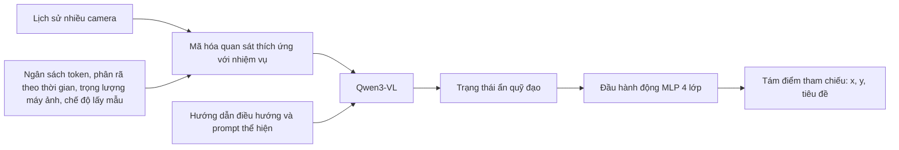
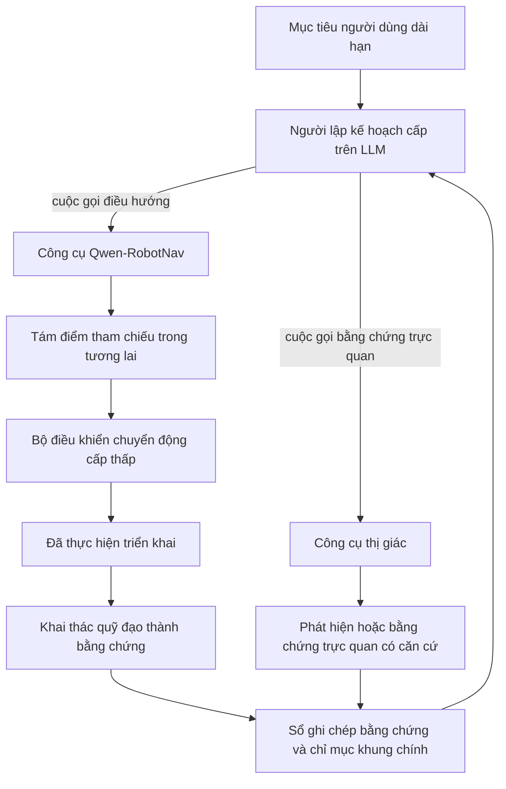

# Qwen-RobotNav: Kiến trúc, Dữ liệu huấn luyện và Đánh giá

## Phạm vi

Báo cáo này bao gồm **Qwen-RobotNav**, chuyên gia điều hướng trong bộ Qwen-Robot.
Nó tập trung vào chính sách điểm tham chiếu, giao diện quan sát có thể định cấu hình, bộ dữ liệu huấn luyện,
lấy mẫu nhiệm vụ cấp lô, ngẫu nhiên quan sát, đánh giá và hạn chế. Đối với
chuyên gia thao tác, xem [Qwen-RobotManip](../Qwen-RobotManip/qwen_robotmanip_details.md).
Để biết mẫu chung, hãy xem [Qwen-VLA](../Qwen-VLA/qwen_vla_details.md).

> **Ngày nghiên cứu:** 22-07-2026. Nguồn chính được kiểm tra là Qwen-RobotNav v3
> (2026-06-29). Tập dữ liệu và số lượng đánh giá là do tác giả báo cáo và chưa được
> được sao chép trong không gian làm việc này. Các kho lưu trữ chính thức hiện tuyên bố rằng không có
> lên kế hoạch giải phóng trọng lượng của mô hình.

## Ý tưởng cốt lõi

Qwen-RobotNav giữ cho đầu hành động đơn giản một cách có chủ ý: Qwen3-VL mã hóa có thể định cấu hình
lịch sử nhiều camera và MLP bốn lớp trực tiếp hồi quy tám điểm tham chiếu trong tương lai. chính của nó
Cơ chế huấn luyện không phải là phổ biến mà là thích ứng đa nhiệm chung theo tỷ lệ 85:15
hỗn hợp quỹ đạo-VL, với lựa chọn tập dữ liệu ở mức độ chi tiết và quan sát hàng loạt
cấu hình ngẫu nhiên độc lập cho mọi mẫu quỹ đạo.

## 1. Tổng quan về mô hình

### 1.1 Nhiệm vụ chính

Qwen-RobotNav hỗ trợ năm nhóm nhiệm vụ điều hướng:

- Hướng dẫn ngôn ngữ thị giác sau đây
- Điều hướng mục tiêu điểm
- Tìm kiếm đối tượng
- Theo dõi mục tiêu
- Lái xe tự động

Nó cũng có thể đóng vai trò là người thực thi điều hướng phản ứng bên dưới trình lập kế hoạch LLM cấp cao hơn.

### 1.2 Kiến trúc



Các đầu ra mô hình:

$$
W=\{(x_k,y_k,\theta_k)\__{k=1}^{8}
$$

Đây là mục tiêu hồi quy trực tiếp 24 chiều.

Không giống như Qwen-VLA và RobotManip sử dụng các hành động khớp DiT. Đầu hành động sử dụng MLP 4 lớp để xuất ra các điểm tham chiếu cho việc điều hướng.


## 2. Mã hóa đầu vào và quan sát

### 2.1 Đầu vào mô hình, Góc máy ảnh và Ví dụ gợi ý

Cuộc gọi RobotNav kết hợp luồng quan sát, ngôn ngữ, nhận dạng nhiệm vụ và bối cảnh có thể định cấu hình
chính sách. Đầu vào được thể hiện tốt nhất dưới dạng:

$$
\left(I_{1:T}^{1:N},\;L,\;\tau,\;\Phi\right),
\qquad
\Phi=(B,\gamma,\{w_c\},m,b_{min},b_{max}),
$$

trong đó \(I_{1:T}^{1:N}\) là lịch sử RGB từ máy ảnh \(N\) qua \(T\) dấu thời gian, \(L\) là
hướng dẫn điều hướng cộng với lời mở đầu phương án, \(\tau\) là chế độ tác vụ và \(\Phi\) kiểm soát chế độ nào
hình ảnh tồn tại và ở độ phân giải nào. Mô hình cơ sở trả về tám điểm tham chiếu \((x,y,\theta)\); một
bộ điều khiển cấp thấp bên ngoài thực hiện chúng.

| Nhóm đầu vào | Nội dung | Bắt buộc hoặc tùy chọn |
| --------------------------- | ------------------------------------------------------------------------------------------- | ---------------------------------------------------------------------------------------------------------------------- |
| quan sát RGB | Khung hình hiện tại và lịch sử từ một hoặc nhiều camera | Yêu cầu; số lượng camera thay đổi tùy theo nền tảng/nhiệm vụ |
| Lời mở đầu của phương án | Nhận dạng ngôn ngữ tự nhiên như robot hay ô tô | Yêu cầu thiết kế nhắc nhở được mô tả |
| Mục tiêu phụ/hướng dẫn | Yêu cầu về tuyến đường, điểm, đối tượng, theo dõi hoặc lái xe | Bắt buộc, nhưng các trường dành riêng cho nhiệm vụ của nó khác nhau |
| Chế độ nhiệm vụ | `VLN`, `PointNav`, `ObjNav` hoặc `Tracking` trong giao diện đối mặt với agent | Cần thiết cho các cuộc gọi đại lý có thể định cấu hình; lái xe tự động được huấn luyện nhưng không được liệt kê là một trong bốn chế độ công cụ này |
| Cấu hình quan sát | Ngân sách token, mức giảm gần đây, trọng lượng máy ảnh, chế độ lấy mẫu khung, giới hạn token trên mỗi hình ảnh | Cấu hình bên ngoài; một số giá trị thường sử dụng giá trị mặc định của nền tảng |
| Ưu tiên điều hướng phụ trợ | Tọa độ/phương hướng, mô tả mục tiêu, trạng thái bản ngã hoặc quỹ đạo trước đó tùy thuộc vào nhiệm vụ | Tùy chọn/phụ thuộc vào nhiệm vụ |

[RobotNav paper v3, §§2.1-2.5 và 3.1-3.2](https://arxiv.org/abs/2606.18112v3)

#### Bố cục camera và thông tin góc được công bố

RobotNav hỗ trợ số lượng camera \(N\) phụ thuộc vào nền tảng tùy ý thay vì một giàn cố định.
Bài viết ghi lại các bố cục quan sát này:

| Bố cục | Lượt xem đã xuất bản | Góc bao phủ và sử dụng |
| ----------------------------- | --------------------------------------------------------------------------------------------------------- | -------------------------------------------------------------------------------------------------------------- |
| Một mắt | Chỉ mặt trước | Triển khai và đánh giá hướng tới tương lai; không có trường nhìn số nào được cố định bởi giao diện mô hình |
| Toàn cảnh bốn góc nhìn | Các mẫu lý luận hiện tại sử dụng trước, phải, sau, trái; Danh sách bộ sưu tập R2R/RxR phía trước, bên trái, bên phải, phía sau | Được mô tả là bao phủ toàn bộ 360 độ; bài báo không ấn định góc phương vị số cho mọi góc nhìn |
| Ví dụ sáu camera | Nhãn bắt đầu`Front`, `Front Right`, tiếp tục qua các chế độ xem trung gian và kết thúc `Front Left` | Chứng minh rằng tên camera ngữ nghĩa mở rộng ra ngoài bốn chế độ xem; góc phương vị hiệu chỉnh chính xác không được liệt kê |
| Lái xe tự động đa góc nhìn | Nhiều camera xe | Số lượng, thứ tự và góc lắp chính xác phụ thuộc vào tập dữ liệu/nền tảng và không cố định trong phần mô hình |

Bài báo đã thử nghiệm các nhãn số như **`right 90 degrees`**, nhưng các nhãn mô tả hoạt động hơi kém
tốt hơn. Đó là ví dụ về góc phương vị rõ ràng duy nhất; gán các giá trị thông thường như 0/90/180/270
độ đối với giàn khoan bốn góc nhìn sẽ là một suy luận chứ không phải là một hợp đồng đầu vào được báo cáo.

Cũng không có đơn đặt hàng máy ảnh toàn cầu nào được công bố. Bản ghi dữ liệu theo lệnh `front, left, right, rear`; dữ liệu lý luận tuần tự hóa ảnh toàn cảnh hiện tại dưới dạng `front, right, back, left`; và sáu góc nhìn
ví dụ bắt đầu `Front, Front Right, ...`. Đây là các đơn đặt hàng tập dữ liệu/ví dụ, không phải là hợp đồng API quy chuẩn.

Đối với trường hợp bốn góc nhìn thông thường, trọng lượng của máy ảnh mẫu là:

```text
front = 2.0, right = 1.0, back = 0.5, left = 1.0
```

Trọng số kiểm soát việc phân bổ token trực quan chứ không phải góc camera vật lý. Chế độ xem phía trước nhận được
chia sẻ lớn nhất vì nó thường chứa các con đường, chướng ngại vật và các mốc mục tiêu; nhìn phía sau nhận được
nhỏ nhất. Mỗi hình ảnh đã chọn được thay đổi kích thước động theo ngân sách token/pixel được phân bổ trong khi vẫn duy trì
tỷ lệ khung hình. Việc huấn luyện cũng làm tăng chiều cao của camera mô phỏng trên 0,5-1,5 m, trường nhìn ngang trên
90-120 độ và tỷ lệ khung hình từ 2:1 đến 4:3; đây là những phần bổ sung dữ liệu, không phải là suy luận bắt buộc
cài đặt. [RobotNav paper v3, §§2.2-2.3 và 4.2.1](https://arxiv.org/abs/2606.18112v3)

#### Ví dụ về tuần tự hóa hình ảnh và thời gian chính xác

Sau khi chọn khung, mô hình sẽ xen kẽ các thẻ văn bản thông thường bằng token hình ảnh. Bài báo đưa ra mẫu hai dấu thời gian, sáu camera này:

```text
Time step 0 Front View <image> Front Right View <image> ... Front Left View <image>
Time step 1 Front View <image> ...
```

Các nhóm là tạm thời và mỗi hình ảnh đều được đặt trước bởi nhãn quan điểm ngữ nghĩa của nó. Không có máy ảnh đã học
Cần phải nhúng ID hoặc thay đổi kiến trúc. Báo cáo không công bố sản phẩm hoàn chỉnh
mẫu trò chuyện, dấu phân cách, ID token hoặc danh sách sáu camera chính xác được ẩn bởi dấu chấm lửng.
[RobotNav paper v3, §2.3](https://arxiv.org/abs/2606.18112v3)

#### Lời mở đầu của phương án chính xác

Bài viết xuất bản hai phần mở đầu bằng ngôn ngữ tự nhiên:

```text
Imagine you are a robot programmed for navigation tasks
```

```text
Imagine you are a car programmed for autonomous driving
```

Đây là các nhiệm vụ ưu tiên chứ không phải là ID phương án đã học. Các tác giả đề xuất rằng một nền tảng mới như
vì máy bay không người lái, rô-bốt có bánh xe hoặc xe bốn chân có thể sử dụng phần mở đầu văn bản mới mà không cần thêm tham số, nhưng phải làm như vậy
không xuất bản các mẫu đã được xác thực cho các nền tảng đó. [RobotNav paper v3, §2.4](https://arxiv.org/abs/2606.18112v3)

#### Nội dung hướng dẫn cho mỗi nhiệm vụ

| Họ mô hình nhiệm vụ | Ngôn ngữ/đầu vào phụ trợ được mô tả trong bài báo | Lịch sử hình ảnh điển hình |
| ------------------ | ------------------------------------------------------------------------------------------------------------------------------------------------------------------------------------- | ---------------------------------------------------------------------------------------------- |
| VLN | Hướng dẫn lộ trình bằng ngôn ngữ tự nhiên | Phạm vi phủ sóng toàn cầu để kết nối lại các mốc với các bước hướng dẫn trước đó |
| ĐiểmNav | Tọa độ mục tiêu tương đối cộng với tư thế, khoảng cách và hướng hiện tại; hoặc nguyên thủy như`Move forward 2.0 meters`, `Turn left 90 degrees`, `Move forward` và `Turn left` | Chế độ xem hiện tại cộng với lịch sử điều hướng được lấy mẫu thống nhất |
| ObjNav | Các mẫu bao gồm`navigate to the {goal_object}` và `find and reach the {goal_object}` | Lấy mẫu rộng, bao quát lịch sử để ghi nhớ các khu vực đã khám phá và quay lại |
| Theo dõi | Mô tả mục tiêu bằng văn bản; truy vấn đại diện của bài báo is`Follow the man in the blue t-shirt` | Hình ảnh lấy cái tôi làm trung tâm hiện tại cộng với lịch sử ngắn, gần đây, có độ phân giải cao |
| Lái xe tự động | Hình ảnh nhiều chế độ xem ở tất cả các biến thể; hướng dẫn điều hướng tùy chọn, trạng thái phương tiện bản ngã và/hoặc lịch sử ngắn gọn về quỹ đạo thực tế | Lịch sử lái xe ngắn; Đánh giá NAVSIM cung cấp ba quỹ đạo thực tế cơ bản trước đó |

Đây là các kết xuất đầu vào khác nhau cho một mô hình được chia sẻ. Trong giao diện agent, người lập kế hoạch cấp trên có thể
thay đổi \(L\), \(\tau\) và \(\Phi\) giữa các cuộc gọi mà không thay đổi trọng số.
[RobotNav paper v3, §§3.1-3.2, 4.1 và 5.4](https://arxiv.org/abs/2606.18112v3)

Đồng huấn luyện lý luận điều hướng có một định dạng khác cụ thể hơn: tối đa tám mẫu được lấy mẫu thống nhất
khung **xem trước** lịch sử, ảnh toàn cảnh `front, right, back, left` hiện tại, hướng dẫn và
thống kê hành động/quỹ đạo theo thời gian chú thích. Số liệu thống kê giám sát văn bản `History`, `Scene Analysis`,
Các mục tiêu `Instruction Progress` và `Action Reasoning`; không phải tất cả chúng đều được yêu cầu trong thời gian chạy bởi
chính sách điểm tham chiếu liên tục. Sự khác biệt này giúp các nhãn chỉ dành cho huấn luyện không bị nhầm lẫn với
đầu vào cảm biến có thể triển khai. [RobotNav paper v3, §4.3](https://arxiv.org/abs/2606.18112v3)

#### Cuộc gọi điều hướng được lắp ráp minh họa

Bài viết định nghĩa cách gọi trừu tượng \(W_i=\operatorname{nav\_qwennav}(L_i,\tau_i,\Phi_i)\), nhưng nó
không phát hành API JSON theo nghĩa đen. Sau đây là **bản dựng lại** từ các trường đã xuất bản:

```yaml
system_preamble: Imagine you are a robot programmed for navigation tasks
task_mode: ObjNav
instruction: Search the kitchen area for a mug.

observation_config:
  token_budget_B: 4096
  temporal_decay_gamma: 1.0
  frame_sample_mode: random
  camera_weights:
    front: 2.0
    right: 1.0
    back: 0.5
    left: 1.0
  min_tokens_per_image: 4
  max_tokens_per_image: 256

observations:
  - time_step: 0
    views:
      front: <image>
      right: <image>
      back: <image>
      left: <image>
  - time_step: 1
    views:
      front: <image>
      right: <image>
      back: <image>
      left: <image>
```

Người lập kế hoạch cấp trên sau này có thể chuyển mô hình tương tự sang `Tracking` hoặc `PointNav` cục bộ, chọn
Lấy mẫu `latest`, tăng \(\gamma\) và giảm \(B\) để có cuộc gọi phản ứng nhanh hơn. Tên trường YAML
và thứ tự ở trên mang tính giải thích, không phải là giao diện chính thức.

Đầu hành động ánh xạ trạng thái ẩn quỹ đạo cuối cùng \(E_A\) thành 24 số, nhưng bài báo không nêu rõ
vị trí trình tự/token trò chuyện chính xác nào tạo ra \(E_A\), liệu token truy vấn chuyên dụng có được sử dụng hay không
dấu phân cách nhắc nhở sản xuất. Những chi tiết đó vẫn **không xác định** nếu không có mã được phát hành.

### 2.2 Mã hóa quan sát thích ứng với nhiệm vụ

Lịch sử điều hướng có thể phát triển vô tận nên mô hình không thể duy trì mọi khung hình ở độ phân giải đầy đủ.

RobotNav hiển thị các tham số quan sát có thể định cấu hình:

- Tổng ngân sách token trực quan \(B\)
- Hệ số suy giảm theo thời gian \(\gamma\)
- Trọng lượng trên mỗi camera \(w_c\)
- Phân bổ tối thiểu và tối đa cho mỗi khung
- Chế độ lấy mẫu khung
- Chế độ nhiệm vụ

Các biện pháp kiểm soát này xác định:

- Những bước thời gian nào được giữ lại
- Camera nào nhận được nhiều token hơn
- Những khung hình nào được mã hóa ở độ phân giải cao hơn
- Liệu những quan sát gần đây hoặc mức độ bao phủ tập phim rộng có được ưu tiên hay không

Ví dụ:

```text
Target tracking:
- high resolution
- short recent window
- strong front-camera weight

Object search:
- longer history
- broader temporal coverage
- more balanced camera allocation
```

Nhận dạng camera và thứ tự thời gian được truyền đạt bằng thẻ ngôn ngữ tự nhiên thay vì các mô-đun kiến trúc mới.

## 3. Hệ thống Định vị Agentic

Đề xuất rộng hơn của bài báo là một **robot đặc vụ**, không chỉ đơn thuần là một chính sách điều hướng độc lập. A
LLM cấp trên có mục đích chung nhận mục tiêu dài hạn của người dùng, lý do về tiến độ, lựa chọn
công cụ nào để gọi và duy trì bộ nhớ nhỏ gọn. Qwen-RobotNav là một trong những công cụ đó: nó là
người thực thi chuyển động chuyển đổi mục tiêu phụ điều hướng cục bộ thành tám điểm tham chiếu.

Sự khác biệt này cũng làm rõ hai cách sử dụng khác nhau của “đầu”:

- **LLM lập kế hoạch cấp cao**—ví dụ Qwen3.6-Plus trong hệ thống QA được thể hiện đã báo cáo—là một
  thành phần lý luận riêng biệt phân rã các nhiệm vụ và gửi công cụ.
- **Đầu hành động MLP bốn lớp** nằm bên trong Qwen-RobotNav. Nó chỉ lập bản đồ cuối cùng của RobotNav
  trạng thái ẩn tới tọa độ điểm tham chiếu; nó không phải là người lập kế hoạch hoặc người đứng đầu gọi công cụ của đại lý.

[RobotNav paper v3, §§3.1-3.3 và 5.3](https://arxiv.org/abs/2606.18112v3)




### 3.1 Qwen-RobotNav là Công cụ Di chuyển

Đối với mỗi cuộc gọi điều hướng, người lập kế hoạch cung cấp:

$$
(L_i,\tau_i,\Phi_i),
$$

trong đó \(L_i\) là mục tiêu phụ cục bộ, \(\tau_i\) chọn hành vi điều hướng và \(\Phi_i\) điều khiển
chiến lược quan sát. Công cụ chuyển động hiển thị bốn chế độ được đặt tên bằng cách sử dụng cùng trọng số RobotNav.

#### Tất cả các giá trị `task_mode` đối mặt với agent

| Trường YAML minh họa | Hành vi đã chọn | Mục tiêu hoặc hướng dẫn do người lập kế hoạch cung cấp | Chiến lược quan sát điển hình | Mẫu đầu vào đại diện |
| --- | --- | --- | --- | --- |
| `task_mode: VLN` | Đi theo một lộ trình được mô tả bằng ngôn ngữ và đặt các mốc theo thứ tự của nó trong các quan sát | Hướng dẫn lộ trình ngôn ngữ tự nhiên theo thủ tục | Giữ lại lịch sử tập rộng để có thể kiểm tra các mốc trước đó theo các bước hướng dẫn sau | `Go to the living room, turn left, and stop near the kitchen.` |
| `task_mode: PointNav` | Di chuyển tới mục tiêu không gian, tọa độ hoặc mục tiêu cục bộ giống như điểm tham chiếu | Tọa độ mục tiêu tương đối, tư thế/khoảng cách/hướng hoặc chuyển động nguyên thủy bằng văn bản | Sử dụng lịch sử được lấy mẫu cục bộ hoặc thống nhất; tăng mức độ gần đây gần mục tiêu để có cách tiếp cận suôn sẻ | `Go to (2.2, 2.4).` hoặc `Move forward 2.0 meters.` |
| `task_mode: ObjNav` | Tìm kiếm một danh mục đối tượng hoặc một trường hợp cụ thể bằng cách sử dụng bằng chứng trực quan tích lũy | Tên đối tượng, danh mục hoặc biểu thức giới thiệu | Sử dụng ngân sách token lớn hơn với lịch sử rộng/ngẫu nhiên trong quá trình khám phá; chuyển sang các khung hình gần đây khi tiếp cận một ứng viên rõ ràng | `Search the kitchen area for a mug.` |
| `task_mode: Tracking` | Duy trì khóa mục tiêu đang di chuyển hoặc được quan sát gần đây | Mô tả mục tiêu bằng văn bản | Ưu tiên lấy mẫu khung hình mới nhất, độ lệch gần đây mạnh và độ chính xác cao cho các quan sát gần đây | `Follow the man in the blue t-shirt.` |

Bốn giá trị chế độ được đặt tên rõ ràng trong bài báo. Việc xê-ri hóa `task_mode: <value>` và
các chuỗi đầu vào ở cột cuối cùng là các ví dụ giấy tiêu biểu hoặc các bản trình bày trung thực của nó đã được xuất bản.
mẫu; chúng không phải là lược đồ API được phát hành. Đặc biệt, `task_mode: ObjNav` chọn
**hành vi tìm kiếm**. Người lập kế hoạch sau đó có thể chuyển lệnh gọi mô hình tương tự sang `PointNav` cho địa phương cuối cùng
tiếp cận hoặc tới `Tracking` nếu mục tiêu di chuyển.

Qwen-RobotNav được huấn luyện về **năm nhóm nhiệm vụ**: làm theo hướng dẫn, điều hướng điểm mục tiêu,
điều hướng mục tiêu, theo dõi mục tiêu và lái xe tự động. Tuy nhiên, giao diện hướng tới agent trong
§§3.1-3.2 chỉ nêu tên bốn giá trị `task_mode` ở trên. **Do đó, lái xe tự động là một quá trình huấn luyện và
họ đánh giá, không phải giá trị lệnh gọi công cụ `task_mode: Driving` được ghi lại.**

RobotNav trả về quỹ đạo điểm tham chiếu, không phải mô men xoắn của động cơ và không phải kế hoạch ngôn ngữ tự nhiên. Cấp độ thấp hơn
bộ điều khiển thực hiện các điểm tham chiếu. Người lập kế hoạch có thể thay đổi chế độ, mục tiêu phụ và cấu hình quan sát
giữa các cuộc gọi mà không tải chính sách điều hướng khác.
[Giấy RobotNav v3, §§3.1-3.2](https://arxiv.org/abs/2606.18112v3)

### 3.2 Các công cụ khác xung quanh RobotNav

Bài viết nêu tên rõ ràng ba **công cụ bằng chứng trực quan phụ trợ**:

| Công cụ | Vai trò trong vòng lặp đại lý | Nó không làm gì |
| ------------------- | --------------------------------------------------------------------- | --------------------------------------------------- |
| Phát hiện đối tượng | Xác định vị trí các đối tượng ứng cử viên trong các quan sát hiện tại hoặc các khung chính được lưu trữ | Không tạo ra các điểm chuyển động |
| Hiểu cảnh | Tóm tắt các phòng, cách bố trí, địa danh và các bằng chứng cấp cảnh khác | Không thay thế người lập kế hoạch hoặc người thực thi điều hướng |
| Nền tảng ngữ nghĩa | Kết nối mục tiêu văn bản hoặc biểu thức đề cập đến bằng chứng trực quan | Không thực hiện mục tiêu nối đất |

Những công cụ này trả lời các câu hỏi về nhận thức khi người lập kế hoạch cần thêm bằng chứng trước khi lựa chọn kế hoạch tiếp theo.
mục tiêu phụ. Bài viết không tiết lộ xương sống mô hình, API, prompt, dữ liệu huấn luyện hoặc độc lập của họ
độ chính xác. Vì vậy chúng nên được hiểu là các thành phần được đặt tên của giao diện được đề xuất chứ không phải là
công cụ phát hành được chỉ định đầy đủ. Đây là các loại công cụ phụ trợ duy nhất được nêu tên rõ ràng trong Phần 3;
bài viết không xác định phạm vi đăng ký rộng hơn cho thao tác, nắm bắt, lời nói, lập bản đồ hoặc robot khác
kỹ năng.

Hệ thống còn cung cấp 2 khả năng hỗ trợ không phải là chính sách chuyển động mới:

- **Thu hồi hình ảnh khung hình chính:** quá trình triển khai đã hoàn tất sẽ giữ lại các khung được lập chỉ mục nguồn; người lập kế hoạch có thể truy xuất
  sau đó khi bản tóm tắt bằng văn bản không đủ.
- **Khai thác quỹ đạo thành bằng chứng:** một bộ chuyển đổi chuyển đổi các đối số của trình lập kế hoạch thành lệnh gọi RobotNav, sau đó
  nén các quan sát dày đặc, dấu vết của bộ điều khiển và điểm tham chiếu thành bằng chứng cho kế hoạch tiếp theo
  rẽ.

[RobotNav paper v3, §§3.1 và 3.3](https://arxiv.org/abs/2606.18112v3)

### 3.3 Sổ ghi chép chứng cứ và nén ngữ cảnh

Việc trả lại mọi hình ảnh và dấu vết kiểm soát cấp thấp cho trình lập kế hoạch sẽ nhanh chóng làm cạn kiệt bối cảnh của nó
window, trong khi chỉ trả về `success/failure` sẽ loại bỏ bằng chứng hữu ích. Dây nịt thay vào đó phát ra
một bản ghi nhỏ gọn. Bài viết đưa ra lược đồ đại diện này:

```text
{
  subgoal: "Search the kitchen area for a mug",
  task_mode: ObjNav,
  config: Phi_i (main controls: B, gamma, m),
  progress: "entered kitchen, checked countertop and dining table",
  salient: ["sink", "countertop", "round table", "no mug observed"],
  outcome: "target not found",
  key_frames: [#18, #31]
}
```

Sổ ghi chép bằng chứng vẫn tồn tại các khu vực được tìm kiếm, địa điểm ứng cử viên, giả thuyết bị bác bỏ, mốc
các tín hiệu và giả định về bố cục thông qua việc nén bối cảnh của kế hoạch. Một mục sau có thể sửa lại một mục trước đó
niềm tin trong khi vẫn lưu giữ lịch sử cập nhật có thể kiểm tra được. ID khung chính duy trì đường dẫn quay lại hình ảnh thô,
vì vậy việc nén văn bản không loại bỏ vĩnh viễn bằng chứng trực quan cơ bản.

Mục vở minh họa của bài báo là:

```text
[step 47] Kitchen entered and searched; countertop and dining table checked. No mug observed.
Corridor shelf remains a possible candidate region from key frame #12.
```

### 3.4 Ví dụ Vòng lặp công cụ có đường chân trời dài

Trình tự sau đây là **minh họa nhưng trực tiếp theo sau ví dụ tìm kiếm cốc của bài báo**:

1. Công cụ lập kế hoạch LLM phân tách “tìm chiếc cốc” thành “tìm kiếm trong bếp”.
2. Nó gọi Qwen-RobotNav ở chế độ `ObjNav` với ngân sách token lớn và lấy mẫu bao gồm lịch sử.
3. RobotNav dự đoán tám điểm tham chiếu ở mỗi bước điều hướng; bộ điều khiển cấp thấp thực thi chúng.
4. Dây nịt báo cáo rằng mặt bàn và mặt bàn bếp đã được kiểm tra nhưng không tìm thấy chiếc cốc nào, và
   lưu trữ các khung chính.
5. Người lập kế hoạch có thể gọi tính năng phát hiện đối tượng hoặc nền tảng ngữ nghĩa trên khung hiện tại/được lưu trữ để xác minh
   đối tượng ứng viên.
6. Nó cập nhật sổ ghi chép bằng chứng, chọn một khu vực khác và gọi lại RobotNav.
7. Khi một cốc ứng cử viên hiển thị, nó có thể chuyển mô hình RobotNav tương tự sang `PointNav` cục bộ hoặc
   `Tracking` với cấu hình quan sát tập trung vào lần gần đây.

Đây là lý do tại sao Qwen-RobotNav được mô tả tốt nhất là **một công cụ bên trong agent được đề xuất**, cụ thể là
công cụ để di chuyển. Người lập kế hoạch cấp trên thực hiện việc suy luận và lựa chọn công cụ theo tầm nhìn dài hạn; tầm nhìn phụ trợ
công cụ thu thập bằng chứng; dây nịt quản lý bộ nhớ; và bộ điều khiển biến các điểm tham chiếu thành cấp độ thiết bị truyền động
chuyển động. Bài viết đánh giá một sự khởi tạo ở cấp độ hệ thống để trả lời câu hỏi được thể hiện, nhưng không
phát hành một bộ phần mềm agent-robot tổng quát hoàn chỉnh.
[RobotNav paper v3, §§3 và 5.3](https://arxiv.org/abs/2606.18112v3)

## 4. Dữ liệu huấn luyện

### 4.1 Thành phần ngữ liệu

Tập huấn luyện được báo cáo chứa khoảng **15,6 triệu mẫu**:


```text
85% navigation trajectory-planning data
15% navigation-related vision-language reasoning data
```

Các nguồn cụ thể hơn tỷ lệ tổng hợp gợi ý:

| Huấn luyện gia đình | Mẫu báo cáo | Xây dựng hoặc nguồn |
| ----------------------------- | ---------------: | ---------------------------------------------------------------------------------------------------------------------------- |
| Hướng dẫn sau |           5,631M | VLN-CE R2R 1.491M và RxR 4.140M, không được kiểm soát bởi giáo viên và được mở rộng trên các biến thể chế độ xem/tăng cường |
| Điều hướng mục tiêu điểm |             984K | Matterport3D và HM3D trong Môi trường sống: Tiếp cận trực tiếp 348K, tầm ngắn 174K, tầm xa 400K, lệnh nguyên thủy 62K |
| Điều hướng mục tiêu-đối tượng |           2.000M | Matterport3D, HM3D và HM3D-OVON; khám phá dựa trên bộ xương với chú thích mục tiêu từ vựng mở |
| Theo dõi mục tiêu |           1,486M | Phân tách theo dõi mục tiêu đơn EVT-Bench, không có yếu tố gây phân tâm |
| Lái xe tự động |           3.216M | các biến thể giám sát nuScenes 78K và OpenScene 3.138M |
| VL Tổng Hợp |       khoảng 1,0 triệu | VQA, chú thích, căn cứ, tuân theo hướng dẫn, lý luận nhiều hình ảnh, nhận dạng mốc và STEM |
| Lý luận cụ thể về điều hướng |             873K | QA điểm quyết định dạng tự do và lý luận lịch sử/cảnh/tiến trình/hành động có cấu trúc bắt nguồn từ quỹ đạo VLN |
| Hội thoại VLN rời rạc |             362K | CVDN, SOON, REVERIE, SRDF và dữ liệu VLN dựa trên biểu đồ khác được định dạng lại dưới dạng câu hỏi hành động bốn lượt xem nhiều vòng |
| Điều hướng do T2V tạo |              40K | Các video theo dõi và làm theo hướng dẫn tổng hợp được chuyển đổi thành quỹ đạo 2-D và được lọc để đảm bảo tính hợp lệ về mặt hình ảnh/động học |

Số lượng phù hợp với tiêu đề được làm tròn:

- **Danh mục quỹ đạo:** khoảng 13.357M mẫu.
- **VL/danh mục lý luận:** khoảng 2.235M mẫu.
- **Kết hợp:** khoảng 15,592M mẫu, được báo cáo là 15,6M.

Đây là các mẫu huấn luyện, không phải 15,6 triệu tập thô độc lập:

- Số lượng R2R/RxR bao gồm khả năng tăng cường ngôn ngữ và chế độ xem camera.
- Số lượng lái xe bao gồm nhiều biến thể điều hòa của cùng một quỹ đạo.
- Quỹ đạo lái xe có thể được hiển thị có hoặc không có hướng dẫn, trạng thái bản ngã hoặc quỹ đạo trước đó
  bối cảnh.

[RobotNav paper v3, §4 và Hình 5](https://arxiv.org/abs/2606.18112v3)

### 4.2 Cách xây dựng mỗi bộ dữ liệu điều hướng

#### Hướng dẫn sau: R2R và RxR

- Mở ra các quỹ đạo thực tế với **giáo viên ép buộc**.
- Chuyển đổi từng lộ trình thành mẫu huấn luyện cấp độ.
- Hướng dẫn trùng lặp theo ID quỹ đạo.
- Tạo ba cách diễn giải cho mỗi hướng dẫn duy nhất.
- Huấn luyện cả cấu hình chế độ xem chỉ phía trước và nhiều camera.
- Áp dụng sàng lọc chất lượng hình ảnh cho các quan sát được hiển thị.

#### ĐiểmNav

- Nhấn mạnh các tuyến đường **6-10 m** khó hơn thay vì cho phép các tuyến đường ngắn dễ dàng chiếm ưu thế.
- Giữ lại các bước tiến về phía trước với **tỷ lệ bao gồm **45%** để giảm sự mất cân bằng trong hành động.
- Luôn giữ nguyên các thao tác quay và dừng.
- Bao gồm các mục tiêu tọa độ, các tuyến đường ngắn/tầm xa và lệnh nguyên thủy.

#### ObjectNav

- Sắp xếp môi trường có thể điều hướng thành biểu đồ khám phá.
- Chọn ngẫu nhiên các nhánh và quay lại ở ngõ cụt thay vì chỉ đi theo những con đường ngắn nhất.
- Làm mịn đường dẫn kết quả bằng các đường khối.
- Các điểm tham chiếu quỹ đạo mẫu mỗi **0,25 m**.
- Đính kèm các mục tiêu đối tượng từ vựng mở và các mẫu ngôn ngữ đa dạng.

#### Theo dõi mục tiêu

- Sử dụng tính năng phân chia Theo dõi mục tiêu đơn của EVT-Bench mà không có yếu tố gây phân tâm.
- Ghép nối hình ảnh ích kỷ hiện tại và lịch sử ngắn gọn gần đây với mô tả mục tiêu bằng văn bản.
- Giám sát định dạng quỹ đạo tương lai tám điểm tương tự được sử dụng bởi các nhiệm vụ điều hướng khác.

#### Lái xe tự động

- Sử dụng quỹ đạo lái xe đa góc nhìn của nuScenes và OpenScene.
- Tạo các biến thể đầu vào khác nhau từ cùng một đường dẫn bằng cách thêm tùy ý:
  - hướng dẫn điều hướng;
  - trạng thái phương tiện bản ngã hiện tại;
  - bối cảnh quỹ đạo thực tế trước đó.

#### Dữ liệu điều hướng chuyển văn bản thành video

Đường ống tổng hợp 40K là:

1. Tạo prompt cảnh ở góc nhìn thứ nhất và hướng dẫn điều hướng bằng LLM.
2. Kết xuất một video ngắn lấy chủ nghĩa tự nhiên bằng mô hình chuyển văn bản thành video.
3. Lọc tính nhất quán của hình ảnh và hướng dẫn bằng VLM.
4. Khôi phục chuyển động của máy ảnh bằng cách sử dụng độ sâu một mắt và ước tính tư thế.
5. Chuyển đổi đường đi của camera thành quỹ đạo điều hướng 2-D.
6. Loại bỏ các mẫu không hợp lý về mặt vật lý bằng bộ lọc động học.

#### Chia sẻ camera và tăng cường chuyển động

- Chiều cao camera: lấy mẫu đồng đều từ **0,5-1,5 m**.
- Trường nhìn ngang: lấy mẫu từ **90-120 độ**.
- Tỷ lệ khung hình: được lấy mẫu trong khoảng **2:1 và 4:3**.
- PointNav cũng thay đổi hướng ban đầu, góc nhìn và chuyển động tốc độ thấp.

[Giấy RobotNav v3, §§4.1-4.2](https://arxiv.org/abs/2606.18112v3)

### 4.3 Dữ liệu lưu giữ ngôn ngữ thị giác

Phần VL bảo toàn:

- Hiểu ngôn ngữ tự nhiên
- Nhận thức về thế giới mở
- Lý luận không gian
- Giải thích các thẻ máy ảnh và thời gian
- Khái quát hóa các hướng dẫn và môi trường vô hình

Ba nhóm chính của nó là:

- **VL chung, khoảng 1,0M:** VQA, chú thích, nối đất, hướng dẫn làm theo, nhiều hình ảnh
  lý luận, nhận dạng mốc và STEM.
- **Lý luận điều hướng, 873K:** tóm tắt lịch sử, phân tích cảnh, theo dõi tiến trình và hành động
  suy luận bắt nguồn từ quỹ đạo điều hướng.
- **Cuộc hội thoại VLN riêng biệt, 362K:** CVDN, SOON, REVERIE, SRDF và dựa trên biểu đồ có liên quan
  dữ liệu điều hướng được định dạng lại dưới dạng câu hỏi hành động nhiều vòng, bốn lượt xem.

### 4.4 Giải thích và phân chia hãy cẩn thận

Các bộ đánh giá sử dụng lại một số **dòng dữ liệu** được thấy trong quá trình huấn luyện—R2R/RxR, EVT-Bench,
Matterport3D/HM3D và HM3D-OVON—dưới các nhãn được giữ lại như Val-Unseen, test hoặc unseen-object
chia tách. Bài viết không công bố một cuộc kiểm tra loại bỏ sự trùng lặp hoặc ô nhiễm ở cấp độ mẫu trên các
chia tách. Điều này không chứng minh được sự rò rỉ, nhưng nó có nghĩa là các định nghĩa phân tách, không chỉ riêng tên tập dữ liệu, mang theo
yêu cầu khái quát hóa. AlpaSim là một ngoại lệ rõ ràng: bài báo báo cáo rõ ràng việc đánh giá zero-shot
mà không cần huấn luyện về 920 kịch bản PhysicalAI-AV NuRec.

## 5. Quy trình huấn luyện

### 5.1 Mục tiêu huấn luyện

RobotNav sử dụng tổn thất tổng hợp:

$$
\mathcal{L}
=
\mathcal{L__{traj}
+
\lambda\mathcal{L__{VL}
$$

ở đâu:

$$
\mathcal{L__{traj}
=
\left\|
W-\hat{W}
\right\|_2^2
$$

là MSE điểm tham chiếu và \(\mathcal{L__{VL}\) là dự đoán token tiếp theo trên các mẫu lý luận liên quan đến điều hướng.

Giá trị được báo cáo là:

$$
\lambda=1,0
$$

Không giống như kết hợp luồng, đây là hồi quy trực tiếp mang tính xác định: một lần chuyển tiếp dự đoán tất cả tám điểm tham chiếu.

### 5.2 Cấu hình ngẫu nhiên

Không có cấu hình quan sát nào được cố định trong quá trình huấn luyện.

Đối với mỗi mẫu, mô hình ngẫu nhiên hóa:

- Ngân sách token
- Phân rã theo thời gian
- Trọng lượng mỗi camera
- Giới hạn phân bổ mỗi khung
- Lấy mẫu lịch sử ngẫu nhiên so với khung hình mới nhất

Điều này ngăn không cho mạng trang bị quá mức cho một bố cục camera hoặc một chiến lược bối cảnh.

Chính sách kết quả có thể chuyển đổi các chiến lược quan sát khi suy luận mà không cần thay đổi kiến trúc hoặc huấn luyện lại về nhiệm vụ cụ thể.

### 5.3 Cách luân phiên các nhiệm vụ trong quá trình đồng huấn luyện

RobotNav có hai nguồn biến thể riêng biệt không nên gộp chung:

```text
Batch level:
choose one dataset from a registry -> load that dataset's batch/objective

Sample level inside navigation data:
independently randomize token budget, temporal decay, camera weights,
per-frame bounds, and random/latest history mode
```

Hành vi hỗn hợp nhiệm vụ là:

- **Mục tiêu cấp cao nhất:** 85% dữ liệu quỹ đạo và 15% VL/dữ liệu lý luận.
- **Mức độ chi tiết của việc lấy mẫu:** chọn tập dữ liệu ở cấp lô từ sổ đăng ký.
- **Mục tiêu cân bằng:** giữ cho tất cả năm nhóm điều hướng luôn hiển thị thay vì cho phép RxR lớn hoặc lái xe
  nguồn để thống trị.
- **Không được tiết lộ:** tỷ lệ đăng ký trên mỗi tập dữ liệu và thứ tự lô chính xác.
- **Không suy ra:** một chuỗi lặp lại theo nghĩa đen, chẳng hạn như `85 trajectory batches -> 15 VL batches`.

Khi mẫu quỹ đạo được chọn, cấu hình quan sát được chọn ngẫu nhiên một cách độc lập:

| Tham số | Phân phối huấn luyện |
| ----------------------------------- | --------------------------------------------------- |
| Ngân sách token trực quan \(B\) | Đồng phục từ 2.048 đến 4.096 |
| Phân rã theo thời gian \(\gamma\) | Đồng phục từ 1 đến 3 |
| Trọng lượng máy ảnh \(w_c\) | Phạm vi thống nhất dành riêng cho máy ảnh |
| Token tối thiểu trên mỗi khung \(b_{min}\) | Đồng phục rời rạc từ 1 đến 8 |
| Token tối đa trên mỗi khung hình \(b_{max}\) | Đồng phục rời rạc từ 128 đến 256 |
| Chế độ lịch sử khung | `random` hoặc `latest`, mỗi loại có xác suất 50% |

Sự thay đổi mục tiêu cũng đơn giản không kém:

- **Lô quỹ đạo:** kích hoạt điểm tham chiếu MSE.
- **Lô VL:** kích hoạt dự đoán token tiếp theo.
- **Tham số chung:** cả hai đều sử dụng cùng một mạng chính sách VLM.
- **Giảm cân:** \(\lambda=1\).
- **Lý do đồng huấn luyện:** việc điều chỉnh chỉ theo quỹ đạo có xu hướng chuyển sang chuỗi hành động phản ứng
  lập bản đồ và mất khả năng suy luận về không gian/ngôn ngữ chung.

[RobotNav paper v3, §§2.2 và 2.6](https://arxiv.org/abs/2606.18112v3)

### 5.4 Tinh chỉnh từ đầu đến cuối

RobotNav được khởi tạo từ Qwen3-VL và được tinh chỉnh từ đầu đến cuối:

- Bộ mã hóa tầm nhìn có thể huấn luyện được
- Nền tảng ngôn ngữ có thể huấn luyện được
- Đầu hành động MLP có thể huấn luyện được
- Đầu hành động sử dụng tốc độ học lớn hơn xương sống được huấn luyện trước
- Sử dụng AdamW, khởi động, phân rã cosine và cắt gradient

Cài đặt ví dụ được báo cáo bao gồm:

```text
Backbone peak learning rate: 2 × 10^-5
Action-head peak learning rate: 1 × 10^-4
Warm-up: first 3% of steps
Gradient clipping: 1.0
```

## 6. Đánh giá

### 6.1 Ma trận benchmark

RobotNav được đánh giá trên tất cả năm nhóm nhiệm vụ huấn luyện cùng với hệ thống QA được thể hiện bằng agent. Những cái này
không phải là một tiêu chuẩn chung: số liệu, cảm biến, ngữ nghĩa phân chia, giả định của bộ điều khiển và quyền truy cập vào
lịch sử khác nhau, vì vậy điểm số chỉ nên được so sánh trong một hàng.

| Đánh giá | Giao thức và số liệu |                      Kết quả Qwen-RobotNav chính | Giải thích quan trọng |
| --------------------- | ------------------------------------------------------------------------------------------------- | ---------------------------------------------: | ------------------------------------------------------------------------------------------------ |
| VLN-CE R2R Val-Không nhìn thấy | Một mắt và toàn cảnh; ĐB, OSR, nDTW, SR, SPL |               Toàn cảnh 8B: 72,1 SR / 66,6 SPL | Họ theo hướng dẫn cũng cung cấp dữ liệu huấn luyện; sự phân chia vô hình là ranh giới hoạt động |
| VLN-CE RxR Val-Không nhìn thấy | Cùng số liệu, hướng dẫn đa ngôn ngữ |               Toàn cảnh 8B: 76,5 SR / 65,7 SPL | Báo cáo giấy +12,1 SR so với NavFoM khi so sánh |
| Kiểm tra VLNVverse | Đường dẫn hướng dẫn chi tiết và thô; SR/SPL |  mức phạt 8B: 63,75/57,93; thô: 46,59 / 41,54 | Những hướng dẫn thô thiển khó hơn về mặt vật chất |
| VLN-PE R2R Val-Không nhìn thấy | Bộ điều khiển flash cấp thấp; SR/SPL và tỷ lệ giảm |          8B: 65,50 SR / 61,19 SPL / 4,05 rơi | Tỷ lệ rơi cao hơn 0,45 của InternVLA-N1 cho thấy sự cân bằng giữa bộ điều khiển và an toàn |
| Đối tượng MP3D / HM3DNav | Từ vựng đóng; SR/SPL | 4B chỉ có RGB: MP3D 52.2/16.0; HM3D-v2 75.6/30.6 | Một số đường cơ sở sử dụng HM3D-v1, hạn chế xếp hạng trực tiếp |
| HM3D-OVON | Đối tượng được thấy, đồng nghĩa, không được nhìn thấy; SR/SPL; một camera phía trước |                      4B SR: 57,7 / 60,1 / 53,1 | Huấn luyện theo kiểu tìm kiếm cải thiện phạm vi tiếp cận nhưng tạo ra các đường dẫn dài hơn, kém hiệu quả hơn |
| EVT-Băng ghế STT | Mục tiêu duy nhất, góc nhìn duy nhất; theo dõi, va chạm và tỷ lệ thành công |               4B: theo dõi 90,0 / 77,4 thành công | Tỷ lệ theo dõi tốt nhất không trở thành thành công của tập hay nhất; chuyên gia đạt 86+ SR |
| NAVSIM điều hướng | Số liệu lái xe vòng kín; prompt bao gồm các quỹ đạo thực tế từ ba khung trước đó |       4B PDMS 91.4; 79,5 không có lịch sử trước đó | Sự thật lịch sử trước đó là một phần chính của bản nhạc |
| AlpaSim trên NuRec | 920 tình huống bắn không; điểm chạm trán, địa hình và tổng điểm |                             8B: 22/27/0,17 | Bỏ xa Alpamayo-R1-10B ở mức 4/16/0,72; biện pháp chuyển OOD, không chuyên chẵn lẻ |

[RobotNav paper v3, Bảng 1-6 và 8-9](https://arxiv.org/abs/2606.18112v3)

### 6.2 Kết quả EQA hệ thống agent

Đây là kết quả **cấp hệ thống**, không phải điểm chính sách RobotNav độc lập:

- **Công cụ lập kế hoạch:** Qwen3.6-Plus.
- **Người thực hiện chuyển động:** Qwen-RobotNav-8B.
- **HM-EQA:** Độ chính xác 76,7 và 0,15 bước chuẩn hóa.
- **Benchmark MT:** độ chính xác 54,4 và 0,19 bước chuẩn hóa.
  - Văn xuôi gọi benchmark này là `MT-HM3D`.
  - Bảng 7 gọi là `MT-EQA`.
- **EXPRESS-Bench:** 79,27 điểm LLM và 33,96 Epath.

Sự đóng góp của người lập kế hoạch và sự không nhất quán trong việc đặt tên phải được giữ nguyên khi trích dẫn các giá trị này.
[RobotNav paper v3, §5.2.4 và Bảng 7](https://arxiv.org/abs/2606.18112v3)

### 6.3 Loại bỏ tỷ lệ và ngữ cảnh

Sự cắt bỏ đánh giá cho thấy một số hiệu ứng không đơn điệu:

- Tăng dữ liệu điều hướng từ 12,5% lên 100% cải thiện mạnh mẽ R2R, RxR, lái xe và
  OVON-Unseen (37,1 đến 53,1 SR), nhưng quá trình theo dõi bão hòa sớm và đạt đỉnh ở mức 25% dữ liệu.
- Trên 500 tập R2R Val-Unseen có \(\gamma=2\), tăng ngân sách token từ 2.048 lên 4.608
  tăng SR từ 70,8 lên 74,6, trong khi OSR đạt đỉnh sớm hơn với ngân sách 3.584 token.
- Với \(B=3072\), SR đạt đỉnh \(\gamma=3.0\) rồi giảm nhẹ; xu hướng khung gần đây hơn là
  chỉ hữu ích ở một mức độ nào đó.
- Loại bỏ lịch sử lái xe thực tế cơ bản ba khung trước đó làm giảm hơn 11 NAVSIM PDMS
  điểm cho cả hai kích thước mô hình được báo cáo.

### 6.4 Bằng chứng thực tế và những cảnh báo

- Các minh họa bao gồm Unittree Go2, phòng triển lãm, căn hộ và quán cà phê.
- Độ trễ được báo cáo:
  - suy luận từ xa: khoảng **196 ms** hoặc **5,1 Hz**;
  - Jetson Thor: khoảng **204 ms**, hoặc **4,9 Hz**.
- Bài viết không báo cáo tỷ lệ thành công khi thử nghiệm lặp lại các triển khai này.
- Do đó, “khái quát hóa thế giới thực bằng không” là bằng chứng định tính, không phải là một thế giới thực thống kê
  giao thức đánh giá.

[RobotNav paper v3, §§5.5-5.6 và Hình 14-15](https://arxiv.org/abs/2606.18112v3)

## 7. So sánh và kết luận

### 7.1 RobotNav khác với Qwen-VLA như thế nào

| Khía cạnh | Qwen-VLA | Qwen-RobotNav |
| ------------------------- | ------------------------------------------------- | ------------------------------------------------------------ |
| Phạm vi | Hành động thể hiện chung và tạo quỹ đạo | Chỉ điều hướng |
| Xương sống | Qwen3.5-4B | Họ Qwen3-VL, được đánh giá từ 2B đến 8B |
| Người đứng đầu chính sách | DiT phù hợp với dòng chảy lớn | MLP 4 lớp nhẹ |
| Đầu ra | Đoạn hành động cụ thể theo nhiệm vụ có thể thay đổi | Đã sửa lỗi quỹ đạo tám điểm |
| Thế hệ | Tích hợp dòng lặp | Hồi quy một lần |
| Trạng thái robot | Có thể được đưa trực tiếp vào mô hình hành động | Chủ yếu là lịch sử trực quan, prompt và bối cảnh điều hướng |
| Giao diện hiện thân | Mô tả robot/điều khiển cộng với mặt nạ hành động | Thẻ nhắc nhở và mã hóa quan sát có thể định cấu hình |
| Xử lý lịch sử | Bối cảnh đa phương thức chung | Phân bổ tạm thời và nhiều camera theo ngân sách token rõ ràng |
| Lịch trình huấn luyện | Chương trình giảng dạy bốn giai đoạn bao gồm RL | Quy trình tinh chỉnh đa tác vụ từ đầu đến cuối |
| Mất hành động | Dự đoán vận tốc phù hợp với dòng chảy | Điểm tham chiếu MSE |
| Kỹ thuật bền vững chính | Các giai đoạn đồng huấn luyện trước và tiến bộ rộng rãi | Ngẫu nhiên hóa cấu hình quan sát |
| Tích hợp đại lý | Chính sách chung | Được thiết kế như một mô-đun phản ứng theo kế hoạch cấp trên |

### 7.2 Triết lý huấn luyện cốt lõi

> **Giữ đầu hành động đơn giản và huấn luyện VLM trở thành người điều hướng.**

RobotNav giả định rằng việc lập kế hoạch điều hướng có thể được thể hiện một cách cô đọng dưới dạng các điểm tham chiếu trong tương lai. Hầu hết lý luận về không gian vẫn nằm trong VLM được huấn luyện trước, trong khi MLP nhỏ chỉ chuyển trạng thái ẩn của nó thành tọa độ.

---

## Nguồn chính

1. Zhang và cộng sự. *Báo cáo kỹ thuật Qwen-RobotNav: Mô hình điều hướng có thể mở rộng được thiết kế cho
   Hệ thống định vị agent*, v3, 2026-06-29.
   [arXiv](https://arxiv.org/abs/2606.18112v3) ·
   [PDF cục bộ](../../../../papers/01-gwen/vla-specific/qwen_robotnav_2606.18112.pdf) ·
   [kho lưu trữ chính thức](https://github.com/QwenLM/Qwen-RobotNav)
2. Wang và cộng sự. *Qwen-VLA: Mô hình Hành động-Ngôn ngữ-Tầm nhìn cho Trí tuệ Thể hiện Chung*.
   [arXiv](https://arxiv.org/abs/2605.30280v2) ·
   [PDF cục bộ](../../../../papers/01-gwen/vla-specific/qwen_vla_2605.30280.pdf)
