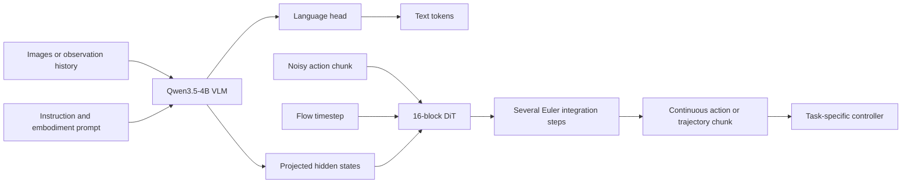
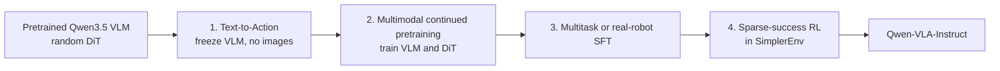

# Qwen-VLA: Presentation Summary

> **Full sources of truth:** [architecture and training report](qwen_vla_details.md) and
> [evaluation evidence](../../evaluation/VLA/benchmarks.md). This short version intentionally omits
> equations, dataset-level action schemas, complete protocols, and implementation details. Primary
> paper: [Qwen-VLA v2](https://arxiv.org/abs/2605.30280v2).

## Main Message

> **Qwen-VLA uses one multimodal backbone and one continuous-action decoder to support manipulation,
> navigation, human motion, and vision-language tasks across different embodiments.**

- Starts from the Qwen3.5-4B vision-language model.
- Adds a separate 16-block, approximately 1.15B-parameter DiT action decoder.
- Generates continuous action or trajectory chunks with flow matching.
- Uses text prompts to identify the embodiment, control frequency, horizon, and task.
- Keeps native action meanings; it unifies tensor shape and training, not physical semantics.

## Architecture



| Component | Presentation takeaway |
| --- | --- |
| Input | Visual observations, task instruction, and embodiment/control prompt |
| Cognitive backbone | Qwen3.5-4B performs perception, grounding, and language reasoning |
| Action decoder | A separate single-stream DiT jointly processes context and noisy action tokens |
| Output | A continuous padded tensor covering a task-specific horizon and channel count |
| Default robot state | No proprioceptive state; images and prompt are the standard inputs |
| Execution boundary | Dataset/platform statistics decode the active channels before a controller executes them |

The language head and action decoder remain separate: text is trained with next-token prediction,
while continuous trajectories are trained with masked conditional flow matching.

## What “Unified Action” Actually Means

```text
Manipulation:  [dx, dy, dz, rotation, gripper, ...]
Navigation:    [dx, dy, heading]
Human motion:  [wrist transform, hand articulation, ...]
                         ↓
              pad to a shared H x K tensor
                         +
                 mask unused entries
```

| Shared across tasks | Still task or embodiment specific |
| --- | --- |
| VLM and DiT weights | Physical meaning of each channel |
| Maximum tensor shape | Coordinate frame and units |
| Padding and validity mask | Normalization statistics |
| Flow-matching objective | Horizon, controller, and safety limits |

Key caution: a prompt naming a new robot is not enough. Deployment still needs a compatible action
schema, normalization, controller, and usually adaptation data.

## Embodiment Prompt

The paper uses a natural-language template containing:

```text
robot identity and arm configuration
+ waist or mobile-base flags
+ control frequency
+ number of future actions
+ task instruction
```

This prompt selects a learned action convention. It does not replace a URDF, kinematic model, or
hardware interface.

## Four-Stage Training Recipe



| Continued-pretraining family | Reported sampling share |
| --- | ---: |
| Robot manipulation trajectories | 74.2% |
| Navigation, human, and synthetic trajectories | 17.2% |
| Vision-language, grounding, driving VQA, and action captions | 8.5% |

The grouped values sum to 99.9% because the paper reports rounded source-level proportions.

Reported scale includes more than **10,000 public robot-interaction hours**, more than **1,000
proprietary robot hours**, and more than **8 million synthetic trajectories**. These sources use
different embodiments and collection methods, so their hours should not be added as one homogeneous
experience total.

The image-free Text-to-Action stage first teaches the randomly initialized DiT a language-indexed
action prior. Multimodal pretraining then grounds that prior in the observed scene. SFT provides most
of the measured post-training gain; the reported RL stage adds smaller, non-uniform changes.

## Evaluation Highlights

All values are **author-reported** and were not reproduced in this workspace.

| Evaluation | Qwen-VLA-Base | Qwen-VLA-Instruct | Presentation interpretation |
| --- | ---: | ---: | --- |
| LIBERO success | 90.8 | **97.9** | Strong simulated manipulation; close to saturation |
| RoboCasa-GR1 success | 40.4 | **56.7** | Bimanual kitchen tasks remain substantially harder |
| Simpler-WidowX success | 64.3 | **73.7** | RL rollouts were collected only in this environment |
| RoboTwin Easy / Hard success | 64.3 / 66.4 | **86.1 / 87.2** | Strong gain after post-training across dual-arm settings |
| SimplerEnv-OOD success | 25.3 | **32.0** | Non-zero transfer, but absolute OOD success remains low |
| DOMINO dynamic success | 21.1 | **26.6** | Dynamic manipulation remains difficult |

Additional evidence:

- Fine-tuning Qwen-VLA-Base on real ALOHA data reports **83.6%** in-domain and **76.9%** OOD average
  success, versus 48.5% and 36.2% when training the same architecture from scratch.
- On continuous navigation, Qwen-VLA-Instruct reports **57.5 SR / 51.2 SPL** on R2R Val-Unseen and
  **59.6 SR / 47.8 SPL** on RxR Val-Unseen. It leads the listed open baselines in success rate, but
  not every path-quality metric.

## Limits to State on the Slide

- One shared tensor is not one universal physical action space.
- The default vision-only state interface can fail under occlusion, contact, or fast dynamics.
- The 1.15B action decoder is expensive compared with a small policy head.
- Most quantitative evidence is short-horizon and benchmark-based; recovery and persistent memory
  remain open problems.
- As checked on 2026-07-22, the official repository provided the report and results but no released
  checkpoint, inference code, or evaluation harness for reproduction.

## Final Slide: Five Points

1. Qwen-VLA is a **generalist multimodal model with a separate continuous-action DiT**.
2. Its shared interface uses padding, masks, prompts, and dataset-specific normalization.
3. Text-to-Action pretraining stabilizes the new action decoder before visual grounding.
4. One checkpoint covers manipulation and navigation, with strong reported in-distribution results.
5. OOD success, deployment semantics, latency, and safety remain the important unresolved tests.
