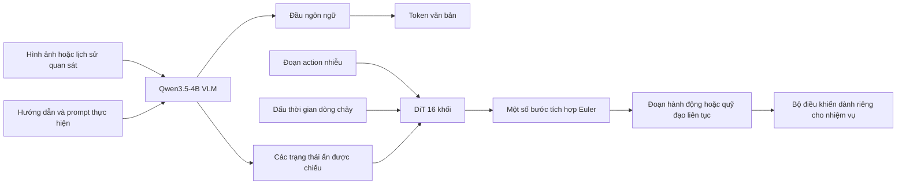
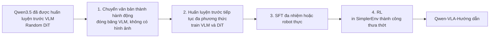

# Qwen-VLA: Tóm tắt bài thuyết trình

> **Nguồn thông tin đầy đủ:** [báo cáo kiến trúc và huấn luyện](qwen_vla_details.md) và
> [bằng chứng đánh giá](../../evaluation/VLA/benchmarks.md). Phiên bản ngắn này cố tình bỏ qua
> phương trình, lược đồ hành động cấp tập dữ liệu, giao thức hoàn chỉnh và chi tiết triển khai. Chính
> giấy: [Qwen-VLA v2](https://arxiv.org/abs/2605.30280v2).

## Thông điệp chính

> **Qwen-VLA sử dụng một đường trục đa phương thức và một bộ giải mã hành động liên tục để hỗ trợ thao tác,
> các nhiệm vụ điều hướng, chuyển động của con người và ngôn ngữ hình ảnh trên các phương án khác nhau.**

- Bắt đầu từ mô hình thị giác-ngôn ngữ Qwen3.5-4B.
- Thêm bộ giải mã hành động DiT 16 khối riêng biệt, tham số khoảng 1,15B.
- Tạo ra các khối hành động hoặc quỹ đạo liên tục phù hợp với luồng.
- Sử dụng prompt bằng văn bản để xác định phương án, tần suất kiểm soát, đường chân trời và nhiệm vụ.
- Giữ nguyên ý nghĩa hành động bản địa; nó hợp nhất hình dạng tensor và huấn luyện, không phải ngữ nghĩa vật lý.

## Kiến trúc



| Thành phần | Bài thuyết trình mang đi |
| --- | --- |
| Đầu vào | Quan sát trực quan, hướng dẫn nhiệm vụ và prompt về phương án/điều khiển |
| Xương sống nhận thức | Qwen3.5-4B thực hiện nhận thức, căn cứ và lý luận ngôn ngữ |
| Bộ giải mã hành động | DiT một luồng riêng biệt cùng xử lý ngữ cảnh và token action nhiễu |
| Đầu ra | Một tenxơ có đệm liên tục bao phủ đường chân trời và số kênh dành riêng cho nhiệm vụ |
| Trạng thái robot mặc định | Không có trạng thái sở hữu; hình ảnh và prompt là đầu vào tiêu chuẩn |
| Ranh giới thực hiện | Thống kê tập dữ liệu/nền tảng giải mã các kênh hoạt động trước khi bộ điều khiển thực thi chúng |

Bộ giải mã đầu ngôn ngữ và hành động vẫn tách biệt: văn bản được huấn luyện với dự đoán token tiếp theo,
trong khi các quỹ đạo liên tục được huấn luyện bằng cách khớp luồng có điều kiện được che giấu.

## “Hành động thống nhất” thực sự có nghĩa là gì

```text
Manipulation:  [dx, dy, dz, rotation, gripper, ...]
Navigation:    [dx, dy, heading]
Human motion:  [wrist transform, hand articulation, ...]
                         ↓
              pad to a shared H x K tensor
                         +
                 mask unused entries
```

| Được chia sẻ qua các nhiệm vụ | Vẫn là nhiệm vụ hoặc phương án cụ thể |
| --- | --- |
| Trọng lượng VLM và DiT | Ý nghĩa vật lý của từng kênh |
| Hình dạng tensor tối đa | Khung tọa độ và đơn vị |
| Phần đệm và mặt nạ hợp lệ | Thống kê chuẩn hóa |
| Mục tiêu phù hợp với dòng chảy | Đường chân trời, bộ điều khiển và giới hạn an toàn |

Lưu ý chính: nhắc nhở đặt tên cho robot mới là không đủ. Triển khai vẫn cần hành động tương thích
lược đồ, chuẩn hóa, bộ điều khiển và thường là dữ liệu thích ứng.

## Prompt về hiện thân

Bài viết sử dụng mẫu ngôn ngữ tự nhiên có chứa:

```text
robot identity and arm configuration
+ waist or mobile-base flags
+ control frequency
+ number of future actions
+ task instruction
```

Prompt này chọn một quy ước hành động đã học. Nó không thay thế URDF, mô hình động học hoặc
giao diện phần cứng.

## Quy trình huấn luyện bốn giai đoạn



| Họ mô hình tiếp tục huấn luyện trước | Chia sẻ lấy mẫu được báo cáo |
| --- | ---: |
| Quỹ đạo thao tác của robot | 74,2% |
| Quỹ đạo điều hướng, con người và tổng hợp | 17,2% |
| Thị giác-ngôn ngữ, nền tảng, thúc đẩy VQA và chú thích hành động | 8,5% |

Các giá trị được nhóm tổng cộng là 99,9% vì bài báo báo cáo tỷ lệ cấp nguồn được làm tròn.

Quy mô được báo cáo bao gồm hơn **10.000 giờ tương tác robot công cộng**, hơn **1.000
số giờ hoạt động độc quyền của robot** và hơn **8 triệu quỹ đạo tổng hợp**. Các nguồn này sử dụng
các phương án và phương pháp thu thập khác nhau, vì vậy số giờ của chúng không nên được thêm vào dưới dạng một đồng nhất
tổng kinh nghiệm.

Giai đoạn Chuyển văn bản thành hành động không có hình ảnh trước tiên dạy cho DiT được khởi tạo ngẫu nhiên một ngôn ngữ được lập chỉ mục
hành động trước. Sau đó, việc huấn luyện trước đa phương thức sẽ căn cứ vào cảnh được quan sát. SFT cung cấp hầu hết
về mức tăng sau huấn luyện được đo lường; giai đoạn RL được báo cáo bổ sung thêm những thay đổi nhỏ hơn, không đồng nhất.

## Điểm nổi bật của đánh giá

Tất cả các giá trị đều được **tác giả báo cáo** và không được sao chép trong không gian làm việc này.

| Đánh giá | Qwen-VLA-Base | Qwen-VLA-Hướng dẫn | Phiên dịch thuyết trình |
| --- | ---: | ---: | --- |
| LIBERO thành công | 90,8 | **97,9** | Thao tác mô phỏng mạnh mẽ; gần bão hòa |
| RoboCasa-GR1 thành công | 40,4 | **56,7** | Nhiệm vụ nhà bếp bằng tay vẫn còn khó khăn hơn đáng kể |
| Simpler-WidowX thành công | 64,3 | **73,7** | Việc triển khai RL chỉ được thu thập trong môi trường này |
| RoboTwin Thành công dễ / khó | 64,3 / 66,4 | **86,1 / 87,2** | Tăng mạnh sau khi huấn luyện trên các cài đặt cánh tay kép |
| SimplerEnv-OOD thành công | 25.3 | **32.0** | Chuyển khoản khác 0, nhưng thành công OOD tuyệt đối vẫn ở mức thấp |
| DOMINO năng động thành công | 21.1 | **26,6** | Thao tác động vẫn còn khó khăn |

Bằng chứng bổ sung:

- Tinh chỉnh Qwen-VLA-Dựa trên báo cáo dữ liệu ALOHA thực **83,6%** trong miền và **76,9%** OOD trung bình
  thành công, so với 48,5% và 36,2% khi huấn luyện cùng một kiến trúc từ đầu.
- Khi điều hướng liên tục, Qwen-VLA-Instruct báo cáo **57,5 SR / 51,2 SPL** trên R2R Val-Unseen và
  **59,6 SR / 47,8 SPL** trên RxR Val-Unseen. Nó dẫn đầu các đường cơ sở mở được liệt kê về tỷ lệ thành công, nhưng
  không phải mọi thước đo chất lượng đường dẫn.

## Các giới hạn cần nêu trên slide

- Một tensor dùng chung không phải là một không gian hoạt động vật lý phổ quát.
- Giao diện trạng thái chỉ có tầm nhìn mặc định có thể bị lỗi khi bị tắc, tiếp xúc hoặc động lực nhanh.
- Bộ giải mã hành động 1.15B đắt tiền so với đầu chính sách nhỏ.
- Hầu hết các bằng chứng định lượng đều mang tính ngắn hạn và dựa trên tiêu chuẩn; phục hồi và bộ nhớ liên tục
  vẫn còn những vấn đề mở.
- Như đã kiểm tra vào ngày 22-07-2026, kho lưu trữ chính thức đã cung cấp báo cáo và kết quả nhưng không được công bố
  điểm kiểm tra, mã suy luận hoặc khai thác đánh giá để tái tạo.

## Trang trình bày cuối cùng: Năm điểm

1. Qwen-VLA là **mô hình đa phương thức tổng quát với DiT hoạt động liên tục riêng biệt**.
2. Giao diện chia sẻ của nó sử dụng phần đệm, mặt nạ, prompt và chuẩn hóa dành riêng cho tập dữ liệu.
3. Quá trình huấn luyện trước chuyển văn bản thành hành động sẽ ổn định bộ giải mã hành động mới trước khi tiếp đất trực quan.
4. Một điểm kiểm tra bao gồm thao tác và điều hướng, với kết quả phân phối được báo cáo rõ ràng.
5. Thành công của OOD, ngữ nghĩa triển khai, độ trễ và độ an toàn vẫn là những thử nghiệm quan trọng chưa được giải quyết.
