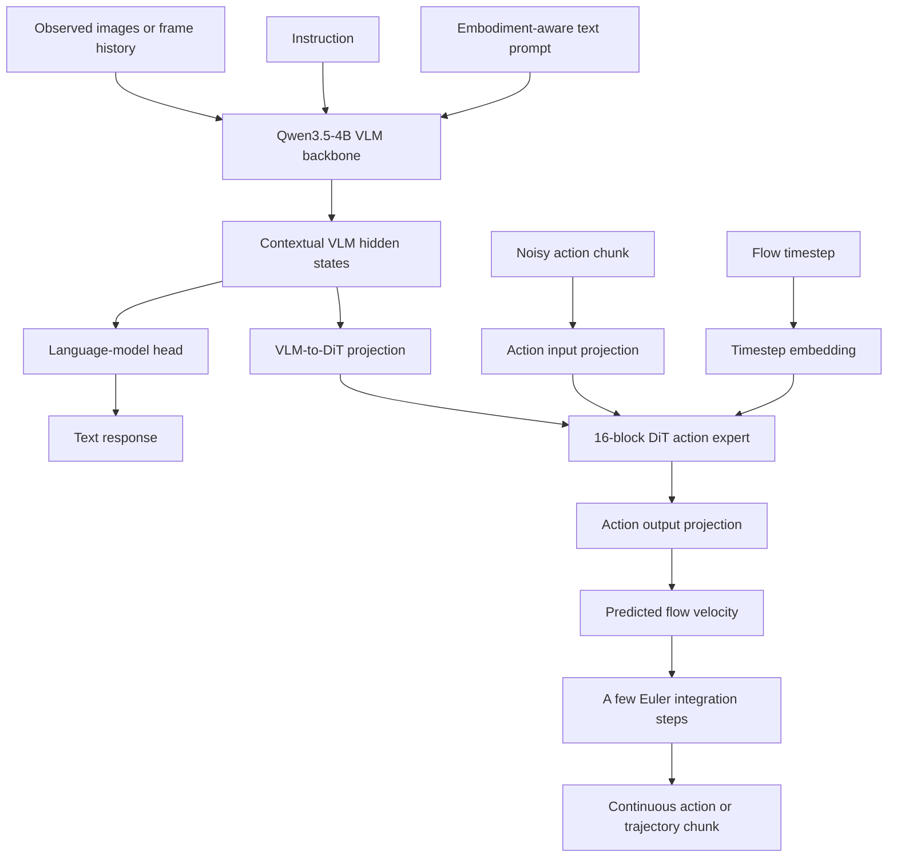
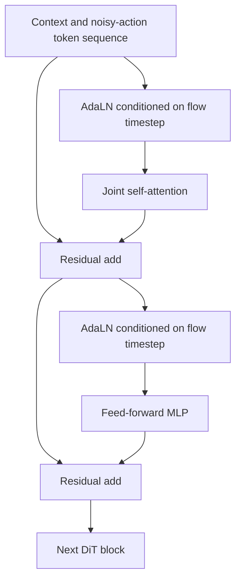
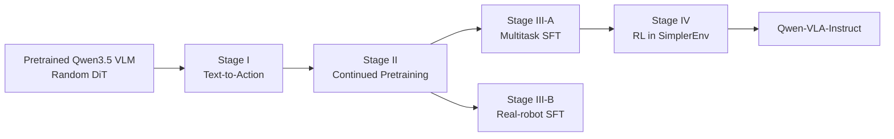
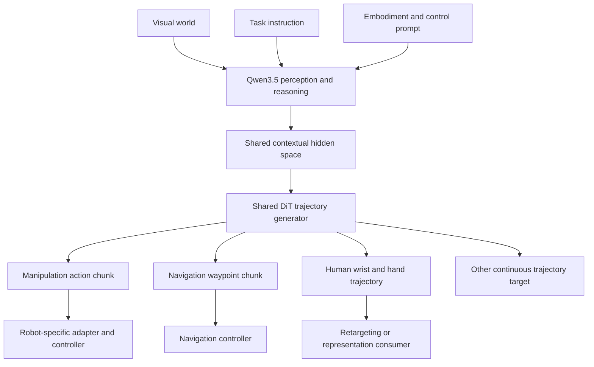

# Qwen-VLA Architecture, Training, and End-to-End Dataflow

## 1. Executive summary

Qwen-VLA is a **generalist vision-language-action model** that extends a pretrained
Qwen3.5-4B vision-language model with a **1.15B-parameter Diffusion Transformer
(DiT) action expert**.

Its central design goal is broader than ordinary manipulation-focused VLAs:

- process images, video-like observation histories, and language;
- retain vision-language understanding and text generation;
- generate continuous manipulation actions;
- generate navigation waypoint trajectories;
- learn from human egocentric wrist and hand trajectories;
- support multiple robot embodiments and control conventions with one set of weights.

The architecture can be summarized as:

```text
Images / observation history
            +
Instruction + embodiment-aware prompt
            ↓
Qwen3.5-4B vision-language backbone
            ↓
Contextual hidden-state sequence
            ├── Language head → text tokens
            └── DiT action expert
                    +
                noisy action chunk
                    +
                flow timestep
                    ↓
            clean continuous action or trajectory chunk
```

The most important distinction is that Qwen-VLA **unifies the neural interface**,
not the physical meaning of every action dimension. A navigation waypoint and a
robot joint target remain physically different. Qwen-VLA places them into the same
padded tensor format, identifies their control convention through text, and masks
unused channels during training.

A second important correction is that the default Qwen-VLA framework **does not
use proprioceptive robot state as an input**. The authors tested joint-angle state
conditioning, found only marginal gains on RoboTwin, and retained the
embodiment-aware text prompt as the sole platform-specific input. This differs from
models such as π0, which explicitly process robot state.

---

## 2. What problem Qwen-VLA is solving

A conventional VLA generally learns:

$$
p_\theta(a_t \mid o_t, x)
$$

where:

- $o_t$ is the current visual observation;
- $x$ is the language instruction;
- $a_t$ is the next robot action.

This formulation is often specialized to one task family, usually manipulation,
and one limited family of action conventions.

Qwen-VLA instead targets a broader conditional sequence model:

$$
p_\theta
\left(
y_{t:t+H-1}
\mid
o_t, x, e, z
\right)
$$

where:

- $o_t$ is visual context: one image, multiple cameras, video frames, or a history;
- $x$ is the task instruction;
- $e$ is the textual embodiment and control description;
- $z$ is an optional task identifier;
- $H$ is the prediction horizon;
- $y_{t:t+H-1}$ is a future action or trajectory sequence.

The output can therefore mean different things:

```text
Manipulation:
    future end-effector, joint, gripper, or hand actions

Navigation:
    future relative waypoints

Human egocentric modeling:
    future wrist transforms and hand articulation

Trajectory-centric prediction:
    future spatial path of an embodied agent or other entity
```

The shared abstraction is not “all outputs are robot joints.” It is:

> Given visual-language context and an embodiment/control specification, predict a
> sequence of physically meaningful real-valued vectors over time.

---

## 3. High-level architecture



Qwen-VLA therefore has two conceptually different output paths:

| Output path       | Output form                         | Training objective        |
| ----------------- | ----------------------------------- | ------------------------- |
| VLM language head | Discrete text tokens                | Next-token cross-entropy  |
| DiT action expert | Continuous action/trajectory tensor | Conditional flow matching |

The VLM is responsible mainly for perception, grounding, instruction
understanding, and contextual reasoning. The DiT specializes in precise,
temporally coherent continuous action generation.

---

## 4. Qwen3.5 vision-language backbone

Qwen-VLA uses **Qwen3.5-4B** as its cognitive backbone.

### 4.1 Input token construction

The backbone receives:

- text tokens from the instruction;
- text tokens from the embodiment-aware prompt;
- visual tokens produced by the vision encoder;
- potentially multiple images or temporal visual observations.

Qwen3.5 is natively multimodal and uses early fusion. Visual embeddings are
interleaved into the text-token stream rather than being processed by a completely
separate downstream policy.

Conceptually:

```text
Embodiment tokens
Instruction tokens
Image placeholder
Visual tokens
Additional text or image tokens
        ↓
One multimodal token sequence
        ↓
Qwen3.5 transformer
```

### 4.2 What hidden states mean here

For an input sequence of $N$ multimodal tokens, the VLM produces:

$$
H_{\text{VLM}}
=
[h_1,h_2,\ldots,h_N]
\in
\mathbb{R}^{N\times d_{\text{VLM}}}
$$

Each $h_i$ is a contextual representation. It is not an action and is not an
ordinary decoded output token. It contains information gathered through the
backbone about:

- visual objects and their positions;
- the referred target;
- scene geometry;
- instruction meaning;
- embodiment and control convention;
- relationships among all input tokens.

A learned linear layer maps these hidden states into the DiT channel width:

$$
C = H_{\text{VLM}}W_c
$$

where:

$$
C\in\mathbb{R}^{N\times d_{\text{DiT}}}
$$

These projected context tokens condition the action expert.

---

## 5. DiT flow-matching action expert

## 5.1 Purpose

The action expert generates continuous action chunks rather than text-like action
tokens.

The expert has approximately **1.15B parameters**, including:

- 16 DiT blocks;
- about 70.8M parameters per block;
- roughly 1.13B parameters in the blocks collectively;
- raw-action input and output projection MLPs;
- VLM hidden-state projection;
- timestep embedding;
- output AdaLN modulation.

The DiT is much more than a small linear policy head. It is a substantial
Transformer dedicated to continuous trajectories.

## 5.2 Inputs to the action expert

The action expert receives three main inputs:

1. projected VLM context tokens;
2. a noisy action chunk;
3. a flow timestep $\tau$.

Let the padded action tensor have shape:

$$
Y_\tau \in \mathbb{R}^{H\times K}
$$

where:

- $H$ is the common maximum action horizon;
- $K$ is the common maximum number of action channels.

An input MLP maps each raw action vector into the DiT hidden width:

$$
A_\tau = \operatorname{MLP}_{\text{in}}(Y_\tau)
$$

The model then joins context and action tokens into one sequence:

$$
S_\tau = [C;A_\tau]
$$

Unlike a simple cross-attention decoder, Qwen-VLA processes VLM context and noisy
action tokens with **joint self-attention** inside a single-stream DiT.

## 5.3 DiT block

A simplified block is:



The expert uses:

- joint self-attention;
- feed-forward MLP layers;
- adaptive layer normalization;
- timestep conditioning;
- multi-section RoPE aligned with the backbone.

### AdaLN (Adaptive Layer Normalization) timestep conditioning

The denoising problem changes with $\tau$. At high noise, the network must infer
the broad trajectory structure. Near the clean endpoint, it must refine details.
AdaLN transforms the timestep embedding into modulation parameters that alter
normalization within each block.

A simplified representation is:

$$
\operatorname{AdaLN}(x,\tau)
=
\gamma(\tau)
\odot
\operatorname{Norm}(x)
+
\beta(\tau)
$$

The actual architecture can also use timestep-dependent gates for the residual
branches. This tells every DiT block which stage of the flow process it is
currently solving.

## 5.4 Output

The DiT predicts a velocity field:

$$
v_\theta
\left(
Y_\tau,\tau
\mid
o,x,e,z
\right)
\in
\mathbb{R}^{H\times K}
$$

This is not directly the final action. At inference, the model begins from random
noise and integrates the predicted velocity field for a small number of Euler
steps until a clean action chunk is obtained.

---

## 6. Unified action-and-trajectory representation

## 6.1 What “unified” means

Qwen-VLA does **not** convert all datasets into one universal physical action
definition.

It preserves each dataset's native control semantics, such as:

```text
Dataset A:
    delta end-effector translation + Euler rotation + gripper

Dataset B:
    absolute joint positions

Dataset C:
    dual-arm joint positions + two grippers

Dataset D:
    relative navigation waypoints

Dataset E:
    human wrist SE(3) motion + hand eigengrasps
```

It unifies only:

- tensor rank and maximum shape;
- channel placement convention;
- padding;
- validity masking;
- neural decoder;
- flow-matching training interface.

## 6.2 Common padded tensor

Every target is represented as:

$$
Y_0\in\mathbb{R}^{H\times K}
$$

A task that uses only $H_{\text{task}}$ timesteps and $c$ action dimensions fills
the leading submatrix:

$$
Y_0[0:H_{\text{task}},\,0:c]
$$

The rest is zero-padded.

A binary mask specifies valid entries:

$$
M\in\{0,1\}^{H\times K}
$$

with:

$$
M_{h,k}
=
\begin{cases}
1, & h < H_{\text{task}}\ \text{and}\ k<c \\
0, & \text{otherwise}
\end{cases}
$$

Example with $H=4$ and $K=8$:

### Navigation sample using three channels

```text
Target Y:

[
 [ Δx1, Δy1, Δθ1, 0, 0, 0, 0, 0 ],
 [ Δx2, Δy2, Δθ2, 0, 0, 0, 0, 0 ],
 [ Δx3, Δy3, Δθ3, 0, 0, 0, 0, 0 ],
 [   0,   0,   0,  0, 0, 0, 0, 0 ]
]

Mask M:

[
 [ 1, 1, 1, 0, 0, 0, 0, 0 ],
 [ 1, 1, 1, 0, 0, 0, 0, 0 ],
 [ 1, 1, 1, 0, 0, 0, 0, 0 ],
 [ 0, 0, 0, 0, 0, 0, 0, 0 ]
]
```

### Manipulation sample using seven channels

```text
[
 [ Δx1, Δy1, Δz1, Δr1, Δp1, Δyaw1, grip1, 0 ],
 [ Δx2, Δy2, Δz2, Δr2, Δp2, Δyaw2, grip2, 0 ],
 ...
]
```

The mask prevents padded values from contributing to the loss.

## 6.3 Dataset-specific normalization

Because a joint angle, a gripper aperture, and a navigation displacement have
different units and scales, each dataset retains an appropriate normalization
scheme.

Conceptually:

$$
\tilde{y}_{h,k}
=
\frac{
y_{h,k}-\mu_{\mathcal{D},k}
}{
\sigma_{\mathcal{D},k}+\epsilon
}
$$

or an equivalent robust normalization.

The model is trained on normalized values. At inference, the predicted channels
are denormalized using the target platform's dataset/control statistics before
being passed to the controller.

This is essential. Merely padding different raw units into one tensor would create
poorly balanced gradients and ambiguous numerical scales.

---

## 7. Action types handled by Qwen-VLA

## 7.1 Manipulation actions

The manipulation data can include:

### Delta end-effector control

$$
a_t =
[
\Delta x,\Delta y,\Delta z,
\Delta r_x,\Delta r_y,\Delta r_z,
g
]
$$

### Quaternion-based end-effector control

$$
a_t =
[
\Delta x,\Delta y,\Delta z,
q_x,q_y,q_z,q_w,
g
]
$$

### Absolute joint-position control

$$
a_t =
[
q_1,q_2,\ldots,q_n,g
]
$$

### Dexterous-hand control

$$
a_t =
[
q^{\text{arm}},
q^{\text{thumb}},
q^{\text{index}},
\ldots
]
$$

### Bimanual control

$$
a_t =
[
a_t^{\text{left}},
a_t^{\text{right}},
g_t^{\text{left}},
g_t^{\text{right}}
]
$$

## 7.2 Navigation trajectories

Navigation uses relative waypoints:

$$
a_h =
[
\Delta x_h,\Delta y_h,\Delta\theta_h
]
$$

A chunk is:

$$
Y =
\begin{bmatrix}
\Delta x_1 & \Delta y_1 & \Delta\theta_1 \\
\Delta x_2 & \Delta y_2 & \Delta\theta_2 \\
\vdots & \vdots & \vdots \\
\Delta x_H & \Delta y_H & \Delta\theta_H
\end{bmatrix}
$$

A downstream navigation controller converts this short trajectory into executable
wheel, steering, or locomotion commands.

## 7.3 Human egocentric action representation

For each hand, Qwen-VLA represents future wrist motion relative to the initial
wrist frame:

- three-dimensional translation;
- axis-angle rotation with three dimensions;
- ten PCA hand-articulation coefficients called eigengrasps.

Per hand:

$$
6\ \text{wrist dimensions}
+
10\ \text{hand dimensions}
=
16
$$

For two hands:

$$
16\times2=32
$$

Thus each human egocentric timestep contains 32 action dimensions.

These targets are not immediately robot motor commands. They provide a broad
human-manipulation prior and can support later robot transfer or retargeting.

---

## 8. Embodiment-aware prompt conditioning

## 8.1 Prompt template

The report specifies a prompt of the following form:

```text
The robot is {robot_tag} with {single arm / dual arms}
[, waist][, and mobile base].
The control frequency is {FPS} Hz.
Please predict the next {chunk_size} control actions to execute
the following task: {instruction}.
```

The prompt communicates:

- robot/platform identity;
- number and configuration of arms;
- presence of a waist;
- presence of a mobile base;
- control frequency;
- prediction horizon;
- task instruction;
- implicitly, the dataset/platform control convention learned during training.

## 8.2 What it actually does

The prompt does not mechanically define kinematics like a URDF file. It does not
contain joint limits, link lengths, or a controller implementation.

Instead, repeated training examples teach the model an association:

```text
Embodiment/control prompt
        ↔
Observation distribution
        ↔
Action dimensions and normalization
        ↔
Typical dynamics and motion patterns
```

For example:

```text
"dual-arm ALOHA, 50 Hz, predict 50 actions"
```

selects a different learned conditional action distribution from:

```text
"navigation agent, 5 Hz, predict 8 waypoints"
```

The prompt is similar to a task or language tag in multitask learning, but carries
more detailed control information.

## 8.3 What it does not guarantee

Changing the prompt to a completely unseen robot name does not automatically make
the model understand that robot.

Generalization still depends on:

- whether similar embodiments appeared in training;
- whether the new action channels are compatible;
- whether normalization and decoding are defined;
- whether the visual appearance and dynamics are sufficiently similar;
- whether the downstream controller can execute the predicted convention.

The text prompt is a conditioning interface, not a replacement for robot data.

---

## 9. Important point: default Qwen-VLA does not use robot state

Many modern action-expert VLAs explicitly feed proprioception such as:

$$
s_t =
[
q_t,\dot q_t,g_t
]
$$

Qwen-VLA evaluated two state-injection approaches:

1. encoding state in the VLM prompt;
2. injecting state directly into the DiT.

On RoboTwin-2.0, the reported results were:

| Conditioning        | RoboTwin-Easy | RoboTwin-Hard |
| ------------------- | ------------: | ------------: |
| No state            |          88.7 |          87.4 |
| State in VLM prompt |          89.3 |          88.7 |
| State in DiT        |          89.4 |          88.3 |

The improvement was small. The authors attribute this to:

- multi-view images already exposing the current robot configuration;
- relative action prediction reducing dependence on an absolute state reference;
- the engineering cost of maintaining many embodiment-specific state interfaces.

Therefore, the default model keeps:

```text
Images
+
Instruction
+
Embodiment-aware text prompt
```

and does not require:

```text
Joint-angle state vector
```

This is a design decision, not a claim that proprioception is generally useless.
State would likely matter more when:

- the robot is partially hidden;
- absolute joint actions are predicted;
- contact forces matter;
- velocity and dynamic state are important;
- high-speed closed-loop control is required;
- vision cannot infer the complete configuration.

---

## 10. Flow-matching training objective

## 10.1 Interpolating clean actions and noise

Let:

- $Y_0$ be the clean normalized target action;
- $Y_1\sim\mathcal{N}(0,I)$ be Gaussian noise;
- $\tau\in[0,1]$ be the flow timestep.

Qwen-VLA constructs:

$$
Y_\tau
=
(1-\tau)Y_0+\tau Y_1
$$

So:

```text
τ = 0 → clean action
τ = 1 → pure noise
```

The target velocity along this linear path is:

$$
\frac{dY_\tau}{d\tau}
=
Y_1-Y_0
$$

The DiT learns:

$$
v_\theta
\left(
Y_\tau,\tau
\mid
o,x,e,z
\right)
\approx
Y_1-Y_0
$$

## 10.2 Masked per-channel action loss

For active channel $k$, the paper computes a timestep-masked mean squared error:

$$
\ell_k
=
\frac{
\sum_{h=1}^{H}
M_{h,k}
\left\|
v_\theta(Y_\tau,\tau\mid o,x,e,z)_{h,k}
-
(Y_1-Y_0)_{h,k}
\right\|_2^2
}{
\sum_{h=1}^{H}M_{h,k}
}
$$

It then averages uniformly across the $c$ active channels:

$$
\mathcal{L}_{\text{act}}
=
\mathbb{E}
\left[
\frac{1}{c}
\sum_{k=0}^{c-1}
\ell_k
\right]
$$

This two-level averaging matters because otherwise:

- padded entries could affect the gradient;
- long-horizon samples could dominate;
- embodiments with more action channels could contribute more loss solely because
  they have higher dimensionality.

## 10.3 Vision-language objective

For ordinary vision-language samples, the backbone retains standard next-token
training:

$$
\mathcal{L}_{\text{vl}}
=
-\sum_i
\log
p_\theta(w_i\mid w_{<i},o)
$$

This is applied to data such as:

- general vision-language supervision;
- spatial grounding;
- embodied action captions;
- autonomous-driving VQA.

Its purpose is to preserve visual perception, language grounding, and reasoning
while large amounts of action training modify the model.

## 10.4 Joint objective

The total objective is:

$$
\mathcal{L}
=
\lambda_{\text{act}}
\mathcal{L}_{\text{act}}
+
\lambda_{\text{vl}}
\mathcal{L}_{\text{vl}}
$$

The coefficients are selected to balance gradient magnitudes between the action
and language objectives.

---

## 11. Four-stage training recipe

Training the whole architecture jointly from the beginning is difficult because:

- the Qwen3.5 VLM is already pretrained;
- the DiT action expert begins randomly initialized;
- a fresh DiT initially produces noisy, uninformative gradients;
- image encoding is expensive;
- the decoder must simultaneously learn action structure, flow dynamics,
  embodiment conditioning, and visual grounding.

Qwen-VLA separates these problems into four stages.



## 11.1 Stage I: Text-to-Action DiT pretraining

### Frozen and trainable parts

```text
Qwen3.5 VLM: frozen
DiT action expert: trainable
Images: withheld
```

The inputs are:

```text
Task instruction
+
Embodiment prompt
+
Noisy target action
+
Flow timestep
```

The target is the clean action trajectory through the flow-matching loss.

The paper interprets this as **structured decompression**:

```text
Compact language:
    "pick up the red cup"
    "dual-arm robot, 50 Hz, 32 actions"

            ↓

High-dimensional trajectory:
    hundreds or thousands of continuous values
```

This stage teaches the DiT:

- the overall geometry of action distributions;
- temporal coherence across action chunks;
- how task language selects a behavior family;
- how embodiment prompts change the motor parameterization;
- how to solve the flow-matching denoising problem.

Because images are absent, the DiT cannot take a visual shortcut. It first learns a
language-indexed action prior.

### Limitation of T2A alone

Text alone cannot determine the exact trajectory in a specific scene. For example,
“pick up the cup” does not tell the policy where the cup is. T2A learns the broad
shape and semantics of the behavior, not scene-grounded control.

## 11.2 Stage II: multimodal continued pretraining

The model then unfreezes both modules:

```text
Qwen3.5 VLM: trainable
DiT action expert: trainable
Images: included
```

The main purpose is visual grounding:

```text
Language-indexed action prior
        +
Actual scene observations
        ↓
Scene-specific executable trajectory
```

The training mixture contains heterogeneous action and vision-language examples.
Within a batch, samples from different task families are mixed according to fixed
sampling ratios.

This stage teaches:

- object and goal grounding;
- spatial-to-kinematic mapping;
- cross-embodiment transfer;
- navigation trajectories;
- robot and human motion priors;
- continued vision-language capabilities.

The resulting checkpoint is Qwen-VLA-Base or the base from which later
specialization proceeds.

## 11.3 Stage III: supervised fine-tuning

SFT starts from the continued-pretraining checkpoint and splits into two tracks.

### Multitask SFT

It jointly uses curated examples from:

- manipulation;
- navigation;
- visual question answering;
- spatial grounding;
- other embodied tasks.

The data are sampled with task and embodiment balancing so a dominant dataset does
not overwhelm smaller task families.

### Real-robot SFT

A separate branch fine-tunes on in-house teleoperation data for physical robot
deployment.

This tests whether broad cross-task pretraining transfers to real hardware with
relatively targeted data.

## 11.4 Stage IV: reinforcement learning

SFT maximizes imitation likelihood, but high demonstration likelihood does not
directly optimize successful closed-loop execution.

Qwen-VLA therefore applies reinforcement learning starting from the multitask SFT
checkpoint.

The reported RL setup uses:

- one simulation environment: SimplerEnv;
- sparse binary task-success rewards;
- executed closed-loop trajectories.

Conceptually:

$$
\max_\theta
\mathbb{E}_{\pi_\theta}
[
R(\text{executed trajectory})
]
$$

The final checkpoint is Qwen-VLA-Instruct.

A notable experimental choice is that RL is narrow—one simulated environment—while
evaluation spans other environments and tasks. The authors use this to test whether
success-oriented policy refinement transfers beyond the RL environment.

---

## 12. Pretraining data mixture

The reported continued-pretraining mixture is:

| Data family                           | Sampling proportion |
| ------------------------------------- | ------------------: |
| Robot manipulation trajectories       |               74.2% |
| Human egocentric trajectories         |                6.0% |
| Navigation trajectories               |                7.5% |
| Synthetic simulation trajectories     |                3.7% |
| General vision-language data          |                3.4% |
| Spatial grounding data                |                2.5% |
| Autonomous-driving VQA                |                2.4% |
| Fine-grained embodied action captions |                0.2% |
| **Total**                       |    **100.0%** |

The mixture combines several kinds of supervision:

```text
Robot trajectories
    → executable motor and controller priors

Human egocentric trajectories
    → scalable object-interaction and dexterity priors

Navigation trajectories
    → long-horizon instruction following and spatial progression

Synthetic trajectories
    → controllable diversity and long-tail configurations

Spatial grounding and VQA
    → object reference, geometry, and semantic reasoning

General VL data
    → preservation of broad visual-language capability
```

Robot manipulation is the majority, but the non-robot data are not merely
auxiliary decoration. They provide semantic and trajectory priors intended to
improve generalization.

---

## 13. Detailed training-sample construction

Suppose the raw dataset contains a dual-arm manipulation episode.

### 13.1 Raw example

```text
Cameras:
    front_rgb[t]
    left_wrist_rgb[t]
    right_wrist_rgb[t]

Instruction:
    "Place the red bowl on top of the blue bowl."

Robot:
    dual-arm ALOHA

Control:
    absolute joint positions + grippers

Frequency:
    50 Hz

Target:
    next 32 control steps
```

### 13.2 Text prompt

```text
The robot is ALOHA with dual arms.
The control frequency is 50 Hz.
Please predict the next 32 control actions to execute the following task:
Place the red bowl on top of the blue bowl.
```

### 13.3 Action target

Suppose each timestep uses:

```text
7 left-arm joints
7 right-arm joints
1 left gripper
1 right gripper
```

Then:

$$
c=16
$$

and the native target has shape:

$$
A_{\text{native}}
\in
\mathbb{R}^{32\times16}
$$

After normalization and padding:

$$
Y_0\in\mathbb{R}^{H\times K}
$$

where the first $32\times16$ region is valid and the rest is padded.

### 13.4 Flow-training construction

Sample:

$$
Y_1\sim\mathcal{N}(0,I)
$$

and:

$$
\tau\sim p(\tau)
$$

Construct:

$$
Y_\tau=(1-\tau)Y_0+\tau Y_1
$$

The model inputs are:

```text
Multiview images
Prompt tokens
Noisy action Yτ
Flow timestep τ
```

The action target is:

$$
Y_1-Y_0
$$

The action loss is evaluated only where $M=1$.

### 13.5 Mixed batch

A single minibatch may contain:

```text
Sample 1: ALOHA bimanual joint actions
Sample 2: WidowX end-effector deltas
Sample 3: VLN relative waypoints
Sample 4: human bimanual wrist and hand trajectories
Sample 5: spatial-grounding text answer
Sample 6: general image question answering
```

Not every sample uses both losses:

- action samples contribute to $\mathcal{L}_{\text{act}}$;
- text-response samples contribute to $\mathcal{L}_{\text{vl}}$;
- some multimodal examples may provide both forms of supervision depending on
  their construction.

The shared backbone is updated by the combined mixture, while the DiT is updated by
continuous-action samples.

---

## 14. End-to-end inference dataflow: manipulation

Consider:

```text
Instruction:
    "Pick up the red cup."

Embodiment:
    single-arm robot
    delta end-effector control
    10 Hz
    16-step horizon

Observation:
    front image + wrist image
```

### Step 1: construct the prompt

```text
The robot is {robot tag} with a single arm.
The control frequency is 10 Hz.
Please predict the next 16 control actions to execute the following task:
Pick up the red cup.
```

### Step 2: encode images

The ViT converts each image into patch-level visual features. Spatial merging
reduces the token count and aligns the features with the VLM hidden width.

```text
RGB images
    ↓
patch embedding
    ↓
vision transformer
    ↓
spatial merging
    ↓
visual tokens
```

### Step 3: run the VLM

Visual and prompt tokens pass through Qwen3.5.

The contextual hidden sequence encodes information such as:

```text
the red cup is left of center
the gripper is below and behind it
the requested object is the cup, not the bowl
the active interface is a 7D delta end-effector action
```

These statements are conceptual interpretations of the representation; the model
does not necessarily output them as explicit text.

### Step 4: initialize noisy action

Create:

$$
Y_{\tau=1}
\sim
\mathcal{N}(0,I)
$$

with shape:

$$
H\times K
$$

### Step 5: flow integration

For Euler steps from $\tau=1$ toward $\tau=0$:

1. project the current noisy action into DiT tokens;
2. concatenate it with projected VLM hidden states;
3. condition the DiT through the timestep embedding and AdaLN;
4. predict the velocity field;
5. update the action tensor.

For a negative step $\Delta\tau$:

$$
Y_{\tau+\Delta\tau}
=
Y_\tau
+
\Delta\tau\,
v_\theta(Y_\tau,\tau\mid o,x,e)
$$

### Step 6: decode the valid channels

Suppose the platform uses:

$$
[
\Delta x,\Delta y,\Delta z,
\Delta roll,\Delta pitch,\Delta yaw,
g
]
$$

Only the first seven channels are retained, then denormalized.

### Step 7: controller execution

```text
Predicted end-effector deltas
        ↓
Cartesian impedance or IK controller
        ↓
Joint targets
        ↓
Motor controller
        ↓
Physical motion
```

### Step 8: closed-loop replanning

After executing part of the chunk, the system receives new images and predicts
again.


This avoids executing an entire long trajectory open-loop after the scene has
changed.

---

## 15. End-to-end inference dataflow: navigation

Consider:

```text
Instruction:
    "Go through the doorway and stop beside the sofa."

Embodiment:
    mobile navigation agent
    relative waypoint convention
    5 Hz
    8-waypoint horizon
```

The perception and VLM stages are similar, but the valid action channels mean:

$$
[
\Delta x,\Delta y,\Delta\theta
]
$$

The output is:

$$
Y
\in
\mathbb{R}^{8\times3}
$$

Example:

```text
[
 [0.40,  0.02,  0.01],
 [0.42,  0.04,  0.03],
 [0.35,  0.12,  0.10],
 [0.24,  0.20,  0.18],
 ...
]
```

This is a short local trajectory. A navigation controller then handles:

- wheel or locomotion commands;
- low-level path tracking;
- dynamic constraints;
- collision avoidance, depending on system integration.

Qwen-VLA predicts where the embodied agent should move, not necessarily the raw
left- and right-wheel motor signals.

---

## 16. How Qwen-VLA differs from “normal” VLAs

There is no single normal VLA architecture. The comparison is clearest against two
major families.

## 16.1 Versus autoregressive action-token VLAs

Representative models:

- RT-2;
- original OpenVLA.

These models quantize actions and generate them using the language-model output
mechanism.

```text
Image + instruction
        ↓
VLM
        ↓
action token 1
        ↓
action token 2
        ↓
...
        ↓
decode tokens into continuous control
```

Qwen-VLA instead uses:

```text
Image + instruction + embodiment prompt
        ↓
VLM hidden sequence
        ↓
continuous flow-matching DiT
        ↓
parallel multi-step action tensor
```

| Property                           | RT-2 / original OpenVLA style           | Qwen-VLA                                               |
| ---------------------------------- | --------------------------------------- | ------------------------------------------------------ |
| Action generation                  | Autoregressive discrete tokens          | Continuous flow matching                               |
| Main action decoder                | VLM language head                       | Separate 1.15B DiT                                     |
| Temporal form                      | Often next action or serialized actions | Action chunk                                           |
| Quantization                       | Required                                | Not required for action output                         |
| Main scope                         | Robot manipulation                      | Manipulation, navigation, human and other trajectories |
| Multiple action conventions        | Dataset remapping/tokenization          | Padded shared tensor + mask + prompt                   |
| Text generation                    | Same autoregressive head                | VLM language head remains separate                     |
| High-frequency trajectory modeling | More difficult due to serialization     | Natural continuous chunk prediction                    |

## 16.2 Versus π0 and π0.5

π0 is much closer architecturally to Qwen-VLA:

- pretrained VLM;
- separate flow-matching action expert;
- continuous action chunks;
- cross-embodiment training.

The main distinction is not “Qwen-VLA has a DiT while π0 has no action expert.”
Both belong to the modern VLM-plus-flow-action-expert family, although their
specific Transformer integration differs.

| Property              | π0 family                                              | Qwen-VLA                                                                 |
| --------------------- | ------------------------------------------------------- | ------------------------------------------------------------------------ |
| Core focus            | General robot manipulation and mobile manipulation      | Unified embodied tasks including manipulation and navigation             |
| Backbone              | PaliGemma-derived VLM in π0                            | Qwen3.5-4B native multimodal VLM                                         |
| Continuous output     | Flow-matching action chunk                              | Flow-matching action/trajectory chunk                                    |
| Robot state           | Explicit robotics-specific state processing             | Omitted in default framework after ablation                              |
| Action expert         | Separate robotics-specific expert weights               | Single-stream 16-block DiT                                               |
| Conditioning          | Images, language, state and embodiment/data conventions | Images, language and embodiment-aware textual prompt                     |
| Output families       | Robot actions across multiple configurations            | Robot actions, waypoints, human trajectories, broader trajectory targets |
| Unification mechanism | Cross-embodiment robot policy design                    | Fixed$H\times K$ interface, leading-channel padding, mask and prompt   |
| Training warm-up      | Broad pretraining/post-training recipe                  | Explicit image-free Text-to-Action stage before multimodal CPT           |
| RL stage              | Depends on model/version and recipe                     | Explicit sparse-success RL stage reported for Qwen-VLA-Instruct          |

Qwen-VLA is therefore not a completely unrelated replacement for π0. It expands a
similar modern action-expert idea into a more heterogeneous action-and-trajectory
foundation model.

## 16.3 Versus specialist navigation models

Many navigation VLAs use:

- a VLM;
- a small MLP waypoint head;
- navigation-specific visual history processing;
- one fixed waypoint output format.

Qwen-VLA instead uses the same large DiT action expert for navigation and
manipulation, so navigation is one control mode within a wider continuous
trajectory framework.

The trade-off is:

```text
Specialist head:
    simpler and cheaper for one output type

Unified DiT:
    more expensive, but can share action and trajectory priors across tasks
```

---

## 17. Why the Text-to-Action stage can work

At first, predicting exact actions without images appears impossible. It is
impossible to recover one uniquely correct scene-specific action from language
alone.

However, flow matching models a **conditional distribution**, not a deterministic
lookup table.

For:

```text
"pick up the cup"
```

the model can learn broad regularities:

- approach before grasp;
- close the gripper near the object;
- lift after grasping;
- produce smooth temporally correlated motion;
- respect the selected action dimension and frequency;
- use both arms differently from one arm.

T2A therefore learns:

$$
p(Y\mid x,e)
$$

CPT later learns the sharper scene-grounded distribution:

$$
p(Y\mid o,x,e)
$$

The image reduces uncertainty by providing object positions, current geometry, and
scene constraints.

A useful interpretation is:

```text
T2A:
    learn what trajectories of this task and embodiment usually look like

CPT:
    learn which specific trajectory fits this observed scene
```

---

## 18. What is shared and what remains embodiment-specific

## Shared model components

- visual perception;
- language understanding;
- spatial grounding;
- VLM hidden representation;
- DiT parameters;
- flow-matching algorithm;
- padded tensor interface;
- loss implementation;
- general temporal and physical priors.

## Still embodiment-specific

- prompt text;
- active action dimensions;
- action-channel meaning;
- action normalization;
- control frequency;
- horizon;
- coordinate frame;
- rotation convention;
- controller and denormalization;
- hardware safety limits;
- low-level execution interface.

Therefore:

> One shared neural model does not eliminate the need for a robot adapter.

A deployment adapter still needs to define:

```text
camera preprocessing
prompt construction
action-channel schema
normalization statistics
coordinate transformations
action denormalization
controller interface
safety validation
```

---

## 19. Practical implementation sketch

A simplified training record could look like:

```python
sample = {
    "images": {
        "front": front_rgb,
        "wrist": wrist_rgb,
    },
    "instruction": "Pick up the red cup.",
    "embodiment_prompt": (
        "The robot is WidowX with a single arm. "
        "The control frequency is 5 Hz. "
        "Please predict the next 8 control actions."
    ),
    "action": action_chunk,       # [H_task, c]
    "action_mask": valid_mask,   # [H, K]
    "dataset_id": "bridge_v2",
    "task_family": "manipulation",
}
```

Preprocessing:

```python
normalized = normalize_by_dataset(
    sample["action"],
    dataset_id=sample["dataset_id"],
)

target = zero_pad(normalized, shape=(H_max, K_max))
mask = construct_mask(
    horizon=H_max,
    channels=K_max,
    valid_horizon=H_task,
    valid_channels=c,
)
```

Training concept:

```python
noise = torch.randn_like(target)
tau = sample_flow_timestep(batch_size=target.shape[0])

noisy_action = (
    (1.0 - tau) * target
    + tau * noise
)

vlm_hidden = vlm(images, instruction, embodiment_prompt)

predicted_velocity = dit(
    context=vlm_hidden,
    noisy_action=noisy_action,
    timestep=tau,
)

target_velocity = noise - target

action_loss = masked_channel_balanced_mse(
    predicted_velocity,
    target_velocity,
    mask,
)
```

This code is illustrative rather than copied from the official implementation.

---

## 20. Strengths of the design

### Broad supervision reuse

One model can learn from datasets that would normally require separate policies.

### Preserved vision-language capability

The VLM objective reduces catastrophic forgetting during action training.

### Continuous trajectory quality

Flow matching supports smooth, multimodal, high-dimensional action chunks without
per-dimension action-token quantization.

### No per-platform output heads

The same DiT handles multiple channel counts and horizons through prompt
conditioning and masking.

### Better separation of concerns

```text
VLM:
    semantic and spatial understanding

DiT:
    continuous temporal action generation

Robot adapter:
    physical interpretation and execution
```

### Structured training curriculum

T2A prevents the randomly initialized action expert from immediately destabilizing
the pretrained VLM.

---

## 21. Limitations and open questions

### Unified tensor does not equal universal embodiment transfer

A new robot still requires a known action schema, normalization, controller, and
usually adaptation data.

### No default proprioception

Vision-only state inference can fail under occlusion, contact, dynamic motion, or
partial observability.

### Large action expert

A 1.15B DiT is computationally expensive compared with a small MLP head.

### Joint-training interference

Manipulation, navigation, and vision-language objectives can compete. The report
notes that action-oriented joint training can modestly regress some pure
vision-language or navigation measures.

### Action data scarcity

Embodied data remain much smaller and less diverse than Internet-scale
vision-language data.

### Mostly short-horizon evaluation

Long-duration execution, recovery, persistent memory, and repeated failure handling
remain open challenges.

### Exact semantics remain external

The prompt conditions the model, but coordinate frames, units, normalization,
hardware constraints, and safety validation must still be defined by the data and
deployment system.

---

## 22. Final conceptual model

The most accurate way to understand Qwen-VLA is:

```text
It is not one universal robot controller with one universal action meaning.

It is one shared multimodal model and one shared continuous trajectory generator
that can learn several embodiment-specific action languages.
```

The embodiment prompt tells the model which action language is active. The padded
tensor and mask provide a common computational structure. The VLM supplies
multimodal understanding. The DiT turns that understanding into a coherent
continuous sequence.



The architecture's novelty is the combination of:

1. a strong natively multimodal Qwen backbone;
2. a large continuous DiT action expert;
3. prompt-conditioned heterogeneous action semantics;
4. padded and masked unified action tensors;
5. staged Text-to-Action, continued-pretraining, SFT, and RL training;
6. simultaneous preservation of language output and continuous embodied output.

---

## References

1. Qwen Team. **Qwen-VLA: Unifying Vision-Language-Action Modeling across Tasks,
   Environments, and Robot Embodiments.** arXiv:2605.30280, 2026.
2. Physical Intelligence. **π0: A Vision-Language-Action Flow Model for General
   Robot Control.** arXiv:2410.24164, 2024.
3. Kim et al. **OpenVLA: An Open-Source Vision-Language-Action Model.**
   arXiv:2406.09246, 2024.
4. Brohan et al. **RT-2: Vision-Language-Action Models Transfer Web Knowledge to
   Robotic Control.** arXiv:2307.15818, 2023.
5. Lipman et al. **Flow Matching for Generative Modeling.** 2023.
6. Peebles and Xie. **Scalable Diffusion Models with Transformers.** 2023.
