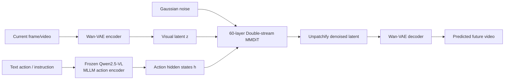
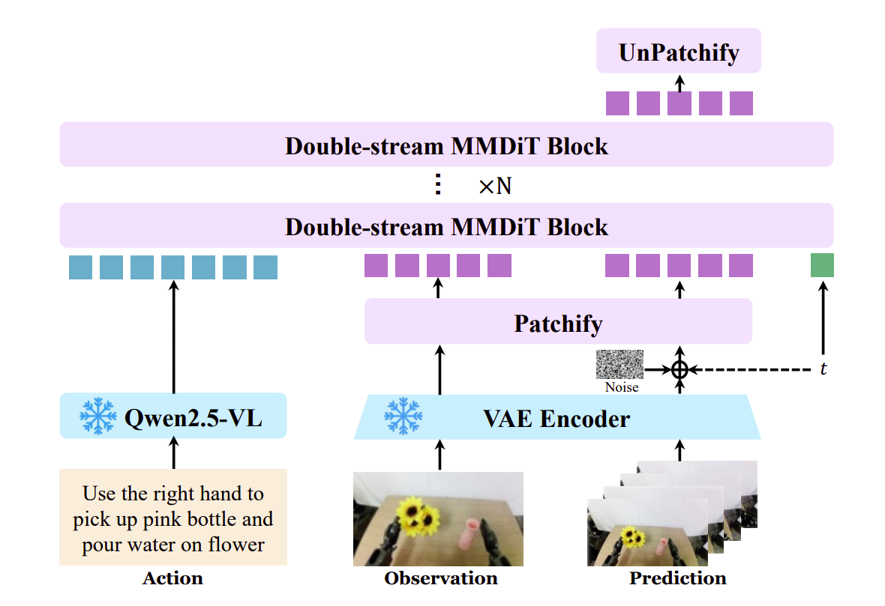
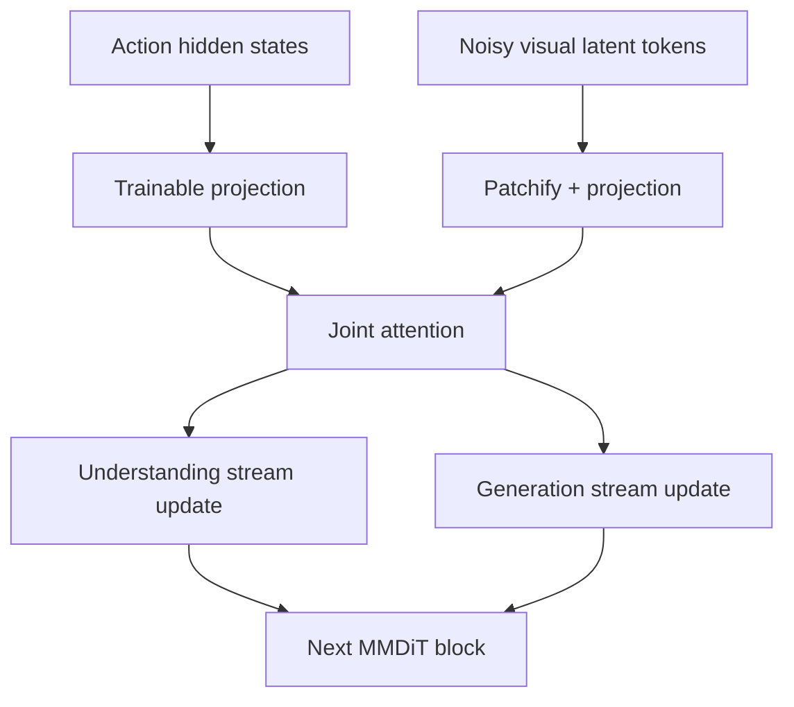
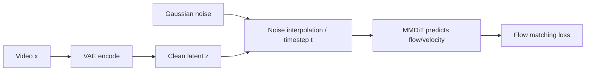
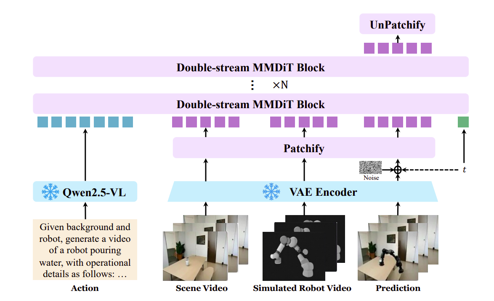

# Qwen-RobotWorld — Architecture

> Qwen-RobotWorld là **language-conditioned video world model**. Nó nhận quan sát hiện tại và action bằng ngôn ngữ rồi sinh trajectory hình ảnh tương lai. Nó không trực tiếp xuất joint command hay motor torque như một policy controller.

## 1. Bài toán model giải quyết

```text
Current visual state s_t + language action a_t
                    ↓
              World model f
                    ↓
Future visual state / trajectory s_(t+1:t+K)
```

Ngôn ngữ là action interface chung cho robot gắp vật, xe tự hành, navigation và human-to-robot transfer. Cách này tránh việc phải thiết kế một action space riêng cho từng robot.

## 2. Overall pipeline

### End-to-end data flow

```text
Language action
      ↓
Frozen Qwen2.5-VL
      ↓
Action semantic tokens
      ↓
Trainable connector
      ↓
                         ┌─────────────────────┐
Current frame/video ────>│                     │
      ↓                  │  Double-stream     │
Wan-VAE Encoder          │  MMDiT × 60        │
      ↓                  │                     │
Visual latent + noise ──>│ Action ↔ Video     │
                         │ Joint Attention    │
                         └──────────┬──────────┘
                                    ↓
                         Predicted velocity field
                                    ↓
                           Flow-matching sampling
                                    ↓
                           Clean future latent
                                    ↓
                           Wan-VAE Decoder
                                    ↓
                         Future video trajectory
```

Trong training, target video được encode thành clean latent, trộn với Gaussian noise ở timestep `t`; MMDiT học velocity field để đi từ noise về clean latent. Khi inference, flow-matching được tích phân qua nhiều timestep để tạo trajectory tương lai.



Ba thành phần chính:

| Thành phần        | Vai trò                                            | Thông số paper                 |
| ------------------- | --------------------------------------------------- | -------------------------------- |
| Qwen2.5-VL          | Encode action/instruction thành semantic condition | Frozen MLLM, 7B                  |
| Wan-VAE             | Encode/decode frame/video trong latent space        | 127M = 54M encoder + 73M decoder |
| Double-stream MMDiT | Transition/denoising function                       | 20B, 60 blocks                   |

## 3. Tensor flow và input/output

### 3.1 Action encoder

```text
Text S
  ↓
Frozen Qwen2.5-VL
  ↓
Last-layer hidden states h = φ(S)
  ↓ trainable connector
Action condition for MMDiT
```

Qwen2.5-VL không xuất action số. Nó biến câu lệnh như “pick up the pink bottle and pour water” thành semantic token features để điều khiển quá trình sinh video.

### 3.2 State encoder/decoder

```text
Video/frame x
  ↓
Wan-VAE encoder E
  ↓
Visual latent z = E(x)
  ↓ patchify
Video tokens
  ↓ MMDiT denoising
Predicted latent
  ↓ unpatchify
  ↓ Wan-VAE decoder
Generated frames/video
```

Paper không đưa một shape cố định cho mọi video vì số frame, resolution và aspect ratio thay đổi. Context tối đa được báo cáo là 48,360 video tokens.



### 3.3 MMDiT input/output

```text
Understanding stream: projected action tokens
Generation stream: noisy visual latent tokens
              ↓
       Double-stream MMDiT block × 60
              ↓
       Denoised visual latent tokens
```

MMDiT có hidden size 3,072, 24 attention heads, head dimension 128 và patch size 2×2.

## 4. Double-stream MMDiT block



Khác Transformer hai stream độc lập: hai stream được cập nhật riêng nhưng **joint attention ở mỗi block** cho phép visual generation tokens đọc semantic action tokens và ngược lại. Nhờ đó action không chỉ được inject một lần ở đầu model.

### Một block nhìn theo computation

```text
Action tokens h ──> projection ──┐
                                  ├─> joint attention ─> action stream output
Noisy video tokens ─> patchify ───┘                     └> video stream output
                                      ↓
                              next double-stream block
```

## 5. 3D RoPE

Mỗi visual token có ba tọa độ: temporal, spatial height và spatial width.

```text
Video token position = (time, height, width)
                         ↓
              asymmetric 3D RoPE
                         ↓
             [16 temporal, 56 height, 56 width]
```

Tổng là 128 dimensions. Temporal nhận ít chiều hơn vì frame lân cận tương quan mạnh; height/width nhận nhiều hơn để biểu diễn vị trí vật thể và scene layout. Scalable RoPE giúp thay đổi resolution/duration khi inference.

## 6. Flow matching objective



Timestep lấy từ log-normal distribution và adaptive shifting theo video length. Với TI2V, latent của first frame được đặt timestep `t=0`, làm visual anchor; loss chỉ áp dụng cho phần cần sinh.

## 7. Scene2Robot

Scene2Robot tái sử dụng cùng backbone cho human-to-robot video editing, không thêm architecture riêng.

```text
Segment 1: Human scene video, human masked
Segment 2: Simulated robot reference from MuJoCo
Segment 3: Noisy generation segment
                         ↓
              3D RoPE + joint attention
                         ↓
              Photorealistic robot video
```

Segment 1 và 2 có timestep 0, không tính loss. Chỉ segment 3 được denoise và nhận gradient. Generation segment đồng thời đọc scene appearance, robot morphology/trajectory và language action.



## 8. Vai trò và giới hạn

- **Input:** observation frame/video và language action; có thể thêm scene/robot reference trong Scene2Robot.
- **Output:** future visual trajectory, không phải low-level control command.
- **Có thể dùng cho:** synthetic policy data, virtual policy evaluation, language-guided planning signal.
- **Không nên gọi là:** end-to-end robot controller nếu chưa có policy chuyển video prediction thành hành động.
