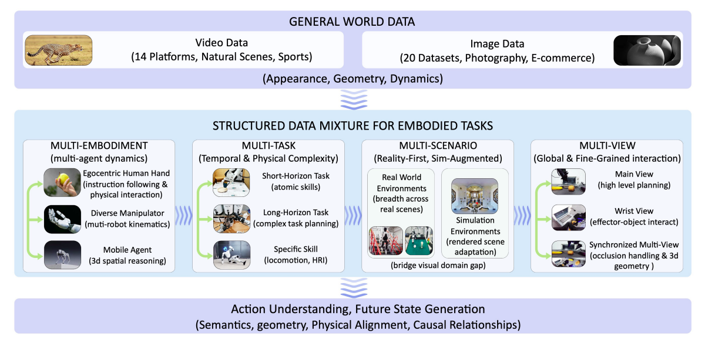

# Qwen-RobotWorld — Bộ dữ liệu

## 1. Tri thức thế giới hiện thân (EWK)

EWK gồm khoảng **8.6M video-text pairs**, hơn **200M observation frames**:

| Thành phần            | Quy mô/thông tin                                                               |
| ----------------------- | -------------------------------------------------------------------------------- |
| General video/image     | 30% tổng corpus                                                                 |
| Embodied data           | 70% tổng corpus                                                                 |
| Manipulation            | khoảng 5.9M samples; 20+ robot morphologies; 1,300+ skills                      |
| Driving                 | khoảng 200K samples trong summary; full curated mixture ~1,744,405 clips/2,405h |
| Điều hướng trong nhà | 6.064 tập; 134 cảnh trong nhà; ~49,8 km |
| Chuyển giao từ người sang robot | Đường ống MANO-to-robot; 14 hình thái robot |
| Multi-view              | khoảng 1.6M embodied samples; synchronized 2–4 views                           |



## 2. Ánh xạ ngôn ngữ hành động

Action signals khác nhau giữa joint angles, waypoints, steering, heading và hand motion được chuyển thành natural-language action. Model học:

```text
Visual state s_t + language action a_t
                 ↓
             predict s_(t+1)
```

Coverage gồm 20+ embodiments và 500+ action categories: manipulation primitives, long-horizon compositions, locomotion/navigation và dynamic/deformable interactions.

## 3. Năm lớp annotation

1. **Task Goal:** mục tiêu và desired state transition.
2. **Chi tiết hành động:** quỹ đạo, hành động vi mô, tốc độ, lực, góc nhìn.
3. **Phản hồi vật lý:** sự dịch chuyển, biến dạng, thay đổi trạng thái tiếp xúc.
4. **Chú thích đầy đủ:** 50–100 từ.
5. **Chú thích ngắn gọn:** 15–30 từ.

Hai loại caption được sampling equal probability 50/50 trong training.

## 4. Miền dữ liệu

| Domain             | Nguồn/vai trò                                                                                                             |
| ------------------ | --------------------------------------------------------------------------------------------------------------------------- |
| Thao tác | EgoHOD, EPIC-Kitchens, Bridge V2, RH20T, DROID, RoboMIND, RoboCoin, Agibot-World, Galaxea, ActionNet, OpenLoong, Robotwin… |
| Lái xe tự động | Waymo E2E, NVIDIA PhysicalAI-AD, Bench2Drive, Sekai |
| Điều hướng trong nhà | VLNVerse, Isaac Sim, 134 cảnh |
| Người với robot | Video lấy con người làm trung tâm → Tái thiết MANO → nhắm mục tiêu lại robot/chỉnh sửa video |
| Dữ liệu chung | Hình ảnh/video trên Internet, đa độ phân giải, không có AIGC theo giấy |

## 5. Lọc chất lượng

LLM judge kiểm tra factual accuracy, specificity, instruction clarity và viewpoint consistency. Caption gần ngưỡng hoặc domain thiếu đại diện được human review; prompt được refine theo scenario/task/embodiment rồi re-annotate.

## 6. Dataset metrics — các chỉ số mô tả dữ liệu

Các chỉ số dưới đây mô tả **quy mô và độ phủ của dataset**, không phải điểm model:

| Dataset metric                  |         Giá trị được báo cáo | Ý nghĩa                                                                 |
| ------------------------------- | ----------------------------------: | ------------------------------------------------------------------------- |
| Video-text pairs                |                        khoảng 8.6M | Số cặp video và mô tả/action text trong EWK                          |
| Observation frames              |                           hơn 200M | Số frame quan sát dùng để học visual dynamics                       |
| Embodied/general ratio          |                   khoảng 70% / 30% | Tỷ lệ embodied data so với general-world data                          |
| Embodiment coverage             |                           20+ loại | Độ đa dạng morphology: human hand, gripper, dual-arm, humanoid…      |
| Action coverage                 |                     500+ categories | Số nhóm action/manipulation/navigation/interaction                      |
| Manipulation samples            |                        khoảng 5.9M | Quy mô dữ liệu robot và human manipulation                            |
| Driving collection              | 1,744,405 clips, khoảng 2,405 giờ | Quy mô raw/processed driving collection được paper báo cáo          |
| Indoor navigation               |          6,064 episodes, 134 scenes | Độ phủ scene và trajectory navigation                                 |
| Human-to-robot transfer         |                khoảng 80K episodes | Dữ liệu MANO retargeting và robot rendering                            |
| Multi-view embodied data        |                khoảng 1.6M samples | Dữ liệu synchronized main/wrist/external views                          |
| Robot morphology trong transfer |                            14 loại | Số robot model được render/retarget từ human motion                  |
| Caption layers                  |                            5 layers | Goal, action detail, physical feedback, comprehensive và concise caption |
| Caption sampling                |                           50% / 50% | Comprehensive caption và concise caption                                 |

Các metric này trả lời câu hỏi **“dataset lớn và đa dạng đến mức nào?”**. Chúng không trả lời trực tiếp model dự đoán tốt đến đâu; điều đó được đo bằng benchmark metrics trong `evaluation.md`.


## 6. Chi tiết cấu trúc dữ liệu EWK

### 6.1 Quy mô và cách đọc các con số

EWK có khoảng **8.6M video-text pairs** và hơn **200M observation frames**, trong đó khoảng **70% là embodied data** và **30% là general data**. Dữ liệu bao phủ hơn **20 embodiment types** và hơn **500 action categories**.

Paper có một số cách thống kê khác nhau giữa phần tổng quan và phần chi tiết:

| Cách thống kê                       |           Quy mô được báo cáo |
| -------------------------------------- | ----------------------------------: |
| Toàn bộ EWK                          |       khoảng 8.6M video-text pairs |
| Embodied portion                       |                    khoảng 6M pairs |
| Manipulation                           |                khoảng 5.9M samples |
| Driving/navigation trong final mixture |                khoảng 200K samples |
| Raw/processed driving collection       | 1,744,405 clips, khoảng 2,405 giờ |

Các con số này không nhất thiết mâu thuẫn: raw clip, processed clip, training sample và final sampled mixture có thể là các đơn vị khác nhau. Một clip có thể được cắt, ghép, annotation hoặc sampling thành nhiều dạng. Paper chưa giải thích hoàn toàn cách reconcile mọi con số, vì vậy khi thuyết trình nên nói “quy mô được báo cáo” thay vì cộng tất cả thành một tổng mới.

### 6.2 Dữ liệu chung của thế giới

General-world data được thu thập từ video của 14 platform, natural scenes, daily life, sports, high-quality images, photography và e-commerce imagery. Video được chuẩn hóa ở 24 FPS và hỗ trợ nhiều aspect ratio như 1:1, 2:3, 3:2, 3:4, 4:3, 9:16 và 16:9.

Image data đóng vai trò visual-quality anchor, giúp model học:

- hình thái đối tượng;
- texture và material;
- thành phần;
- ngoại hình sắc nét.

Caption được sinh bằng Qwen2.5-VL. Paper mô tả việc loại trừ AIGC image/video khỏi general data vì lo ngại artifact, physical inconsistency và bias từ dữ liệu synthetic.

### 6.3 Dữ liệu thao tác

Manipulation là phần lớn nhất của embodied corpus và gồm nhiều nguồn:

| Loại                        | Nguồn tiêu biểu                                                                  | Kiến thức đóng góp                                                        |
| ---------------------------- | ----------------------------------------------------------------------------------- | ------------------------------------------------------------------------------ |
| Human manipulation           | EgoHOD, EPIC-Kitchens, Egocentric-10k                                               | Hand-eye coordination, tool use, dexterity và everyday affordance             |
| Single-arm robot             | Bridge V2, RH20T, DROID                                                             | Grasp, push, insert, pick-and-place và contact physics                        |
| Multi-robot/multi-morphology | RoboMIND, RoboCoin, AgiBot-World, Galaxea, Qwen-Aloha, Fourier ActionNet, OpenLoong | Single arm, dual arm, dexterous hand, humanoid và long-horizon task           |
| Simulation                   | InternData-A1, RoboTwin, GR00T-XE, RT-1-related data                                | Deformable/fluid interaction, controllable variation và simulator familiarity |

Manipulation data được tổ chức theo bốn trục:

1. **Multi-embodiment:** cùng một task như “pick up the cup” có thể do human hand, two-finger gripper, dexterous hand, dual-arm robot hoặc humanoid thực hiện. Model học task semantics thay vì ghi nhớ một vector joint cụ thể.
2. **Multi-task:** gồm atomic action, short-horizon, long-horizon composition, dynamic interaction, fluid/deformable object và bimanual coordination.
3. **Multi-scenario:** kitchen, workshop, laboratory, outdoor workspace, factory, real scene và simulated scene để giảm overfit vào background, lighting, camera hoặc simulator.
4. **Multi-view:** egocentric/head view, wrist camera, external camera và synchronized concatenated views. Main camera hỗ trợ planning; wrist camera hỗ trợ contact, grasp và fine manipulation.

### 6.4 Dữ liệu lái xe

| Dataset              | Loại                   |     Quy mô được báo cáo |
| -------------------- | ----------------------- | ----------------------------: |
| Waymo E2E            | Real driving, 8 cameras |        7,044 clips, 11.3 giờ |
| NVIDIA PhysicalAI-AD | Real driving, 5 cameras | 1,342,418 clips, 1,715.9 giờ |
| Bench2Drive          | CARLA, 6 cameras        |     384,948 clips, 511.2 giờ |
| Sekai                | Pedestrian/drone        |       9,995 clips, 166.6 giờ |

Tổng driving collection được báo cáo là **1,744,405 clips**, khoảng **2,405 giờ**. Pipeline xử lý là:

```text
Raw driving sequence
        ↓
Frame extraction
        ↓
Trajectory → unified waypoint representation
        ↓
Segment theo maneuver transition
        ↓
Clip dài 2–8 giây
        ↓
Structured trajectory caption
```

Driving data cung cấp ego-motion, multi-agent motion, parallax, perspective change, scene-scale 3D geometry, acceleration, lane change và turning.

### 6.5 Dữ liệu dẫn đường trong nhà

Navigation data được xây dựng trong NVIDIA Isaac Sim từ VLNVerse:

- 6.064 tập thành công;
- 134 cảnh trong nhà;
- RGB 256×256;
- 10 khung hình/giây;
- trajectory trung bình 8.2 m, khoảng 4–17.5 m;
- tổng distance khoảng 49.8 km;
- khoảng 5.8 giờ video.

Có hai dạng instruction:

- 3,031 step-by-step instructions, trung bình 67.2 từ;
- 3,033 instructions với nhiều register: formal, natural và casual.

Nhóm này dạy room-scale geometry, obstacle-aware movement, long-term spatial coherence và grounding language vào continuous trajectory.

### 6.6 Chuyển giao từ người sang robot

Pipeline chính chuyển video tay người thành robot video:

```text
Egocentric human bimanual video
        ↓
MANO reconstruction
        ↓
3D hand keypoints
        ↓
Retarget to robot end-effector trajectories
        ↓
Remove human hands bằng video inpainting
        ↓
Render 14 robot models bằng MuJoCo IK
        ↓
Aligned human/scene/robot video streams
```

Bốn stream được tạo gồm original human video, hand-removed scene, pure simulation và robot-overlaid scene. Ngoài ra, paired render từ Isaac Sim và MuJoCo giúp model học chuyển từ simplified robot render sang photorealistic robot appearance.

Phần này có khoảng **80K episodes**, gồm Franka Panda, AgileX Split Aloha, ARX Lift2, AgiBot Genie1, single-arm, dual-arm, mobile dual-arm và humanoid.

### 6.7 Ánh xạ ngôn ngữ hành động

Các domain có action space khác nhau:

| Domain       | Action gốc                         |
| ------------ | ----------------------------------- |
| Thao túng | Góc khớp, điểm tham chiếu đầu cuối |
| Lái xe | Chỉ đạo, ga, quỹ đạo |
| Điều hướng | Hướng đi, điểm tham chiếu, lệnh rẽ |

Qwen-RobotWorld ánh xạ chúng thành natural-language action. Ví dụ:

```text
EE đi từ (x1,y1,z1) đến (x2,y2,z2), gripper đóng
        ↓
“Move the gripper toward the red cup, close it around the cup,
and lift it vertically.”
```

Ưu điểm là một interface dùng cho nhiều embodiment và domain. Hạn chế là language là biểu diễn lossy: không giữ chính xác force, torque, proprioception hoặc motor-level control, nên không đủ để điều khiển robot trực tiếp.

### 6.8 Hierarchical annotation và data-processing pipeline

Mỗi video được annotation theo năm layer:

1. **Task Goal:** trạng thái nào cần thay đổi từ đầu đến cuối.
2. **Action Detail:** trajectory, direction, micro-action, speed, force và viewpoint.
3. **Physical Feedback:** object displacement, contact change, deformation, fluid motion hoặc cloth folding.
4. **Comprehensive caption:** 50–100 từ, gồm viewpoint, agent, action và physical feedback.
5. **Concise caption:** 15–30 từ, gần với instruction ở inference.

Comprehensive và concise caption được sampling 50/50 để model hiểu cả detailed action specification và brief natural command.

Pipeline xử lý gồm:

```text
Raw data collection
        ↓
Video preprocessing
        ↓
Hierarchical annotation
        ↓
Caption quality filtering
        ↺ failed sample → re-annotation
```

Video preprocessing gồm frame extraction, frame interpolation, sub-task splitting, main-view selection và multi-view concatenation. Task-aware splitting phải giữ trọn transition như `approach → contact → manipulation → result`, tránh cắt clip sau grasp hoặc trước placement khiến model không học được quan hệ nhân quả.

Quality filtering dùng LLM judge và human evaluation, kiểm tra factual accuracy, specificity, instruction clarity và viewpoint consistency. Caption lỗi được retry bằng prompt theo scenario, task và embodiment.
