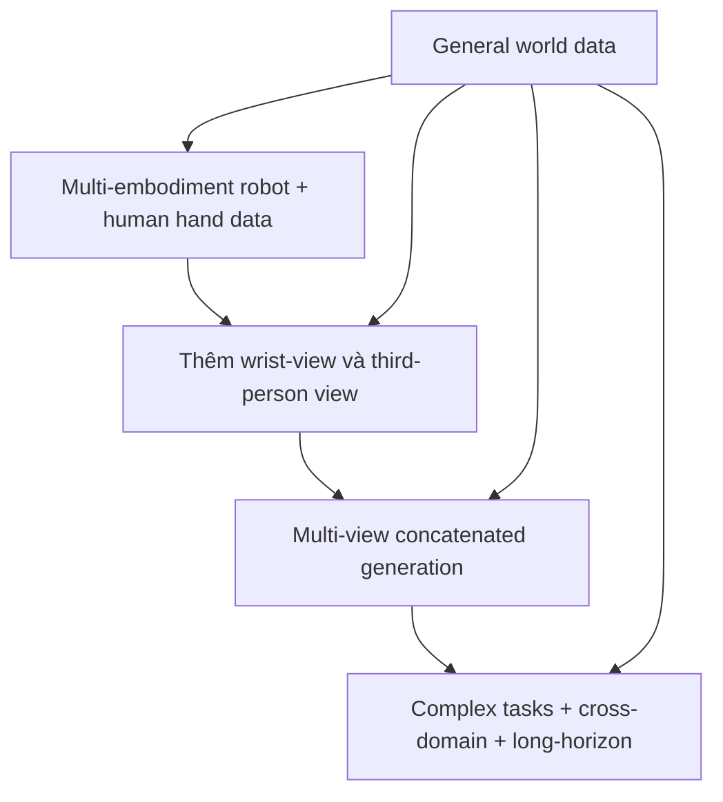

# Qwen-RobotWorld — Training stages

## 1. Training strategy

Paper công bố hai stage chính:

```text
General world foundation pretraining
                 ↓
Embodied specialization SFT
```

Điểm đặc biệt là general data vẫn xuất hiện trong mọi batch ở SFT, nên model vừa học embodied physics vừa giữ general visual prior.

## 2. Stage 1 — General foundation pretraining

Mục tiêu là học appearance, geometry, object motion, lighting, collision dynamics và human manipulation priors.

```text
General images/videos + human hand videos
                    ↓
             T2I + T2V + TI2V joint training
                    ↓
          General visual/world foundation
```

- Hơn 200M real-world observation samples từ 14 video platforms.
- General data không dùng AIGC images/videos theo mô tả paper.
- T2I làm visual quality anchor cho object morphology.
- T2V học video dynamics.
- TI2V học continuation từ first-frame observation.
- Task ratio chuyển dần từ T2I sang joint T2I/T2V/TI2V.

## 3. Stage 2 — Embodied specialization SFT

Embodied data được đưa vào theo progressive four-phase schedule:



Trong embodied portion:

- khoảng 70% tổng SFT data là embodied, 30% general;
- manipulation khoảng 90% embodied sampling weight;
- multi-view concatenation khoảng 5%;
- navigation/driving khoảng 5%.

General data tiếp tục có mặt trong mọi batch.

## 4. Data processing stages

```text
1. Raw collection
        ↓
2. Video preprocessing
        ↓
3. Hierarchical annotation
        ↓
4. Caption quality filtering
        ↺ re-annotation nếu không đạt
```

Video preprocessing gồm frame extraction, frame interpolation, sub-task splitting, main-view selection và multi-view concatenation.

## 5. Training objective/infrastructure

- Flow matching trên VAE latent.
- Noise lấy từ standard normal.
- Timestep log-normal, adaptive shifting theo video length.
- TI2V first-frame timestep cố định ở 0.
- Megatron-LM với hybrid parallelism.
- Selective activation recomputation trên một phần double-stream blocks.

Paper không mô tả RL stage; không nên tự thêm RL vào pipeline chính của Qwen-RobotWorld.
