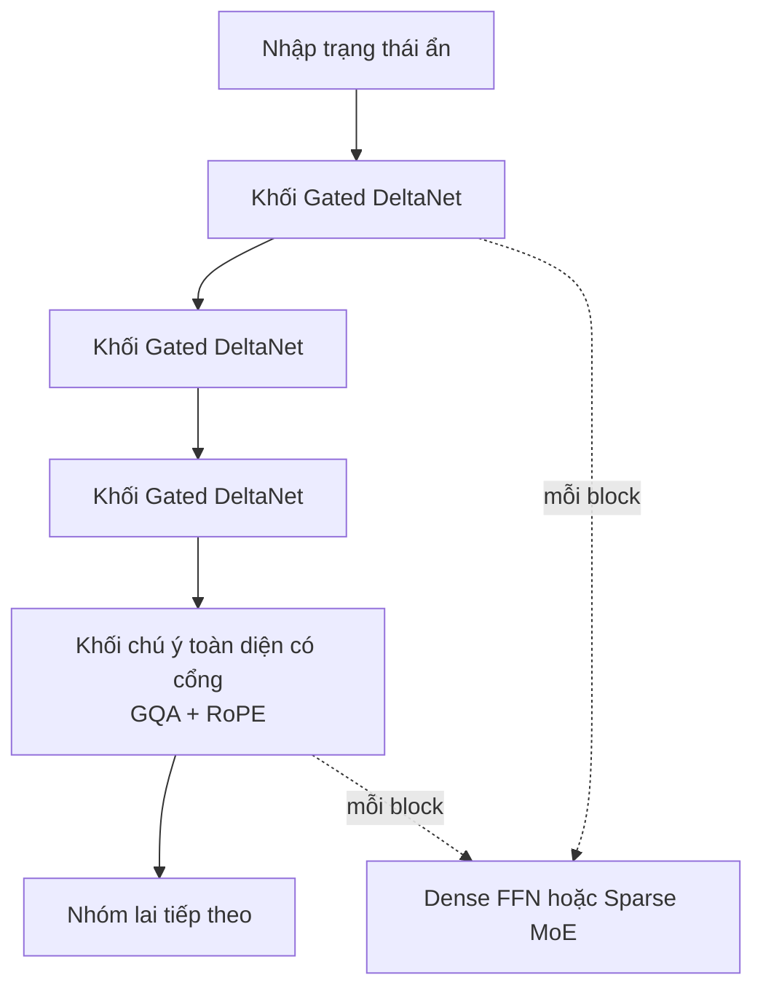
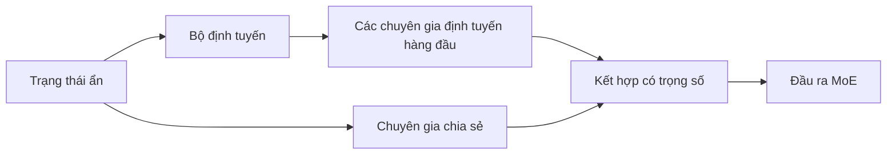
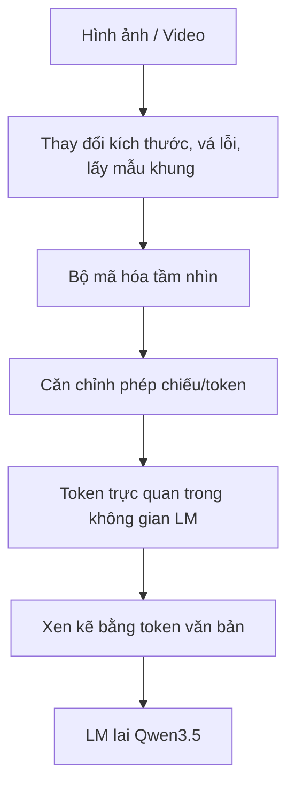

# Qwen3.5 — Kiến trúc

> **Scope.** Tài liệu này dùng các thông tin công khai trong blog/model card/config của Qwen. Các con số có thể khác theo checkpoint; khi thuyết trình cần ghi rõ model cụ thể. Qwen3.5 là **native multimodal causal language model**, không chỉ là LLM text được gắn thêm vision ở cuối.

## 1. Luồng dữ liệu tổng thể

```text
Image / Video ──> Resize, patch/frame sampling ──> Vision Encoder
                                                        │
                                                        v
                                             Visual features / tokens
                                                        │
Text ───────────────> Tokenizer ────────────────────────┤
                                                        v
                                      Unified multimodal token sequence
                                                        │
                                                        v
                             Qwen3.5 hybrid language model (causal)
                              │  DeltaNet blocks + gated attention blocks
                              │  Dense FFN hoặc sparse MoE FFN
                              v
                   Next-token logits / thinking / answer / tool calls
```

**Early fusion** nghĩa là text token và visual token được đưa vào cùng một chuỗi để backbone tối ưu chung bằng objective causal language modeling. Đây là khác biệt quan trọng so với pipeline “frozen vision encoder → projector → text LLM” kiểu late fusion.

## 2. Một nhóm layer hybrid

Qwen3.5 xen kẽ nhiều Gated DeltaNet layer với một Gated Full-Attention layer định kỳ:

```text
Input hidden states
        │
        v
┌─────────────────────────────────────┐
│ Gated DeltaNet + Dense/MoE FFN       │  (1)
└─────────────────────────────────────┘
        │
        v
┌─────────────────────────────────────┐
│ Gated DeltaNet + Dense/MoE FFN       │  (2)
└─────────────────────────────────────┘
        │
        v
┌─────────────────────────────────────┐
│ Gated DeltaNet + Dense/MoE FFN       │  (3)
└─────────────────────────────────────┘
        │
        v
┌─────────────────────────────────────┐
│ Gated Full Attention + Dense/MoE FFN │  (4)
└─────────────────────────────────────┘
        │
        v
Next group
```

Ví dụ được công bố cho **Qwen3.5-9B**: 32 layers, hidden size 4096, bố cục `8 × [3 × (Gated DeltaNet → FFN) + 1 × (Gated Attention → FFN)]`. Đây là ví dụ checkpoint, không nên áp dụng nguyên xi cho mọi model.

## 3. Khối Gated DeltaNet

```text
Input x
  │
  ├──> RMSNorm ──> Q/K/V projections ──> gated recurrent update ──> DeltaNet output ──┐
  │                                                                                   │
  └────────────────────────────────────────────────────────────────────────────── (+) ┘
                                      Residual 1
                                           │
                                           v
                              RMSNorm ──> Dense FFN / MoE ──┐
                                                            │
                              Residual 1 ───────────────── (+)
                                                            │
                                                            v
                                                         Output y
```

Trực giác: DeltaNet duy trì một **state/bộ nhớ nén** thay vì lưu và so sánh trực tiếp toàn bộ key-value của chuỗi. Query đọc state; key xác định thông tin; value là nội dung; gate điều khiển ghi, giữ, quên và mức đóng góp vào output. Cơ chế này hướng tới chi phí gần tuyến tính theo độ dài chuỗi ở phần mixing chính, nhưng có thể yếu hơn full attention khi cần truy xuất chính xác giữa các token xa.

## 4. Khối chú ý đầy đủ có cổng

```text
Input x
  │
  ├──> RMSNorm ──> Q/K/V ──> RoPE ──> Gated GQA ──┐
  │                                                │
  └──────────────────────────────────────────── (+)┘  Residual 1
                                      │
                                      v
                          RMSNorm ──> Dense FFN / MoE ──┐
                                                        │
                          Residual 1 ───────────────── (+)  Residual 2
                                                        │
                                                        v
                                                     Output y
```

GQA dùng nhiều query heads hơn KV heads, vì vậy giảm kích thước KV cache và memory bandwidth. RoPE mã hóa thông tin vị trí. Full attention được đặt định kỳ để thực hiện global information mixing mà DeltaNet có thể bỏ sót.

## 5. Dense FFN và sparse MoE

Biến thể dày đặc:

```text
Hidden state ──> shared FFN ──> output
```

Biến thể MoE:

```text
Hidden state ──┬──> Router ──> top-k routed experts ──┐
               └──> Shared expert ───────────────────┤
                                                     v
                                           weighted combine → output
```

Tên `35B-A3B` có nghĩa gần đúng là khoảng 35B tổng parameters nhưng khoảng 3B parameters được activate cho mỗi token. MoE tăng capacity với compute/token thấp hơn dense cùng tổng số weights, đổi lại routing, cân bằng tải, communication và serving phức tạp hơn.

## 6. Vision Encoder và context

```text
Image/video → preprocessing → vision layers → projection/alignment
            → visual tokens → interleave với text tokens → LM backbone
```

Patch size, số vision layers, temporal patching và các kích thước vision khác phải lấy từ `vision_config` của checkpoint cụ thể; không nên suy ra từ model card tổng quát.

Qwen3.6-35B-A3B (đại diện cùng họ kiến trúc) công bố 262,144 native tokens và khả năng mở rộng khoảng 1,010,000 tokens. “Support 1M” chỉ nói về độ dài input/serving; không đảm bảo reasoning và retrieval không suy giảm ở độ dài đó.

## 7. Qwen3.6-35B-A3B — ví dụ so sánh

| Thuộc tính                 | Giá trị công bố                                     |
| ---------------------------- | ------------------------------------------------------- |
| Tổng / activated parameters | 35B / 3B                                                |
| Lớp, kích thước ẩn | 40, 2048 |
| Bố cục | `10 × [3 DeltaNet + 1 Gated Attention]` |
| Bộ GD | 256 chuyên gia được định tuyến; top-8 định tuyến + 1 chia sẻ |
| DeltaNet | 32 đầu giá trị; 16 đầu truy vấn/khóa; đầu mờ 128 |
| Kiểm soát attention | 16 đầu truy vấn; đầu 2 KV; đầu mờ 256; quay mờ 64 |
| Context                      | 262K native; khoảng 1.01M extended                     |
| Khác                        | Multi-step MTP; preserve-thinking                       |

MTP (Multi-Token Prediction) tạo training signal cho nhiều token tương lai và có thể hỗ trợ speculative decoding. `preserve_thinking` cho phép các lượt sau tiếp tục dùng historical thinking context; đây là tính năng behavior/API, không phải một backbone mới.

## 8. Thông số chính thức của Qwen3.5-35B-A3B

| Thuộc tính                      |                                                      Giá trị |
| --------------------------------- | -------------------------------------------------------------: |
| Loại model                       |                      Causal Language Model with Vision Encoder |
| Tổng / activated parameters      |                                                       35B / 3B |
| Kích thước ẩn |                                                           2048 |
| Token embedding và LM output     |                                               248,320 (padded) |
| Lớp |                                                             40 |
| Layer layout                      | `10 × [3 DeltaNet + 1 Gated Attention]`, mỗi layer có MoE |
| Đầu / kích thước DeltaNet |                                              32V; 16 QK / 128 |
| Gated Đầu chú ý / kích thước |                                               16Q; 2KV/256 |
| Kích thước vị trí quay |                                                             64 |
| Bộ GD |                     256 chuyên gia; 8 định tuyến + 1 chia sẻ được kích hoạt |
| Chuyên gia trung cấp |                                                            512 |
| MTP |                                    Được huấn luyện với nhiều bước |
| Context                           |                   262,144 native; khoảng 1,010,000 extensible |

Model card ghi Qwen3.5 mặc định sinh **thinking content** trong `<think>...</think>` trước final response. Qwen3.5-Flash là hosted/API version tương ứng với 35B-A3B nhưng có thêm production features như 1M context mặc định và built-in tools; không nên coi đó là cùng một serving configuration với open-weight checkpoint.

## 9. Giải thích ngắn gọn

- **Vision Encoder:** biến ảnh/video thành biểu diễn mà LM có thể đọc.
- **Early fusion:** visual và text token cùng tham gia vào chuỗi thống nhất.
- **DeltaNet:** xử lý phần lớn chuỗi bằng state tuần tự, tiết kiệm memory/compute.
- **Gated Attention:** thỉnh thoảng truy cập toàn cục chính xác hơn.
- **FFN/MoE:** biến đổi từng token; MoE chọn một số expert thay vì chạy tất cả.
- **Residual + RMSNorm:** giữ dòng gradient/ổn định hóa việc huấn luyện.
- **Causal head:** dự đoán token tiếp theo, sinh answer, reasoning hoặc tool call.







