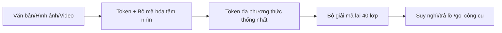
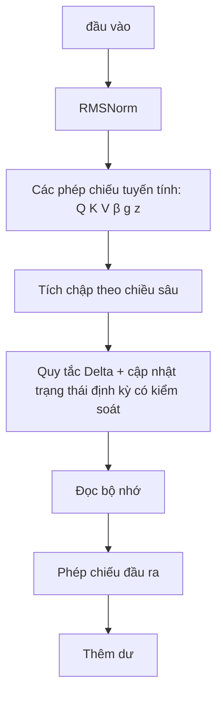
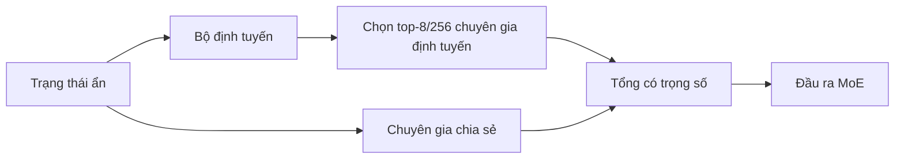
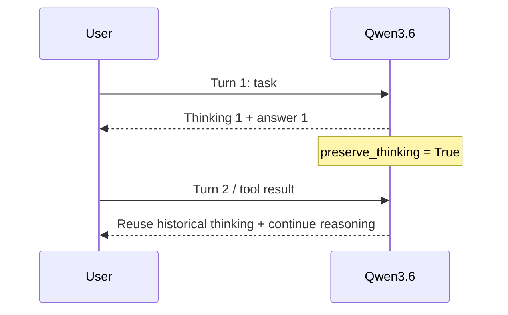

# Qwen3.6-35B-A3B — Kiến trúc

> **Mức độ công khai:** thông tin chính lấy từ Hugging Face model card/config. Bài phân tích bên ngoài dùng để diễn giải và phê bình benchmark, không phải technical report peer-reviewed.

## 1. Kết luận kiến trúc

Qwen3.6-35B-A3B là multimodal causal language model có Vision Encoder. Điểm quan trọng là model card vẫn dùng architecture class `qwen3_5_moe`: Qwen3.6 **không thay backbone**, mà chủ yếu cải thiện post-training và agent capability.



## 2. Thông số chính thức

| Thuộc tính                 |                                                      Qwen3.6-35B-A3B |
| ---------------------------- | -------------------------------------------------------------------: |
| Tổng / activated parameters |                                                             35B / 3B |
| Lớp / chiều ẩn |                                                            40/2048 |
| Lớp kiến ​​trúc |                                                      `qwen3_5_moe` |
| Layer layout                 | `10 × [3 Gated DeltaNet + 1 Gated Attention]`, mỗi layer có MoE |
| Chuyên gia |                                   256; 8 định tuyến + 1 chia sẻ được kích hoạt |
| DeltaNet |                                32 đầu V, 16 đầu QK, đầu mờ 128 |
| Kiểm soát attention |                                 16 đầu Q, 2 đầu KV, đầu mờ 256 |
| Kích thước RoPE |                                                                   64 |
| Bối cảnh bản địa |                                                       262.144 token |
| Extended context             |                                   khoảng 1,010,000 tokens với YaRN |
| MTP |                                             được huấn luyện với nhiều bước |
| Giấy phép |                                                           Apache 2.0 |

## 3. Bộ giải mã lai

### Gated DeltaNet + MoE

```text
Input
  ↓
RMSNorm
  ↓
Gated DeltaNet (linear/recurrent token mixer)
  ↓
Residual 1
  ↓
RMSNorm
  ↓
Sparse MoE: router → top-8 routed experts + shared expert
  ↓
Residual 2
  ↓
Output
```

### Attention có kiểm soát + MoE

```text
Input
  ↓
RMSNorm
  ↓
Gated GQA + RoPE (global token mixing)
  ↓
Residual 1
  ↓
RMSNorm
  ↓
Sparse MoE
  ↓
Residual 2
  ↓
Output
```

Ba DeltaNet layers xử lý phần lớn sequence với chi phí gần tuyến tính theo độ dài; layer full attention định kỳ giữ khả năng truy xuất chính xác giữa các token xa. Trong 40 layers, tỷ lệ là 30 DeltaNet và 10 Gated Attention.

## 4. Gated DeltaNet



DeltaNet duy trì recurrent state thay vì lưu toàn bộ attention matrix. `β` điều khiển update strength, `g` điều khiển memory decay và `z` là output gate theo mô tả cấu hình/implementation. Trade-off: tiết kiệm memory/KV cache hơn full attention nhưng global retrieval được bổ sung bằng các attention layer định kỳ.

## 5. Gated Full Attention và GQA

Qwen3.6 dùng 16 query heads nhưng chỉ 2 KV heads. GQA cho phép nhiều query cùng chia sẻ key/value, giảm KV cache và bandwidth. RoPE dimension là 64; output gate điều tiết mức đóng góp của attention trước residual.

## 6. MoE thưa thớt



Qwen3.6 giữ nguyên cấu hình MoE chính so với Qwen3.5: 256 experts, 8 routed experts và 1 shared expert. `A3B` chỉ lượng parameters được activate mỗi token, không phải số parameters tổng.

## 7. MTP và context

MTP được huấn luyện multi-step để dự đoán nhiều token tương lai, có thể hỗ trợ speculative decoding. Native context là 262K; mở rộng tới khoảng 1.01M dùng YaRN. YaRN là thay đổi cấu hình positional scaling khi serving, không phải kiến trúc backbone mới.

## 8. Thinking Preservation — điểm mới nổi bật



Mặc định chỉ thinking của message gần nhất được giữ. `preserve_thinking` cho phép giữ và sử dụng thinking traces lịch sử, phù hợp coding nhiều vòng, repository reasoning và tool loop. Qwen3.5 không công bố option này như một tính năng chính thức tương đương.

## 9. Qwen3.5 so với Qwen3.6

| Thành phần       | Qwen3.5-35B-A3B                         | Qwen3.6-35B-A3B              | Thay đổi                |
| ------------------ | --------------------------------------- | ---------------------------- | ------------------------- |
| Backbone           | Hybrid DeltaNet + Gated Attention + MoE | Gần như giữ nguyên       | Không đổi đáng kể   |
| Parameters         | 35B / 3B active                         | 35B / 3B active              | Không đổi              |
| Context            | 262K native, ~1.01M extended            | 262K native, ~1.01M extended | Không đổi chính       |
| MTP                | Multi-step                              | Multi-step                   | Không đổi chính       |
| Agent coding       | Có                                     | Tập trung mạnh hơn        | Cải thiện post-training |
| Thinking history   | Chưa có option tương đương       | `preserve_thinking`        | Điểm mới chính        |
| Architecture class | `qwen3_5_moe`                         | `qwen3_5_moe`              | Xác nhận backbone chung |
