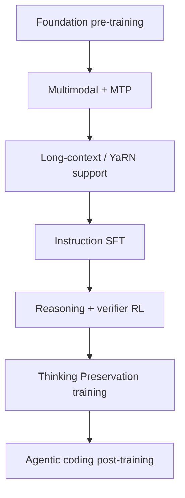
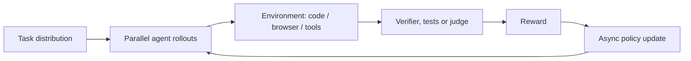

# Qwen3.6-35B-A3B — Training stages

> Qwen chưa công bố training recipe đầy đủ. Pipeline dưới đây kết hợp thông tin model card với diễn giải thận trọng từ các capability được công bố.

## 1. Pipeline tổng quát



## 2. Foundation và multimodal training

Nền tảng giữ nguyên hướng Qwen3.5: text, code, math, multilingual, image-text, video-text và document được đưa vào causal multimodal training. MTP tạo thêm tín hiệu dự đoán nhiều token tương lai.

Chưa công bố: tổng token, tỷ lệ modality, curriculum, filtering, deduplication và compute budget.

### Mixed multimodal sampling

Một cách diễn giải phù hợp với thực hành huấn luyện LLM/VLM hiện đại là các domain được sampling vào mixed batches:

```text
Text + Code + Math + Image + Video + Reasoning + Tool
                         ↓
                    Sampling policy
                         ↓
                    Mixed mini-batch
                         ↓
                 Causal next-token loss
```

Không nên hiểu pipeline là train hết text rồi mới train code, math, image và video. Cách train tuần tự dễ gây distribution shift và catastrophic forgetting. Qwen chưa công bố tỷ lệ sampling thực tế của Qwen3.6.

### Dynamic sampling và curriculum

Sampling ratio có thể thay đổi theo giai đoạn: sau dữ liệu nền tảng có thể tăng code, math, reasoning hoặc agent trajectories. Dữ liệu cũng có thể được sắp xếp từ dễ đến khó. Đây là diễn giải theo thông lệ, không phải curriculum chính thức của Qwen.

## 3. Long-context

Model hỗ trợ 262,144 native tokens. Khi cần khoảng 1M tokens, framework có thể dùng YaRN bằng cách thay đổi `rope_parameters`. Đây là context extension ở cấu hình/inference; không đồng nghĩa model luôn reasoning ổn định ở 1M.

## 4. Post-training cho agentic coding

```text
Repository / frontend task
        ↓
Plan multi-file changes
        ↓
Tool call: terminal / browser / filesystem
        ↓
Observe result and tests
        ↓
Iterate patch
        ↓
Final working code
```

Qwen3.6 nhấn mạnh frontend workflows, repository-level reasoning, terminal và tool use. Đây là khác biệt trọng tâm so với cách mô tả Qwen3.5 rộng hơn về general agents.

## 4.1 SFT, RL và agent training

```text
Foundation model → Instruction / conversation SFT
                 → Reasoning và coding data
                 → RL: prompt → response → reward → policy update
                 → Agentic coding: repository / terminal / browser / GUI
```

RL thường cần model đã có khả năng sinh output có ý nghĩa; reward của output ngẫu nhiên ở đầu training ít hữu ích. Đây là cách diễn giải từ các công bố về RL và agent environments, không phải training recipe đầy đủ.

## 5. RL và asynchronous environments



Các công bố nói đến million-agent environments, asynchronous RL và task distributions tăng dần độ phức tạp. Tên thuật toán, reward function, environment suite và số rollout chưa được công khai đầy đủ.

## 6. Thinking Preservation training

Đây là behavior training mới, không phải layer mới:

```text
Turn 1: thinking → answer
       ↓ lưu historical thinking
Turn 2: tool result / new instruction
       ↓ reuse reasoning context
Tiếp tục kế hoạch với ít suy luận lặp lại hơn
```

Mục tiêu là duy trì consistency trong iterative coding và agent loop, đồng thời có thể giảm token lặp và cải thiện KV-cache utilization. Claim về hiệu quả vẫn cần independent verification.

## 7. Khác Qwen3.5

| Qwen3.5 | Qwen3.6 |
|---|---|
| Foundation → SFT → reasoning/agent post-training | Giữ nền tảng, tăng trọng tâm agentic coding |
| Thinking theo lượt gần nhất | Có training/option `preserve_thinking` |
| General multimodal agents | Frontend, repository, terminal và tool workflows nổi bật hơn |
| Không có training recipe đầy đủ | Vẫn không công bố recipe đầy đủ |

Qwen3.6 được mô tả là xây dựng trên nền Qwen3.5. Cách hiểu thận trọng là **continued/post-training update**:

```text
Qwen3.5 checkpoint → New SFT / agent data / coding data
                   → RL và Thinking Preservation → Qwen3.6
```

Qwen chưa công bố đầy đủ checkpoint initialization và toàn bộ recipe, nên không nên khẳng định tuyệt đối rằng không có bất kỳ training lại nào.
