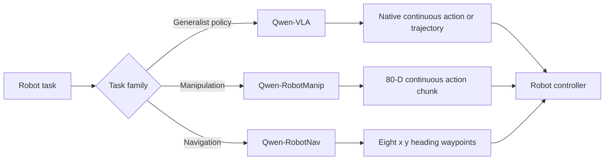

# Qwen Robot Models: Presentation Index

These short reports are designed for presentations. They emphasize diagrams, charts, compact tables,
and speaking points. They do **not** replace the detailed reports.

| Model | One-line purpose | Short report | Full report |
| --- | --- | --- | --- |
| Qwen-VLA | Unify continuous actions and trajectories across tasks and embodiments | [Presentation summary](qwen_vla.md) | [Complete report](../qwen_vla.md) |
| Qwen-RobotManip | Generate continuous manipulation actions across different robot embodiments | [Presentation summary](qwen_robotmanip.md) | [Complete report](../qwen_robotmanip.md) |
| Qwen-RobotNav | Convert configurable multi-camera history and a navigation goal into eight waypoints | [Presentation summary](qwen_robotnav.md) | [Complete report](../qwen_robotnav.md) |

## Conceptual Comparison

| Question | Qwen-VLA | Qwen-RobotManip | Qwen-RobotNav |
| --- | --- | --- | --- |
| Main problem | Unify task and embodiment-specific continuous action languages | Make heterogeneous robot actions physically compatible | Make observation history configurable across navigation tasks |
| Backbone | Qwen3.5-4B | Qwen3.5-4B | Qwen3-VL, evaluated from 2B to 8B |
| Policy head | 16-block, about 1.15B flow-matching DiT | 10-block flow-matching DiT | Four-layer MLP |
| Output | Padded and masked native action or trajectory chunks | Masked 80-D manipulation action chunks | Eight waypoints, each \((x,y,\theta)\) |
| Training emphasis | Four stages from Text-to-Action through SFT and RL | Reported 9:1 VLA-to-VL batches | 85:15 trajectory-to-VL data |
| Core idea | **Share the neural interface, preserve physical semantics** | **Align first, then scale** | **Keep the head simple; train the VLM to navigate** |

> All benchmark values in the short reports are author-reported and have not been reproduced in this
> workspace. Use the full reports for protocols, limitations, source breakdowns, and exact citations.
