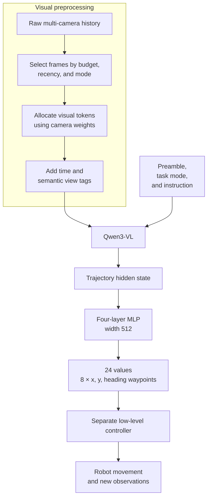
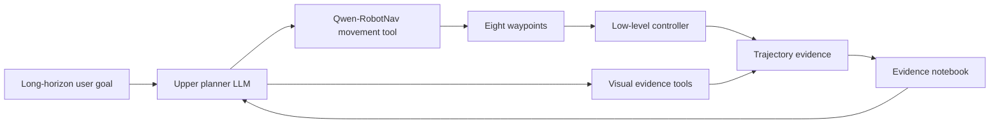
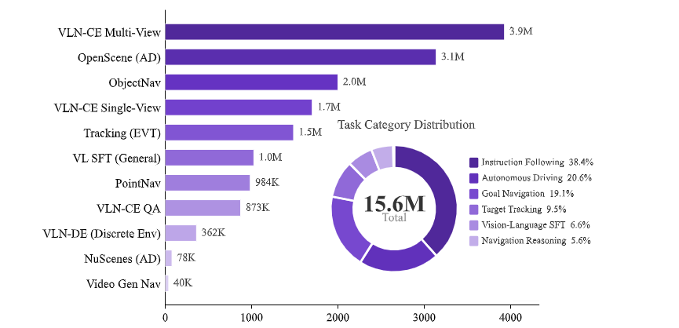
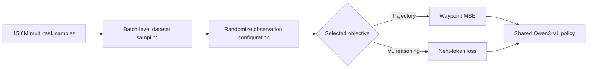

# Qwen-RobotNav: Presentation Summary

> **Full source of truth:** [Qwen-RobotNav complete report](../qwen_robotnav.md). This short version
> intentionally omits complete input schemas, dataset construction, training settings, benchmark
> protocols, and caveats. Primary paper: [Qwen-RobotNav v3](https://arxiv.org/abs/2606.18112v3).

## Main Message

> **Qwen-RobotNav turns configurable multi-camera history and a navigation instruction into eight future
> waypoints, and can serve as the movement tool inside an LLM-planned robot agent.**

- Supports VLN, PointNav, ObjectNav, target tracking, and autonomous-driving training.
- Uses Qwen3-VL for spatial and language reasoning.
- Uses a small four-layer MLP instead of diffusion.
- Predicts eight \((x,y,\theta)\) waypoints in one forward pass.
- Allows an upper planner to change task mode and observation strategy between calls.

## Architecture


| Component                | Presentation takeaway                                                                             |
| ------------------------ | ------------------------------------------------------------------------------------------------- |
| Inputs                   | Multi-camera RGB history, embodiment preamble, sub-goal, task mode, and observation configuration |
| Vision-language backbone | Qwen3-VL with dynamic-resolution visual encoding                                                  |
| Observation control      | Token budget, recency decay, camera weights, random/latest sampling, per-image bounds             |
| Action head              | Four-layer MLP, hidden width 512                                                                  |
| Output                   | 24 numbers = eight waypoints ×\((x,y,\theta)\)                                                   |
| Controller boundary      | A separate low-level controller converts waypoints into physical movement                         |

## Agent-Facing Task Modes

The upper planner selects one of four modes for each RobotNav call. These are interfaces to the same
model weights, not separate policies.

| Illustrative YAML field | Selected behavior                                         | Typical observation strategy                                                 | Representative input                                             |
| ----------------------- | --------------------------------------------------------- | ---------------------------------------------------------------------------- | ---------------------------------------------------------------- |
| `task_mode: VLN`      | Follow a natural-language route and its ordered landmarks | Broad history, larger context, weak recency bias                             | `Go to the living room, turn left, and stop near the kitchen.` |
| `task_mode: PointNav` | Move toward a coordinate or waypoint-like local goal      | Local or uniformly sampled history; emphasize recent frames near the target  | `Go to (2.2, 2.4).`                                            |
| `task_mode: ObjNav`   | Search for an object category or instance                 | Broad/random history during exploration; recent frames during final approach | `Search the kitchen area for a mug.`                           |
| `task_mode: Tracking` | Follow a moving or recently observed target               | Latest-frame sampling, strong recency bias, high recent-frame fidelity       | `Follow the man in the blue t-shirt.`                          |

The four mode names are published by the paper, but the literal `task_mode: <value>` YAML syntax is a
presentation reconstruction rather than a released API. `ObjNav` selects search behavior; after finding
a candidate, the planner can switch the same model to local `PointNav` or `Tracking`.

Do not confuse these four modes with the five trajectory-training families. **Autonomous driving is the
fifth training and evaluation family, but the paper does not define a `task_mode: Driving` value in the
agent-facing interface.** See the [complete report](../qwen_robotnav.md#all-agent-facing-task_mode-values)
for the full evidence and caveats.

### Worked Example: Input to Waypoints

This **presentation reconstruction** uses fields described by the paper; it is not an official API:

```yaml
system_preamble: Imagine you are a robot programmed for navigation tasks
task_mode: ObjNav
instruction: Search the kitchen area for a mug.

observation_config:
  token_budget: 4096
  temporal_decay: 1.0
  frame_sampling: random
  camera_weights: {front: 2.0, right: 1.0, back: 0.5, left: 1.0}
  tokens_per_image: {min: 4, max: 256}

observations:
  - time: 0
    views: {front: <image>, right: <image>, back: <image>, left: <image>}
  - time: 1
    views: {front: <image>, right: <image>, back: <image>, left: <image>}
```

After selection, images are serialized with semantic camera and time tags, for example:

```text
Time step 0 Front View <image> Right View <image> Back View <image> Left View <image>
Time step 1 Front View <image> Right View <image> Back View <image> Left View <image>
```



An illustrative output with the correct eight-row, three-value shape could be:

```text
[(0.25, 0.00, 0.00), (0.50, 0.03, 0.05), ...,
 (1.60, 0.45, 0.55), (1.75, 0.65, 0.75)]
```

| Output field | Meaning                                                |
| ------------ | ------------------------------------------------------ |
| (x,y)        | Future planar waypoint position                        |
| \(\theta\)   | Desired heading at that waypoint                       |
| Eight rows   | A short local trajectory predicted in one forward pass |

The numeric waypoints are illustrative. RobotNav does not directly output wheel speeds, motor torques,
or a language plan; the controller executes them and returns new evidence for the next call.

## Camera and History Strategy

The per-mode context patterns above are recommended tendencies, not fixed presets. The planner can
change token budget, recency, camera weighting, and sampling mode between calls as a task changes phase.

The main controls are:

- **Token budget \(B\):** total visual tokens shared across retained images. A larger budget preserves
  more history or image detail, but increases computation.
- **Temporal decay \(\gamma\):** recency bias. Larger values allocate relatively more tokens to recent
  observations; smaller values preserve older evidence more evenly.
- **Sampling mode:** `random` gives broader coverage across the episode, while `latest` keeps a recent
  sliding context.
- **Camera weights:** relative importance during token allocation. They are weights, not percentages and
  do not need to sum to one.
- **Per-image bounds \(b_{min},b_{max}\):** prevent a retained image from receiving too few or too many
  tokens.

The following are **illustrative inference presets**, not values mandated or evaluated as complete
per-task configurations by the paper:

| Mode and phase | \(B\) | \(\gamma\) | Sampling | Camera weights `front/right/back/left` | \(b_{min}/b_{max}\) | Intended effect |
| --- | ---: | ---: | --- | --- | --- | --- |
| `VLN` | 4096 | 1.0 | `random` | `2.0 / 1.0 / 0.5 / 1.0` | `4 / 256` | Preserve broad route history while keeping the forward view most detailed |
| `PointNav` — local approach | 2560 | 2.5 | `latest` | `2.0 / 0.75 / 0.25 / 0.75` | `4 / 256` | Prioritize current geometry and recent obstacle changes near the goal |
| `ObjNav` — exploration | 4096 | 1.0 | `random` | `1.5 / 1.0 / 1.0 / 1.0` | `4 / 256` | Cover previously visited regions and retain evidence from all directions |
| `Tracking` | 2048 | 3.0 | `latest` | `2.0 / 0.5 / 0.25 / 0.5` | `4 / 256` | Spend a compact budget on the newest frames and likely forward target location |

For example, an object-search call can begin with the `ObjNav` exploration row. Once a mug is visible,
the planner can switch to the local `PointNav` row; if the target is moving, it can instead switch to the
`Tracking` row. This phase change is the intended use of the configurable interface.

The paper randomizes training configurations over these published ranges:

| Parameter | Training range |
| --- | --- |
| \(B\) | Uniform from 2048 to 4096 |
| \(\gamma\) | Uniform from 1 to 3 |
| \(b_{min}\) | Discrete uniform from 1 to 8 |
| \(b_{max}\) | Discrete uniform from 128 to 256 |
| Sampling mode | `random` or `latest`, each with 50% probability |

Camera weights use camera-specific random ranges that are not numerically disclosed. The only complete
four-view example published in the report is:

```text
front = 2.0, right = 1.0, back = 0.5, left = 1.0
```

Consequently, the alternative camera-weight rows above are explanatory choices, not reported defaults.
For a platform without four views, the planner supplies weights for its actual semantic camera names.
The paper uses those names rather than one fixed numeric-angle contract.
[Qwen-RobotNav v3, §§2.2, 3.2 and 5.5](https://arxiv.org/abs/2606.18112v3)

## RobotNav Inside the Agent




| Agent component     | Role                                                                 |
| ------------------- | -------------------------------------------------------------------- |
| Upper planner LLM   | Decompose goals, choose tools, select task mode, and manage progress |
| Qwen-RobotNav       | Generate movement waypoints                                          |
| Object detector     | Find candidate objects in current or stored frames                   |
| Scene understanding | Describe rooms, layout, and landmarks                                |
| Semantic grounding  | Connect language references to visual evidence                       |
| Evidence harness    | Compress rollouts into summaries and key-frame references            |
| Evidence notebook   | Preserve searched areas, hypotheses, landmarks, and outcomes         |

The paper names the visual tools but does not disclose their implementations or APIs.

## Training Data



| Training family            | Reported samples |
| -------------------------- | ---------------: |
| Instruction following      |           5.631M |
| PointNav                   |             984K |
| ObjectNav                  |           2.000M |
| Target tracking            |           1.486M |
| Autonomous driving         |           3.216M |
| General VL                 |       About 1.0M |
| Navigation reasoning       |             873K |
| Discrete VLN conversations |             362K |
| Text-to-video navigation   |              40K |

Total: approximately **15.6M samples**, mixed as **85% trajectory** and **15% VL/reasoning**.

## How Training Samples Are Built

| Family    | Key transformation                                                                              |
| --------- | ----------------------------------------------------------------------------------------------- |
| R2R/RxR   | Teacher-force routes into steps, deduplicate instructions, add three paraphrases, refine images |
| PointNav  | Emphasize 6-10 m routes; keep forward steps at 45%; retain all turns/stops                      |
| ObjectNav | Explore a skeleton graph with branch/backtrack behavior; spline-smooth at 0.25 m spacing        |
| Tracking  | Pair current/recent observations with a target description and future waypoints                 |
| Driving   | Reuse paths with optional instruction, ego state, and trajectory-history conditioning           |
| T2V       | LLM prompt → video generation → VLM filter → monocular pose/depth → kinematic filter        |

## Training Flow



Important: the paper gives the 85:15 mixture but not the full dataset registry rates or literal batch order.

## Evaluation Highlights

| Evaluation            |         Main reported result | Presentation caution                                        |
| --------------------- | ---------------------------: | ----------------------------------------------------------- |
| VLN-CE R2R Val-Unseen |           72.1 SR / 66.6 SPL | Panoramic 8B                                                |
| VLN-CE RxR Val-Unseen |           76.5 SR / 65.7 SPL | Multilingual route following                                |
| VLNVerse fine         |         63.75 SR / 57.93 SPL | Coarse instructions score lower                             |
| HM3D-OVON unseen      |                      53.1 SR | Longer search paths reduce efficiency                       |
| EVT-Bench tracking    | 90.0 tracking / 77.4 success | Highest tracking does not mean highest task success         |
| NAVSIM                |                    91.4 PDMS | Uses three previous ground-truth trajectories in the prompt |
| AlpaSim zero-shot     |                   0.17 score | Far behind driving specialists                              |

System-level EQA results use **Qwen3.6-Plus as planner** and **Qwen-RobotNav-8B as movement tool**;
they are not standalone RobotNav scores.

## Final Slide: Five Points

1. RobotNav places most navigation reasoning in Qwen3-VL and keeps the action head small.
2. Its main control surface is the observation strategy, not the waypoint decoder.
3. One model supports several navigation modes through prompts and task configuration.
4. Inside the proposed agent, RobotNav is specifically the **movement tool**.
5. Benchmark coverage is broad, but real-robot evidence is qualitative and specialist driving/tracking
   methods still expose important gaps.
