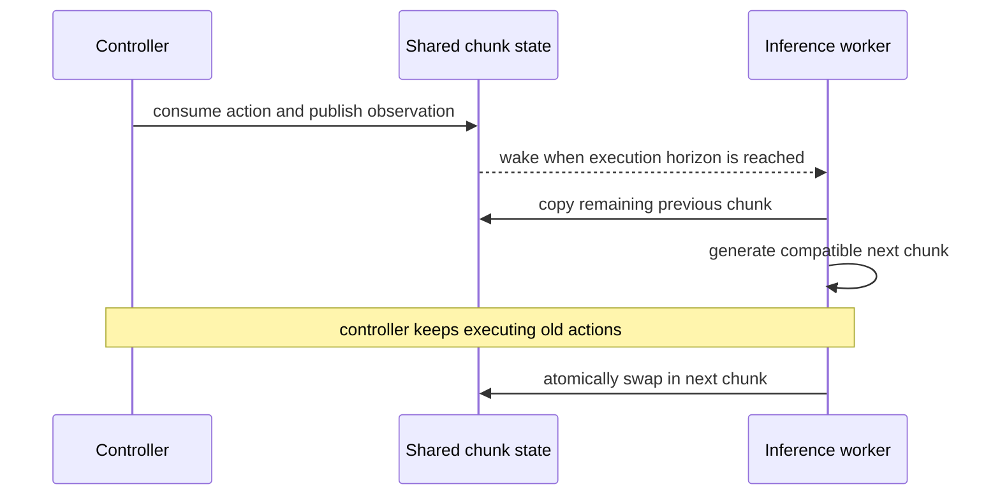

# Asynchronous chunk runtime

## Purpose

This module hides model latency by running inference concurrently with action execution. It is the
common runtime contract used by both inference-time and training-time RTC; the two methods differ
only in how they generate a chunk compatible with the previous one.

Let the current policy predict

$$
A_t=[a_t,\ldots,a_{t+H-1}],
$$

with prediction horizon `H`. The controller executes `s` actions before replacing the chunk. If one
inference call takes `δ` seconds and the controller period is `Δt`, the paper defines the integer delay

$$
d=\left\lfloor \delta/\Delta t\right\rfloor.
$$

Inference must begin `d` controller steps before the desired swap. During those steps, the controller
continues consuming the old chunk. The valid operating region is `d <= s <= H - d`.

## Inputs and outputs

| Item | Meaning |
|---|---|
| Latest observation `o` | Observation captured when background inference starts |
| Previous chunk | Remaining planned actions, shifted into the new chunk's time frame |
| Delay estimate `d` | Number of old-chunk actions that will execute before inference finishes |
| Execution horizon `s` | Number of actions consumed between chunk-generation starts |
| Output | A new chunk whose first `d` positions agree with committed actions |

## Runtime flow

Algorithm 1 of the inference-time paper uses mutex-protected shared state, a condition variable, and
a background inference loop. It estimates the next delay conservatively as the maximum of a short
buffer of observed delays, then selects an effective execution horizon of `max(d, s_min)`.

The released Kinetix evaluator implements the same temporal alignment in a batched, simulated form:
it executes the first `d` actions from the previous chunk, then actions `d:s` from the newly generated
chunk. It drops the first `s` positions from the new chunk before the next iteration
([`eval_flow.py`, lines 119–139](https://github.com/Physical-Intelligence/real-time-chunking-kinetix/blob/9296f31d62d5bfeb5779dcb2f9bcf71ca37f448b/src/eval_flow.py#L119-L139)).

## Timing assumptions and limits

- **Verified:** the paper assumes observation and action consumption are synchronized at controller
  step boundaries; it does not model sub-step delay or jitter.
- **Verified:** the full robot scheduler is described in the paper but is not included in the public
  Kinetix code. The public evaluator uses fixed simulated `inference_delay` and `execute_horizon`.
- **Inferred engineering requirement:** a real deployment needs timestamped observations, measured
  end-to-end latency, a safe fallback when `d > H - s`, and an atomic chunk swap. These requirements
  follow from the timing contract but are not fully specified by the released runtime.
- **Unknown:** behavior under missed deadlines, reordered network responses, controller packet loss,
  or delay changes faster than the estimator buffer.

## Evidence

- *Real-Time Execution of Action Chunking Flow Policies*, Sections 2 and 3.3, Algorithm 1, pages
  2–6: [local PDF](<../../../papers/02-realtime-chunking/Real-Time Execution of Action Chunking Flow Policies.pdf>).
- *Training-Time Action Conditioning for Efficient Real-Time Chunking*, Section III and Figure 1,
  page 2: [local PDF](<../../../papers/02-realtime-chunking/Training-Time Action Conditioning for Efficient Real-Time Chunking.pdf>).
