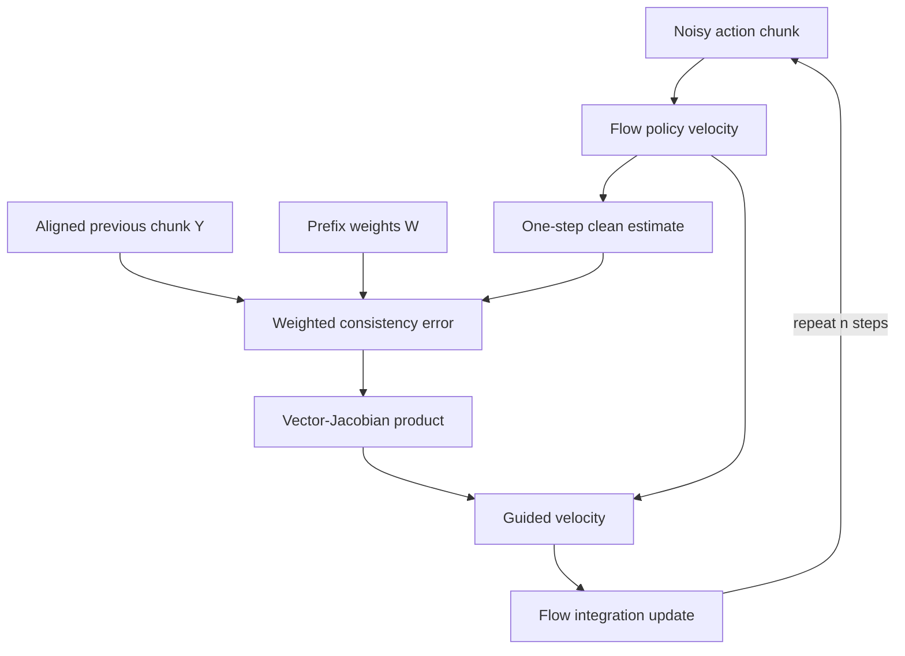

# Inference-time flow inpainting

## Purpose

Inference-time RTC turns chunk stitching into an inverse problem. It keeps the pretrained policy
unchanged and modifies the velocity used at each flow integration step so that the denoised chunk
matches known actions from the previous chunk.

For a standard flow policy, sampling starts at Gaussian noise and integrates the learned velocity
field from flow time `τ=0` to `τ=1`. RTC first forms an estimate of the clean chunk:

$$
\hat A_1(A_\tau)=A_\tau+(1-\tau)v_\pi(A_\tau,o,\tau).
$$

It compares this estimate with an aligned, padded previous chunk `Y`, weights the error with mask
`W`, and backpropagates that error through the clean-chunk estimate. The vector–Jacobian product is
added to the model velocity before the numerical integration step.

## Data flow

The released implementation uses `jax.vjp` around the denoiser, multiplies the residual by prefix
weights, clips the analytic guidance coefficient, and adds the correction to the base velocity
([`model.py`, lines 219–265](https://github.com/Physical-Intelligence/real-time-chunking-kinetix/blob/9296f31d62d5bfeb5779dcb2f9bcf71ca37f448b/src/model.py#L219-L265)).

## Training and inference behavior

- **Training:** none; this method is applied to an already-trained flow policy. The paper says a
  diffusion policy can also be converted to the required flow form at inference time.
- **Inference:** every denoising step requires a reverse-mode autodiff pass for the guidance
  correction. The same latest observation conditions the base policy while the old chunk supplies
  the continuity constraint.
- **Output:** a complete action chunk. Only the portion after the committed `d` actions can affect
  future execution.

## Cost and evidence

On the paper's RTX 4090 profile for `π0.5`, five denoising steps take total model latency from 76 ms
without RTC to 97 ms with RTC. The denoising component rises from 14 ms to 35 ms, a reported 2.5x
increase for that component. These numbers exclude network and robot-side preprocessing. The
reported full non-mobile pipeline averages about 109 ms, while the mobile pipeline averages about
139 ms (Appendix A.3).

In Kinetix, RTC outperforms naive asynchronous execution, temporal ensembling, and BID across the
reported delay sweep. The paper also notes that BID samples many chunks and therefore uses more
compute. Exact solve rates should be read from Figure 5; the text does not tabulate them.

## Limits

- **Verified:** the method only directly applies to iterative diffusion/flow action generators.
- **Verified:** backpropagation inside each sampling step increases the very latency RTC is intended
  to tolerate.
- **Verified:** pseudoinverse guidance is based on a local linearization and becomes less effective
  for larger conditioned prefixes; the follow-up paper motivates training-time conditioning partly
  from this weakness.
- **Unknown:** the papers do not establish a deadline guarantee for arbitrary hardware, model sizes,
  or network jitter.

## Evidence

- *Real-Time Execution of Action Chunking Flow Policies*, Sections 3.1 and 3.3, Equations 2–4 and
  Algorithm 1, pages 4–6; Appendix A.3, pages 23–24:
  [local PDF](<../../../papers/02-realtime-chunking/Real-Time Execution of Action Chunking Flow Policies.pdf>).
- Released [`FlowPolicy.realtime_action`](https://github.com/Physical-Intelligence/real-time-chunking-kinetix/blob/9296f31d62d5bfeb5779dcb2f9bcf71ca37f448b/src/model.py#L219-L265),
  inspected 2026-07-22.
