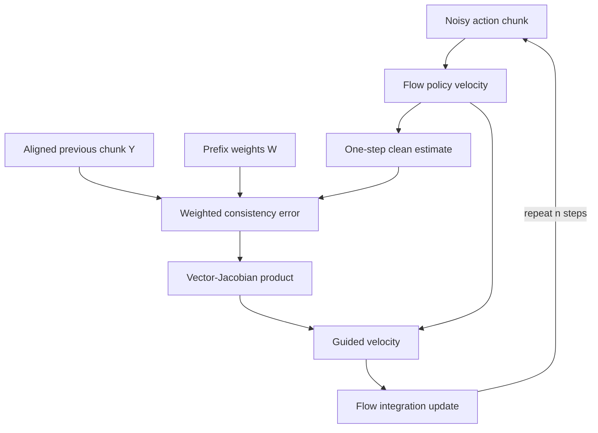

# Flow inpainting tại thời điểm suy luận

## Mục đích

RTC tại thời điểm suy luận biến việc ghép đoạn thành một bài toán nghịch đảo. Nó giữ chính sách được đào tạo trước
không thay đổi và điều chỉnh vận tốc được sử dụng ở mỗi bước tích hợp luồng sao cho đoạn đã khử nhiễu
khớp với các hành động đã biết từ đoạn trước.

Đối với chính sách luồng tiêu chuẩn, việc lấy mẫu bắt đầu ở nhiễu Gaussian và tích hợp vận tốc đã học
trường từ thời gian dòng chảy `τ=0` đến `τ=1`. RTC trước tiên hình thành ước tính về đoạn sạch:

$$
\hat A_1(A_\tau)=A_\tau+(1-\tau)v_\pi(A_\tau,o,\tau).
$$

Nó so sánh ước tính này với đoạn `Y` được căn chỉnh, đệm trước đó, đánh giá lỗi bằng mặt nạ
`W` và truyền ngược lỗi đó thông qua ước tính khối rõ ràng. Tích vectơ-Jacobian là
được thêm vào vận tốc mô hình trước bước tích phân số.

## Luồng dữ liệu

Việc triển khai đã phát hành sử dụng `jax.vjp` xung quanh bộ khử nhiễu, nhân phần dư với tiền tố
trọng lượng, cắt hệ số hướng dẫn phân tích và thêm hiệu chỉnh cho vận tốc cơ bản
([`model.py`, dòng 219–265](https://github.com/Physical-Intelligence/real-time-chunking-kinetix/blob/9296f31d62d5bfeb5779dcb2f9bcf71ca37f448b/src/model.py#L219-L265)).

## Hành vi đào tạo và suy luận

- **Đào tạo:** không có; phương pháp này được áp dụng cho chính sách luồng đã được đào tạo. Tờ báo nói một
  Chính sách khuếch tán cũng có thể được chuyển đổi sang dạng luồng yêu cầu tại thời điểm suy luận.
- **Suy luận:** mỗi bước khử nhiễu yêu cầu thẻ tự động phân biệt chế độ đảo ngược để được hướng dẫn
  sửa chữa. Quan sát mới nhất tương tự tạo điều kiện cho chính sách cơ sở trong khi đoạn cũ cung cấp
  ràng buộc liên tục.
- **Đầu ra:** một đoạn hành động hoàn chỉnh. Chỉ phần sau các hành động `d` đã cam kết mới có thể ảnh hưởng
  việc thực hiện trong tương lai.

## Chi phí và bằng chứng

Trên hồ sơ RTX 4090 của bài báo dành cho `π0.5`, năm bước khử nhiễu đưa tổng độ trễ của mô hình từ 76 mili giây
không có RTC đến 97 ms với RTC. Thành phần khử nhiễu tăng từ 14 ms lên 35 ms, theo báo cáo là 2,5 lần
tăng cho thành phần đó. Những con số này không bao gồm tiền xử lý phía mạng và phía robot. các
đã báo cáo đường truyền không di động đầy đủ có tốc độ trung bình khoảng 109 mili giây, trong khi đường truyền di động có tốc độ trung bình khoảng
139 ms (Phụ lục A.3).

Trong Kinetix, RTC vượt trội hơn so với việc thực thi không đồng bộ đơn giản, tập hợp thời gian và BID trên toàn bộ
báo cáo quét độ trễ. Bài báo cũng lưu ý rằng BID lấy mẫu nhiều khối và do đó sử dụng nhiều
tính toán. Tỷ lệ giải quyết chính xác phải được đọc từ Hình 5; văn bản không lập bảng chúng.

## Giới hạn

- **Đã xác minh:** phương pháp này chỉ áp dụng trực tiếp cho các bộ tạo tác động dòng/khuếch tán lặp lại.
- **Đã xác minh:** lan truyền ngược bên trong mỗi bước lấy mẫu sẽ làm tăng độ trễ mà RTC dự định
  để chịu đựng.
- **Đã xác minh:** Hướng dẫn giả đảo dựa trên tuyến tính hóa cục bộ và trở nên kém hiệu quả hơn
  đối với tiền tố có điều kiện lớn hơn; bài viết tiếp theo thúc đẩy việc điều chỉnh thời gian tập luyện một phần
  khỏi điểm yếu này.
- **Không xác định:** các tài liệu không thiết lập thời hạn đảm bảo cho phần cứng, kích thước mô hình,
  hoặc jitter mạng.

## Chứng cớ

- *Thực thi chính sách luồng hành động theo thời gian thực*, Phần 3.1 và 3.3, Phương trình 2–4 và
  Thuật toán 1, trang 4–6; Phụ lục A.3, trang 23–24:
  [PDF cục bộ](<../../../../papers/02-realtime-chunking/Real-Time Execution of Action Chunking Flow Policies.pdf>).
- Đã phát hành [`FlowPolicy.realtime_action`](https://github.com/Physical-Intelligence/real-time-chunking-kinetix/blob/9296f31d62d5bfeb5779dcb2f9bcf71ca37f448b/src/model.py#L219-L265),
  kiểm tra 2026-07-22.
