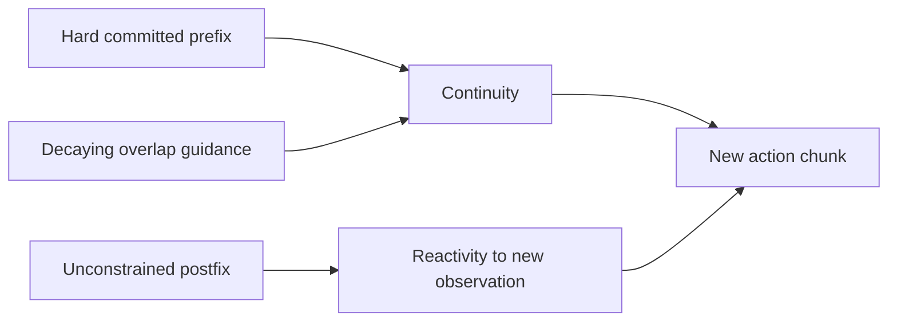

# Soft masking and sampling stability

## Purpose

A hard constraint on only the `d` committed actions can be too weak when `d` is small: the new
chunk may satisfy the short prefix but switch to another valid strategy immediately afterward. Soft
masking uses all overlap between consecutive chunks to encourage a gradual handoff.

The new chunk has three temporal regions:

| Region | Weight | Interpretation |
|---|---:|---|
| `i < d` | `1` | Frozen actions guaranteed to execute during inference |
| `d <= i < H-s` | decays from `1` toward `0` | Overlapping plan may change, but continuity is preferred |
| `i >= H-s` | `0` | No old action exists; generate freely |

The paper uses an exponential decay in the middle region. The public function
[`get_prefix_weights`](https://github.com/Physical-Intelligence/real-time-chunking-kinetix/blob/9296f31d62d5bfeb5779dcb2f9bcf71ca37f448b/src/model.py#L37-L63)
also implements linear, all-ones, and hard-prefix schedules for ablation.

## Why clipping is a separate stability mechanism

The analytic pseudoinverse-guidance coefficient is singular at `τ=0`. Image inpainting commonly
uses many denoising steps, but the robot experiments use only five. The paper therefore clips the
guidance weight at `β`; otherwise an early, very large correction can make the generated trajectory
diverge or become jerky.

Appendix A.2 reports that increasing `β` above 5 provides no further benefit in the simulated
ablation, so the experiments use `β=5`. This is an empirical setting for the reported policy and
sampler, not a universal constant.

## Interaction with reactivity

More overlap guidance promotes continuity, but it can also preserve an outdated plan. Exponential
decay expresses increasing uncertainty farther into the future. The reported ablation finds
exponential decay best overall, with linear decay close behind; hard masking underperforms most at
small delays and short execution horizons.

## Limits and unknowns

- **Verified:** soft masking exists only in inference-time RTC. Training-time RTC conditions on the
  hard `d`-action prefix and does not learn the additional decaying overlap constraint.
- **Verified:** the paper compares schedule families in simulation, not in the six real-world tasks.
- **Inferred:** `β`, schedule, and overlap length are coupled to the number of flow steps and policy
  Jacobian; changing the sampler may require retuning. This follows from the guidance formula and
  ablations, but the paper does not give a general tuning rule.
- **Unknown:** there is no reported adaptive schedule based on scene change, uncertainty, or
  measured discontinuity.

## Evidence

- *Real-Time Execution of Action Chunking Flow Policies*, Section 3.2 and Equation 5, pages 4–5;
  Appendix A.2 and A.4, pages 23 and 25:
  [local PDF](<../../../papers/02-realtime-chunking/Real-Time Execution of Action Chunking Flow Policies.pdf>).
- Released prefix schedules and clipped correction:
  [`model.py`](https://github.com/Physical-Intelligence/real-time-chunking-kinetix/blob/9296f31d62d5bfeb5779dcb2f9bcf71ca37f448b/src/model.py#L37-L63),
  inspected 2026-07-22.
