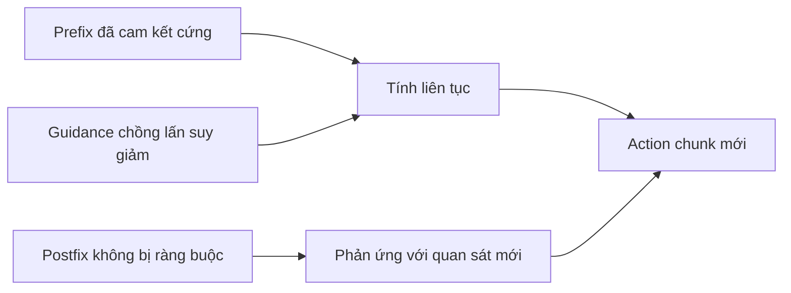

# Soft masking và độ ổn định khi lấy mẫu

## Mục đích

Ràng buộc cứng chỉ trên `d` action đã cam kết có thể quá yếu khi `d` nhỏ: chunk mới có thể
thỏa mãn prefix ngắn nhưng chuyển sang một chiến lược hợp lệ khác ngay sau đó. Soft masking
sử dụng toàn bộ phần chồng lấn giữa hai chunk liên tiếp để khuyến khích quá trình chuyển tiếp
diễn ra từ từ.

Chunk mới có ba vùng thời gian:

| Vùng | Trọng số | Diễn giải |
|---|---:|---|
| `i < d` | `1` | Các action bị cố định, chắc chắn được thực thi trong quá trình inference |
| `d <= i < H-s` | giảm từ `1` về `0` | Kế hoạch chồng lấn có thể thay đổi, nhưng ưu tiên tính liên tục |
| `i >= H-s` | `0` | Không có action cũ; sinh tự do |

Paper sử dụng suy giảm theo hàm mũ ở vùng giữa. Hàm công khai
[`get_prefix_weights`](https://github.com/Physical-Intelligence/real-time-chunking-kinetix/blob/9296f31d62d5bfeb5779dcb2f9bcf71ca37f448b/src/model.py#L37-L63)
cũng triển khai các lịch linear, all-ones và hard-prefix để làm ablation.

## Vì sao clipping là một cơ chế ổn định riêng

Hệ số pseudoinverse guidance giải tích có điểm kỳ dị tại `τ=0`. Image inpainting thường dùng
nhiều bước khử nhiễu, nhưng các thí nghiệm robot chỉ dùng năm bước. Vì vậy, paper chặn trọng số
guidance tại `β`; nếu không, một hiệu chỉnh rất lớn ở giai đoạn đầu có thể khiến trajectory
được sinh ra phân kỳ hoặc bị giật.

Phụ lục A.2 báo cáo rằng tăng `β` quá 5 không mang lại thêm lợi ích trong ablation mô phỏng,
do đó các thí nghiệm dùng `β=5`. Đây là thiết lập thực nghiệm cho policy và sampler được báo
cáo, không phải một hằng số phổ quát.

## Tương tác với khả năng phản ứng

Guidance chồng lấn nhiều hơn thúc đẩy tính liên tục, nhưng cũng có thể giữ lại một kế hoạch đã
lỗi thời. Suy giảm theo hàm mũ biểu diễn độ bất định tăng dần ở tương lai xa hơn. Ablation được
báo cáo cho thấy suy giảm theo hàm mũ tốt nhất về tổng thể, theo sát là suy giảm tuyến tính;
hard masking kém hiệu quả nhất khi độ trễ nhỏ và execution horizon ngắn.

## Giới hạn và điểm chưa biết

- **Đã xác minh:** soft masking chỉ tồn tại trong RTC tại inference. RTC tại training điều kiện
  hóa theo prefix cứng gồm `d` action và không học thêm ràng buộc chồng lấn suy giảm.
- **Đã xác minh:** paper so sánh các họ lịch trong mô phỏng, không phải trên sáu tác vụ thực tế.
- **Suy luận:** `β`, lịch và độ dài chồng lấn phụ thuộc lẫn nhau với số bước flow và Jacobian
  của policy; thay đổi sampler có thể cần tinh chỉnh lại. Điều này suy ra từ công thức guidance
  và các ablation, nhưng paper không đưa ra quy tắc tinh chỉnh tổng quát.
- **Chưa biết:** chưa có lịch thích nghi nào được báo cáo dựa trên thay đổi của cảnh, độ bất định
  hoặc độ gián đoạn đo được.

## Bằng chứng

- *Real-Time Execution of Action Chunking Flow Policies*, Mục 3.2 và Phương trình 5, trang 4–5;
  Phụ lục A.2 và A.4, trang 23 và 25:
  [PDF cục bộ](<../../../../papers/02-realtime-chunking/Real-Time Execution of Action Chunking Flow Policies.pdf>).
- Các lịch prefix và phép hiệu chỉnh có clipping trong mã được phát hành:
  [`model.py`](https://github.com/Physical-Intelligence/real-time-chunking-kinetix/blob/9296f31d62d5bfeb5779dcb2f9bcf71ca37f448b/src/model.py#L37-L63),
  kiểm tra ngày 2026-07-22.
